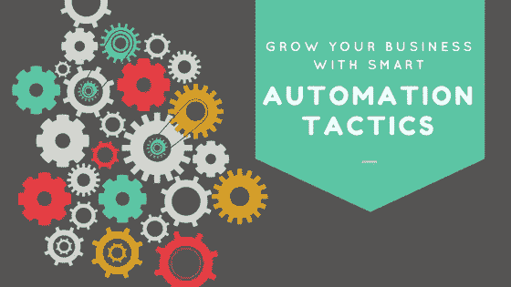

# 利用智能自动化策略发展您的业务

> 原文：<https://medium.com/swlh/grow-your-business-with-smart-automation-tactics-446164768283>

Marketing Automation

对于企业家和他们的营销和销售团队来说，自动化的概念是一个迷人的东西。

想象一下——机器人在做人们曾经做过的事情。

这项技术减少了许多营销和销售团队不得不做的内容营销的“繁忙工作”,让他们从其他重要任务中解脱出来。

内容营销需要花费大量的时间和精力。过去几年，一家公司投入的时间和精力都在增加，因为互联网上的内容已经饱和了。

因此，当自动化系统被引入时，许多公司都加入了这一行列。

有些取得了巨大的成功。然而，许多人没有。

是什么导致了他们的自动化失败？你的营销和销售团队可以实施什么样的策略才能真正看到成效？

这就是我和营销专家、[获奖博客作者 Matt Heinz](https://www.insidesales.com/insider/lead-management/sales-lead-management-50-most-influential-people-announced/) 讨论的内容。

# 为什么自动化对许多公司不起作用

在与大公司(如亚马逊和比尔和梅林达盖茨基金会)的合作中，内容营销的预算一直在增加。这很好，因为内容营销是接触客户和潜在客户的最佳方式之一。

然而，Matt 注意到一个令人担忧的趋势——支出增加，内容激增，但这些公司没有看到内容与其业务成果之间的相称联系。

他的理论是，公司正在发布大量“垃圾”博客帖子，这些帖子让公司感觉良好，因为它们获得了点击量和网络流量。然而，这些内容和流量并没有积极转化为商业价值。

对马特来说，[营销自动化](http://www.magnificent.com/marketing-automation)是一种创造一致性和可重复性的手段，可以在正确的时间将正确的内容与正确的前景联系起来。

但是许多公司倾向于将自动化视为“设置好就忘了它”

好的营销和销售技术意味着自动化一些机器人可以比人类做得更好更有效的事情。机器人可以留意并跟踪你的潜在客户的活动。

他们甚至可以负责一些后续工作，比如当客户采取某种行动时，比如下载白皮书或注册订阅您的时事通讯，他们会在您的 drip 活动中发送下一封电子邮件。

但是机器人不会(也不应该！)取代马特所说的“人情味”。

潜在客户不想与机器人交流，他们想与人交流。

因此，机器人可以照顾复杂销售需求的想法是一种谬误。

然而，许多公司认为一旦他们购买了自动化软件，就万事大吉了。机器人会照顾好一切。

然而，如果一家公司想要真正成功，看到增长，并获得回头客，还有很多事情要做。

# 有助于企业发展的自动化策略

我们如何利用自动化技术而又不失人情味？

我们需要做的第一件事是慢下来，想出一个策略。

要做到这一点，问自己这些问题。

*   成功是什么样子的？我的终极目标是什么？(这通常是销售或收入数字。)
*   谁是我的理想客户？
*   他们关心的问题是什么？
*   您将创建什么类型的内容来适应购买过程的每个阶段，以吸引潜在客户？

马特提出了一个非常好的观点:在你向某人推销之前，你必须引起他们的注意。你打算做什么来赢得并保持他们的注意力？

在这个阶段，最好完全忘记技术。现在，关注的焦点是客户——他们的需求，他们关心的问题，他们在生活和/或业务中试图实现的目标。

如果你在内容中提到这一点，你更有可能引起他们的注意，让他们对某个特定的话题感兴趣。

下一步是考虑与他们感兴趣的话题相关的其他内容。

一旦你弄清楚在销售过程的不同阶段什么会引起你的客户的兴趣，那么你就可以创造出可扩展和可重复的东西，营销自动化现在可以帮助你。

在这些最初的战略阶段，销售和营销团队都需要参与。他们很清楚你想向什么样的人推销，以及你将如何实现这一点。

然后，让您的团队确定营销团队应该在什么时候向潜在客户展示什么，以及销售团队应该在什么时候以及如何与客户互动。

# 你成功的关键:一切都应该以客户为中心

说到营销，许多公司真的陷入了他们需要完成的每一件事——他们不断增长的待办事项清单。他们忘记思考的是他们为什么要做他们正在做的事情，以及为了谁。

Matt 反复告诉我(这是我最近从许多营销专家那里听到的)，我们需要确保以客户为中心。

对于销售和营销来说，一种模式并不适合所有人。

不同的人在不同的时间因为不同的原因想要不同的东西。

营销活动的目标是在正确的时间把正确的信息传递给正确的人。

始终考虑你的理想客户——你想卖给的客户，真正需要你的产品的客户，以及你想一次又一次回来的客户。

记住你的客户和你一样有需求和欲望，这样会更容易。想想你的产品将如何为一个人或一家公司服务。现在想一想，一旦他们有了你的产品，你还能以什么方式帮助他们。

以此为起点，你将开始看到成功的自动化营销活动，以及你一直想要的业务增长。

你想从我的获奖嘉宾马特·海因茨那里了解更多吗？一定要 [***订阅他的博客***](https://www.heinzmarketing.com/blog/) ***和*** [***在 Twitter 上关注他***](https://twitter.com/HeinzMarketing?ref_src=twsrc%5Egoogle%7Ctwcamp%5Eserp%7Ctwgr%5Eauthor) ***。你不会后悔的。***

# 关于马特·海因茨

马特·海因茨(Matt Heinz)是一位多产的作家和全国公认的获奖博客作者，他是亨氏营销公司的总裁和创始人，在各种组织和行业拥有 15 年的营销、业务发展和销售经验。Matt 的职业生涯专注于持续交付可衡量的结果，实现更高的销售额、收入增长、产品成功和客户忠诚度。Matt 是销售线索管理领域 50 大最具影响力人物和 50 大销售和营销人物的重复获奖者。

Magnificent Marketing — Digital Agency — Austin, TX

## 这篇文章发表在 [The Startup](https://medium.com/swlh) 上，这是 Medium 最大的创业刊物，拥有+387，966 名读者。

## 在这里订阅接收[我们的头条新闻](http://growthsupply.com/the-startup-newsletter/)。

