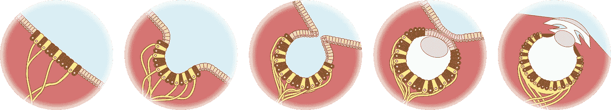

# 从初创发展到可扩展:在正确的时间做出正确的改变

> 原文：<https://medium.com/swlh/growing-from-startup-to-scalable-make-the-right-changes-at-the-right-time-3b752ae99ec2>

eye evolution, illustration © C.L. Hamer

在我职业生涯的早期，我曾为一家科技公司工作，这家公司最近从一家小型初创公司发展成为一家拥有数百名员工的公司。一天，这位首席执行官在全公司范围内发表讲话，他解释道，“初创公司比大公司更有效率地生产代码——因此我们将继续像初创公司一样运营这家公司！”

不幸的是，在实践中，这实际上相当于免费的软饮料，每个人都被期望每天无偿加班。

我记得当时在想，*“事情不是这样的。大公司不能像初创公司一样运作是有原因的。”*如果你把所有失败的创业公司都计算在内，甚至不清楚创业公司是否比大公司为每个开发人员生产了更多的代码。

回想起来，我把老板愚蠢的讲话视为一份礼物。多年来，我在不同的公司工作，这启发我仔细观察“创业模式”与可扩展实践的不同之处，并思考从一种模式到另一种模式的最佳策略。

我喜欢用的比喻是眼睛的进化。

step 1

有些动物只有一小块感光细胞。他们的一些后代为他们的光传感器开发了一个凹形缺口——提供了更多关于光线和阴影方向的信息。

step 2

其他的后代做了进一步的改进，导致了我们现在的版本。

eye evolution, illustration © C.L. Hamer

当你按顺序看这些步骤时，你可能会有这样的印象，每一项创新都是经过深思熟虑的，旨在让这种生物更接近拥有复杂、现代的眼睛。但进化不是这样运作的。这些明显的“步骤”中的每一步都由一只已经(或曾经)*完成*的动物来代表——从某种意义上说，它适合在其环境中生存。

这就是当你将你的 IT 部门从“启动模式”建设成“扩大模式”时应该遵循的道路类型——每一个增加都应该是帮助你在公司当前发展阶段更有效地构建软件的东西。

与 evolution 不同，你的优势在于你可以观察成功的大公司的 IT 部门——因此你有一个可以效仿的例子——并且你可以有意识地做出改变。(有一些优势是很好的，因为也不像进化，你没有一亿年的时间来完成它。)

但是有一个榜样作为目标也有它的缺陷。很容易看到一家大公司说，*“谷歌在做 X，所以我的公司也应该做 X。”*不一定。你可能最终会在开发出能够聚焦图像的视网膜之前，花费相当于制造透镜的资源。

“启动模式”和“扩大模式”的主要区别之一是，在时间和资源方面，你能负担得起任何给定项目的前期投资。

在启动模式下，使用“快速原型”策略进行代码开发是有意义的。如果你还处于只有几个客户(或者没有客户)的阶段，你的商业计划可能会改变和发展——所以很多标准的最佳实践不如让你的想法立即启动和运行的例子重要。

通常，一家初创公司会有一两个工程师，他们能写出大量令人印象深刻的代码，并乐于这样做——不受任何官方程序的约束。这种开发策略在长期代码可维护性方面有一些主要缺点，所以如果你能承受不这样做的话，我不建议你这样生产你的产品。但是，如果你的公司是一家小型创业公司，你的预算可能会非常紧张。如果前期成本意味着你的公司明天就会失败，那么长期的代码可维护性是没有帮助的。

相比之下，放大模式没有那么快，但从长远来看成本更低。编写正确设计的规范可以节省因误解而浪费的时间。维护大量的工程级文档简化了入职和知识转移的过程。在开发阶段增加有效和适当的测试和监控有助于避免开发人员不断地从当前的任务中抽身出来“灭火”——例如，对产品版本中的问题进行紧急修复。

但是创业模式也有一些优势，那就是*不仅仅是一个从短期结果出发抛弃长期想法的问题。更大的公司有更结构化和更昂贵的流程和政策——不仅仅因为它负担得起，还因为它*比创业公司更需要它们。**

当你有少于十个人在同一个房间里并且不断地相互交流时，你可以灵活地决定谁做什么以及以什么方式做。要完成的事情很少，每个人基本上都知道谁在做什么，状态如何。这允许高效和透明的任务分配。如果公司是由关系融洽的人组成的，那么谁擅长某项任务，谁就能完成它。老板可以亲自监督一切，所以目标和优先事项的沟通是直接的，而不是通过一系列的互动来过滤。

每增加一个人，就更难确保每个人都在同一页上。您需要某种正式的政策，以便依赖彼此工作的团队(如开发&测试或客户端&服务器端)知道彼此期望什么——并防止对何时以及发布或交付什么产生误解。

当你从一个两人开发团队变成一个四人开发团队时，很容易出现两个工程师一起非正式地讨论想法的问题——然后天真地认为“每个人都知道”我们在做什么，谁在做什么。这种错误会让其他一些工程师觉得他们是局外人，对影响他们项目的决策没有任何发言权。这个错误可以通过补充“启动模式”灵活高效的系统来解决*“工程师可以随时随地与任何人讨论他们的项目”*一个更具可扩展性的系统，包括一些正式而繁琐的计划会议。

但是开会是要花钱的。规范和正式的需求需要钱。测试和测试人员要花钱。经理需要花钱。因此，明智地分配资源并在需要时添加可扩展的组件非常重要。

我见过的最有教育意义的管理错误之一发生在我在一家公司工作时，这家公司刚刚获得了一大笔风险投资资金。该公司几年前将一项创新技术推向市场，取得了一些初步成功。但是技术在进步，他们的旗舰产品很快就过时了。该公司迫切需要重新站在科技市场的前沿——这时天赐的新风险资金流入拯救了公司。

但是，该公司没有用这笔钱来改造他们的商业模式，并找出他们的客户公司对他们提议的新产品线不感兴趣的原因，而是将这笔钱花在了内部管理的大规模(昂贵)重组上——这是在全公司会议上大张旗鼓地推出的。他们的新产品线得到了及时的开发和实施，但最终没有人买它。(至少对那家公司来说。)

我从那次经历中得到的教训是，当你靠投资者的钱生活时，你不能自满。当你没有足够的收入流流入时，你不能购买“很好”的过程改进。

挑战在于，从公司内部——尤其是如果这是你的第一次创业——很难很好地了解你的公司真正最需要的是什么。

随着公司的发展，您需要逐步构建更大公司的策略结构，并且以正确的顺序添加它们非常重要，这样每次添加都会为您的公司带来价值。

但是那个顺序是什么？

不幸的是，我认为没有一个简单的公式是每个创业公司都应该遵循的。如果有一条路总是有效的话，那就简单多了。但是创业公司千差万别。我工作过大约七八家初创公司(取决于你对初创公司的定义)，可能最令人震惊的事情是它们彼此之间有多么不同。

初创公司有很强的“创始人效应”——你的初始团队中少数人的特殊才能和兴趣决定了你的公司将会如何发展。它们的优缺点决定了你需要先用正式的政策来填补哪些漏洞。

如果你是第一次创业，如果你的团队中至少有一些人以前在创业公司工作过，会有所帮助，这样他们可以给你一些视角，让你了解你的创业公司的文化与其他公司有何不同。如果你有这样的团队成员，花时间问问他们的印象。如果你刚刚获得了一些新的投资者资金，向一个有经验的局外人请教如何明智地使用这笔资金可能是值得的。

总的来说，我建议你不要盲目地尝试应用任何现在热门的想法。不要只是假设任何一套管理策略、结构或最佳实践对每个发展阶段的每个公司都是最好的。寻找你的公司正在努力的地方，并在那里开始改进。

## 这篇文章发表在《初创企业》杂志上，这是 Medium 最大的创业刊物，有 333，253 人关注。

## 订阅接收[我们的头条新闻](http://growthsupply.com/the-startup-newsletter/)。

