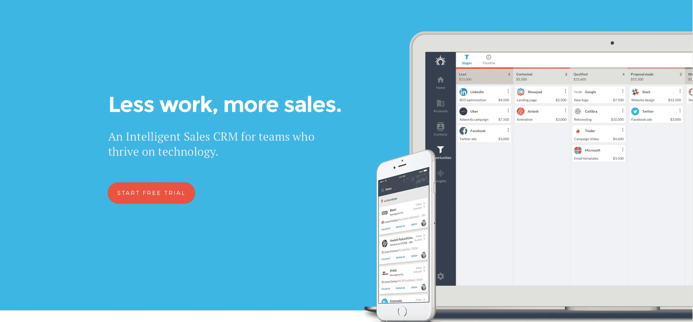

# 用 SaaS 销售自动化实现业务增长

> 原文：<https://medium.com/swlh/growth-hacking-your-business-with-saas-sales-automation-8afb2273241c>

创业时，你不会觉得销售是一门独立的商业“学科”你只要努力推销你的产品或服务，然后简单地完成交易。

但你卖得越多，你就越能发现，构建你接近、沟通和处理客户的方式，对提高你的收入至关重要。很快，**花时间发邮件和打电话给你的客户变成了一项巨大的工作**,在你继续发展你的业务之前，需要很好地管理这项工作。

这就是为什么无论你是必须处理此事的人，还是你身边有销售团队，都有一些重要的事情要记住:

*   自动化您的沟通
*   不要过度自动化你的沟通
*   让团队成员负责不同的销售阶段

> “将潜在客户与成交分开。让团队成员负责这两个不同的销售流程至关重要。”[亚伦·罗斯，可预测的收入](https://blog.salesflare.com/aaron-ross-of-predictable-revenue-88efc730a672)

# 自动化->更好的时间管理->更高的效率->更多的客户端

接近你的潜在客户需要个性化。毕竟，你的客户不想买你的产品。他们只是想扩大业务。他们每个人都有不同的问题。很可能你有不同的方法，你的产品或服务可以帮助他们解决问题。

这就是为什么销售永远不会 100%自动化。我们是喜欢个人交流和充分理解我们的问题的人。

尽管如此，你仍然可以**自动化销售的一些元素，这样你就有更多的时间**关注对你的客户真正重要的事情，以及对他们的业务增长重要的事情。

# 从 CRM 系统开始

客户关系管理是你销售的基础。不理解为什么从 [excel 转换到 CRM](https://picksaas.com/blog/switching-excel-to-crm?utm_source=blog&utm_campaign=Salesflare) 应用程序可以帮助你成长，可能你们大多数人已经在使用像 Salesflare 这样的 CRM 应用程序。

[Salesflare](https://picksaas.com/crm/salesflare?utm_source=blog&utm_campaign=Salesflare) 是一个简单的在线 CRM 应用程序，专为中小型企业设计，专注于自动化您的日常销售活动。

Salesflare — a new tech way to manage your clients and sales

Salesflare 的独特之处在于它高度关注技术和自动化。想象一下，将你所有的电子邮件联系人输入一个系统需要多少工作。**无论您使用 Gmail 还是其他邮箱系统，Salesflare 都会与您的邮箱同步并自动检测联系人**。

这个有效的现代 CRM 系统将帮助您:

*   节省花在技术任务上的时间
*   自动跟踪您的活动
*   与其他系统连接，创造顺畅的销售流程

最后一点涉及到与其他应用程序的连接，这一点变得至关重要，只要你想让你的组织专注于正确的事情，即发展与客户的关系。

# 自动检测潜在客户并将其添加到您的 CRM 中

你怎么知道有人可能对你的产品或服务感兴趣？它们可能来自许多不同的来源，所以确定你获取客户的最有利可图的渠道是非常重要的。

销售渠道中一些最常见的销售线索来源:

*   选择加入弹出窗口收集了您网站上的电子邮件
*   登录页面上填写的表格
*   在你的网站上填写联系表格
*   外向冷邮寄活动
*   点击电子邮件中的电子书链接
*   有人在您的实时聊天对话中留下了电子邮件
*   +许多其他

如何处理所有这些来源，以了解你如何接触到合适的人？

## 查看您的 Salesflare pipeline 中选择加入弹出窗口收集的电子邮件

在 Zapier 中，你可以设置一个自动化系统，当一个销售线索通过 [SumoMe](https://picksaas.com/lead-capturing/sumo?utm_source=blog&utm_campaign=Salesflare) 或 Poptin 留下他的电子邮件地址时，它会自动创造一个销售机会。

这让你可以纯粹通过查看你的客户关系管理来监控和接触你的销售线索，而不需要在几个不同的列表之间跳转。

## 将您在 Landingi 登录页面上收集的销售线索添加到您的销售渠道中

您可以设置自动化，让您自动将登录页面上收集的销售线索添加到您的销售渠道中。然后，它可以让你向潜在客户发送个人电子邮件，同时在一个地方及时了解你的所有线索。

## 将通过 Calendly 与您预约会议的潜在客户添加到您的 CRM 中

如果您使用[日历](https://picksaas.com/scheduling-apps/calendly?utm_source=blog&utm_campaign=Salesflare)让您的访问者与您预约会议，将它与 Salesflare 集成是一个在一个地方处理所有潜在客户的好方法。

## 将通过 SumoMe/Poptin 弹出窗口和 Landingi 登录页面收集的电子邮件添加到啄木鸟的自动电子邮件活动中

收集新的潜在客户不会神奇地把他们变成客户。给他们打电话，建立关系，了解他们的问题，或者至少从给他们发送个人但自动的电子邮件活动开始，这些活动包含一些有用的资源，他们可以利用这些资源来发展他们的业务。

## 自动将在啄木鸟活动中查看过您文档的收件人推进到管道的下一阶段

如果有人点击了你文档的链接，你只是想知道而已。通过适当的自动化，您可以设置一个销售线索，一旦他单击指向文档的链接，该销售线索就被转移到您的 Salesflare pipeline 的下一阶段。

你越快联系查看你文档的主管越好，这使得使用 Docsify 或 Attach.io 这样的软件非常有用。

> “从统计数据来看，那些在浏览你的产品/网站时就被叫去的访问者，转化得更好，而那些在更长时间后才被联系的访问者。”迈克·罗伯格，[销售加速公式](https://www.amazon.com/Sales-Acceleration-Formula-Technology-Inbound/dp/1119047072)

# 销售自动化——销售增长的第一步

实施自动化销售系统仅仅是开始。更重要的是，花时间和你的团队在一起是很好的，这样每个人都知道如何使用软件来充分利用它，来发展你的业务。

从我的经验来看，培训是不够的。你的团队必须相信自动化的力量，为了实现这一点，他们需要看到在日常工作中使用自动化的影响。这只能通过定期与他们合作来实现，更新自动化以满足他们即将到来的需求并帮助他们应对新的挑战。

*在* [*picksaas*](https://picksaas.com/?utm_source=Blog&utm_campaign=Salesflare) *，我们通过实施销售、营销和项目管理的自动化 saas 解决方案来帮助公司发展。*

*我们还分析云应用程序，并帮助我们的用户发现最佳应用程序来发展他们的业务。*

*- >在*[*picksaas.com*](https://picksaas.com/?utm_source=Blog&utm_campaign=Salesflare)发现有助于业务增长的应用

*原载于 2018 年 5 月 16 日 blog.salesflare.com**的* [*。*](https://blog.salesflare.com/saas-sales-automation-in-growth-hacking-your-business)

## 这个故事发表在 [The Startup](https://medium.com/swlh) 上，这是 Medium 最大的创业刊物，拥有 325，962+人关注。

## 在这里订阅接收[我们的头条新闻](http://growthsupply.com/the-startup-newsletter/)。

