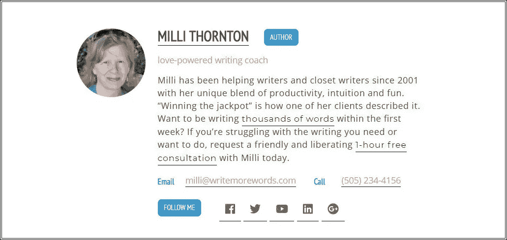

# 客座博文:如何在作者框中发出有力的行动号召

> 原文：<https://medium.com/swlh/guest-blogging-how-to-make-a-potent-call-to-action-in-the-author-box-947e6090a2a3>

Photo by [Iñaki del Olmo](https://unsplash.com/photos/usBtx_aYs8Q?utm_source=unsplash&utm_medium=referral&utm_content=creditCopyText) on [Unsplash](https://unsplash.com/?utm_source=unsplash&utm_medium=referral&utm_content=creditCopyText)

> 有了客座博文，你可以和你所在领域的一些顶级博客作者建立联系。当人们开始看到你的名字出现在他们所有的博客上时，他们会开始给你同样的尊重。
> —巴米德勒，负责的作家

D o 你写的投稿文章或客座博文有明确的目的吗？

如果是，你可以在你的作者栏里反映出来，这样你的推广目标会更成功。

一份精心制作的简历和作者栏中的行动号召可以突出你的文章，帮助你的读者获得正确的作者简介。

# 为什么是“快照”？

当读者看到你客座博文的结尾时，如果你做得很好，他们会对你很好奇。

他们也会热情地采取某种行动。

采取行动的愿望通常不是留下评论。收到对你文章的评论可以看作是锦上添花。满足读者的需求会更好。

为了满足读者更深层次的需求，你在作者栏中的简历应该简短、引人注目、聚焦于读者而不是你自己，并提供清晰的 CTA(行动号召)。

# **用一两句话树立权威**

如果你的作者简历夸大了你的资历，这会冲淡你在你的领域中获得的真实权威。

> 与流行的看法相反，证书更多的是关于你的读者，而不是你自己。

除非阅读纯粹是为了休闲，否则你的读者最关心的是你是否有他或她的主要问题的解决方案。

一篇好的作者简介可以用 1-2 句简单明了的话来树立你在读者心目中的权威。例如:

> 小企业顾问莎拉·米勒关心你的成功。她帮助小企业主减少牺牲，获得更多为自己工作的好处。

Photo by [Andrew Neel](https://unsplash.com/photos/QLqNalPe0RA?utm_source=unsplash&utm_medium=referral&utm_content=creditCopyText) on [Unsplash](https://unsplash.com/?utm_source=unsplash&utm_medium=referral&utm_content=creditCopyText)

# **提供接触/跟随细节的填充**

虽然能够展示网站地址和社交媒体链接对作者来说是一个优势，但是如果读者没有明显的方向，他们可能不会对你的链接做太多。

没有明确目的的网站地址通常不足以吸引读者点击进入。社交媒体链接可能是多余的，而不是你们都喜欢的联系。

如果你的读者在社交媒体上关注你，这可能是一种拖延症。从你那里获得社交媒体更新不如获得解决方案来得直接。

# **为什么你的读者需要行动号召**

我们自己总是很清楚我们在提供什么。但是一个全新的读者不会看到它，除非你变得具体。

除非你提供一个报价——并给你的读者一个快速评估的方法——他们很可能对你的简历和联系方式有一个分散的体验。这意味着你将失去 30 秒钟发挥最大影响力的机会。

> 如果你所提供的东西在你的教育和专业背景的细节中丢失了，她可能不会在你的简历中出现。在博客的侧边栏中，其他吸引人的东西可能会吸引她的眼球。

## "化繁为简是成功的第一要素。"

## —乔治·厄尔·巴克

Photo by [Kevin](https://unsplash.com/photos/aiyBwbrWWlo?utm_source=unsplash&utm_medium=referral&utm_content=creditCopyText) on [Unsplash](https://unsplash.com/?utm_source=unsplash&utm_medium=referral&utm_content=creditCopyText)

# **如何用更少的话说更多的话**

让我们回到莎拉·米勒。Sarah 撰写客座文章的目标是吸引更多读者访问她的网站，获得更多订户，并最终从新客户那里赢得更多业务。作者栏里有她的简历:

> 小企业顾问莎拉·米勒关心你的成功。她帮助小企业主减少牺牲，获得更多为自己工作的好处。如果你经常每周工作 60 个小时以上，错过了太多的家庭聚餐，请点击链接获得莎拉的免费下载:如何获得回报，而不是被你投资业务的每个小时耗尽。

免费下载是号召读者访问莎拉的网站。下载将读者放入 Sarah 的电子邮件列表中。在她的每周邮件中，她提供了更多有用的信息(她在客座博文中提供的类型)。这给了新订户时间来评估她的产品并获得信任感。

理想情况下，Sarah 的免费下载还会在最后包含一个行动号召，比如提供一个免费咨询或对她的服务打折。

# **为什么一个有效的作者盒子能帮助世界**

尽管在互联网上有很多关于人生目标的猜测和探索，但每个人都贡献出一些有价值的东西，就是在帮助这个世界。

然而，在营销中——包括客座博文——除非我们的目标客户和顾客了解我们可以提供的定制帮助，否则联系的机会可能会白白浪费掉。

为客座作者写一份有效的简历，并提供一个简明的行动号召，可以帮助你帮助更多的人，也可以吸引更多的目标客户来帮助你的业务蓬勃发展。

*原载于 2018 年 4 月 13 日*[*www.bizcatalyst360.com*](https://www.bizcatalyst360.com/how-to-make-a-clear-call-to-action-in-the-author-box-of-your-guest-articles/)*。*

## 这篇文章发表在 [The Startup](https://medium.com/swlh) 上，这是 Medium 最大的创业刊物，有 319，283+人关注。

## 在此订阅接收[我们的头条新闻](http://growthsupply.com/the-startup-newsletter/)。

