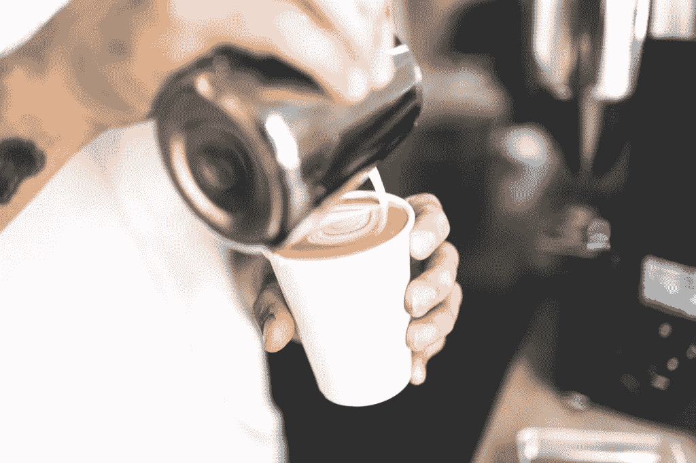
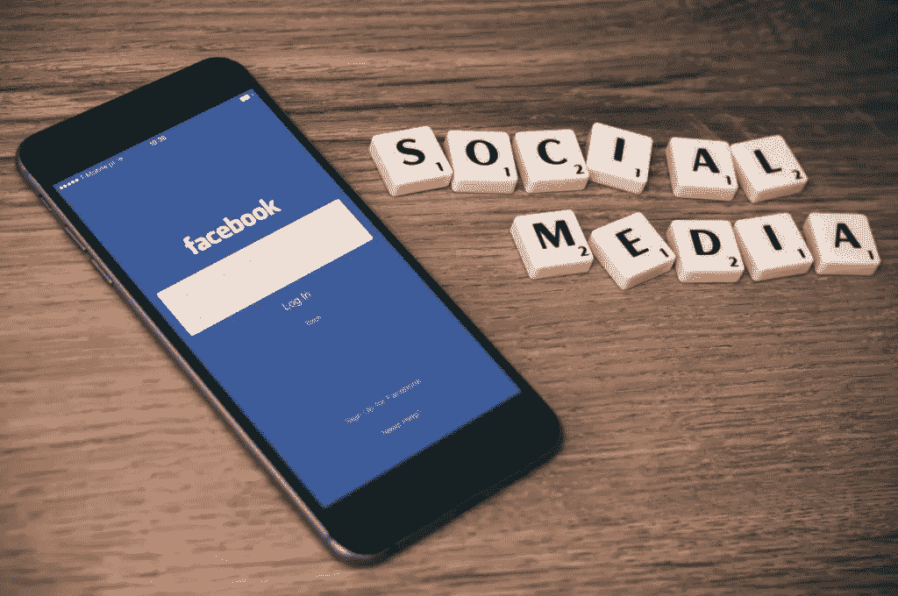

# 习惯造就人

> 原文：<https://medium.com/swlh/habits-maketh-the-man-32fd07037a6>

> ***“动力是让你开始的东西。习惯是你前进的动力”***[**——吉姆·瑞恩**](http://www.goodreads.com/author/show/549394.Jim_Ryun)

几乎所有成功人士与其他人不同的一点是他们的习惯。大多数人花了数年时间建立积极的日常习惯，并积极培养和调整它们，使它们总是令人兴奋和刺激的。

对于我们其他人来说，习惯是我们一天中日常感觉的自然结果。它们的形成是一种反应，而不是一种创造。

这篇文章旨在帮助你让你的生活脱离自动驾驶仪，开始积极地培养新习惯，在未来几年为你服务。

# 习惯到底是什么？

在我们开始改变习惯或形成新习惯之前，考虑一下习惯的实际定义是有帮助的——它们是什么？它们是如何形成和破碎的？是什么导致我们养成某些习惯？

习惯是狡猾的小动物；有时候很难准确定义习惯是什么。每个人看起来都不一样，没有简单的方法可以改变我们所有的日常习惯和惯例。

它们也有负面的含义(见下面的官方定义)，但是如果你更加意识到它们，以及习惯的力量，从长远来看，没有什么是你不能实现的。汤姆·科利的书 [**改变你的习惯，改变你的生活**](https://www.amazon.com/Change-Your-Habits-Life-Millionaires/dp/1635050049) 就是一个证明，探索了将普通人变成百万富翁的具体习惯。

[*“习惯的锁链太弱以至于感觉不到，直到强大到无法挣脱。”――塞缪尔·约翰逊*](https://twitter.com/share?text=%E2%80%9CThe+chains+of+habit+are+too+weak+to+be+felt+until+they+are+too+strong+to+be+broken.%E2%80%9D+%E2%80%95+Samuel+Johnson&url=https://eccountability.io/habit-forming/&via=Eccountability)

习惯可以被科学地研究，并且已经有各种各样的研究在科学上完成，在科学上，什么能精确地定义一个“习惯”,以及我们如何能发展常规去改变现有的和形成新的。虽然关于习惯的构成并不只有一个正确的答案，但是在习惯的形成背后有各种各样的理论来帮助解释为什么以及如何形成习惯。

例如,《习惯的力量》的作者查尔斯·杜希格写了一些关于习惯如何起作用的文章，根据他的说法，习惯基本上是我们每天经历多次的小循环的产物。这个循环看起来是这样的:

# 触发→套路→奖励

因此，让我们对此进行进一步的阐述。触发器是某种有规律的提示，促使你的大脑经历一个典型的例行程序。例如，也许你正试图戒掉咖啡因瘾，但不知何故，你仍然发现自己每天在上班的路上都会去星巴克。

在这种情况下，触发因素可能来自于这样一个事实:你开车经过星巴克——你看到了它，你觉得有必要停下来买一杯咖啡，因为这是你习惯的。这是习惯的常规部分。你的诱因是去看星巴克，你的惯例是进去买一杯星巴克饮料。奖励呢？当然是买了咖啡后喝。

我们习惯的触发因素可以根植于许多不同的事物。通常，他们是情绪化的。这是开始吸烟的人数；你可能会感到压力或焦虑，这提示你继续你的例行公事，拿出一支烟并点燃，当你吸烟时，你会得到缓解压力的回报(尽管这当然是短期的)。

对于不良习惯，如吸烟、饮酒或不健康的饮食来缓解压力或负面情绪，这种“回报”通常是短暂的，很快就会被一种负罪感或羞耻感所取代，这种负罪感或羞耻感是因为实施了一个在长期游戏中对你没有真正好处的习惯。

理解这个循环很重要，因为能够隔离和理解最初的暗示和触发——以及为什么你会感觉到那个触发背后的原因——是能够改变你的常规的第一步。在我们的第一个关于停下来买星巴克的例子中，一旦你可以隔离你的触发点——每天开车经过星巴克店——改变习惯可能就像选择不同的路线去上班一样简单，从而避免购买星巴克的触发点。

> [**下载一份工作表，里面包含你今天就开始创造积极的新习惯所需的一切！**](https://godirectentertainment.leadpages.co/leadbox/14331e073f72a2%3A14e3e4942b46dc/5641332169113600/)

# 学习培养哪些习惯

仅仅知道一种习惯是如何或为什么形成的是不够的；你还必须知道哪些习惯是值得你在生活中养成和发展的。你可以从观察其他成功人士的共同习惯开始——比如 T4 列出的成功企业家的五个日常习惯。

像生活中的所有事情一样，你需要关注的习惯会有所不同，这取决于你的优先事项、愿景和目标。一些好习惯对你来说很容易养成，而另一些则可能更具挑战性——你为之奋斗的事情可能与其他人奋斗的事情不一样。

当你决定在生活中开始培养哪些习惯时，有一些一般的事情要记住。作为参考，看看这些[成功企业家的 20 个习惯](https://smallbiztrends.com/2016/05/habits-of-successful-entrepreneurs.html)——一个在不同领域和成功阶段的所有成功企业家中最常见的 20 个习惯的列表。

学习养成习惯的一个简单方法是**停止、开始、保持:**

我们应该**停止**做什么？

我们应该**开始**做什么？

我们应该**让**继续做什么？

你可以在这里下载一个免费的工作表工具来帮助你或你的商业伙伴讨论这种“停止-开始-保持”方法[。](http://connect.rhythmsystems.com/download-start-stop-keep-tool-qp)

我们再一次发现，自我反省的技能在这里至关重要——了解你自己、你的优先事项、你的优势和你的弱点是知道哪些行动对你有效，哪些无效的关键。现在让我们来看看一些你可能想停止做的事情，以及一些你可能想开始做的事情。

## **有些事情你可能不想做了**

*   **不断查看社交媒体。这不仅浪费时间，还不可避免地让你将自己与他人进行比较——或者与你在社交媒体上看到的他们的有限形象进行比较。当你看到人们选择在网上描绘自己的“完美”照片时，你可能会经常发现自己在比较中不够格。社交媒体可能是好的，但当你漫不经心地浏览你的脸书或推特时，它会降低你的生活效率——平均每个人每天花大约 1 小时 40 分钟在社交媒体上。**
*   是时候停止盲目的媒体消费了。想想你一天中有多少时间是开着电视或收音机的，无论是下班一回家就打开电视，还是每次在车里都开着收音机。听收音机或看电视并没有什么特别的问题，但是当它侵占了你的生活，而你甚至没有意识到你在吃什么的时候，这就有潜在的问题了。
*   **吃得不好。**我们不是在这里规定你的饮食，但健康的饮食习惯对整体健康的身体大有帮助。当你身体处于最佳状态时，你就最有能力在生活的各个领域追求成功。
*   **花太多时间在任何与你的长期目标不匹配的事情上，或者让你兴奋和激励你的事情上。当然，我们有时都不得不做一些对我们来说并不特别有趣、令人兴奋或愉快的事情。你可能不喜欢去看牙医或洗车，但它必须时不时地做。我说的是你选择做的分散你整体视野的事情(比如当你试图为环球旅行存钱时，每天都去买星巴克)。如果它只是一种不需要出现在你生活中的模式，那么是时候抛弃它了。**

# 一些你可能想开始做的事情(如果你还没有开始做的话)

*   **沉思。你可能认为冥想只是“精神”型和“嬉皮士”型的，但那不是真的。科学开始显示花时间在安静的冥想中有很多好处；这有助于理清你的思绪，重新集中你的思想，让你每天都做最好的自己。事实上，Inc.com 已经发表了一整篇文章，介绍科学如何证明冥想有助于改善企业。**
*   **记日记。也许你不是作家，但是花点时间写日记还是值得的。它可能只是记下你每天感激的一些事情，或者你可能真的花时间写下你一天和一周的细节——比如对你当天做得好的深思，以及你想做得更好的地方。写日记没有对错之分；不管你写了多少日记或者你遵循了什么特别的方法，写日记这个简单的行为将有助于提高你的写作技巧和自我意识。**
*   **每天练习正念。**即使你没有每天花时间进行正式的冥想练习，你也没有理由不在一天中时不时地花几分钟来留意和意识你的周围环境、你的情绪和你的行为。对自己进行这些安静的检查是确保你坚持自己愿景的好方法。
*   **锻炼身体。**你可能不是那种想每天晚上花两个小时在健身房的人，这没关系。但是，真的没有理由过完全久坐的生活，因为一项又一项的研究表明，定期锻炼对保持你的身心健康至关重要。每天只需 20-30 分钟的体育活动就足够了；这并不需要投入太多的时间。

关于你应该关注的习惯种类以及如何去做的更多想法，请访问史蒂夫·斯科特的网站 [**养成好习惯**](http://www.developgoodhabits.com/) ，那里有各种各样与好习惯相关的资源和建议。

也许最重要的是…意识到你已经养成的好习惯，并坚持下去！“如果没坏，就别修”——不管你在做什么，只要对你有好处，优先考虑这些习惯，让它们成为你日常生活的一个重要部分。

> [“我们重复做什么，就会成为什么样的人。”―肖恩·柯维，高效青少年的 7 个习惯](https://twitter.com/share?text=%E2%80%9CWe+become+what+we+repeatedly+do.%E2%80%9D+%E2%80%95+Sean+Covey%2C+The+7+Habits+Of+Highly+Effective+Teens+%27&url=https://eccountability.io/habit-forming/&via=Eccountability)

# 从小处着手

> "千里之行始于足下。"

不要试图在一夜之间改变你的整个生活方式！每当你跟不上你试图在生活中实施的许多新变化时，你就会发现自己变得不知所措、灰心丧气。相反，选择一个新的习惯开始在你的生活中形成，并把你的精力集中在这上面。

当一个新的习惯在你的生活中变得牢固时，你就可以添加另一个好习惯来关注，如此等等。请记住，即使是最成功的人也曾从小处开始，然后逐渐壮大——没有人能在一夜之间拥有一百万 Twitter 粉丝。

最好的方法是从能让你在日常生活中更快乐的习惯开始。职业幸福教练维基·莫里斯写了一本关于这方面的很棒的书，叫做《快乐习惯》。

我还强烈建议将冥想和/或正念作为最重要的习惯之一，立即开始培养——因为你必须**正念**并意识到你在日常生活中正在做什么，以便识别消极模式并开始用积极模式取代它们。

这一切都从正念开始。休·g·伯恩的 [**《此时此地的习惯**](https://www.amazon.com/Here-Now-Habit-Mindfulness-Unhealthy/dp/1626252378) 是最好的地方，可以从如何通过更加留心来打破坏习惯的实用建议开始。在你养成正念的本性之前试图改变你的其他习惯有点像试图解决症状而不是找到持久的治疗方法，但是如果你能开始一直培养正念，它会让你在你做的其他事情上更有效率。

不服气？也许这份 [10 位沉思的著名企业家的名单](http://www.whyamiunhealthy.com/10-famous-entrepreneurs-that-meditate/)能改变你的想法。

# 养成一种习惯需要多长时间？

当谈到养成(或打破)一个习惯需要多长时间时，有很多数字被抛出。许多人说，一个新习惯可以在一个月内学会(这一观点似乎因麦克斯韦·马尔茨的《心理控制论》一书而得到推广，他在书中写道，他的大多数整形手术患者需要大约 21 天才能习惯看到自己的新面孔)。但是根据《科学警报》上的这篇文章，形成一个新习惯的平均时间是 66 天，而个体时间可能从 18 天到 254 天不等。

> [下载一份工作表，里面包含你今天就开始创造积极的新习惯所需的一切！](https://godirectentertainment.leadpages.co/leadbox/14331e073f72a2%3A14e3e4942b46dc/5641332169113600/)

所以现实是，对于养成一个新习惯需要多长时间这个问题，并没有一个一成不变的答案。更多阅读[中的希望与恐惧“打破一个习惯需要多长时间？](http://www.hopesandfears.com/hopes/now/question/216479-how-long-does-it-really-take-to-break-a-habit)这篇文章提到，当打破一个习惯/形成一个新习惯时，有许多变量会发挥作用——例如，每当一个旧的压力源重新进入你的生活，并触发你再次开始做原来的坏习惯时，你可能会认为你已经完全掌握了新习惯。

注意这篇文章提到的最重要的事情之一？摆脱生活中消极习惯的最好方法就是专注于用积极的习惯来代替它们！不要把时间浪费在消极的事情上，并为此自责。相反，追踪你积极的习惯，每天花越来越多的时间在积极的事情上。你不可能真正“打破”坏习惯，除非你已经养成了更好的习惯来取代它们。

在《希望与恐惧》这篇文章中，你需要注意的另一件事是提到养成或改掉一个新习惯所需的时间因人而异。在这个博客系列中，我们已经谈了很多关于个性的重要性；每个人的目标、惯例、愿景、梦想和自我反省的做法看起来会有所不同，这取决于他们自己独特的个性和特质。

嗯，当你试图计算你需要多长时间才能养成一个新习惯时，情况也是如此。有些可能对你来说特别根深蒂固(因为你拥有它们的时间太长了，它们已经习惯了)，而其他的可能不是。

M.J. Ryan 的书《习惯改变者》 给了你 81 条咒语，旨在帮助你打破坏习惯，方法是用一句格言重组你的大脑，比如:

*   不能说不就不能说是
*   握手表达你的恐惧
*   站在你不想站的地方

如果你只是一周或一个月停下来喝一次昂贵的手工咖啡，你可能会比每天停下来喝咖啡的人更容易迅速地从你的生活中消失。不要根据别人的成功来判断自己；相反，要学会根据自己的优势和劣势来批判自己。

# 养成日常习惯

在德里克·多普克的书《健康习惯革命**中，你可以在短短 21 天内学会如何培养新习惯，每天只需投入 5 分钟。**

**当你开始明确哪些好习惯需要融入你的生活，哪些坏习惯需要改掉并用新习惯取代时，真正改变的关键是让它们成为日常生活的一部分。毕竟，这就是习惯的本质——只是日常生活的一部分。**

**所以，决定你将如何开始你的早晨——无论是冥想、用心早餐、上班路上的信息播客，还是其他——并坚持下去。让它成为一种惯例。**

**让健康维护成为一种常规——下班后去健身房，下午吃点健康的零食，让你在一天的剩余时间里精力充沛，无论你需要做什么来保持自己的健康——计划好你一天中什么时候会做这些事情，然后让它们成为你日常生活的核心部分。**

**将你自己的日常事务与成功企业家的日常事务进行比较，为了让你自己成功，在你需要的地方做出改变。**

**我们将在下一篇博文中更深入地讨论跟踪和监控习惯的主题。**

> **[**下载一份工作表，里面包含你今天就开始创造积极的新习惯所需的一切！**](https://godirectentertainment.leadpages.co/leadbox/14331e073f72a2%3A14e3e4942b46dc/5641332169113600/)**

**本文原载于 [eccountability.io](https://eccountability.io/habit-forming/)**