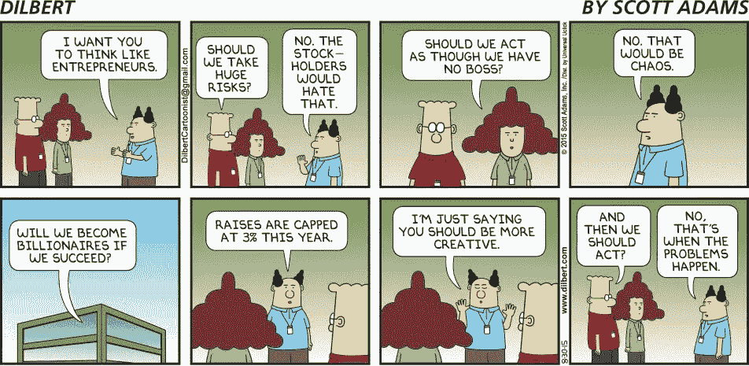

# 黑客入侵企业文化:创业公司和公司中的故事、英雄和仪式

> 原文：<https://medium.com/swlh/hacking-a-corporate-culture-stories-heroes-and-rituals-in-startups-and-companies-4913c05e7820>

今年，我一直在与采用和适应精益方法的公司和政府机构合作。我在这篇博文中总结了我的学习[，这里](http://steveblank.com/2015/06/26/lean-innovation-management-making-corporate-innovation-work/)、[这里](http://steveblank.com/2015/03/17/getting-to-yes-for-corporate-innovation/)和[这里](http://steveblank.com/2015/05/19/organizational-debt-is-like-technical-debt-but-worse/)和[这里](http://steveblank.com/2015/03/11/fear-of-failure-and-lack-of-speed-in-a-large-corporation/)并把它们一起放在演示文稿[这里](http://steveblank.com/2015/08/21/innovation-50x-in-companies-and-government-agencies/)中。

我遇到的一个有趣的创新挑战集中在公司文化上。虽然初创公司可以从零开始构建价值观和文化，但想要(重新)开始企业创新的现有公司必须重新启动现有的——有时是根深蒂固的——企业文化。这不是一项容易的任务，但未能改变文化将注定该公司任何创新努力的失败。

**企业创新需要创新文化** 现有公司的创新不仅仅是伟大技术、关键收购或聪明人的总和。企业创新需要与之匹配并支持它的文化。通常这意味着对现有公司文化的改变。说服员工放弃旧的价值观和信仰，接受新的价值观和信仰是一项挑战。

一项企业创新计划的开始和结束往往都是董事会会议对首席执行官的授权，随后是一系列给员工的备忘录、大量海报和为期一天的研讨会。这通常创造了“创新剧场”，但创新很少。

麦肯锡的两位顾问特里·迪尔和阿瑟·肯尼迪写了一本名为《企业文化:企业生活的礼仪》的书。他们指出，每家公司都有一种文化**——**，这种文化是“我们公司做事方式”的简称公司文化有四个基本要素:

*   *价值观/信仰*——为一家公司做的每一件事设定哲学，本质上就是它所代表的东西
*   故事/神话 —故事是关于创始人/员工如何克服障碍，赢得新订单…
*   *英雄* —获得奖励和庆祝的是什么，你如何成为组织中的英雄？
*   *仪式* —公司庆祝什么以及如何庆祝？

**企业文化的力量** 在我第三次创业时， [Convergent Technologies](http://steveblank.com/category/convergent-technologies/) ，我开始理解企业文化的力量。在这家疯狂的初创公司工作的价值观和基本信念体现在一句话中，那就是我们是“硅谷的海军陆战队”如果你对加入海军陆战队的想法不感兴趣，你就不要申请。如果它很有吸引力(通常对高睾酮的 20 岁年轻人来说)，你会努力争取进入。

当我加入时，公司已经有了一个“战胜不可能”和“立足创新”的故事库。众所周知，创始人们已经从简单地制造一台能装在一块带有新奇的英特尔微处理器的电路板上的完整的计算机，转向向其他计算机公司出售带有操作系统和办公应用程序(个人电脑的前身)的完整的桌面工作站。在同一次会议上，这位首席执行官在一位客户的白板前完成了从“我们不感兴趣”到 4500 万美元订单的转变。

随后与一家大型计算机客户的每一笔交易都被庆祝(交易价值数千万美元)，我们的销售人员被视为英雄。当需要任何特殊的定制工程努力来匹配超额销售承诺(几乎每笔交易)时，工程师也被视为英雄。当营销人员乘坐[红眼航班](https://en.wikipedia.org/wiki/Red-eye_flight)去现场支持销售时(经常如此)，我们也成了英雄。

最后，每个大订单都伴随着仪式和庆祝活动。钟声和锣声会响起。首席执行官会分发 100 美元的钞票，并当场发放 25，000 美元的奖金，这是多年来一直谈论的话题。有一次，他甚至在我们主要走廊的墙上喷涂了一句劝诫要按时运送新产品的话(如此粗糙，我甚至无法解释，但 30 年后仍然记得)。

虽然我的头衔、名片和工作描述描述了我的工作职能，但这些不成文的价值观、故事、英雄和仪式指导着我在工作中的行为。

**企业文化诊断** 你甚至可以在进入一家公司之前就很好地了解它的文化。例如，当公司说，“我们重视我们的员工”，但却为高管预留了停车位、私人自助餐厅和顶层办公室时，这比任何公关宣传都更能说明问题。或者，如果一位首席执行官自豪地吹嘘他们的企业孵化器，但孵化器的停车场在下午 5:15 是空的。

我坐在几个随意的咖啡休息时间和午餐上，比阅读所有的公司使命声明或自助餐厅里鼓舞人心的海报更了解一家公司的企业信仰、英雄和仪式。在 [Horizon 1 和 2 公司](http://steveblank.com/2015/06/26/lean-innovation-management-making-corporate-innovation-work/)(那些执行或扩展当前商业模式的公司)中，故事围绕着英雄和反叛者，他们不顾现有的流程，设法完成了一些新的事情。这些公司的惯例是关于重组、晋升、头衔、加薪等。

这些核心价值观和信念以及随之而来的故事、英雄和仪式，也定义了谁在组织中是重要的[以及公司想要吸引谁。例如，如果一家公司把财务业绩看得比什么都重要，它的故事、神话和仪式可能会包括一位英雄如何从一家供应商那里为公司节省了 5%的成本。或者，如果一家公司专注于提供突破性产品，那么英雄、故事和仪式将与产品创新有关(例如，Mac、iPod 和 iPhone 开发的苹果传奇)。](http://steveblank.com/2009/05/04/the-sharp-end-of-the-stick/)

**打造企业文化** 为了让创新通过设计而非例外地发生，企业需要打造自己的企业文化。这类似于对你自己的公司发动心理战。这需要人力资源和财务部门的配合，是一个精心策划的过程。

1.  评估你的公司目前的价值观和信念*被员工理解*
2.  传达对新价值观的需求并让员工接受新的思维方式是很难的。它始于思考公司希望赖以生存的新价值观和信念
3.  围绕这些价值观，计划共同努力创造一系列新的故事、英雄和仪式
4.  在创造新文化的同时，调整公司的激励计划(薪酬计划、奖金、晋升等)。)到新的价值观。未能重新调整激励机制注定了任何新文化变革的失败。

为了创造创新文化，公司需要英雄和创造新商业模式、新产品和新客户的员工的故事。由一个疯狂的想法创造出来的新产品线的故事。或者像一个保守的经理那样的英雄，他不断地把最好的团队送到企业孵化器；或者是部门总经理，他们改造并采用了收购的产品，并将其构建成一个成功的产品线；或者是工程团队，他们走出大楼，看到了客户的需求，并构建了一个服务于客户需求的产品，并最终建立了一个新的部门。仪式和奖励需要支持这种类型的创新(不仅仅是现有的执行)。

文化变革几乎总是会遇到问题——抵制变革(我们总是这样)、过时(世界变了，但我们的价值观没有变)、不一致(我们口头上说我们的价值观，但并没有真正实施)。但是，通过改变激励机制来强化文化，结合起来就能实现这一目标。

创新文化的结果是一个有着统一目标的大公司，能够以速度、敏捷和激情前进。

**经验教训**

*   企业创新需要创新文化
*   企业文化由价值观、故事、英雄和仪式组成
*   创业公司从零开始建立注重创新的价值观和文化
*   想要(重新)开始企业创新的现有公司必须重新启动现有的企业文化——这很难
*   你可以破解文化
*   它需要与人力资源和财务部门进行仔细、周密和协调的流程
*   结果是[创新@50x](http://steveblank.com/2015/08/21/innovation-50x-in-companies-and-government-agencies/)

*在*[*www.steveblank.com*](http://www.steveblank.com)*阅读更多史蒂夫空白博客。*