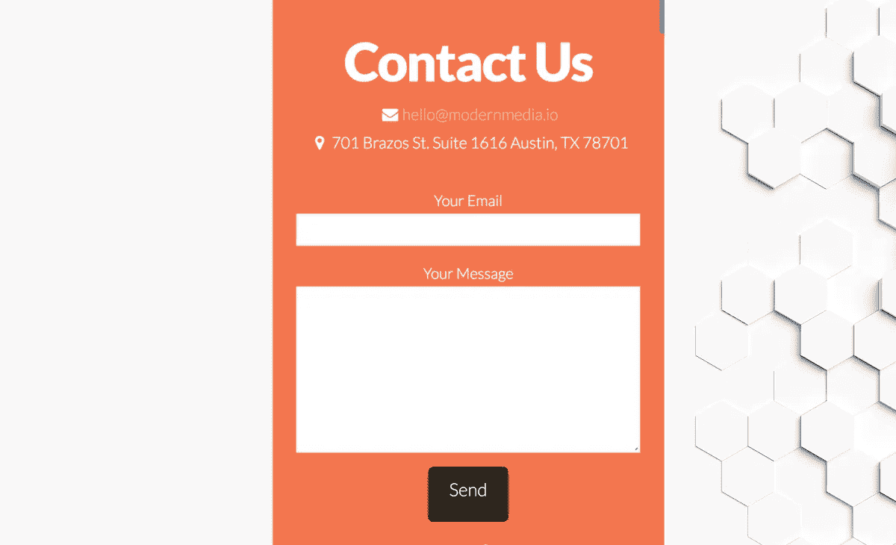
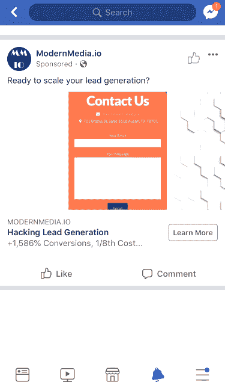
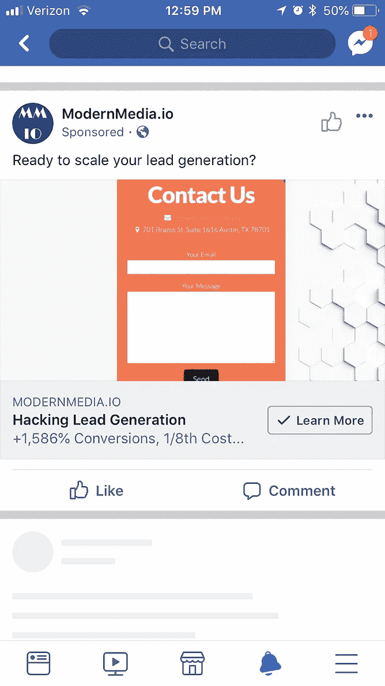
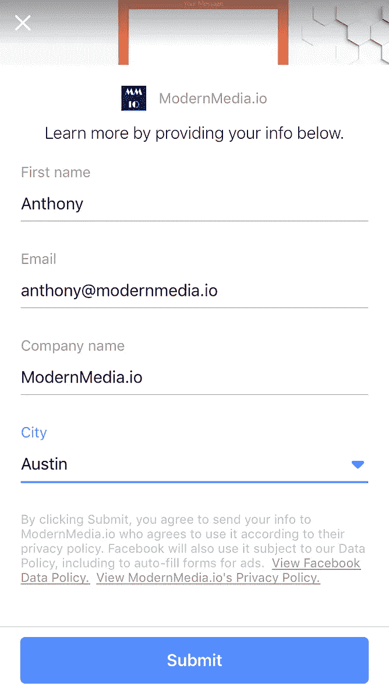
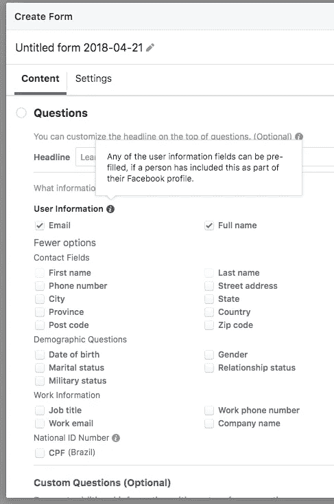
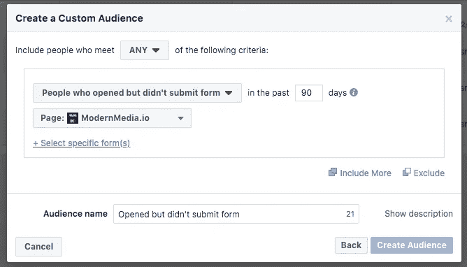
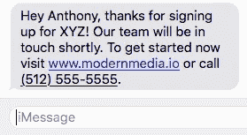
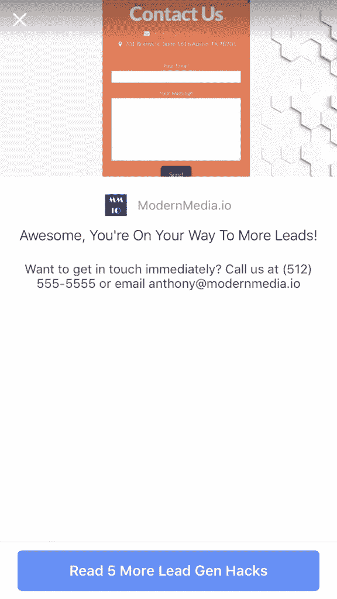
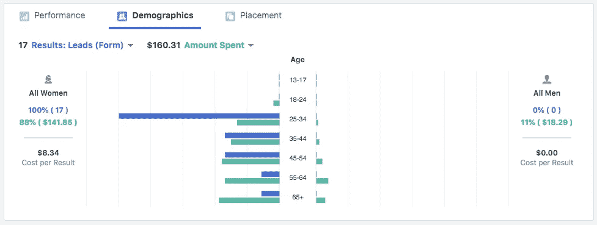

# 利用脸书领导形式广告黑掉领导 Gen[How To]

> 原文：<https://medium.com/swlh/hacking-facebook-leads-4326bf9e1447>

## 成本降低 1/8，转化率提高 1，586%

Learn How Facebook Lead Ads Are Great For Lead Generation

**你是靠领导一代成长起来的吗？**潜在客户是许多公司的生命线……电子邮件地址既是现代的电话号码，也是名片。

你的主要潜在客户渠道是你网站的**联系我们**表格吗？您的行动号召是以下内容之一吗？

*   取得联系！
*   我们谈谈吧。
*   请求免费咨询

接着往下读……这种方法已经帮助许多公司在很少甚至没有潜在客户的情况下获得了潜在客户……一直扩展到**每天数百个潜在客户** …,并且**将每个潜在客户的成本** (CPL) 降低到仅为其登录页面成本的八分之一。

或者也许你**已经在开展销售线索形式的营销活动**并在寻找提高投资回报率和进一步优化的方法。查看以下最佳实践。实现这些额外选项中的一个就能让你的转换率翻倍。

> 欲了解更多最佳实践，请访问

# 什么是脸书领先广告？

[脸书销售线索广告](https://www.facebook.com/business/a/lead-ads)是一种相对较新的**销售线索捕捉工具**。传统上，用户会点击广告，访问你的网站，四处浏览……然后*也许*会提交一份联系表格。有了脸书领先广告，用户可以切入正题，立即提交他们的联系信息。

*What do Facebook Lead Ad Forms Look Like?*

**他们很棒** **因为**他们解决了领先一代的两个最大的*技术*障碍:

1.  **网页加载时间:**谷歌报告称[大多数网站在加载](https://testmysite.withgoogle.com/intl/en-gb)时会损失一半的访客。这太疯狂了，当你被点击收费时，你必须加倍才能找到你真正的点击费。
2.  填写联系信息:输入并仔细检查电子邮件地址和电话号码是一件痛苦的事情，尤其是在手机上。脸书销售线索表单将*自动将用户在脸书的个人资料中的信息填充到销售线索表单中*。

花了一大笔钱买广告，却发现访客在点击你的广告，但在转化过程中的某个时候又掉了下来，这很令人沮丧。呃。花了这么多广告费却没有投资回报。作为一个用户，你有多少次因为加载时间太长而放弃了一个网页？有多少次你会因为花费时间太长而取消账单？或者你关闭一个 app 多少次？我们一直在这样做，却没有意识到这一点。 **引形正解**。

想一想你出门在外的时候，也许是步行去开会，也许是在健身房，你需要对工作信息发送一个长的回复。我敢肯定你的反应是“我会等到回家，在电脑前坐下来，打出我最好的回答”。联系方式通常要简单得多，但同样的心理因素也在起作用……*我稍后再做*。

这是你需要克服的最大的心理障碍……而脸书的 Lead Form 广告在这方面做得很好。

Collecting Lead Information With A Facebook Lead Ad

请记住，现在大多数网站流量都是移动的。移动是方便的，移动是高度可及的。但是在手机上填写联系表格是一场噩梦。手机慢。多任务处理很糟糕……而且通知不断分散我们对正在做的事情的注意力，平均每个人每天会收到 63 个通知。同样，脸书**会自动填充**联系信息。真正的游戏规则改变者。

User Information Fields That Facebook Can Auto-Populate

**什么时候领先形式的广告最有效？**

*   表现不佳的网站(速度慢、不安全、信任问题)。
*   不熟悉的品牌或网站(用户停留在脸书)。
*   高度接触或需要跟进的销售过程。
*   不要有购物车或自助结账功能。
*   高票价。
*   建立名单的举措。

你有没有注意到你的脸书广告本身似乎表现不错，但你没有看到任何转换？如果人们点击你的网站，但没有转化，那么铅广告可能值得测试。

# 黑客领袖 Gen

很好，现在您已经熟悉了领先广告，也许您已经开始开展一项活动，并看到了一些结果。准备好更上一层楼了吗？准备开始看到真正的投资回报。*地狱是的*。好了，让我们开始吧。

**基本销售线索生成原则:**如果您刚刚开始销售线索生成…

1.  **尽可能简单……**从统计数据来看，对于每一个额外的输入字段，都会有一定比例的用户退出并不提交。*你可能只需要他们的电子邮件地址*。
2.  **添加一个时间限制或稀缺…** 一个他们现在应该提交的理由。克服“我以后再做”的想法
3.  **尽快跟进…** 你等待的时间越长，你的行动号召在潜在客户心目中的印象就越淡。

> 关于脸书销售线索生成的问题？
> 
> 请通过 [hello@modernmedia.io](mailto:hello@modernmedia.io) 联系我们

# 高级脸书线索广告提示

**增加投资回报率…**

1.  重新定位打开表单但未提交的用户。
2.  发送自动跟进。
3.  提供立即与您联系的选项。
4.  添加第二个行动要求、追加销售或交叉销售。
5.  磨练你的目标和信息。
6.  在其他平台上重新定位(LinkedIn)。

## 1.重新定位打开表单但未提交的用户。

脸书有一些最先进的重新定位选项，对于领先广告也是如此。请确保创建至少一个广告集，重新定位打开您的潜在客户表单但未提交的用户。

我们建议重新定位广告，使用不同的优惠和不同的卖点。要么是他们没有提交，要么是他们没有从第一次互动中转变过来的原因。采取不同的角度，添加另一个约束(即。时间不多了)，或者让交易变得更好(他们已经表示有兴趣打开你的表单…利用这些热情的观众吧！).

此外，请确保排除已经从正在使用的任何其他访问群体转换过来的用户。

***Retarget Lead Ad Forms****: People who opened but didn’t submit* form

## 2.发送自动跟进。

记住，你和潜在客户接触的时间越长，他们的记忆就越淡。

脸书[与一些开箱即用的 CRM](https://www.facebook.com/business/help/908902042493104)集成在一起。如果你的客户关系管理在那份名单上——很好，连接系统，确保新的线索得到及时跟进。

如果你不在那个名单上，或者没有使用 CRM…不要担心。我最喜欢的选择其实是[扎皮尔](https://zapier.com/)。你可以用它做很多事情。Zapier 可以将数据传输到几乎任何系统，它可以将你的线索备份到电子表格中，你可以直接从那里发送信息。

收集电话号码而不是电子邮件地址？使用自动短信服务。[短信 98%的时间都是打开的](https://theblog.adobe.com/marketing-with-98-percent-read-rate-and-10-more-compelling-stats/)！

Send an automatic follow-up to your leads.

## 3.提供立即与您联系的选项。

你正在收集线索…但有些人会成为热门的现成买家。也许他们现在需要你的解决方案。

让他们很容易升级自己。在感谢页面上列出电话号码和电子邮件地址。

Double Your Conversions With Additional CTAs

## 4.添加第二个行动号召。

这是大多数广告商忽略的游戏规则改变者。就像给他们提供一个联系你的选项一样…你为什么要在客户旅程的终点设置一堵砖墙呢？

相反，告诉他们下一步需要做什么。提供第二个行动要求，例如:

*   比如我们的页面。
*   开始免费试用。
*   立即享受九折优惠。
*   邀请一个朋友。

他们已经是炙手可热的潜在客户，对你的报价感兴趣，你是他们的首选。让他们追加销售和交叉销售自己。**总有一些人想要更多。**

参见上面的截图示例。

## 5.磨练你的目标和信息。

目前唯一的“**当你被收费的时候**”选项是对领先广告的印象。这意味着每次脸书向别人展示你的广告时，你都要付费。每次，不管他们是否点击、转换或滚动到下一个狗迷因。

这与 **CPC** (每次点击费用)不同，后者只在有人参与时才收费。CPC 是伟大的，因为你可以在你的广告文案中召唤出你的目标受众或者取消其他受众的资格。“马拉松运动员可以通过……”(普通跑步机用户不太可能点击)或“有草坪护理问题的房主可以尝试……”(公寓业主或租户不太可能点击)。

**像鹰一样观察你的转换人口统计数据**。如果你注意到老用户占你的转换更多？然后限定你定位的*年龄范围*。请注意，您在周末收到的销售线索很少(通常是 B2B 活动，因为人们在周末没有这种心态)？然后限制你的活动只在工作日进行。*向最佳点*优化，你将**消除浪费的印象和浪费的广告费用**。

最好能更具体地定位你的主要广告。如果你发现你的广告没有显示，那么扩大，但请记住，每次你的广告显示时，你将被收费。

Optimize Your Campaign Based on Conversion Demographics

看看上面这个广告活动第一天的例子。在第一天，我们立即看到 25-34 岁的女性是最佳转换年龄组。如果这种趋势持续下去，就要针对这一特定人群调整你的目标和信息。将你的目标人群更新为 25-34 岁的女性。更新你的形象，使用年轻女性，直接和她们说话，使用她们能理解和产生共鸣的措辞。

您预计每条线索的成本是多少？这在很大程度上取决于目标受众和广告本身。您的线索广告可能从 10-20 美元/线索或更多开始…随着时间的推移，优化到每线索不到 1 美元并不罕见。

> ***数据:*** [***脸书领先广告基准***](https://leadsbridge.com/facebook-lead-ads-benchmark/)

## 6.在其他平台上重新定位(LinkedIn)。

一旦你有了他们的电子邮件地址，他们就表示出了兴趣。在其他平台上展示广告，如谷歌展示网络、LinkedIn 或 Twitter，保持领先优势。

当你的销售人员匆忙联系时，这是培养销售线索的绝佳机会。领导周末报名了吗？很多时候他们会在周一忘记，但是如果你重新设定目标，也许他们会多看几次你的标志，到周一的时候，你仍然会在脑海中出现。

因此，我们在这里讨论了很多，从关于销售线索广告的信息到优化您的营销活动的技巧和最佳实践。领先广告仍然是新鲜事物，是领先于竞争对手的绝佳机会。去给他们一个尝试，让我知道你是否有任何问题！

> 关于脸书销售线索生成的问题？
> 
> 请通过 [hello@modernmedia.io](mailto:hello@modernmedia.io) 联系我们

*最初发布于*[modernmedia.io/hacking-facebook-leads/](http://modernmedia.io/hacking-facebook-leads/)，*2018 年 4 月 21 日。*

## 这篇文章发表在 [The Startup](https://medium.com/swlh) 杂志上，这是 Medium 最大的创业刊物，拥有 319，583+读者。

## 在这里订阅接收[我们的头条新闻](http://growthsupply.com/the-startup-newsletter/)。

