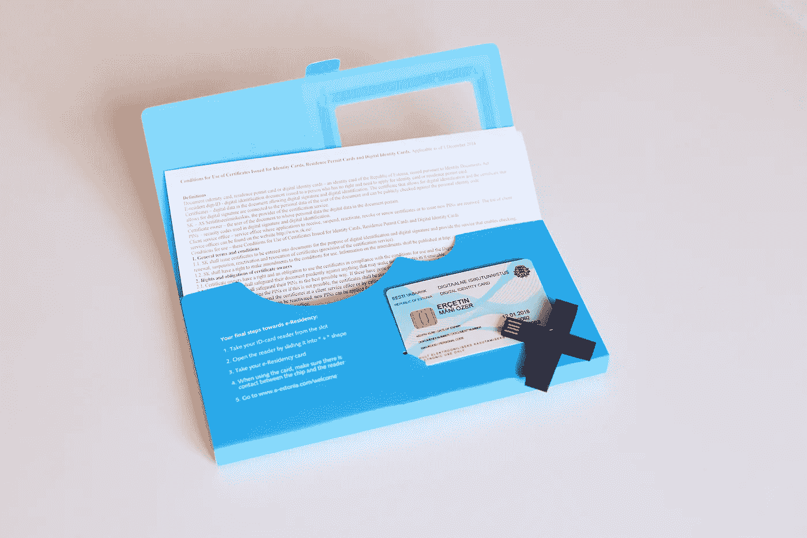
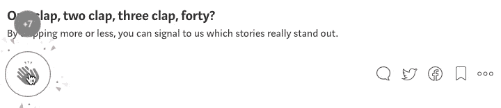

# 品牌社区对硬国家

> 原文：<https://medium.com/swlh/hard-states-versus-branded-communities-8b9a7efe939f>

## …基本收入倡议如何发展公共秩序？

政府不再有效率。无论是对内还是对外政策，决策都变得投机取巧，而不是长期的。各国更喜欢使用战术力量和谎言，而不是竞争性话语。这可能是一场历史悲剧。正如亨利·基辛格写的那样，“……营销努力是为了传达候选人的信念，还是候选人表达的信念反映了对个人可能偏好和偏见的“大数据”研究？民主能避免演变成基于情绪化的大众诉求而非开国元勋们想象的理性过程的蛊惑人心的结果吗？“有效需要不确定的实验，并假设这是一项有风险的业务。它与大型无机系统无关，但对长期可靠生存至关重要。”可持续性”产生了[危险的问题和债务依赖](https://www.iif.com/publication/global-debt-monitor/global-debt-monitor-january-2018)。尽管技术进步，最大的社会机构，如金融，医疗保健，公共安全，公用事业服务似乎是比较原始的。

[Fortune:](http://fortune.com/2016/02/10/national-debt/) The U.S. May Be Even More Broke than You Think

[另一边](/@jareekboy/legal-values-and-the-progress-de257546c8b8)，我们周围的世界已经变得(或者一直以来都是)非常快速增长、可扩展和不可预测。我们爱上了新技术——脆弱、快速变化和极端的现象。它让我们用新躁狂症改变一切——“打破最古老的模式”。我们相信现在能够改变最古老的非结构化和复杂的系统，包括社会，法律等等。改变并不是坏事，但是改变的方式(和速度)并不安全。变化是辩证的好事，但并不是每个变化都对社会和商业有益。

> 这里有一个内在的巨大矛盾……“一直使国家成为人间地狱的东西，恰恰是人类试图使它成为天堂的东西”，—f·霍尔德林

在《通往奴役之路》中，弗里德里希·哈耶克写道:“当文明的进程发生了意想不到的转折，当我们发现自己受到了与过去野蛮时代相关的邪恶的威胁，而不是我们所期待的持续进步时，我们自然会责怪除了我们自己以外的任何东西[……]如果结果与我们的目标如此不同，如果我们面对的不是自由和繁荣，而是奴役和苦难， 难道还不清楚邪恶的力量一定挫败了我们的意图，我们是某种邪恶力量的受害者，在我们能够重新踏上通往更美好的道路之前，必须战胜这种邪恶力量吗？ [……]我们准备接受对我们文明目前危机的几乎任何解释，但有一个除外:世界目前的状况可能是我们自己真正错误的结果，追求我们最珍视的一些理想显然产生了与我们预期完全不同的结果。”所以，我们该怎么处理？

# 品牌社区进行大型实验

政府做不到的，品牌社区可以做到。现在的趋势是对土地的未来发起不同的倡议。由 Seasteading Institute 提出和推出的东西，正在被其追随者和追随者重新诠释。[第一个](https://www.seasteading.org/)于 2017 年与法属波利尼西亚达成协议并建立了特殊关系，共同创建一个海域，为塔希提泻湖保护水域中的浮动岛屿提供“特殊的政府框架”。与此同时，[蓝色前沿](https://www.blue-frontiers.com/)成立了，这是一家新成立的公司，将在 2020 年前管理海域并建造旨在有机适应海平面变化的浮岛。在法属波利尼西亚政府的支持下，它正在推出世界上第一个由初创企业、实验室和住宅组成的浮动生态系统。

[Blue Frontiers:](https://www.blue-frontiers.com/) The world’s first floating ecosystem of start-ups, laboratories, and homes

另一个叫做 [NEOM](http://www.discoverneom.com/content/pdfs/NEOM_BROCHURE_RGB_100073132_LDN.pdf) 的被定位为“世界上第一个横跨三个国家的独立特区。它将成为位于沙特阿拉伯西北部的一个新的充满活力的目的地。NEOM 希望成为一个领先的全球中心，通过为其居民提供田园生活方式来预示人类文明的未来，NEOM 寻求吸引来自世界各地的顶级人才，以前所未有的方式推动创新的边界，并推动该地区及其居民的发展。”另一方面，[爱沙尼亚的倡议](/e-residency-blog/were-planning-to-launch-estcoin-and-that-s-only-the-start-310aba7f3790)正在改变国际社会的形成方式。其中一些不再重要，而是在数字上合法和独立。[自由职业者正在改变我们对工作的看法。它为减少全球的结构性不平等提供了全新的机遇。Work-Work-work 替换](/@slavasolodkiy_67243/gig-economy-is-on-the-rise-34bea518bb2f)[用 work(！)而是自主](https://www8.gsb.columbia.edu/faculty/jstiglitz/sites/jstiglitz/files/Inequality%20and%20Economic%20Growth.pdf)。全世界的失业率都很高。[全球青年失业率再次上升](http://www.un.org/youthenvoy/2016/08/global-youth-unemployment-rise/)，预计约为 13%。

[e-Estonia:](https://apply.gov.ee/) e-Residency offers the freedom to easily start and run a global business in a trusted EU environment

# a .基本健康收入和其他举措

众所周知，基本收入可以在全世界范围内提供更多的自由。由于日益加剧的不平等、数十年停滞不前的工资、终身职业转变为不到一小时的任务、机器人和深度神经网络等指数级发展的技术，有人提议开始永久保证每个人都有一些收入。 [Y Combinator](https://basicincome.ycr.org/) 在美国启动了私人资助的实验:“基本收入是向所有个人保证的无条件现金转移——没有工作要求，没有收入审查，也没有如何花钱的限制。每个人单独获得收入”。阅读[他们的完整提案](https://static1.squarespace.com/static/599c23b2e6f2e1aeb8d35ec6/t/59c3188c4c326da3497c355f/1505958039366/YCR-Basic-Income-Proposal.pdf)。

[Autonomic, The Healthcare Bank grants a basic wellness income guarantee](https://www.dropbox.com/s/tp437vxxyhuxrkr/Autonomic%2C%20The%20Healthcare%20Bank%20Shortview%20i1.pdf?dl=0)

[正如我们认为的](/@jareekboy/the-future-of-healthcare-financing-9840e18c4d7b)，[保健银行](https://www.dropbox.com/s/tp437vxxyhuxrkr/Autonomic%2C%20The%20Healthcare%20Bank%20Shortview%20i1.pdf?dl=0)应该在世界各地成立。这些机构一方面将成为政府和保险公司之间的经纪人，另一方面将成为被保险人之间的经纪人。政府可能会直接资助健身房会员资格或提供报销，购买由身体活动支持的数字货币，或其他任何东西。不幸的是，无论在哪里，对于政策制定者来说，如何执行[量化宽松](https://en.wikipedia.org/wiki/Quantitative_easing)都是显而易见的，但在直接拨款至关重要的现实领域中，却没有相似之处。正如研究人员认为的那样，预防性健康计划是解决国家健康危机的最大希望，因为它提供了一个独特的机会来重新构建健康本身的思维模式——从疾病到健康。根据世卫组织的数据，不健康的生活方式是至少 60-70%的疾病的主要原因。正如[克里斯·维耶巴赫](https://en.wikipedia.org/wiki/Chris_Viehbacher)所说:“在美国，政府可以花 10 万美元来防止你的死亡，但甚至不会花 1 美元来保护你不生病。”原有的[医疗保险](https://www.medicare.gov/coverage/fitness-programs.html)不覆盖健身房会员资格或健身计划，所以私人医疗银行应该覆盖。故事很简单。

## 这个故事发表在 [The Startup](https://medium.com/swlh) 上，这是 Medium 最大的创业刊物，拥有 272，582+人关注。

## 在这里订阅接收[我们的头条新闻](http://growthsupply.com/the-startup-newsletter/)。

## 你喜欢这篇文章吗？跟着我；)然后拍手👏

