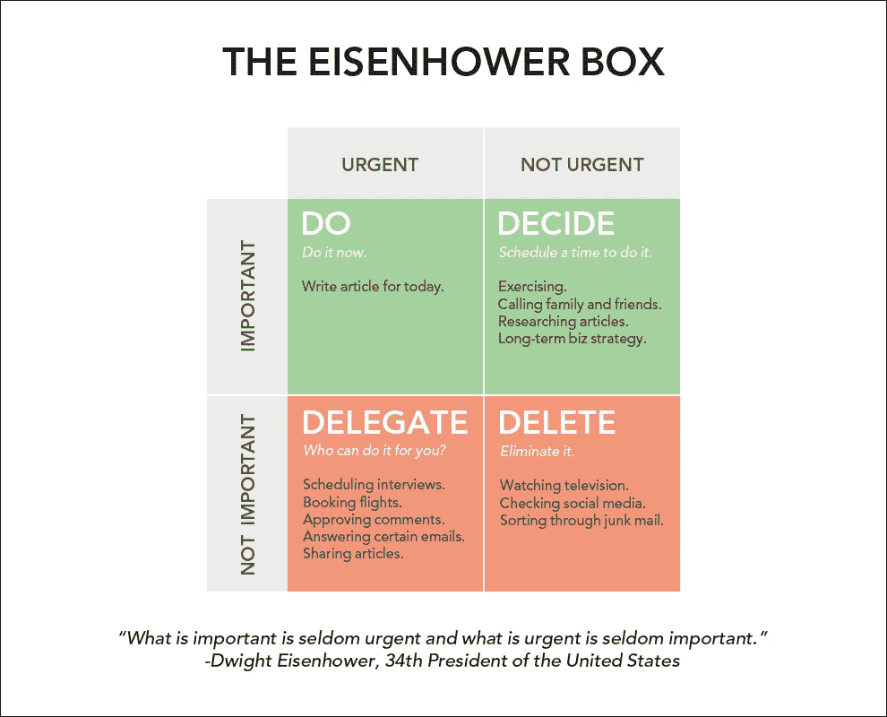

# 努力工作是进步的敌人

> 原文：<https://medium.com/swlh/hard-work-is-the-enemy-of-progress-d370b6915ee4>

## 努力工作并不总能让你得到你想要的东西。

有一种观点认为，在这个世界上，一切都需要努力。它被商业“教练”、蹩脚的 Instagram 引用和一个不顾一切地展示他们有多成功的社会所延续。

我也不是想说努力工作没有价值，它对你的业务增长至关重要。但这种“24/7 全天候忙碌”的心态肯定会带来挑战，如果不解决这些挑战，可能意味着你的企业的死亡(或停滞，在许多情况下是一回事)。

**这种心态让你的企业过于依赖你**

当你自己做每件事，而没有在你周围建立适当的系统让你的企业自我运转时，你是在工作，而不是在公司。

太多的人把自己放在销售人员、营销人员、财务人员和业务生产/履行人员的位置上。一切都依赖于他们的参与。

*如果你是一个知道如何做某事的人，没有你这件事是不会完成的。*

*如果你是这个过程某些部分的决策者，没有你，这个过程怎么进行呢？*

这些都是你在经营公司时要考虑的事情。你花了太多时间在努力工作上，以至于忘了聪明地工作。

你需要建立流程，外包，并把你的业务想象成一台机器，或者一个系统——而不是一个人的工作。

决定如何做的最简单的方法是艾森豪威尔矩阵。这是其中一个的样子:

Courtesy of [James Clear](https://jamesclear.com)

开始把你每天的活动放入矩阵中，并决定你真正需要做什么。你很快就会更聪明地工作，而不一定更努力。

## 这篇文章发表在 [The Startup](https://medium.com/swlh) 上，这是 Medium 最大的创业刊物，有 318，983+人关注。

## 订阅接收[我们的头条新闻](http://growthsupply.com/the-startup-newsletter/)。

