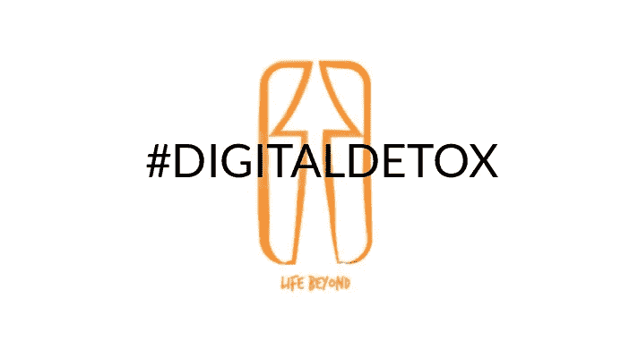

# 铁杆数字排毒——以及为什么我不想要任何东西

> 原文：<https://medium.com/swlh/hardcore-digital-detox-and-why-i-dont-want-any-3d7fd7a3710>

## 当我沉迷于智能手机的时候

为什么智能手机成瘾会成为一个如此巨大的问题？一个关于平衡触摸屏迷行为、有意识地使用数字技术和数字排毒的故事。

## 我非常支持平衡使用数字技术

我大半辈子都对科幻、哲学和科技着迷。我目前的职位是荷兰最具创新性的 It 咨询公司之一的内容撰稿人，这并非巧合。

但正因为如此，我有机会近距离、批判性地观察数字技术对我们生活的影响。无论是个人还是社会。

而[的冲击是巨大的](/life-beyond/life-beyond-the-touch-screen-a715b119b8db)。

# 对数字戒毒的需求

青少年抑郁症和自杀率较高显然至少与智能手机使用的增加有关。显然；交通事故造成更多的伤亡。但更重要的是:

# 从最重要的事情上分心

我们允许我们的[代理和我们的自我导向被绑架](/life-beyond/offline-sunday-self-direction-and-balance-80c26bb99cf)。这不是人类历史上的第一次，当然不是——但是数字技术让人们分心的方式肯定是前所未有的。

> 从真正重要的事情上分心；不管那是什么，对我们任何一个人来说。

技术发展的速度正使无意识地与我们的日常数字界面互动变得越来越诱人和无摩擦，这至少应该有些令人担忧。

如果你从事技术或营销行业，这一点尤其重要。无论是关心自己还是关心客户如何使用你的产品和服务。

这是你的(企业社会)责任。

我一直注意到，我很难用语言来解释为什么不平衡的、习惯性的(过度)使用数字技术是一个如此大的问题。

> 关键是:孩子们真的在游泳池和海滩上[溺水](https://www.usatoday.com/story/news/nation-now/2018/08/15/child-drownings-linked-phone-distraction-among-parents-pools/998836002/)(在美国、德国、荷兰和其他地方)，因为父母很难从他们的手机上抬起头来。如此等等。什么？的。见鬼了。

# 数码排毒；离线星期天

受到其他思想家和作家的启发——其中最著名的是[嗨，沃特！](https://medium.com/u/295258f6269d#OfflineSunday 过得怎么样。<em class=)

[太好了。我有时甚至有点惭愧——被认为是我有时担心会遇到的那个爱发牢骚的小混蛋——但最自豪的是越来越多地被认为是更平衡和更有意识地使用技术的倡导者。](https://medium.com/u/295258f6269d#OfflineSunday 过得怎么样。<em class=)

[只有一个问题。](https://medium.com/u/295258f6269d#OfflineSunday 过得怎么样。<em class=)

## [我非常沉迷于我的手机](https://medium.com/u/295258f6269d#OfflineSunday 过得怎么样。<em class=)

[我不得不——不好意思地——承认:我早上第一件事就是查看手机。因为实用。睡觉的时候，我会在枕头下用它来播放音乐或咒语。](https://medium.com/u/295258f6269d#OfflineSunday 过得怎么样。<em class=)

[我知道。就避免智能手机成瘾而言，这是非常危险和愚蠢的。](https://medium.com/u/295258f6269d#OfflineSunday 过得怎么样。<em class=)

[但是它太实用了。](https://medium.com/u/295258f6269d#OfflineSunday 过得怎么样。<em class=)

[一点也不实际的是，我如何每天查看手机大约 200 次，看看我是否有任何可能稍微重要的新通知。](https://medium.com/u/295258f6269d#OfflineSunday 过得怎么样。<em class=)

[(如果我之前的使用情况接近他的研究中的普通智能手机用户的话，这是从平均每天无意识地抓取 2617 次的巨大进步。我做了什么改变了我的习惯？这里可以找到](https://medium.com/u/295258f6269d#OfflineSunday 过得怎么样。<em class=)[。)](/life-beyond/life-beyond-the-touch-screen-a715b119b8db)

但是我不想突然戒掉我的智能手机瘾。我不想要任何硬核数字排毒。为什么？因为数字技术与上世纪四五十年代的吸烟并不完全相同——有些人将数字技术与吸烟相提并论。

与吸烟相比，数字技术对我们的日常生活有越来越明显的好处。

更像是…

## 数字技术就像壁纸

不使用壁纸是不切实际的。或者墙漆。你明白我的意思。

> 我们只需要确保我们使用数字设备和应用程序的方式不会变得类似于使用含有石棉的壁纸或油漆。

关于墙纸或墙漆的更多信息:一旦你习惯了，你很少会记得它的存在。我们大多数人甚至不知道为什么我们会得到它，或者为什么人们一开始就开始使用它。

但是现在我们在这里，我们怎么能回到冰冷、光秃秃的石墙——我不是说这是一个选择，也不是说这是一个时髦的选择:而是唯一的选择？

> 区别？作为一个社会，你可以说我们沉迷于壁纸。但最大的区别是，我们不会像对待智能手机一样，花太多时间醒着抚摸壁纸——预见真实的人与真实的人和其他重要的事情的真实接触。

嗨，我是欧文。我非常沉迷于我的智能手机。如果你想一想，很可能你也是。

为平衡干杯。

我非常重视并感谢您的关注。我写的是平衡和有意识地使用数字技术，并关注于**之后的生活。可以免费看我的处女作小说，面值* [*这里*](https://www.facevaluethebook.com/) *。**

*如果您能通过鼓掌或在下面的评论中让我知道您对这篇文章的评价，我将不胜感激。*

**最后，如果你知道这篇文章对谁有价值，请分享。**

**

## *这篇文章发表在 [The Startup](https://medium.com/swlh) 上，这是 Medium 最大的创业刊物，拥有+369，832 名读者。*

## *在这里订阅接收[我们的头条新闻](http://growthsupply.com/the-startup-newsletter/)。*

**