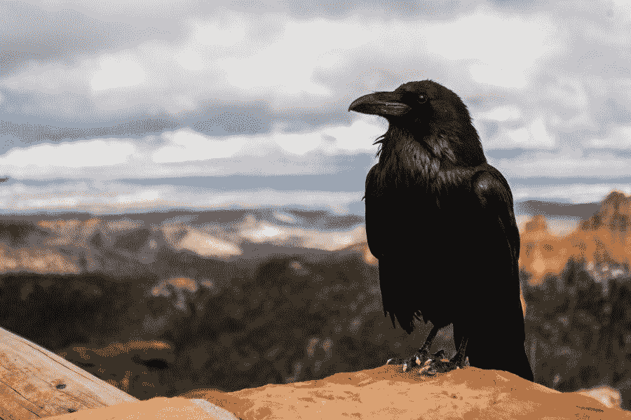
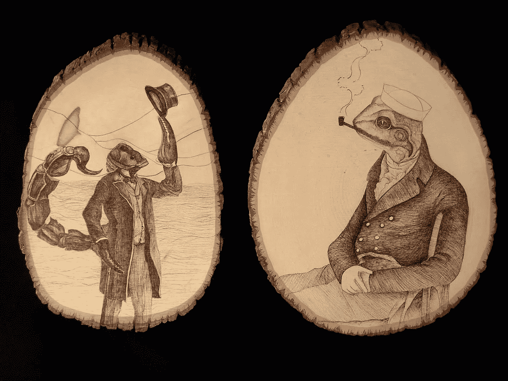

# 小心你的好奇心。小心喜鹊。

> 原文：<https://medium.com/swlh/harness-your-curiosity-beware-the-magpie-18c79e6eb56d>

我在康沃尔郡乡下的一个非常小的村庄里度过了我最年轻的几年。很长一段时间里，我们有一个当地的送奶工，他每天早上都会把玻璃瓶的牛奶送到我们家门口。你可能见过这种——有彩色箔盖的那种。

不可避免地，许多瓶子受到了当地野生动物的攻击。乌鸦和麻雀会刺破盖子，试图狼吞虎咽地喝光牛奶，但我更感兴趣的是看看清晨的喜鹊是否会出来偷锡纸盖子。

毕竟，传说中喜鹊是一种只喜欢闪闪发光的东西的鸟。

形象地说，我们都有自己的喜鹊。有时它们相对温顺。在其他情况下，他们贪得无厌地咬着钻头。

我们的喜鹊不仅仅是为了抓住一些闪亮但低价值的物品，如牛奶瓶盖或 Instagram 之类的东西而游荡。

现代喜鹊想要制造影响。

它想做出积极的改变。

它想要实现和超越。

它想建一个装满有价值的东西的巢。

我不知道你怎么样，但是我的喜鹊饿极了。

*A Raven, rather than a ravenous Magpie. by* [*Tyler Quiring*](https://unsplash.com/photos/T5Ye7puWZxo?utm_source=unsplash&utm_medium=referral&utm_content=creditCopyText) *on* [*Unsplash*](https://unsplash.com/?utm_source=unsplash&utm_medium=referral&utm_content=creditCopyText)*.*

根据迈尔斯-布里格斯测试，我的性格类型是 [INFJ](https://www.16personalities.com/infj-personality) 。

谈到职业，INFJ 的特点之一是不喜欢选择一条道路，主要是因为这意味着做出令人心碎的决定，放弃其他几个同样令人满意和有趣的选择。

天生对不同的事物和它们是如何工作的好奇加剧了这一点。

生活在今天这个永远在线的世界里，尤其是在繁忙的城市里，这种感觉更加强烈。

这种结合为喜鹊创造了特别肥沃的土壤。

喜鹊几乎可以在任何地方找到食物:

*   一篇有趣公司幕后的文章
*   一项新的慈善事业
*   一个我们可以(下意识地)与之比较的成功人士
*   向刚起步或变换车道的人征求建议
*   相邻行业的新趋势或新想法

喜鹊渴望所有这些。

就像传说中的[蝎子](https://en.wikipedia.org/wiki/The_Scorpion_and_the_Frog)，这不是它的错——这只是它的本性。

如果我们纵容喜鹊，它会伤害我们。

然而，为了避免伤害，我们不必完全驱逐喜鹊。

我们必须做的是驯服它，即使我们觉得这样做会错过大好机会。

Derek Sivers 建议，在考虑一个决定或机会时，一个很好的启发是用[、【绝对是】或](https://sivers.org/hellyeah)来回答。如果不是*‘见鬼是’*那么答案应该是*‘不是’*。

喜鹊让我们在应该说*不*的时候说*是*。

但是只有我们知道什么时候是*【地狱是的】*。那种感觉来自喜鹊够不到的其他地方；它对我们还不够了解。这就是我们驯服它的方法。

做决定的时候，问问自己:这是我，还是喜鹊？

*原载于 2018 年 1 月 2 日*[*【howardgray.net*](http://howardgray.net/2018/01/02/harness-your-curiosity-beware-the-magpie/)*。*

## 这个故事发表在 [The Startup](https://medium.com/swlh) 上，这是 Medium 最大的企业家出版物，拥有 293，189+人。

## 在此订阅接收[我们的头条新闻](http://growthsupply.com/the-startup-newsletter/)。

