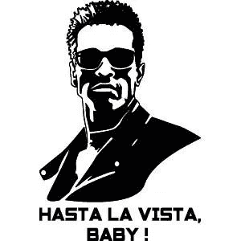
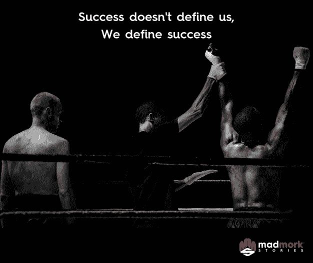

# 再见，硅谷

> 原文：<https://medium.com/swlh/hasta-la-vista-silicon-valley-99dff4f65354>

6 月 29 日，我的前妻收到了一封永远改变了我们生活的信:她的房东要出售房子。她将不得不在接下来的 60 天内搬出这栋房子。这座 1200 平方英尺的小房子(你可以在这里看到)在 2015 年以 150 万美元的荒谬价格(按照国家标准)出售，现在在市场上的价格是令人垂涎的 240 万美元。对业主来说持续繁荣的硅谷房地产市场继续对租房者实施水刑。

不得不再次搬家、为我们的孩子寻找新学校以及我也不得不搬家的前景(尽管我最近以比去年高出 20%的价格续签了自己的租约)，让我们不得不为选择而手忙脚乱。这也让我们问自己同样熟悉的问题:

我们究竟为什么要留在硅谷？

对我的前任来说，搬回自己国家的决定对美国以外的任何人来说都很熟悉。在她的祖国，她有她的家人，她的朋友，她的生意，并且可以住在那里，费用只是这里的一小部分(租金实际上是这里的 1/3)。

对我来说，这个决定要艰难得多:46 岁的时候，我正考虑搬到 8000 英里以外的外国，在那里我没有网络，没有工作，而且必须用一门外语工作(幸运的是，我会说这门外语)。更重要的是，我将不得不放弃一年前刚刚开始的新业务，失去与所有朋友的联系，失去过去 9 年多来在初创公司和谷歌建立的亲密商业关系。

这个决定令人痛苦。

或者是吗？

事实证明与我想象的大相径庭。几个月来，我和别人交谈，听到自己抱怨山谷里的情况。这句话我听了又说，听得太多了，我已经厌倦了自己说这句话。成本、交通、压力、竞争以及所有的一切。

我经常想到这一点，以至于生活在硅谷就像被困在一段糟糕的婚姻中。我可以解释我为什么搬到这里。我可以合理化我建立创业公司的尝试。我可以解释我为什么加入谷歌。我可以解释为什么我试图开办自己的公司。为了追求创业的荣耀，我可以合理地耗尽我的积蓄。我可以合理解释长时间的工作、压力、挫折，或者无休止地比较我在硅谷巨人中的地位。

我甚至可以解释为什么它让我失去了婚姻…

但我现在无法合理化，如果我留下来，让我的前妻和孩子搬到世界的另一端，8000 多英里以外，我可能会违反我最神圣的价值观。我找不到理由不去看我的两个小孩。我猜你必须在某个时候在沙子上画一条线(并且不要越过它)。

你看，当我的世界在 2017 年 3 月 6 日崩溃时，我做出了，这是我很长时间以来做出的最好的决定之一:我伸出援手。不是来自朋友，不是来自我的家人，也不是来自治疗师(尽管所有这些也有帮助)。

我有私人教练。通过和我的教练一起工作，我开始意识到两件事改变了一切，并使一个看似不可能的决定变成了一个相当简单的决定。

我明白了自己的目标:“成为激励人们从事有意义、有影响力的职业的磁性能量。”

我知道了我的核心价值观是什么:

好父亲:辅导、指导、优质时间、家庭、真正在场、玩耍、好奇、有趣、有意、高度参与、乐观主义者

MADMORK:独立，自由思考，选择生活，天生的挑战动力，代表公平/正义，反迪士尼，反体制，没有废话，没有主播

宁静:和平，简单，感恩，返璞归真，不废话，避难所，自然世界，健康，自然归属，与自己，家庭的深刻联系，对人类意味着什么

世纪之旅:奋斗、驱动、探索、好奇、坚韧、活在当下、不废话、承诺、呕吐、勇敢、无畏

# **旅程**

那么，我是如何做出决定的呢？我做了任何优秀的技术人员都会做的事。我收集了数据，然后我去咀嚼它。我和父母交谈，和朋友交谈，和教练交谈，还读了很多书。

然后，一旦我觉得我有了所有的数据点，我就在帕西菲卡订了一个可以俯瞰海岸线的酒店，并把自己隔离在那里 24 小时。我写作，阅读，计算数字，在海滩上漫步。

这个决定结果相当简单。当你在上面看我的价值观，这是堆栈排名，最高值是好父亲。好父亲的价值观就是指导、训练、帮助和支持他人。但更重要的是，好父亲正是这样:一个好父亲。从这个角度来看，世界上只有两个人是重要的:娜塔莎和拉斐尔·默克。我 7 岁和 11 岁的孩子。

是的，我可以留在这里，尝试每月一次可笑的通勤，去 8000 英里外看他们。是的，我可以欺骗自己，认为我可以通过 Facetime 和 Whatsapp 培养父爱纽带。是的，我可以一厢情愿地认为，在迪斯尼乐园或加勒比海的美好假期可以洗去爸爸不在时他们的眼泪。当他们跌倒时，我不在那里扶起他们。当他们在学校度过糟糕的一天时不在那里。当他们需要拥抱道晚安时却不在。不在那里。

真的吗？我到底在想什么？一切都变得清晰了。我打算搬到 8000 英里以外的地方。忘记创业，忘记荣耀，忘记我的网络，忘记我过去 4-5 年的白日梦。是时候尊重我的价值观，做对大多数父亲来说可能显而易见的事情了，但对我们这些在科技跑步机上跑来跑去、日复一日在谷歌巴士上磨蹭的人来说，这可能不那么明显。

是时候忠于我说过的我想成为的人了。故事结束。

当我最终做出决定时，我的头脑清晰明了，我感到一种巨大的平静。我离开酒店房间，沿着海滩散步了很久。散步结束时，我来到一个俯瞰大海的高崖。我仍然记得那个时刻，它将伴随我很长一段时间。我眺望大海，感觉冷风吹在我的脸上，我感到平静、放松、快乐和兴奋。

在接下来的几周里，我不会假装事情很容易。我的处境、年龄、缺乏人脉以及移居国外的严酷现实并没有影响我。我会在冷汗中醒来，问自己。想知道我将如何谋生，从头开始会是什么样子，我将如何在外国和用外语交朋友。我发现自己紧张焦虑。

但最终，我从未怀疑过自己。这是一个基于我的核心价值观和对我来说最重要的东西的决定:我的孩子和成为他们生活中重要的一部分。从这个角度来看，和我的教练一起明确我的价值观并对其进行优先排序，真的让我的决定比我想象的要简单得多。这也是我过去一年在技术领域指导过的客户所宣扬的。一旦你真正了解了自己的价值观，并愿意按照它们生活，生活中的许多决定实际上会变得简单得多。

# **其他离职原因**

抛开价值观不谈，还有其他问题也促使我决定离开硅谷。除了对疯狂的住房成本的明显考虑之外，当你有孩子和多个家庭要抚养时，这种考虑会被显著放大，旧金山的通勤状况现在在美国排名第一，在全球排名第五——恭喜旧金山！

除了从旧金山延伸到桑尼维尔的交通堵塞，另一个随着交通一起向南迁移的是越来越多的无家可归者和房车。雷德伍德城的无家可归者几乎出现在每个街角，并在城市的各个立交桥下有永久的营地，而从帕洛阿尔托到雷德伍德城的街道上似乎排列着稳定的休闲车队伍。

现在，我不是社会学家，所以我不能具体指出为什么会发生这种情况，但该地区房价的不断飙升和财富的不平等肯定不会有所帮助。整件事让我想知道该地区将走向何方，当我想到我的孩子将在什么样的环境中成长时，作为父母的我感到担忧。

这让我想起了我生命中两个特别的小人物:我的孩子们。决定搬迁的一个重要原因围绕着两件事:

首先，即使我亲自出现在我的孩子面前，当我和他们在一起时，我也总是感到紧张，我给予他们的关注的质量并不是我基于我的价值观想要的。当我 7 岁的女儿评论说:“爸爸，你为什么一直在工作？”时，我痛苦地意识到这一点。或者“爸爸，你为什么总是生气？我不喜欢你生气的时候”。事实上，情况变得如此糟糕，以至于我的前妻甚至向我提到，孩子们变得太害怕了，不敢告诉我某些事情。害怕我。哇…

当我意识到我和孩子的关系正在恶化时，那是一个转折点。有些东西必须放弃。我违背了我的价值观。我不想继续那样生活。

第二，鉴于我在冥想和教练方面的工作，我开始明白，我不需要在这里取得成功才能快乐。事实上，当我环顾四周，看到那些“成功”的人时，他们中的许多人实际上并不“幸福”。有时候，他们似乎越成功就越不快乐。

SMLXL

所以我意识到，我完全可以住在其他地方，在那里我可以有更好的工作/生活平衡，更高的生活质量，成为“小池塘”中的“大鱼”。我真的不在乎待在 Techcrunch。我不在乎我的公司是否以 Z 估值从 Y 提高了 X。那些事情对我来说已经不再像以前那样重要了。

别误会，我不后悔 9 年前搬到这里的决定。我不后悔我做的决定或做过的事情，因为它们都让我成为一个更完整、更有自我意识、更平衡的人。

硅谷仍然是一个充满魔力、创新、无与伦比的创造力和技术天才的地方，我在这里交了很多好朋友，但它面临着严峻的挑战，如果它要继续吸引人们来这里，它的领导人需要解决这些挑战(鉴于最新的立法可能会越来越多地将优秀人才拒之门外，这将变得更加有趣)。

所以对我来说，是时候重新开始了。一个新的国家，新面孔，新的机遇和挑战。我永远感激我在这里经历的一切，更重要的是，感激所有忍受了疯狂默克的疯狂和戏剧的朋友和家人。硅谷对我来说永远有一个特殊的位置，所以，现在，不是“再见”，而是“再见”我确信我很快会再次拜访。

从哪里？这是我下一篇文章的主题。敬请期待；)

再见了，宝贝！

疯狂默克

## 这篇文章发表在 [The Startup](https://medium.com/swlh) 上，这是 Medium 最大的创业刊物，有+ 377，643 人关注。

## 订阅接收[我们的头条](http://growthsupply.com/the-startup-newsletter/)。

