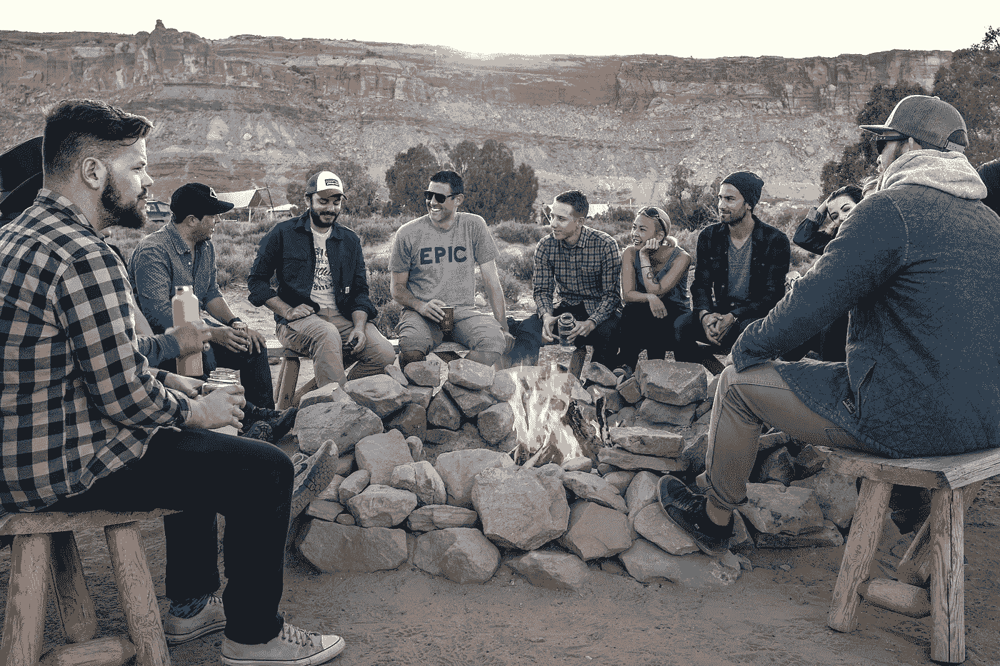

# 你忽略了你的部落吗？

> 原文：<https://medium.com/swlh/have-you-been-ignoring-your-tribe-4e46bccb34a9>

## 如果你现在对社交媒体营销感到沮丧，答案可能是肯定的。

Photo by [Phil Coffman](https://unsplash.com/photos/anV_zgNDZhc?utm_source=unsplash&utm_medium=referral&utm_content=creditCopyText) on [Unsplash](https://unsplash.com/?utm_source=unsplash&utm_medium=referral&utm_content=creditCopyText)

我在工作日帮助大品牌开发他们的社交媒体项目。当我不在工作时，我认识的小企业主向我咨询他们的社交媒体营销工作。

两党的一个共同点是社交媒体势不可挡。当谈到利用社交媒体开展业务时，有太多的可能性(并且发展很快)。因此，注意力不集中会让你一下子筋疲力尽和瘫痪。

如果我们真的将其归结为一点，大品牌和小企业都在寻求使用社交媒体作为销售工具。这可能意味着在 feed 中销售东西。这也意味着为你的客户赢得足够的兴趣和信任，以完成 feed 之外的交易。

以我的经验来看，很难找到真正擅长这个的大品牌和小企业。但是，有一种不同类型的企业一直做得很好。

他们是博客写手、在线企业家……“有影响力的人”

他们在社交销售方面的成功并不是因为他们总是第一个使用新的广告单元，也不是因为他们发布广告的频率更高。社交销售始于他们的起源故事。

大多数有影响力的人都是围绕着一种激情、生活方式或信仰体系开始创业的。他们的社交媒体帖子提供了一个新的机会，甚至可能团结在一个事业或共同的敌人周围。他们的信息总是集中在“为什么”随着时间的推移，其他人也开始出现并参与进来。最终推出了一款产品，销量自然就来了。

相反，大多数大品牌和小企业都有相反的起源故事:他们创造了一种产品，然后试图让人们购买它。他们的信息通常集中在“什么”上对这些企业来说，社交销售要困难得多。

**社交销售做得好的企业和做得不好的企业之间的关键区别在于，一个建立了一个部落，一个没有。**在商业中，部落改变一切。

[塞思·戈丁](https://www.amazon.com/Tribes-We-Need-You-Lead/dp/1491514736)——营销中一切“部落”的教父——将一个部落定义为*一群人，他们与一个领导者、一个想法以及彼此相连。他说一个部落只需要两样东西:共同的兴趣和交流的方式。*

**建立部落意味着花更多的时间庆祝你的目标和那些相信它的人，而不是花更少的时间推销产品。这意味着让你的部落更容易相互联系。因此，我敢说，销售变得很容易。**

**公司投放广告。传奇品牌和企业建立了一个部落。**

诚实面对自己:你是否在社交媒体上忽略了你的部落？如果社交销售对你的企业来说是一场斗争，答案可能是肯定的。

# 如果你想建立一个部落，以下是你的社交内容需要的 5 样东西:

## 令人信服的“为什么”

你的“为什么”通常会追溯到公司成立的原因。你信仰的事业是什么？你推销的理想结果或梦想是什么？你在和什么东西抗争吗？你看重什么？说说吧。不要害怕变得有点极端或不完美。正如我们在 2017 年见证的那样，拥有一个观点是会传染的。

Patagonia 是一个将商业和社交媒体价值放在首位的品牌的典型例子。巴塔哥尼亚明确的“为什么”让人们更容易证明支付更多费用和更多谈论该品牌是合理的。过去一周，巴塔哥尼亚在 Instagram 上发布的[趋势帖子](https://www.instagram.com/p/BcTKr6Xl6I8/?hl=en&taken-by=patagonia)是一个很好的例子，它把你的“为什么”放在第一位，代表你的部落表明立场。

## 慷慨

在社交媒体上，慷慨仅仅意味着帮助人们得到他们想要的东西。你如何让他们的生活更轻松？你怎么回答他们的问题？解决他们的问题？给他们一个身份？提供方向？减少决策疲劳？

我最喜欢的影响者之一是拉米特·塞西。众所周知，他说他免费赠送 [98%的内容。他希望他的免费内容非常好，以至于人们会想，“如果这是免费的，Ramit 的付费内容会有多棒？”在关注 Ramit 的免费工作多年后，购买他的 2000 美元课程对我来说是显而易见的。虽然这种商业策略可能看起来有些落后，但 Ramit 拥有数百万美元的业务，仅销售其内容的 2%。](https://www.iwillteachyoutoberich.com/toc/)

## 关注你的员工，而不是你的产品

在社交媒体中，人们很容易养成只关注下一条信息的习惯。如果相反，你花更多的时间庆祝你的追随者和信徒呢？

你所在部落的行为应该影响你的社交媒体行为。你的部落在做什么？他们使用了哪些可以帮助其他人的技巧？他们克服了什么？他们还追随谁？今天你能给他们什么惊喜呢？在社交媒体上做得很好的品牌是 La Croix。在我们的内心深处，人类喜欢被倾听和认可！

## 希望

期待的反义词是什么？推销你的部落不想要或不想要的东西。相反，提供附加值，并确保你的团队知道它的到来，这样他们就可以期待它的到来。

从战术上来说，这可以是常规内容系列的形式(也就是周三发牢骚或 T2 每周脸书现场教练会议)，也可以是你销售产品的方式。例如，[玛丽·弗里奥](http://marieforleo.com)每年只提供一次她标志性的[商学院](https://www.marieforleo.com/bschool/)项目。人们知道它，谈论它，等待它，他们的兴奋自然会唤起部落内外的宣传和分享。

## 一个联系的地方

“领导力是一门艺术，它给人们一个平台，让他们传播可行的想法。”——塞思·戈丁

到目前为止，如果你想建立一个部落，给你的部落一个可以闲逛的地方是你现在可以做的最容易被忽视的事情。许多人都渴望一种身份，并渴望与他人分享。

在社交方面，这可能意味着成立一个私人脸书团体。除了培养社区、归属感和共同身份，你还可以从最重要的客户和潜在客户那里获得第一时间的信息。你可以测试内容和产品创意，然后获得实时反馈。你也可以向你最重要的客户提供特别优惠和私人聚会的邀请。

***“对于个人来说，性格就是命运。对于组织来说，文化就是命运。”谢家华***

无论你是个体户、小企业主还是大品牌的营销经理，你都会遇到这样一种情况:算法、新的广告单元和漂亮的创意不足以维持你的营销努力。

如果社交是你营销策略的核心，现在就改变你的心态。首先关注你的“为什么”，你的事业和你的部落。只有这样，社交销售才会变得简单而有效。

***梦见经历营销康复？给我发邮件，告诉我你最大的营销抱怨和梦想。我会考虑在即将发表的媒体文章《hello@nicoleemerick.com》中包含解决方案。***

## 这个故事发表在 [The Startup](https://medium.com/swlh) 上，这是 Medium 最大的创业刊物，拥有 273，384+人关注。

## 在这里订阅接收[我们的头条新闻](http://growthsupply.com/the-startup-newsletter/)。

