# 你在文莫身上留下钱的踪迹了吗？

> 原文：<https://medium.com/swlh/have-you-left-a-money-trail-on-venmo-d3676d624310>

See what Venmo’s revealing about your financial life to the public with Money Trail.

## [使用此应用程序](https://chrome.google.com/webstore/detail/money-trail/pfapkinkogbekmajdmmdiificmnkeflm)在 Venmo ***上公开看到你的朋友*** 透露他们失败的约会、深夜食物抢购、输掉扑克比赛等等…

*这篇博文改编自我最近的论文* *中的发现。*

作为美国的一名大学生，Venmo 已经成为一款离不开的应用。每当我欠了某人的饭钱、赌输了的钱，甚至房租，Venmo 都会立即帮我结账。只需输入姓名、汇款金额和描述付款目的的信息，我就可以用手机向几乎任何人汇款。在旅途中即时结清债务是如此简单。

在几次使用 Venmo 后，我注意到该应用程序让我可以在我的 Venmo 新闻订阅上公开分享交易(减去金额)。

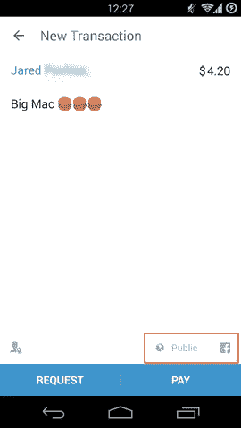

This transaction (the message, who is paying whom and the time the payment was sent) will be shared publicly, which can been seen by the setting highlighted in red.

乍一看我的新闻，我不认为这是一个问题。如果全世界都能看到我和舍友时不时互相掏钱吃饭，我还在乎什么？

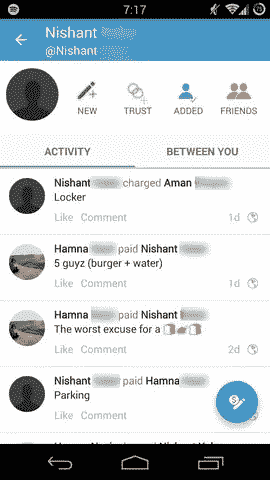

My summer roommate’s public Venmo newsfeed on the Android app.

当我开始浏览这些新闻源时，我意识到 Venmo 有一个**默认功能，公开分享所有交易**，我的许多朋友从未关闭过这个功能。这意味着，如果我或 Venmo 上的任何人向后滚动我朋友的新闻源，我就可以查看他们的全部交易历史。

我决定编写 Money Trail 扩展，您可以在这里获得，以聚合和可视化来自个人 Venmo newsfeed 的数据。有了 Money Trail，我可以看到这个应用程序真正揭示了我朋友的哪些信息。

A walkthrough of Money Trail using my Venmo data, to give a sense of how the extension works.

# 我发现了什么

可能很难想象，你用某条信息进行交易的简单信息会泄露你的任何隐私。然而，我发现，如果我把你在 Venmo 上进行的所有交易的信息加起来，我就可以开始看到你与谁互动、你何时与他们互动的模式，最重要的是互动的背景，这让我可以推断出你生活的许多方面。

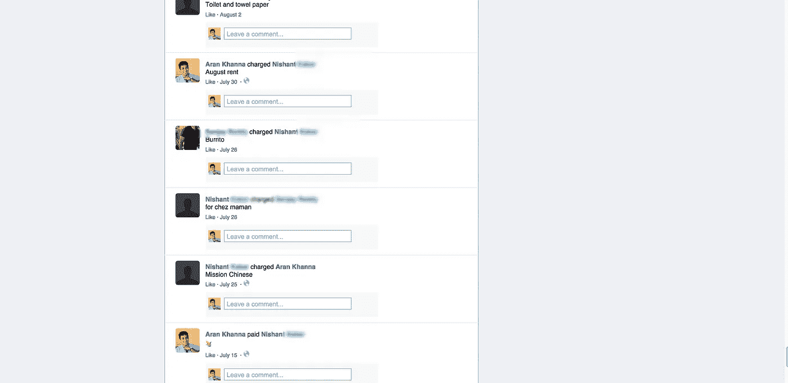

A screenshot of my summer roommate’s public newsfeed on Venmo.com. Including a charge from me for “August rent”.

先说我暑假室友公开的 Venmo 交易。乍一看，很容易看出我们花了很多时间在一起，因为我们在 7 月和 8 月有大量的交易。此外，7 月 3 日的付款信息“八月租金”很容易让人看出我们是室友。

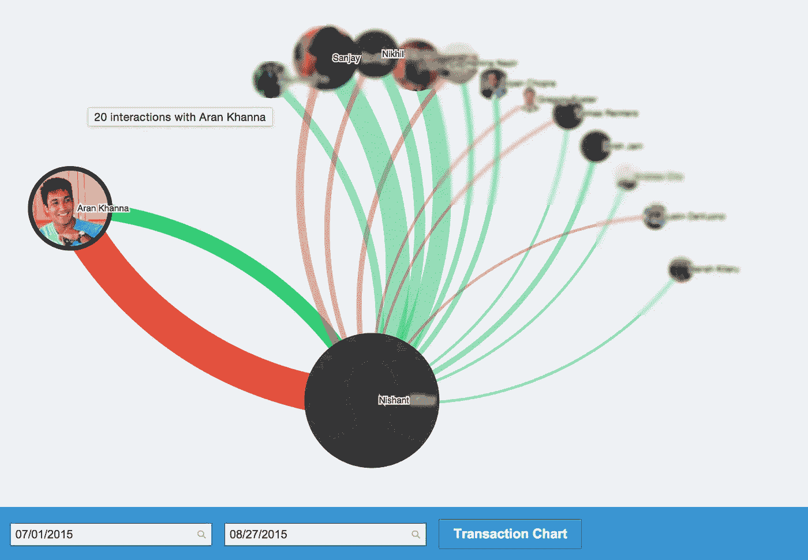

The people my roommate interacted with the most over the summer according to Venmo.

Money Trail 对他的 newsfeed 数据的气泡图可视化显示，我的室友与我、他的高中朋友 Sanjay 和我们的另一个室友 Nikhil 有大量的公开 Venmo 交易。这反映了一个事实，那就是我们整个夏天都经常在一起消磨时间(和金钱)。

最重要的是，我意识到我的室友和我的许多其他朋友经常通过 Venmo 分摊交通费用和餐费，通常在消息中包括优步目的地和餐馆名称等内容。这使得准确地找出这些朋友大多数晚上和谁一起吃饭，以及他们和别人去哪里郊游变得很容易。

因为所有这些交易都是公开分享的，而不仅仅是与网络上的朋友分享，所以 Venmo 上的任何人都可以发现这些事情。例如，我在 Venmo 上查看了一个与我毫无关系的人的交易历史，姑且称她为“Sarah”。

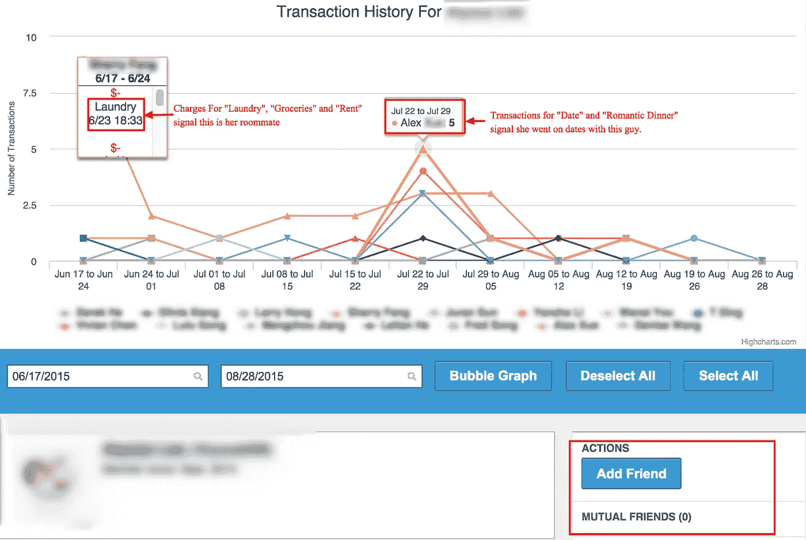

The transaction history for a user I am not friends with and have no mutual friends with.

就像我室友的历史一样，我可以告诉莎拉她在纽约的室友是谁，她和谁一起吃饭，她和别人去哪里郊游。我甚至能看到她要和谁约会。

它不止于此。上学期，我参加了一个由一小群人组织的活跃的校园扑克小组，由于几乎没有人携带现金，Venmo 成为购买这些游戏的默认方式。

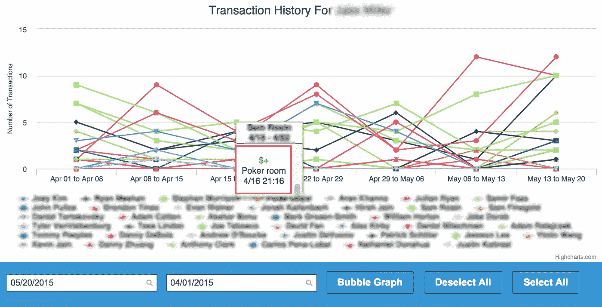

Money Trail’s transaction chart for one of the poker game organizers, highlighting a buy-in from one of the frequent players.

深入到一个经常举办游戏的组织者的图表中(他收集买入费并支付赢家),我可以说出这些游戏何时进行，谁在每场游戏中买入，谁空手而归。

个人并不是唯一在 Venmo 上公开分享数据的人。哈佛校园周围的小企业最近开始使用这款应用。

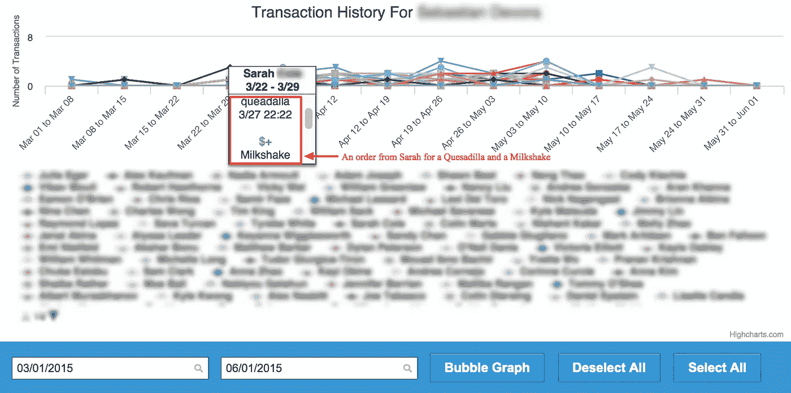

Money Trail’s transaction chart for a campus grill that accepts Venmo payments highlighting orders from a frequent customer (incidentally this is a great analytics tool for the grill).

上学期，校园里的一家烧烤店开始接受 Venmo 点餐。通过查看公开的交易数据，我可以看到谁在烧烤店点餐，他们点餐的时间，甚至他们点餐的具体项目。例如，从这些数据中，我可以知道我的一个朋友是烧烤店的常客，并且在大多数周末晚上 2 点左右倾向于点一份鸡肉卷和奶昔。

不仅仅是校园企业使用 Venmo 收取现金，许多学生运营的组织也开始接受 Venmo 的会费。这意味着我可以通过查看一个组织的公共 Venmo 历史来获得一个相当全面的成员列表。

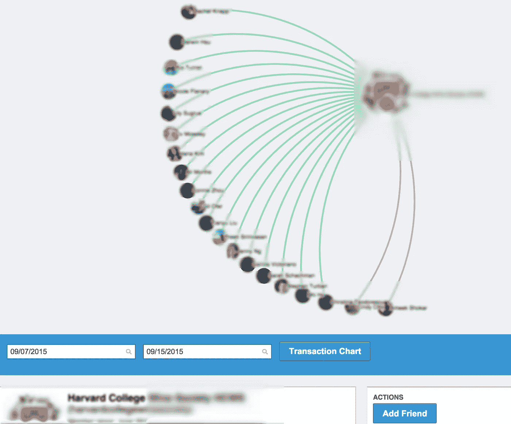

All the members of a student-run drinking Society at Harvard who have paid dues via Venmo.

我发现我可以在校园里找到许多种族、宗教和文化协会的成员名单，以及大多数兄弟会和姐妹会的成员名单。这不仅仅局限于哈佛的组织。

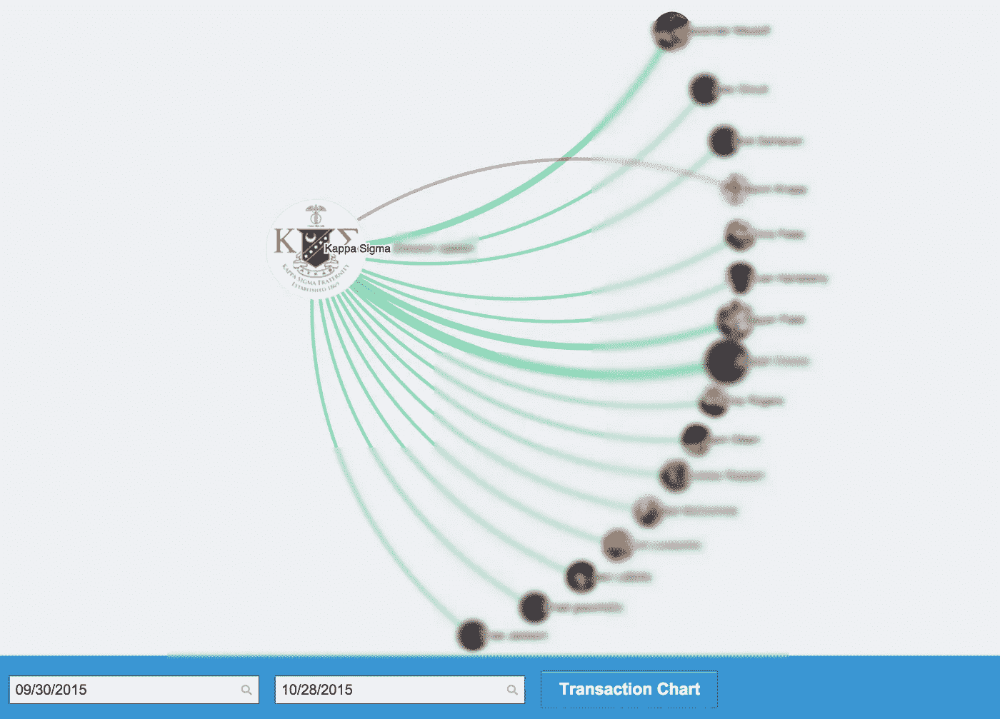

All the members of a certain chapter of the Kappa Sigma fraternity who paid dues via Venmo.

Venmo 上的许多学生组织也通过该应用程序出售物品，如奖品和活动门票。

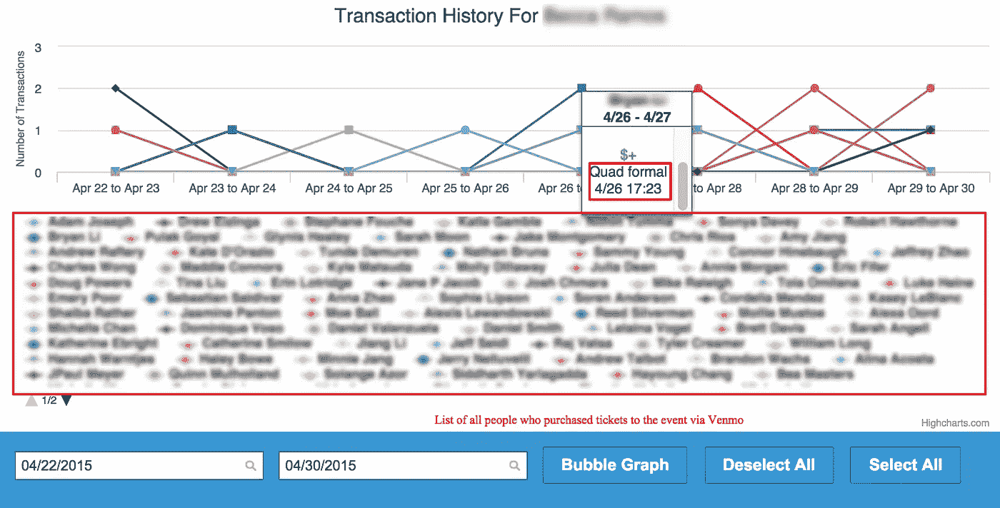

The Venmo transaction history for an organization over the week that they were selling tickets for their formal event.

除了让我看到谁正在从一个组织购买 t 恤，这些公开数据还让我能够生成一个完整的列表，列出哪些人付费参加了一个组织的活动，如音乐会和聚会。

尽管如此，看起来我只是通过查看用户的公共 Venmo feeds 和资金踪迹找到了一些皮毛。如果你想可视化你朋友的 Venmo 数据，看看你自己能发现什么有趣(和令人毛骨悚然)的事情，你可以在这里下载 Chrome 的扩展。代码也可以在 Github 上获得并开源[。](https://github.com/arank/money-trail)

# 有什么问题吗？

你可能想知道这是不是一个问题？毕竟，用户总是可以选择将其支付的可见性切换到“仅朋友”或“仅参与者”，因此人们必须知道他们正在共享这些信息。

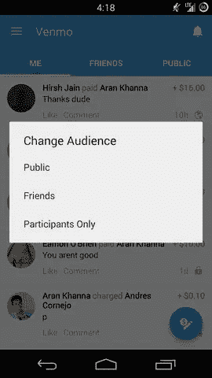

The menu on the Android app to let you change an individual transaction’s public visibility. This is accessible by holding down on any transaction in your newsfeed.

然而，事实上，我向许多朋友展示了这一扩展，他们被图表描述他们社交生活的准确性吓了一跳，这表明问题更加微妙。

这个问题似乎类似于我在[之前的工作](/@arankhanna/stalking-your-friends-with-facebook-messenger-9da8820bd27d)中发现的 Facebook Messenger 的位置共享默认问题。因为公开共享事务是 Venmo 的默认设置，人们[很少费事去改变它](https://en.wikipedia.org/wiki/Default_effect_%28psychology%29)，尤其是当人们很容易忽略任何给定的事务正在被共享的事实时。

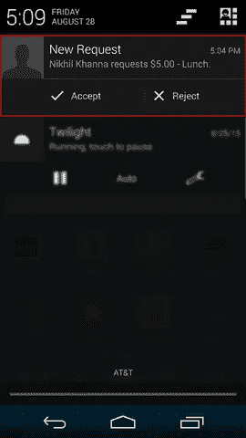

With Venmo’s Android notification, highlighted here, you don’t even have to think about who you are sharing your transaction with. All you have to do is hit “Accept”

人们往往没有意识到，随着时间的推移，他们通过使用 Venmo 无意中传播了许多关于自己的信息，这些数据可以累加起来，揭示一些非常私人的事情。

除了隐私问题，这些数据的可用性也可能成为一个安全问题。Slate 在最近的几篇文章中显示，Venmo 上的欺诈行为已经以各种方式发生，麻省理工学院 2014 年发表的一篇论文提到，公开交易数据可能会使用户更容易受到欺诈，因为攻击者可以利用这些数据来识别用户在 Venmo 上的密友并冒充他们。

# 让它停下！

此时，您可能会问，与单独设置每笔新交易的可见性相比，是否有更简单的方法来保持 Venmo 历史的私密性。乍一看，这似乎很容易。只要你打开设置页面，甚至不用向下滚动，你就可以看到“共享”下的“默认观众”设置，并将其切换到私人。

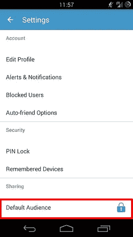

A screenshot of the settings page on Android app immediately after being opened, highlighting the “Default Audience” sharing setting, which is set to private.

然而，你可能很快就会意识到，涉及到你的公开交易仍然会出现在你的新闻提要中。这是因为“默认受众”设置只会使您发起的收费和支付成为私人行为。未更改默认隐私设置的朋友发起的任何收费或付款仍将公开共享。

要隐藏这种交易，你必须回到设置页面，向下滚动找到容易错过的“涉及你的交易”设置，这是最近才添加到 Android 应用程序中的，并将其切换到私人。

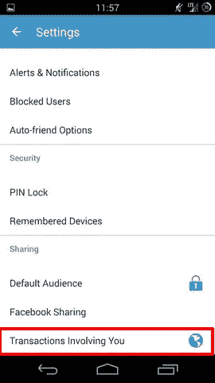

A screenshot of the setting page the Android app after scrolling down, highlighting the “Transactions Involving You” setting, which is still set to public.

虽然 Venmo.com 和 iOS 应用程序最近更新了一项设置，让你可以将你的整个交易历史追溯为私人交易，但在最新版本的安卓应用程序中，隐藏你过去公开交易的唯一方法是单独设置每笔交易的可见性。

这种混乱的设置让我觉得不太合理，并让我想知道为什么管理 Venmo 隐私如此复杂？我并不是说 Venmo 故意试图让这个过程变得乏味或对用户来说很难，但是肯定没有巨大的激励让应用程序让用户公开分享更少的支付。我把我的财务信息给了 Venmo，因为我可以在网上看到我的很多朋友经常使用这款应用，并且 [Venmo 的增长主管证实](https://mixpanel.com/education/leveraging-social-proof-for-growth)如果用户能够看到其他人，尤其是朋友，公开使用这款应用，他们加入这款应用的比率会更高。

我不是[第一个注意到 Venmo](https://www.washingtonpost.com/news/the-intersect/wp/2015/02/26/why-would-anyone-in-her-right-mind-use-venmo/) 默认分享功能潜在的隐私侵犯本质的人，我也不是第一个开发[应用程序展示其后果的人](http://www.vicemo.com/)。虽然 Venmo 被监管机构强制对安全问题做出回应，但该公司在回应公众批评时几乎没有加强隐私控制。

综上所述，我可能会继续使用 Venmo，尽管我知道在使用这款应用时，我必须时刻警惕自己的隐私。这并不是因为没有更好的选择， [Square Cash](https://cash.me/) 在没有分享功能的情况下做了本质上相同的事情，这也不是因为我不在乎牺牲我的隐私。这是因为我认识的每一个人和我遇到的几乎每一个人都已经在 Venmo 上了，这使得完全停止使用它变得太方便了。

似乎 Venmo 对其提供的便利收取的价格是你的一点隐私。有了[金钱追踪扩展](https://chrome.google.com/webstore/detail/money-trail/pfapkinkogbekmajdmmdiificmnkeflm)，你可以亲眼看到你的隐私 Venmo 花费了你多少钱，并自己决定这是否是你愿意付出的代价。

# 如果你发现了这个有趣的☺，请点击下面的推荐按钮

# 如需更深入的分析，请查看[在技术科学](http://techscience.org/a/2015102901/)上的相应论文

发表于*[**# SWLH**](https://medium.com/swlh)**(***创业、流浪、生活黑客)**

******