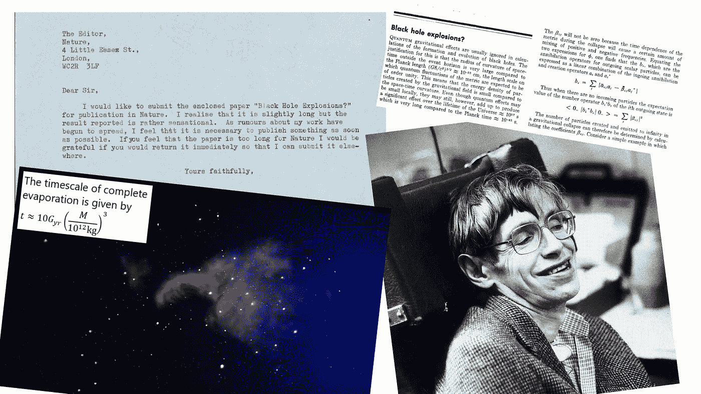

# 斯蒂芬·霍金向我们展示了没有什么是永恒的

> 原文：<https://medium.com/swlh/hawking-radiation-how-stephen-hawking-showed-us-nothing-lasts-forever-ccebb0bde833>

今天是斯蒂芬·霍金的 78 岁生日。他在这个领域最大的成就是向我们展示了即使是黑洞也不是永恒的。

**霍金去世了，物理学界失去了一位巨人，对此无需多做介绍。因其在流行文化中的无数亮相而闻名，对他的大部分赞誉都恰如其分地给予了他**