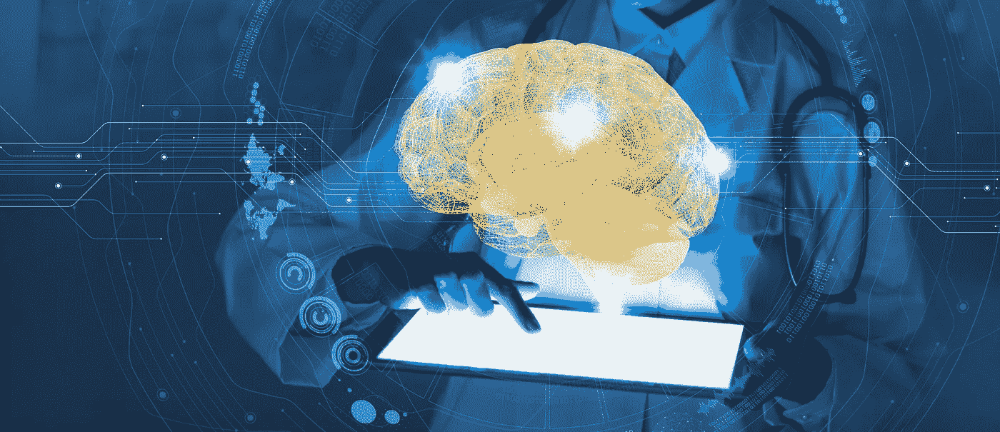
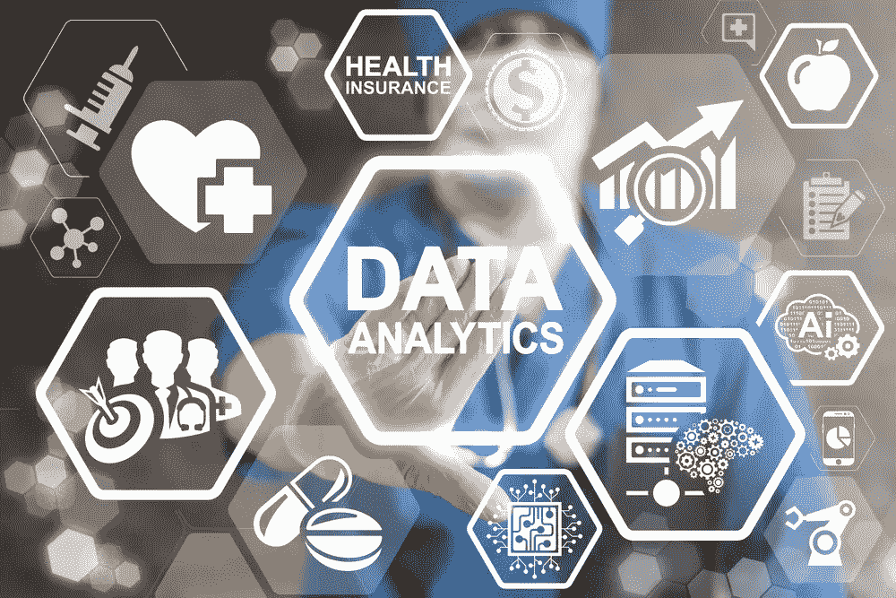
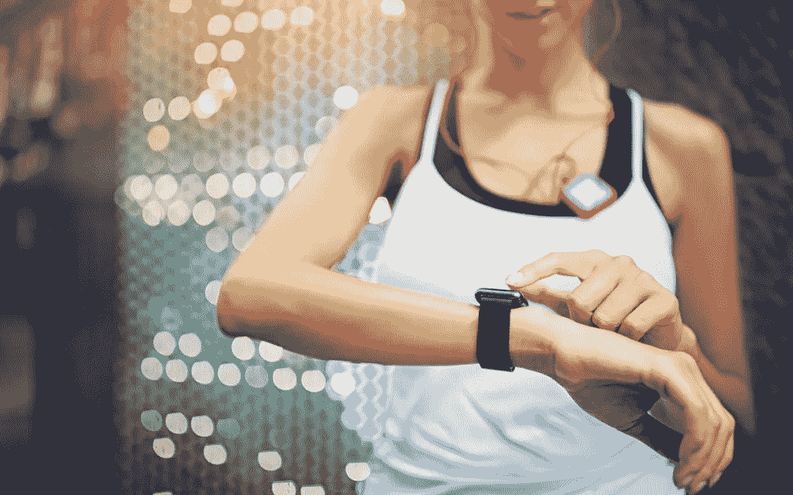
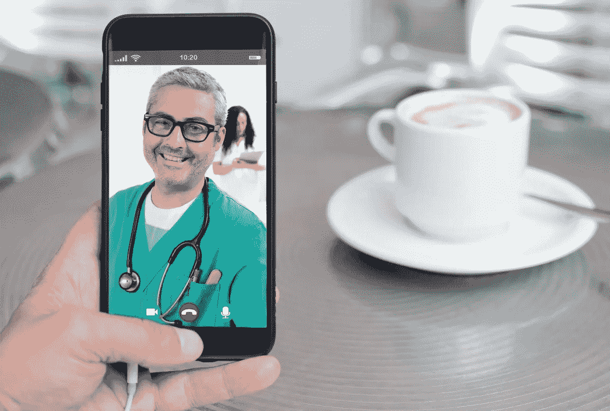

# 医疗保健:2019 年及以后的 5 大数字趋势

> 原文：<https://medium.com/swlh/healthcare-5-digital-trends-for-2019-and-beyond-99f9703823d7>

就技术修订而言，医疗保健通常被认为是最保守的行业之一。毕竟，当人类健康甚至生命受到威胁时，采取预防措施是有客观原因的。然而，越来越多的从业者和医疗服务提供者认识到技术创新在医疗保健中的重要性。现代医学不能再停留在上个世纪了。

今天，人们已经习惯了电子病历或在线挂号服务。但是医疗保健领域的技术进步远远不止这些，根据预测，2019 年将成为医学采用新技术的转折点，到 2020 年，数字健康市场[预计将达到 2060 亿美元](https://www.statista.com/statistics/387867/value-of-worldwide-digital-health-market-forecast-by-segment/)。我们选择了 2019 年及以后将在医疗保健领域发挥重要作用的 5 个最具进步性的数字趋势，并希望与您分享。

# 1.人工智能

[人工智能](https://stfalcon.com/en/blog/post/artificial-intelligence-first-steps-in-implementation) (AI)在医学和医疗保健中的应用正在获得动力。在我们之前的一篇文章中，我们已经讲述了人工智能机器人是如何被用于护理的。但是，铁护士并不是基于人工智能的医疗技术的唯一实现。人工智能提供的处理大量数据的能力，加上不断改进的图像识别功能，催生了各种创新的健康技术。以下是 2019 年及以后医疗人工智能的几个应用方向:

*   **医学诊断。** AI 应用显著提高了诊断的速度和准确性。人工智能工具有助于更快更准确地分析调查数据，使医生能够更准确地进行诊断，并看到更多的患者。今天，基于人工智能的图像识别诊断设备已经用于诊断皮肤病学和光学偏差、糖尿病和其他导致外观变化的疾病。
*   **医疗产品开发。**新药的研发过程非常缓慢且昂贵。药剂师需要考虑数百个变量，从财务适当性到法律和道德问题。今天，人工智能被用于根据早期临床数据安全地探索药物发现过程中的化学和生物相互作用。其中最突出的例子是 IBM Watson 和 GNS Healthcare AI 系统在癌症治疗搜索中的应用。
*   **工作流优化。人工智能有助于自动化日常文书工作、日程安排和时间表输入等重复性任务。这些是医务人员经常认为最令人厌倦和沮丧的任务，因为它们单调乏味。**

在这个精彩的视频中，你可能会发现更多人工智能在医疗保健中的应用:

# 2.大数据和分析

近年来的技术进步导致收集的关于个人的医疗和健康数据的数量急剧增长。它为卫生组织创造了从这些海量数据中获取洞察力的新机会。新的集成解决方案可以为任何特定目的收集、处理、互连、存储和分析数据。医疗保健专业人员使用这些大数据使诊断变得更快、更容易。数据分析还可以提高医疗机构的效率。保险公司可以利用大数据提供量身定制的保险产品。

大数据在医疗保健领域最广泛的应用是电子健康记录系统(EHR)。EHR 允许保存每个人的数字记录，包括病史、人口统计、实验室结果、诊断等。每份记录都保存在一个可修改的文件中，不仅将医生从繁重的文书工作中解救出来，还可以作为一个有价值的统计来源。它还可以用于干预，并在患者需要新的医疗检查或程序时提供警告和提醒。美国 94 %的医院都在采用电子健康记录，到 2020 年，集中的欧洲健康记录系统有望成为现实。

# 3.医疗物联网(IoMT)

物联网(IoT)是指通过互联网相互连接的设备。这项技术最近有了很大的发展。在医疗保健领域，物联网用于通过可穿戴设备(包括心电图和 EKG 监护仪)、智能传感器和移动应用程序远程监控患者或客户的健康。到 2020 年，预计全球将部署多达 300 亿台 IoMT 设备。

IoMT 工具有助于临床医生在家或在世界任何角落监测患者。利用连接设备来监控有风险的患者，以确保他们服药，测量血糖水平和血压，设置提醒和警报。这类新推出的设备之一是 Apple Watch Series 4，它可以根据安装的应用程序监控心率、平静呼吸、检测跌倒、计算卡路里等。一些设备，如健身追踪器，对应于智能手机应用程序，收集和显示必要的统计数据。

可穿戴技术还能提高库存，优化工作流程。例如，有了 RFID 标签，医院管理者可以监控员工一整天的活动，并确定在运营效率方面应该引入哪些变化。

# 4.远距离医学

远程医疗通过使患者更容易接触专家来改善医疗保健。这在农村或偏远地区尤为重要。[根据预测](https://www.datamintelligence.com/research-report/telemedicine-market/?gclid=EAIaIQobChMIv-r_jqOO3gIVWKqaCh2C4QNGEAAYASAAEgJqPPD_BwE)，到 2025 年，全球远程医疗市场的价值预计将达到 1131 亿美元。到目前为止，该领域由视频聊天平台主导。患者可以通过互联网与医生进行视频通话，这样他们不仅可以描述症状，还可以展示可见的症状。但这远不是远程医疗的唯一用途。与定期去看医生相比，这项技术为治疗和监测慢性疾病提供了更好的条件。它减轻了患者的压力，并且更加方便和经济。

最近远程医疗的一个独特例子是[西南医疗](https://www.smalv.com/en/ehealth-tools/nowclinic.html)。他们的 NowClinic 服务为客户提供 24/7 的虚拟预约机会，等待时间通常不超过 10 分钟。该应用程序适用于 iOS 和 Android 设备，安装简单快捷。这项技术让 SMA 在短时间内招募了 30，000 多名患者。

公司也从远程医疗中受益。因此，Adecco，一家全球人事公司，与 American Well 合作，为其员工提供远程医疗服务。截至 2018 年 6 月，Adecco 44%的员工成功参加了远程医疗。到目前为止，telehealth 已经为该公司节省了 23 万美元。

# 5.医疗保健中的虚拟现实/增强现实

虚拟和增强现实为从诊断到医学教育的医疗保健技术带来了重大进步，并已用于治疗[多种疾病](https://stfalcon.com/en/blog/post/VR-in-healthcare)。在虚拟现实中，人出现在完全人工创造的环境中，而增强现实生成的图像可以叠加在现实世界的物体上。在这两种情况下，用户都可以在 VR/AR 眼镜的帮助下看到创建的图像或文本，同时他们的手保持空闲。

如今 VR/AR 技术的主要应用有:

*   **应急反应。**急救人员可以在进行急救的同时找到必要的信息，而无需浪费时间进行搜索，并在患者到达医院之前记录下他们的重要信息。
*   **预防和诊断。** VR/AR 允许模拟不同的条件并操作摄像机，以便将现有的检查数据与数据库中的示例进行比较或复制治疗效果。
*   **手术。**在这里，虚拟现实最重要的影响是运动器官的三维重建。当外科医生需要在狭小空间或复杂条件下工作时，该技术尤其有用。
*   **教育。** VR/AR 是改变医学教育的伟大工具。例如，外科医生可以预演手术过程并练习精确的步骤，这将使他们在真实情况下更快地完成手术，并对组织造成最小的损伤。微软 HoloLens 是在医学教育中使用 VR 的一个很好的例子:

*   **康复和情绪恢复。**已经证明 VR/AR 对遭受剧烈疼痛的患者具有缓解作用，并允许减少阿片类药物的使用。在一些诊所，如 Maplewood Senior Living，VR 头戴设备被用于治疗痴呆症和认知障碍。

# 综上

我们讨论了最具创新性的数字趋势，这些趋势将塑造 2019 年及以后医疗保健和医疗行业的发展。希望这些信息能激发你的创造力，激发你创造更有雄心的项目。

*原载于*[*Stfalcon.com*](https://stfalcon.com/en/blog/post/healthcare-digital-trends)*。*

## 这篇文章发表在 [The Startup](https://medium.com/swlh) 上，这是 Medium 最大的创业刊物，拥有+391，714 人关注。

## 在这里订阅接收[我们的头条新闻](http://growthsupply.com/the-startup-newsletter/)。

