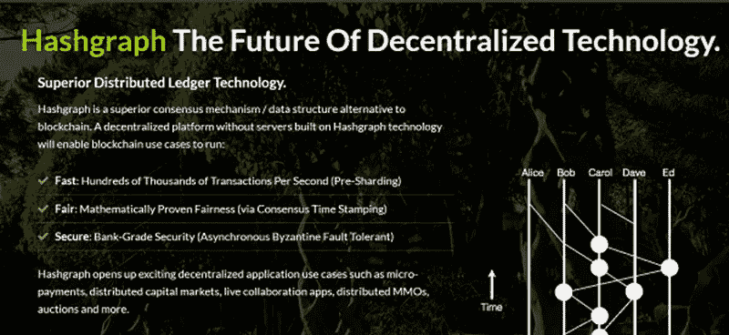
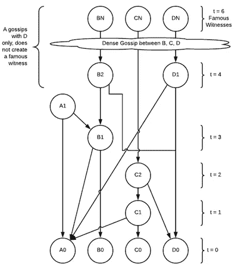

# hedera Hashgraph——下一个国王？

> 原文：<https://medium.com/swlh/hedera-hashgraph-the-next-king-a47c5e3c8260>

如今，区块链相关新闻似乎占据了头条，主要出版物如*华尔街日报*、*美国消费者新闻与商业频道*和*纽约时报*都发表了与这项新兴技术相关的文章。更重要的是，比特币和以太坊网络的独霸地位可能很快就会结束。像 Hedera 和他们的 Hashgraph 平台这样的新公司正在开发专有的分布式网络，试图推翻这些区块链国王，而像 IBM 这样的主流公司有他们自己的成熟的基于区块链的解决方案。IBM 等传统科技巨头的参与不仅证明了新兴行业的有效性，也表明了这一经济领域的激烈竞争。

通常被视为区块链最大目标之一的银行和金融服务公司对区块链的能力，尤其是分权和分布式账本感到担忧，这是可以理解的。今年早些时候，美国银行在一份监管文件中指出，他们认为加密货币对他们的业务构成了威胁，[美国消费者新闻与商业频道报道](https://www.cnbc.com/2018/02/23/bank-of-america-worried-about-threat-of-cryptocurrency-to-its-business.html)。声明称，“客户可能会选择与其他市场参与者开展业务，这些市场参与者在我们认为具有投机性或风险的领域从事业务或提供产品，如加密货币……对我们的收益……以及客户与我们做生意的意愿产生负面影响。”

然而，其他银行更看好这项技术。例如，据 CoinTelegraph 报道，摩根大通正在开发自己的“以太坊企业版”Quorum ，甚至考虑将该计划分拆到自己的公司。然而，摩根大通的区块链项目尤其凸显了这些举措的一些问题——它们仍然围绕着过时的共识算法和协议，如比特币和以太坊。可以肯定的是，区块链科技在最近几年经历了巨大的发展，但是一直没有一个催化剂来推动它发展。

一家科技初创公司 [Hedera](https://www.hederahashgraph.com/) ，正在开发一个虚拟货币和去中心化平台 Hashgraph，它实际上是建立在区块链上的*而不是*。它利用了一种称为有向无环图(DAG)的不同功能，但能够实现去中心化和网络分布，就像区块链网络一样，但更安全。

一家科技初创公司 [Hedera](https://www.hederahashgraph.com/) 正在开发一个虚拟货币和分散平台 Hashgraph，它实际上是建立在区块链上的*而不是*。它利用了一种称为有向无环图(DAG)的不同功能，但能够实现去中心化和网络分布，就像区块链网络一样，但更安全。该平台的另一个关键方面是其拜占庭容错。这意味着它不容易受到“拜占庭失败”的影响，即“不到 1/3 的成员可能是攻击者，可能相互勾结，可以删除或延迟诚实成员之间的消息，而消息延迟没有限制。”因此，Hedera Hashgraph 比区块链的同类产品安全得多，实际上，它能够很好地抵御致命的 DDoS 攻击。

*Hedera Hashgraph 的主要平台特性*

比特币和以太坊网络的一个主要缺点是它们依赖于工作证明(PoW)共识算法。战俘区块链并不是真正拜占庭，因为理论上，他们仍然受到 51%的攻击。用户可以购买或获得大部分供应，然后改变网络。此外，网络成员永远不会真正知道何时达成共识；他们只是对这种随时间增长的概率有了更大的信心。更重要的是，工作证明系统容易出现分叉，因为两个区块可以同时开采，迫使出现分叉，直到社区同意遵循哪个“品牌”。

比特币和以太坊网络在交易速度和网络效率方面也存在巨大问题。比特币平均每秒处理 10 笔交易，以太坊大约 15 笔——也好不到哪里去。相比之下，Hedera Hashgraph 平台使用一种新的分布式共识进行操作，每秒可以完成数十万次交易。这可以通过几个关键特性来实现。

首先，“流言蜚语”在网络上起着巨大的作用。每个网络参与者都“八卦”它所了解的信息，当每个成员重复随机地向其他成员传播信息时，允许数据通过每个成员传播。与现有的区块链协议相比，这种 gossip 协议使用非常少的带宽开销，并防止网络膨胀。“hashgraph”数据结构记录了谁以什么样的顺序对谁说了闲话，创建了一个网络交互的分布式分类账。gossip 协议允许网络以惊人的速度和效率扩展。

第二，共识算法使用“虚拟投票”，网络中的每个成员都有一份哈希表副本。如果双方都使用涉及发送投票的典型拜占庭协议，这允许甲方确定乙方会发送什么投票。在这种情况下，乙方实际上不需要投票，因此每个成员可以在没有实际发送任何投票的情况下就决策达成一致。虚拟投票系统提供了更高水平的诚实性和透明度，同时也节省了 PoW 算法所不能节省的带宽。

第三，网络通过其交易促进公平。所有成员都能够在任何时候创建签名事务，并且每个成员都会收到一份签名事务的副本。社区根据这些交易的顺序达成协议。通过实现这种级别的公平，一小群攻击者无法恶意影响被选为共识的交易顺序。

有了这样的功能，Hedera Hashgraph 完全有可能取代比特币和以太坊，成为下一个分布式网络之王。或者塔雷·海德拉只是 Tezos、EOS、Cardano 等众多竞争者中的一员，并将永远是比特币和以太坊的配角？时间会证明一切，但我们以前已经看到过，如果它会发生，它肯定不会是最后一次。

## 这篇文章发表在《创业公司》杂志上，这是 Medium 最大的创业刊物，有 310，796 人关注。

## 订阅接收[我们的头条](http://growthsupply.com/the-startup-newsletter/)。

