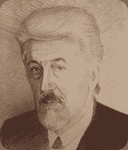
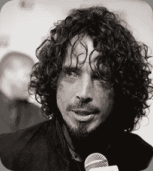
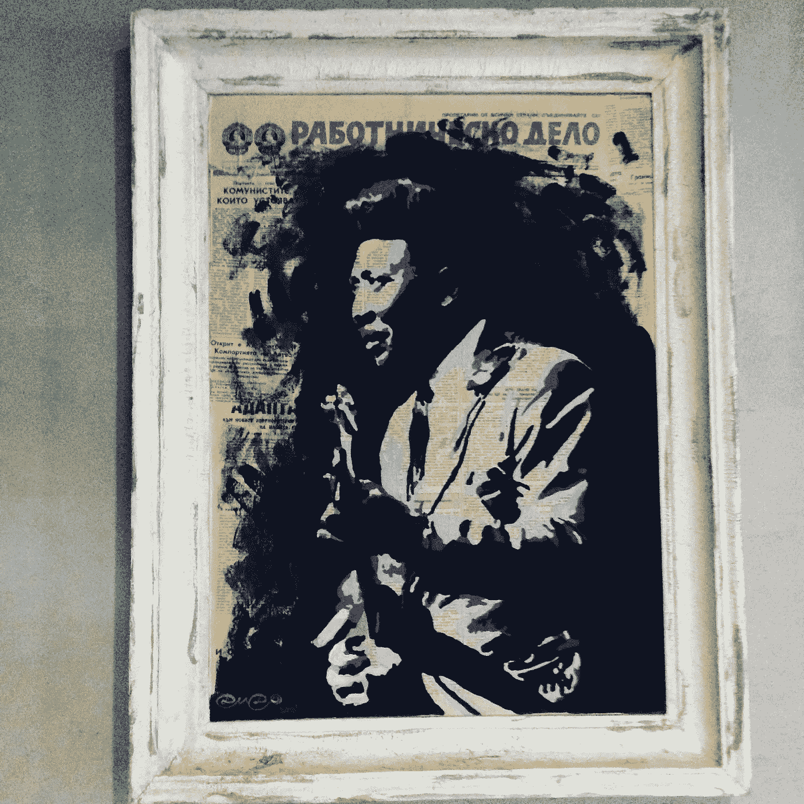
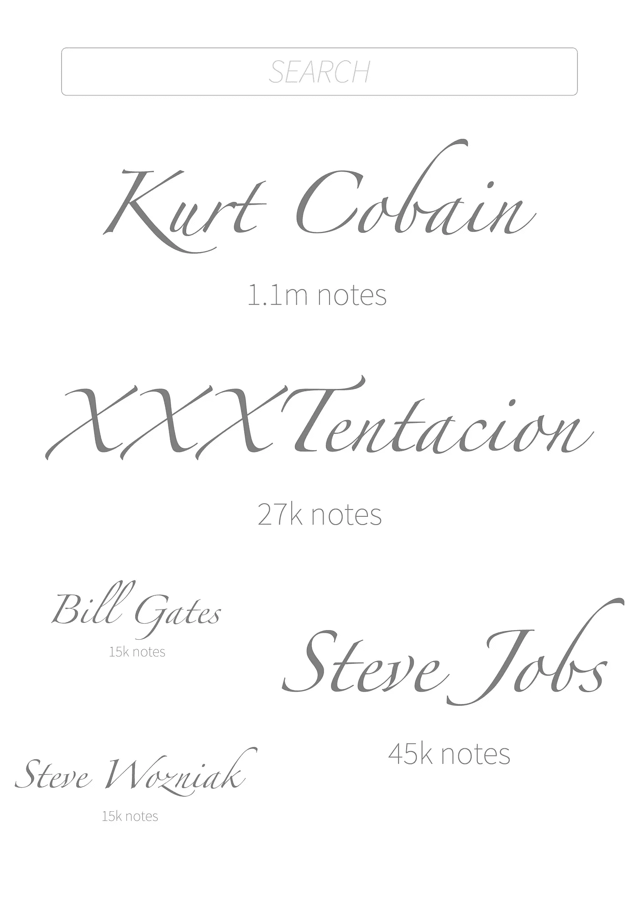
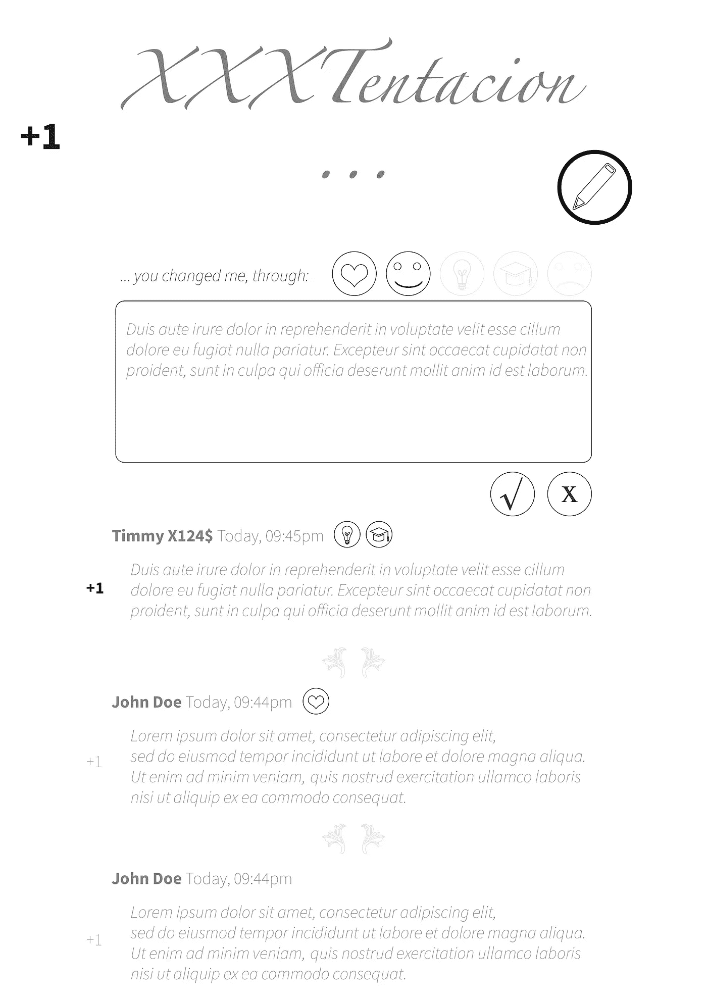
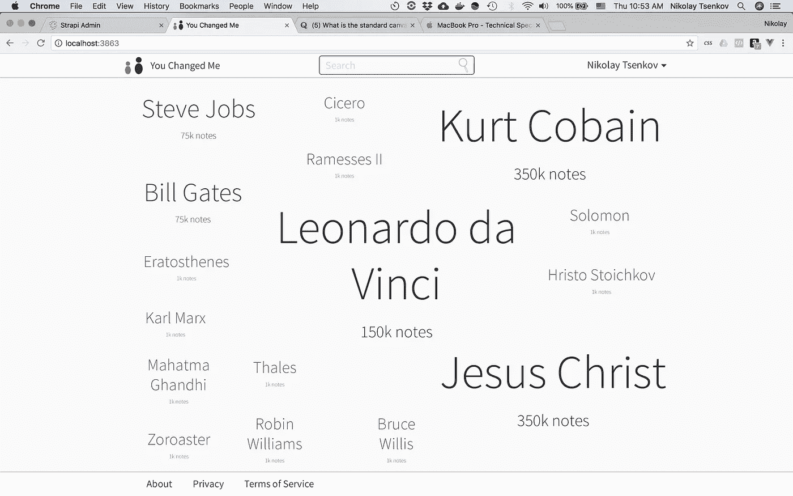
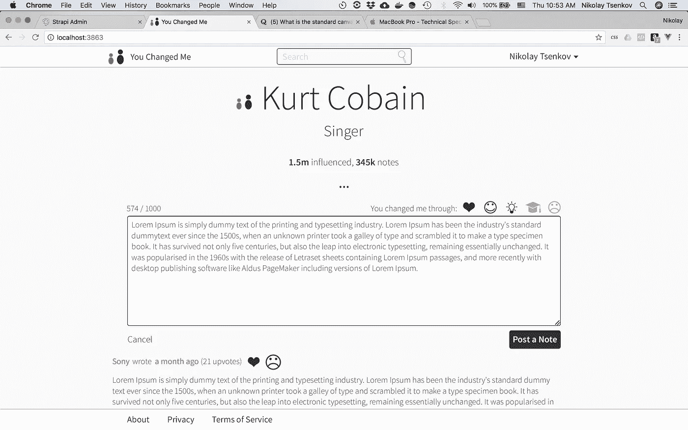
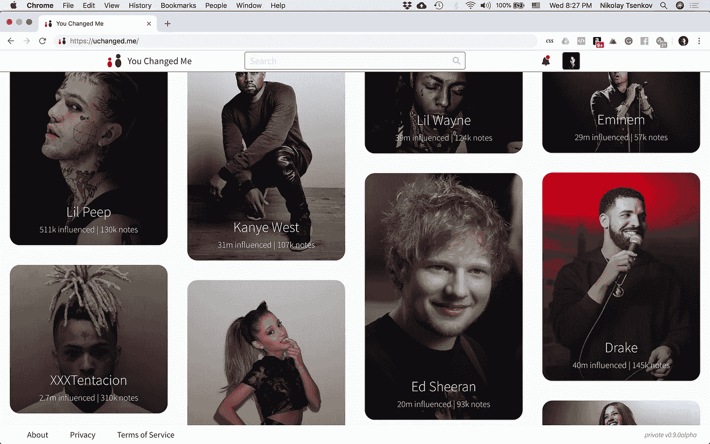
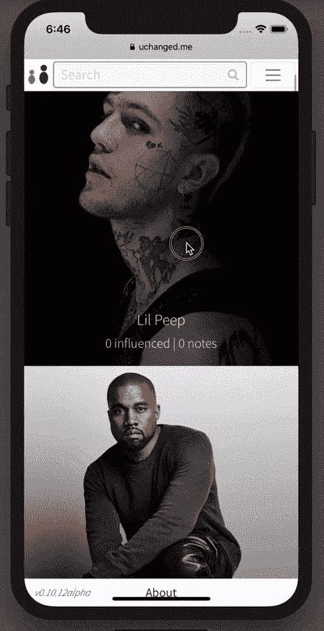

# “你好！”比“R.I.P”还难

> 原文：<https://medium.com/swlh/hello-is-harder-than-rip-d5b8a5b47824>

…现在是我们改变这种状况的时候了。

Source: [unsplash](https://unsplash.com/photos/3reWf5Rp4jo)

# TL；博士

在我能够表达我对他们的感激之前，我失去了他们。改变自己的方式是我采取的第一步，但我意识到问题要大得多:我们对有影响力的人和我们尊敬的人表达感激和钦佩的次数平均每年不到一次。它大部分仍未被表达出来，被文化锁定，完全得不到技术的服务。以至于“你好！”(通常)比“R.I.P”更难说。

我相信技术掌握着答案，我已经建立了一些东西来让这种积极性流动。我们即将推出，你可以在这里订阅(或不订阅):https://www.producthunt.com/upcoming/uchanged-me

# 2011 年 5 月

我记得得知我最喜欢的高中老师去世的消息。我妈妈打电话告诉我。

库拉(人口 3000)是我在其中长大的保加利亚小镇，离塞尔维亚边境很近。我的父母仍然住在那里，每当有重大的事情发生，几个小时后整个社区都会知道。一天后，所有搬走的儿女也发现了。

我属于第二类人，但是我妈妈很快给我打了电话——足够让我收拾好行李，赶上最后一班回家的火车，这样我就可以参加葬礼了…

在黑暗的火车车厢里，只有我一个人醒着。我一分钟也睡不着，整个晚上我都在想这个人灌输给我的所有智慧……我记得他带我和我的队友在首都索非亚参加全国编程比赛的时候，以及我们在学校的计算机实验室花了很多时间解决问题。

他的名字叫约尔丹·扬切夫(Yordan Yonchev ),是一位天才的数学家(远远超出了高中老师的水平),一位国际象棋大师，这个国家(或者说是 T4 世界)首批计算机程序员之一，一位诗人，一位无线电&电子爱好者，一位无限的学习者，他有目的地选择了这个小镇，这样他就可以学习，教学，养家糊口，平静地度过一生。总是在学习新的东西，从不担心宏伟的想法。

当我到达时，仪式已经开始，数百人前来表达他们最后的敬意。我走进房间，立即看到了一个看起来不起眼的棺材，他躺在那里……被美丽的鲜花洒满，成对地放在他的胸前，他看起来……像是睡着了……就像是如果有人哭得稍微大声一点，他就会醒来，擦去我们脸上的泪水，给我们大家讲一个他最精彩的笑话。他看起来很平静。

然而，那个房间一点也不安静。我以前参加过葬礼，但那里的一些东西与我一生中经历的任何事情都非常不同。

当我踏进去的时候，我突然感觉到…一股*重量*压在我的肩膀上，压在我的头上，压在我的胸口和心脏上…如此之重，以至于我呼吸困难。当我慢慢向他走去时，我感到这重量正在压垮我，不仅仅是重量…我感到了*的疼痛。*我记得当时想:“*我几乎能感受到这个房间里的每一点悲伤！每一声哭泣，每一滴落在地板上的眼泪。”。这些都引起了我的共鸣。这是灵魂粉碎。*

几秒钟内，我的眼睛充满了泪水，我的胸部开始无法控制地跳动，试图让我哭出来的声音。我什么都控制不了。

就在这一刻，我问自己——我在这里，哭得死去活来，但我真的告诉过这个人，当他还活着，身体健康的时候，我是多么感激他吗？我很快意识到我从来没有…

这个**怎么可能是**？得知他去世的那一刻，我收拾好行李，连夜赶路，参加了他的葬礼。然而，当这对他来说很重要的时候，我从来没有花时间？

我感觉糟透了。这个人对我有巨大的影响，我非常尊敬他，但是我从来没有告诉过他…我觉得自己是世界上最大的伪君子…

这段经历改变了我。我对自己说——从现在开始，无论何时何地，我都会给予尊重。

# 2018 年 6 月

我和我的女朋友(Vesi)住在保加利亚索非亚的一个小公寓里。我正在记录我的每日日志，这是我几周前刚开始写的，现在快写完了。维斯正准备和我约会。今天是我的生日，今年我想要一份非常特别的礼物…

这是一个美丽的早晨，外面阳光明媚，有点冷——这是外出的完美一天，在城市中漫步，人们坐在市中心舒适的咖啡馆里，一边啜饮着浓咖啡，一边观看。

我已经完成了 vlog，但是我必须带上我的笔记本电脑，笔记本&笔，耳机等等。这看起来不像是为生日派对做准备。看起来我们正准备去工作。

那是因为我们是！我要的礼物——Vesi 将与我共度周末，在一家咖啡店工作，实现我选择的一个想法，我们将在下周一一起启动这个项目！

我累坏了。我在这个项目上投入了一年半的时间，它还没有发布，也不会很快发布……我迫切需要休息。在那段时间里，我没有带很多钱回家，我也不想让 Vesi 给我买任何东西，但回过头来看，即使我们拥有世界上所有的钱，这个周末仍然会是最好的生日礼物！

# 2017 年 5 月

漫长的一天工作结束后的一个晚上，我在手机上滚动浏览脸书。突然，一堆注册信息淹没了我的订阅，我发现了一些非常坏的消息——克里斯·康奈尔自杀了…

[Original image source](https://en.wikipedia.org/wiki/Chris_Cornell#/media/File:Chris_Cornell.jpg)

这对我来说是一个打击……我是他的超级粉丝，起初，我无法理解这样一个才华横溢的人，在生活中取得了如此多的成就，却仍然非常活跃，很可能还能在 T2 多活许多年……会决定结束自己的生命。抑郁症夺走了我们又一位伟人的生命…

突然之间，我的社交反馈变成了关于克里斯的……可能至少有几天是这样。人们张贴着他所演唱的歌曲的信息、卡片和视频…

[Original image source](https://commons.wikimedia.org/wiki/File:Chester_Bennington,_en_su_%C3%BAltimo_concierto_en_Espa%C3%B1a_(2017).jpg)

两个月后，查斯特·贝宁顿自杀了…他是克里斯的朋友，在他的追悼会上表演，他在克里斯 53 岁生日的同一天自杀了…这种联系显而易见，令人痛苦…

这导致了一波更大的悲伤和 R.I.P .帖子。人们甚至开始分析他在自杀前很久就决定结束自己生命的迹象。

但是**不管他们发布了什么或者说了什么**，有一件事是肯定的——他们都为切斯特感到难过，并想分享他们有多感激他，但是他们也**太迟了**……

这让我想起了我老师的去世。我已经做出了改变，总是奖励对我好的人，无论他们是我的伙伴、同事、朋友还是家人。但是直到这个时候，我从来没有想过如何向那些对我一无所知的人表达我的感激之情。”。

然后我突然想到:如果在他生命的最后几个小时，切斯特想看看人们对他的感觉——**他看起来怎么样？难道是维基百科，旨在冷酷客观地删除一个艺术家唯一寻找的东西(那个*东西，*是*一群人的情感反应*)？是不是在脸书，人们可以发布任何事情，所以几乎不可能找到特定类型的内容？是媒体过度放大了他们报道的每一条新闻(正面的或负面的)吗？**

然后，我进一步展开了这个想法——假设明星得到了他们(不)相当多的支持(我很确定这不是真的)——普通人面对这样的决定，从哪里寻找情感支持或他们自我价值的证据呢？没有适合每个人的维基百科页面或杂志封面……然而任何人都可能抑郁，当你抑郁时——你会忘记其他人有多爱你。你忘记了你的心跳对某个人来说很重要…

这改变了我。我开始问自己:“*为什么这样的地方不存在？*“…

# 回到我的生日

[Original image source](https://laptopfriendly.co/sofia/from-barista-coffee-and-more)

我们找到了一家[不错的小咖啡店](https://www.baristacoffeesofia.com/)和一些[好评](https://laptopfriendly.co/sofia/from-barista-coffee-and-more)。这个地方供应美味的 100%阿拉比卡咖啡，它有一个非常温暖的美式氛围，电源插座，舒适的椅子，和一个非常好的无线网络。我们很快找到一个舒适的地方打开行李，开始工作。

我们需要做的第一件事是弄清楚:**我们想在**上做什么？但是说实话，在我们离开公寓之前，我就知道那是什么了。在我(现在)在这个地球上的 31 年里，我注意到并观察到了世界上一个普遍存在的问题，我还没有看到任何人试图真正解决或处理这个问题。

我知道这个问题已经很久了，但是我总觉得…好像我不是解决这个问题的合适人选。我不是那样的人…直到我是。

这个项目的代号是“be4ugo ”,几天前发生的一些事情让我确信这个问题:

1.  仍然存在并与之相关；
2.  甚至没有人走上解决它的道路；
3.  我与它有个人联系，有生活经验，也有技术专长去尝试解决它。

# 11 天前…

…在美国佛罗里达州的一家汽车经销店前发生的一起抢劫案中，一名年轻的、冉冉升起的说唱歌手在自己的车里被枪杀。作为一个在项目中长大的孩子，即使当他成名并开始赚钱时，他仍然用现金进行日常交易。警方报告称，劫匪从他的车里偷走了 5 万美元，这是他今天早些时候刚从自动取款机或银行取出的。

在这一点上，我还没有真正听到他的音乐。老实说，我对他唯一的了解，是不久前公布的一张他入狱时的面部特写，以及他因虐待怀孕女友而等待审判的事实。光是这个信息就像一堵墙，不允许我对这个人更感兴趣。

然而，当我听到他去世的消息时，我的好奇心猛增，让我去看看他的音乐。我被*惊呆了* …

他发行的最后一张专辑显示出真正伟大的迹象。但最让我震惊的是，当我对他有了更多的了解，了解了整个女友事件的两个方面，以及他是如何在生命的最后几天采取必要的措施成为一个更好的人。

然而，在世人发现他的努力之前——他走了……他在 20 岁时去世了……

在他去世后的日子里，他在 Instagram 上的粉丝数量会越来越多，而以前他需要数年时间才能收集到这些数据。同样的事情也发生在他的其他社交账户和他的流媒体数据&唱片销量上。

那个说唱歌手太棒了。

[Original image source](https://commons.wikimedia.org/wiki/File:Xxxtentacion.jpg)

我开始在死后的兴趣中寻找类似的峰值，并注意到一个明显的模式:

> 在他去世后，XXXTentacion 的亚马逊专辑销量飙升超过 70 万张
> — [福布斯](https://www.forbes.com/sites/bryanrolli/2018/06/19/xxxtentacion-album-sales-skyrocket-following-death/#4ced31e03d1b)
> 
> 查斯特·贝宁顿
> ——[广告牌](https://www.billboard.com/articles/columns/chart-beat/7874023/linkin-park-sales-rise-chester-bennington-death)去世后，林肯公园美国音乐销量增长 5，332%
> 
> 克里斯·康奈尔去世后，他的销售额上升了 552%

几个月后，阿撒·富兰克林去世了，同样的事情也发生在她的数字上。

> 阿撒·富兰克林的音乐高居 iTunes 榜首，在传奇人物去世后在 Spotify 上飙升
> ——[《今日美国》](https://eu.usatoday.com/story/life/music/2018/08/16/aretha-franklins-music-sales-spike-after-her-death/1008573002/)

这又一次证实了我们都感激他人，但是大多数积极的情感——我们从不表达；**快递来不及**；或者我们甚至一起忘记他们。

我相信我们大多数人都目睹了这三件事。不幸的是，我也相信…

# 我们大多数人都做过这三件事

是不是说我们都是坏人？我不这么认为。我认为这意味着，我们所有人都有一个共同的问题。

自从我失去了一些人，在我能够告诉他们他们对我有多重要之前，我开始改变我自己的方式，确保我总是奖励那些对我好的人。但是当我意识到这个问题是多么的广泛和深刻，而且没有人愿意去解决它时，我决定我的努力是不够的！我必须在比我更大的范围内做些什么。

# 这个想法

最终，我形成了这样一个想法:在互联网上有一个地方，你可以随时看看你在生活中做过的好事，也可以随时奖励对你来说最重要的人。

还有什么比让受益者写下自己的感激之情更好的方式来记录这些善行呢？

所以我们有了一个想法，现在是困难的部分…

# 回到咖啡店

*A shot of one of the art pieces in the coffee shop.*

回到那家咖啡店，在我生日那天，我们的计划很简单——创建一个网站，人们可以在那里向他们的影响者和资助者表达感谢。在周末结束前发布这个网站。

我们首先通过在网上查看商标，为这个项目想出了一个可用的名字(“be4ugo”已经被取了，老实说，有点儿可怕。第一个小时，项目名称变成了，
**你变我**(而我们当天买的域名，是 **uchanged.me** )。

当我们开始的时候，我非常确定如果我们不能在第一天获得足够多的用户(经典的先有鸡还是先有蛋的问题)，我们至少可以用大量名人的名字和角色填充数据库，我们可能会找到免费的资源。

当我在为网站绘制模型时，Vesi 搜索了一个免费的影响者数据库。

这是我在那家咖啡店做的几个屏幕。这是我认为首页应该有的样子。

The size of the name would depend on the trendiness of the person’s page.

当你为影响者写笔记时，这就是我如何想象影响者页面的。

The predefined ChangeFactors (the icons) were: Love, Joy, Inspiration, Knowledge &Pain

当 Vesi 告诉我她发现了一个可以免费获得的数据库时，这一天的大部分时间都花在了这个名为 [Pantheon](http://pantheon.media.mit.edu) 的数据库上，在这个数据库中，一个由麻省理工学院的研究生和教授组成的团队通过分析维基百科上的数据，列出了 11340 位有史以来最有影响力的人。

所以在第一天，我们得到了产品名称**、域名**、初始数据**和模型**。这是伟大的一天。这是最好的。生日。永远不会。********

# ****快进 2 个月****

****因为这经常发生在过于乐观的企业家身上——它不仅仅需要两天就能完成。:)****

****不到一个月，我就有了一个看起来与模型相似的 MVP，我开始向我信任的人展示它，他们会给我一个诚实的反馈。****

****在这段时间里，我一直在想——“*这对我来说是有意义的，但对其他任何人来说可能都不是……当反馈进来时，做好准备迎接冲击吧！*”。事实上，我甚至无法说服 Vesi 有人会使用该产品。****

****但令我惊讶的是，即使是我交谈过的最挑剔的人，也在努力用一个好的理由来否定这个想法。卡住了！****

****又过了一个半月，我画出并实现了一个东西，大概可以称之为“*设计*”，这是当时产品的样子——这是登陆页面:****

********

****这是影响者页面:****

********

# ****自 2018 年 9 月中旬以来在私人阿尔法****

****在这一点上，我知道我需要开始与最终用户合作，并在我公开发布产品之前，开始完善至少有几个人真正喜欢的体验。我推出了该产品的私人阿尔法，并开始从我的网络中邀请人们。****

****经过 45 天的工作，在大约 26 名早期用户的帮助下，我对他们进行了多次采访和调查，几次公开调查和许多不眠之夜，我越来越接近我想要更多关注 uchanged.me 的点，我们的第一次公开测试很快就要开始了。****

# ****今天****

****从咖啡店的第一天开始，我们的数据库已经增长到超过 350，0 00 名有史以来最有影响力的人，我已经对产品进行了数十次迭代，包括几次完全视觉化地重新设计首页。****

****这是现在的头版。****

********

****The stats are not real, of course — just showcasing how they would look in a real scenario.****

****这是网站上移动体验的简短演示(我们还没有应用程序，但网站适应不同的屏幕尺寸):****

********

# ****谁愿意忘恩负义？！****

****答案是——**绝对没有人！******

****但是目前表达这种感激的社交工具只是不存在的 T4。甚至在社交网络出现之前——亲自去找某人表达你的感激之情并不是一件最容易(而且经常是“可能的”)的事情。****

****无论我们喜不喜欢，我们的社会都在朝着越来越接近 100%数字化的交流方式发展。****

****这就是为什么这个问题应该用技术来解决。****

****我们需要改变，uchanged.me 将帮助我们实现这一目标。****

# ****下一步:公测****

****很快，你就可以加入 uchanged.me 了！****

****你可以在这里订阅我们的新闻稿:[https://www.producthunt.com/upcoming/uchanged-me](https://www.producthunt.com/upcoming/uchanged-me)****

****我们的官方推特账号是:[https://twitter.com/@uchanged_me](https://twitter.com/@uchanged_me)****

*****(🤫，不要告诉任何人，但是如果你等不了那么久，并且想帮助我们提供一些反馈，你可以在这里请求邀请:*[*https://uchanged.me/register/request-invite*](https://uchanged.me/register/request-invite)*)*****

*****非常感谢* [*布莱恩·卡姆*](https://medium.com/u/38e8cf687176?source=post_page-----d5b8a5b47824--------------------------------)*[*赫里斯托·科塞夫*](https://medium.com/u/93ee34066d54?source=post_page-----d5b8a5b47824--------------------------------) *、恩斯特·克里克、瓦西里·泰尔齐耶夫、维塞尔卡·瓦尔奇科娃、叶夫根尼·彼得罗夫和*亚历克斯·苏明*阅读初稿并帮助我编辑这篇文章。******

**********

## *****这篇文章发表在 [The Startup](https://medium.com/swlh) 上，这是 Medium 最大的创业刊物，有+392，714 人关注。*****

## *****在这里订阅接收[我们的头条新闻](http://growthsupply.com/the-startup-newsletter/)。*****

**********