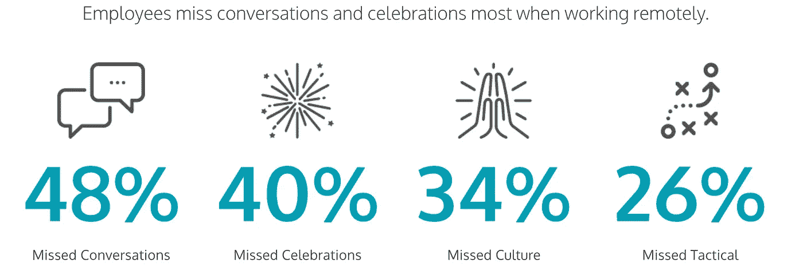
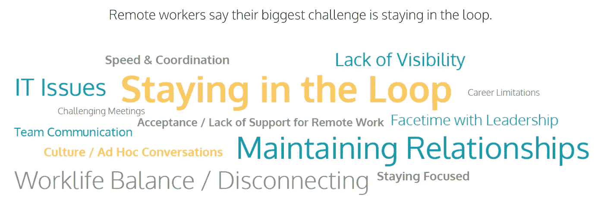
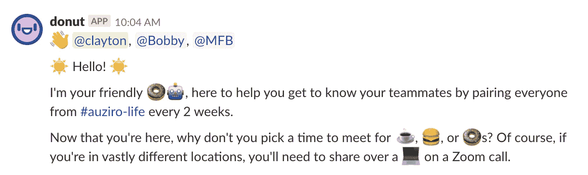

# 通过随机性帮助您的远程员工建立更强的个人联系

> 原文：<https://medium.com/swlh/help-your-remote-employees-build-stronger-personal-connections-through-randomness-4c95662e274e>

## 你如何利用一点点随机性带来很多快乐。

Photo by [dylan nolte](https://unsplash.com/@dylan_nolte?utm_source=medium&utm_medium=referral) on [Unsplash](https://unsplash.com?utm_source=medium&utm_medium=referral)

最近，我能够在我的组织中快速实施一项计划，帮助人们感到联系更加紧密。奇怪的是:它依赖于完全的随机性！

在我分享实用技巧之前，让我解释一下为什么人际交往很重要。

渴望联系是人类的基本天性，事实证明，这在工作场所可能最为重要。研究表明[真正有害的生理变化](http://workplacementalhealth.org/News-Events/Blog/January-2018/Loneliness-in-the-Workplace-Can-Be-a-High-Cost)会发生在那些没有归属感的员工身上，尤其是在工作压力大的时候。简而言之，它会让你生病。

另一方面，当你感觉在公司内部联系良好时，你的身体和精神会在更高的水平上工作。这有很多影响，包括影响你的客户体验以及其他员工的体验。

Photo by [Boudewijn Huysmans](https://unsplash.com/@boudewijn_huysmans?utm_source=medium&utm_medium=referral) on [Unsplash](https://unsplash.com?utm_source=medium&utm_medium=referral)

# 远程员工面临的连接挑战

如果你是一个远程工作的人，你会知道这并不都是彩虹和独角兽——它肯定有它的好处，但也不是没有挑战。

在 OWLLabs 的 2017 年“远程工作状态”报告中，有两个清晰的数据点突出表明了远程员工面临的主要挑战之一:

Source: [OWLLabs State of Remote Work 2017](https://www.owllabs.com/state-of-remote-work-2017)

Source: [OWLLabs State of Remote Work 2017](https://www.owllabs.com/state-of-remote-work-2017)

远程员工认为，对话(即那些即兴的非正式对话，当你在人们身边时更为普遍)和处于循环中的感觉是他们缺少的两个最大元素。

哇…后退一秒钟。因此，我们认为渴望联系是人类的基本天性，在工作场所不满足这种渴望会让员工身体不适。然后，根据数据，进行对话和感觉自己在圈子里肯定是感受联系的两个最重要的部分，但也是两个最大的缺失元素。敲响警钟！

对我来说，这是一种动力，促使我更加谨慎地联系我们的员工，并让我发现了一个我实现的简单工具，它已经成为我的组织中迄今为止最受欢迎的员工计划之一。

但在我告诉你更多之前，让我们来谈谈更深的个人关系的一些好处。

Photo by [Adam Jang](https://unsplash.com/@adamjang?utm_source=medium&utm_medium=referral) on [Unsplash](https://unsplash.com?utm_source=medium&utm_medium=referral)

# 当人们感觉联系更加紧密时会发生什么？

答李名炀·斯塔拉德是研究高效领导者如何促进人际关系的专家，也是*《关系文化:工作中共享身份、同理心和理解的竞争优势》的作者，*拥有强大的员工关系和联系有五大好处:

> “员工有清晰的认知，他们尽最大努力，他们使自己的工作与组织的目标一致，他们进行更多的沟通，他们参与创新以推动创新。客户可以感觉到它是否存在。当员工参与并保持联系时，他们自然希望与客户分享。”

值得注意的是，斯塔拉德所说的大部分好处往往与公司的核心行为、文化和价值观直接相关。在我的组织中，这是千真万确的，我们认为坚持高标准，通过合作、试验、学习和创新取胜，以及专注于提供客户价值是我们的核心原则。因此，我甚至认为强大的人际关系是你的员工如何“表现”你的公司文化的关键因素(在我最近写的这篇文章中，我[对此有更多的想法)。](/swlh/how-to-lead-and-cultivate-culture-in-your-startup-940b16b961e9))

Photo by [Vicky Gu](https://unsplash.com/@vickygu?utm_source=medium&utm_medium=referral) on [Unsplash](https://unsplash.com?utm_source=medium&utm_medium=referral)

# 你如何利用随机会议建立强有力的联系

所以，这是我向你承诺的一个实用技巧——在我们实施的时候解释过:每隔一周的周一，一个 Slackbot(即时通讯平台 Slack 内部的一个应用程序)会将员工随机分成三组，鼓励他们一起喝杯咖啡或吃个甜甜圈。

This is the message sent to all three participants to kick off the random chat. We utilize a [slackbot called Donut](https://www.donut.com/) to facilitate this.

我们对全公司的所有员工都使用这种方法，无论他们是远程办公还是在我们的办公室工作。这意味着世界各地不同时区的人是匹配的，因此通过视频电话会议分享咖啡是很常见的。如果你碰巧和你所在地的人匹配，那么他们通常会在现实生活中相遇。

鼓励 30 分钟的无议程聊天。这并不意味着是一个与工作相关的电话…但它可以变成一个。这不应该是个人快速约会…但有时事情就是这样发展的。关键是要比你更好地了解一个人，建立一些融洽的关系，一种新的联系。我们故意三人一组来做，因为这样会让谈话更容易进行……如果有人做不到，你仍然可以两个人一起做。

自从启动 [p](https://auth0team.atlassian.net/wiki/spaces/PEOP/pages/61081506/Auziro+Match+%27n%27+Meet+in+%23auziro-life+on+Slack) 计划以来，我们已经确认了 350 多次会议。这相当于 350 多次两三个人聚在一起进行联系，在整个组织中共有大约 1000 次联系。

有机演变的有趣元素之一是在会议期间痴迷于拍摄“甜甜圈自拍”。我们有一个专用于这些照片的松弛频道，上面有一些讨论的摘要——基本上这是一个实时窗口，可以看到所有正在建立的新的个人联系。

Typical “donut selfies”. Left shows a donut meeting where everyone was in person. The right is a typical remote donut meeting, where people are often across the world, meeting over video conf (And yes, he is holding a box of ACTUAL DONUTS!!).

Photo by [Helena Lopes](https://unsplash.com/@wildlittlethingsphoto?utm_source=medium&utm_medium=referral) on [Unsplash](https://unsplash.com?utm_source=medium&utm_medium=referral)

# 那么员工到底是怎么想的呢？

如果你继续实施这一点，你只需要与员工交谈，就能听到新关系的精彩故事。最有收获的结果之一似乎是个人和职业都获得了好处。这里有几段我们家人的话:

> “我有机会认识了一些来自全球不同部门的优秀人士。亲自了解他们很棒，但了解公司其他部门的工作方式同样很棒。事实上，我已经建立了许多强有力的联系，这些联系实际上有助于我的工作方式以及与他人的合作。” *—系统架构师，远离美国明尼苏达州*
> 
> “与来自销售、工程、营销等部门的同事交谈的机会让我有机会与我作为远程员工可能不会遇到的人进行水冷却器式的对话……甚至只是一名新员工。” *—社区工程师，远离美国加利福尼亚州，新员工入职仅 4 周。*
> 
> “这给了我一个与来自不同国家和部门的人交谈的理由，这些人可能是我在工作中通常不会与之互动的人，这令人难以置信地有益”。—办公室助理，阿根廷布宜诺斯艾利斯办公室。

# 这是分布式组织必须锻炼的肌肉

构建这种关系文化(而不是“远程文化”)是克服远程员工在高度地理分散的工作环境中所面临的挑战的关键。但是你必须有意识地培养这个习惯；那块肌肉。

在我们这个数字互联的世界里，忽视个人联系似乎太容易了。我很清楚这一点…因为我妈妈告诉我，她希望我能给她打更多的电话，你知道，在真正的语音电话机上😜。

> 建立这种关系文化，而不是“远程文化”，是克服远程员工面临的挑战的关键

## 这篇文章发表在 [The Startup](https://medium.com/swlh) 上，这是 Medium 最大的创业刊物，拥有+387，966 名读者。

## 在这里订阅接收[我们的头条新闻](http://growthsupply.com/the-startup-newsletter/)。

