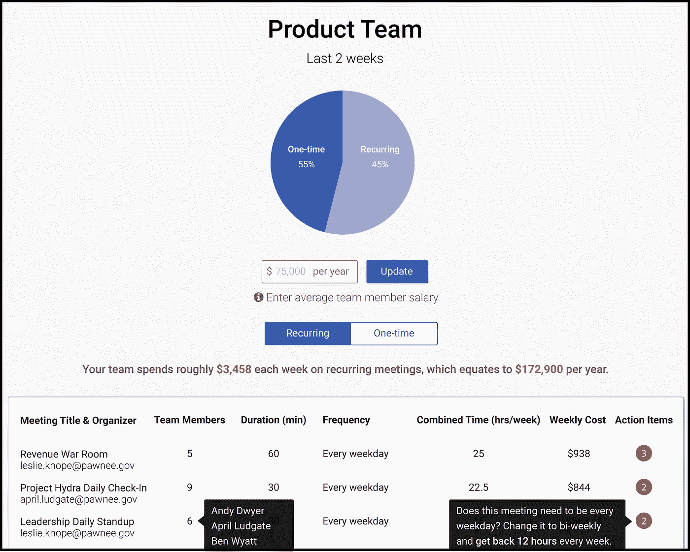

# 帮助您的团队摆脱会议

> 原文：<https://medium.com/swlh/help-your-team-get-out-of-meetings-681bd4deda2f>

## 了解成功的团队如何利用会议评级来提高工作效率

Ever want to know how much specific meetings cost? With Rate That Meeting, now you can.

会议会消耗团队的士气和生产力，它们会迅速滚雪球般主宰你的一天和一周。我们可能都有过这样的日子，整天在会议之间奔波，只有在正常工作时间之外的晚上才能找到时间真正完成工作。像这样的日子既不富有成效，也没有必要。

> 我们对会议评级有一个简单的目标——让你和你的同事在工作中花更少的时间在无效的会议上。

我们构建了两个核心产品来实现这一目标— (1)一个便于对内部会议进行评级和反馈的平台，以及(2)一个显示会议对您团队生产力的影响的仪表板。

通过与我们的一些早期客户密切合作，我们已经确定了两个主要主题，这两个主题显著提高了团队有效使用[会议](https://ratethatmeeting.com?referrer=medium.com-successful-teams)的能力。

## 1.让您的同事知道您正在对会议进行评级

并请他们参与！

考虑到你希望你的会议反馈保持匿名，这听起来可能违反直觉，但是匿名的目的不是为了避免让人们知道你想要更好的会议，而是为了确保你能够提供诚实和建设性的反馈。

让你的团队知道你需要他们对你组织的会议的反馈，这是一个强有力的信号，表明你重视他们的时间。邀请他们参与让他们知道你对提高团队和整个公司的生产力是认真的。

为了让这变得简单，我们有一个基本模板，你可以用它来让你的团队了解会议的评级，并让他们参与进来([点击这里](https://ratethatmeeting.com/faq/#tell-your-team-about-rate-that-meeting))。将此放入电子邮件、空闲消息或会议描述中。

## 2.带上你的团队

当整个团队都参与时，反馈效果最好。

为了促进小组参与，我们让鼓励其他与会者对与您相同的会议进行评价变得更加容易，即使他们尚未注册对该会议进行评价。

无论你是带着清晰的后续步骤离开富有成效的会议，还是带着浪费了一个小时的感觉离开，你都有责任让会议组织者知道你的想法。你应该鼓励你的同龄人也这样做。

快速启动并运行会议是快速而简单的。注册只需要不到一分钟的时间，你很快就可以少花很多时间在无意义的会议上。

*查看*[*【ratethatmeeting.com】*](https://ratethatmeeting.com?referrer=medium.com-successful-teams)*了解更多。*

*如果你有问题、评论或者只是想打个招呼，给*[*danny@ratethatmeeting.com*](mailto:danny@ratethatmeeting.com)*发个短信——我们很乐意收到你的来信。*

## 这个故事发表在 [The Startup](https://medium.com/swlh) 上，这是 Medium 最大的企业家出版物，拥有 308，692+人。

## 在这里订阅接收[我们的头条新闻](http://growthsupply.com/the-startup-newsletter/)。

