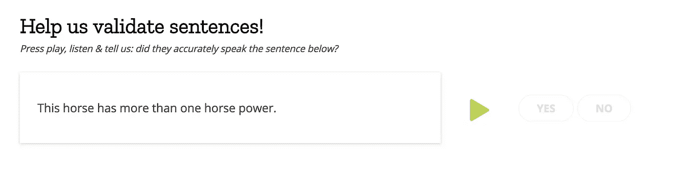
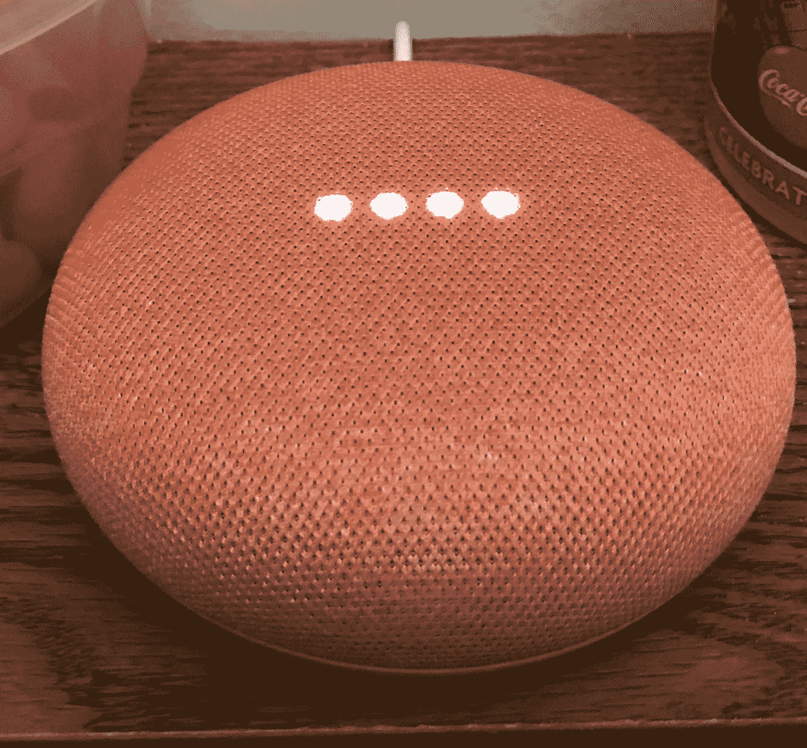
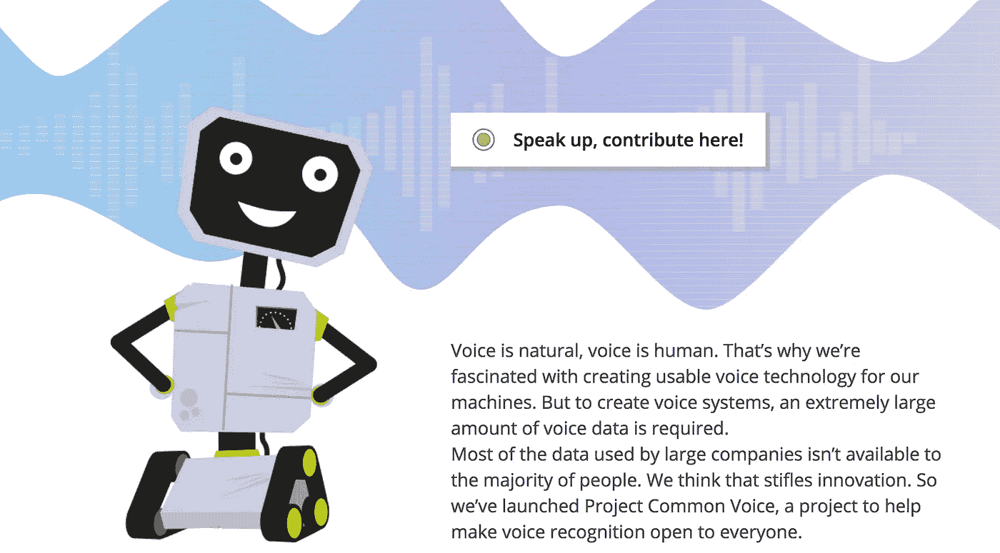
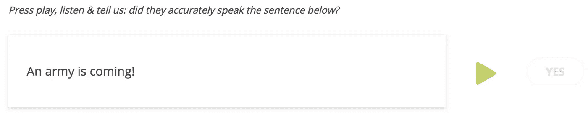

# 来自深渊的有益声音。

> 原文：<https://medium.com/swlh/helpful-sounds-from-the-abyss-f917fe6dd818>

好的，谷歌，听一会儿…

“一个穿红黑衣服的人骑着冲浪板”，我听到有人说。

“突然，他消失了，我能听到墙后一声微弱的尖叫”，另一个人悄悄地补充道。

一个印度声音平静地说，*好像他没有听到尖叫声或注意到失踪的人:*“一名消防员站在消防车上。”

“向左仔细看”，*从越来越多的人群中传来一个声音。“我会告诉你如何找到隐藏的宝藏”，*她说。*“好大一堆金子。”*

“没人知道它是从哪里来的”，一个家伙漫不经心地说。

接下来是一个德国人，*跑题了，但不可否认是正确的:*“永远不要通过给猴子剃毛来宣传剃须刀，这很残忍，会引起法律诉讼。”他的声音带着几分有趣和困惑，好像连他自己都有点惊讶于他的话。

“听着，别信他说的！”，有人哀求道。事实上，我们相信他们不是猴子剃毛的粉丝。

"你为什么惹了这么多麻烦？"一名美国妇女说道，也许是在谴责德国人竟然提出了这个不人道的话题。

接下来，一个低沉的声音带着缓慢、浓重的南方拖腔，很有帮助地补充道(你很快就会意识到):“在纪娜和尼泊尔之间的国际边界上，有一个非常重要的地方。”

“发现敌人。”又宣布了一个。

“一支军队来了！”

以上是一个松散耦合和高度炮制的叙事，但基于实际事件。算是吧。

斜体的文本*只是低级的文学粘合剂，用来连接真正说过的话之间的点(尽管实际上不是按照那个特定的顺序)。这个小故事中的说话者并没有真正参与任何形式的虚构，而是一个更大更重要的故事的一部分。*

这些人——志愿者，所有人——都在记录他们朗读奇怪的小片段的声音，这些片段包含大量的声音和单词。然后，其他志愿者从全国或全球各地收听，并确保录音与用作提示的句子相匹配。

看起来是这样的:

当你把这些放在一起，你会得到什么？

Google Home. Image: Wikipedia

一个保护网络开放性的雄心勃勃的项目(我会解释)。

该项目正在建立一个来自所有人口统计数据的大规模数据库，并被用于开发可以理解和产生人类语音的开源人工智能。诸如此类的功能对于谷歌 Home 和亚马逊 Alexa 这样的“智能音箱”来说是必不可少的。

如果该项目成功，你可能会看到能够用人类语言对话的开源智能设备的激增。(第一个可能已经出现了:一家名为 [Mycroft](https://mycroft.ai/) 的初创公司正在基于开源软件和硬件生产他们的 Mark 1。)

这些设备甚至可以在现有的基于云的服务尚未消失的地方工作，无论是一个荒岛还是你自己的家(不需要通过我们称之为互联网的 NSA 未经授权的窃听工具将你的声音发送到数据中心的房间，这些房间[希望](https://www.theverge.com/2018/1/22/16920440/amazon-echo-google-home-nsa-voice-surveillance)不会像& T 的[臭名昭著的](https://www.wired.com/2015/08/know-nsa-atts-spying-pact/) [641A](https://en.wikipedia.org/wiki/Room_641A) )。

如果项目失败了呢？

我们冒着未来互联网应用——我们与他人交流或与世界电子互动的方式——被一小撮像亚马逊和谷歌这样的强大公司主宰的风险。通过控制使用条款或对每一个被解码的话语征收费用，这些公司可能会对一个真正开放和自由的网络构成强大的威胁。

在某些方面，挑战亚马逊的 Alexa 类似于早期的浏览器战争，当时网络几乎成为微软 ie 浏览器的天下。

幸运的是，这群培训开源软件的志愿者正是由 Mozilla 组织的，Mozilla 是一家非盈利组织，以生产 Firefox 浏览器而闻名，该浏览器在击败 IE 浏览器后成功做到了这一点。

如果你有时间，请参加 https://voice.mozilla.org/的自由开放互联网之战。

"好吧，谷歌，你能听到声音倍增吗？"

**它们听起来是这样的:**

👏感谢阅读！请分享并添加您的声音。👏

## 这个故事发表在 [The Startup](https://medium.com/swlh) 上，这是 Medium 最大的创业刊物，拥有 289，682+人关注。

## 在这里订阅接收[我们的头条新闻](http://growthsupply.com/the-startup-newsletter/)。

