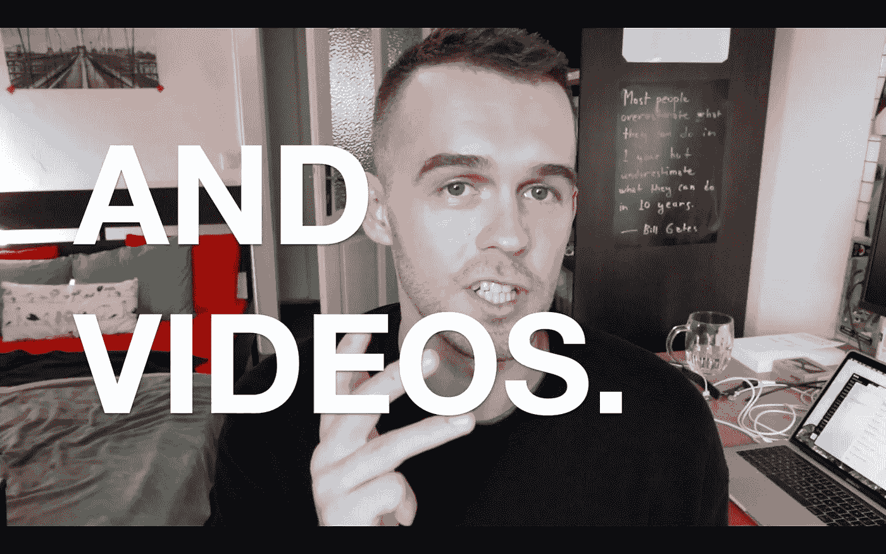

# 给，这是我做的

> 原文：<https://medium.com/swlh/here-i-made-this-50afed8ae804>

## 我一年前开始的，我要宣布一件事。

365 天前，我开始写日记。

我接受了建议。如果你想成为作家，那就写作吧。

事实证明，就是这么简单。

从那以后，我经历了起起落落。正如他们所说，生活是痛苦的。

我开始在网上写作，然后就停止了。但我从未停止写日记。这是我的锚。

我知道我必须每天打卡，以保持在我努力成为的人的轨道上。

我做到了，今天是一周年纪念日。

> 然而，我并不以此为荣。我很感激我的生活让我能够追求激情。不是所有人都有自由。我不认为这是理所当然的。

此外，我学到了*时间不会飞*当你做事情。我明白了当我富有创造性的时候，我是快乐的。我观察到有一种内在的和社会的恐惧阻止我们探索我们的创造力。

我想谈谈这些恐惧。我想学会管理它们，并鼓励每个人去挑战它们。我想继续创作更多的东西。

我今天做了*这个*:

> 我相信，所有的人都是有创造力的。

爱情，

*马蒂*

附:感谢[内森·孔特尼](https://medium.com/u/310f0ff4cf2f?source=post_page-----50afed8ae804--------------------------------)、[本杰明·p·哈迪](https://medium.com/u/5153880ce2ee?source=post_page-----50afed8ae804--------------------------------)、[汤姆·库格勒](https://medium.com/u/caa51e5ba081?source=post_page-----50afed8ae804--------------------------------)、[汉克·格林](https://medium.com/u/4681f189a24e?source=post_page-----50afed8ae804--------------------------------)、[杰克·康特](https://medium.com/u/e6e1cecf4846?source=post_page-----50afed8ae804--------------------------------)、[海军拉维康](https://medium.com/u/67f5049293c7?source=post_page-----50afed8ae804--------------------------------)、[凯西·奈斯塔](https://medium.com/u/cb3bf029673b?source=post_page-----50afed8ae804--------------------------------)和[初创企业](https://medium.com/u/f0236d5369c?source=post_page-----50afed8ae804--------------------------------)的鼓励。

没有你带路，这一切都不会发生。

*感谢阅读！如果有什么引起共鸣的，请留下评论* ❤️

我喜欢和世界各地有创造力的人交流。所有的人都有创造力。

通过以下方式与我联系:

[媒介](/@uhmrt) | [推特](https://twitter.com/uhmrt) | [领英](https://www.linkedin.com/in/uhnak/) | [脸书](https://www.facebook.com/uhmrt/)

## 这篇文章发表在 [The Startup](https://medium.com/swlh) 上，这是 Medium 最大的创业刊物，拥有+ 374，357 名读者。

## 在这里订阅接收[我们的头条新闻](http://growthsupply.com/the-startup-newsletter/)。

