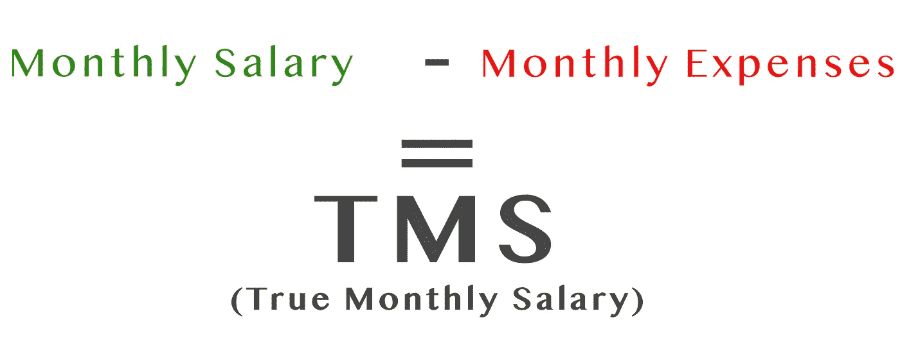
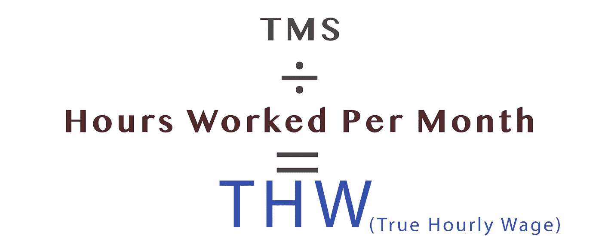

# 这是你每小时实际挣多少钱

> 原文：<https://medium.com/swlh/here-is-how-much-money-you-actually-earn-per-hour-85d22e053c08>

## 提示:它比你想象的要低得多

看到我们在网上寻找交易和优惠券代码时是多么聪明，而在我们的工资支票上又是多么无知，这是相当令人惊讶的。

## 如果你不知道你需要多少钱，你最终总是会买得更多，干得更多。

在之前的一篇文章中，我提到了[找到自己的“足够”](/swlh/what-happens-when-you-find-your-enough-in-this-lifetime-65fdc4844aa6)的重要性。
一旦你发现自己的足够多，你就知道自己真正*需要*多少钱。
让我们假设你的“足够”总额为每月 2075 美元。这意味着你需要每月赚 2500 美元(2075 美元外加 20%左右的利息才安全)。如果你每小时挣 25 美元，这意味着你一个月需要工作 100 个小时，或者一周大约 23 个小时。这是普通美国人工作时间的一半。

但是你每小时的工资是多少？
而你 ***每周需要*** 工作多少小时？你的真实时薪是你的工资、工作时间和工作费用的综合。

请允许我用四个简单的步骤来指导你找到你真正的月薪和时薪。如果你愿意诚实地遵循这些步骤，期望在完成这篇文章时，对你的生活，尤其是工作有新的见解。

# **1。找出你的月薪和假设时薪**

他的步骤很简单。写下你的年薪，并扣除所有税款。
将你得到的数字除以 12(月)得到你的月薪。接下来，用你每周应该工作的小时数乘以 47(一年中的工作周数)，得出你每年工作的小时数。现在用你的年薪(减去税)除以你每年工作的小时数，你就会得到你假设的时薪。我的朋友罗杰税后年薪为 57，000 美元。因此，他的月薪是 4，750 美元(57，000 美元/12 个月)。根据合同，罗杰应该每周工作 40 小时。由于每年工作 47 周，他有权声称每小时挣 30 美元。是这样吗？

# **2。找到你的总工作费用**

如果不是为了工作，你会花钱买什么东西？
任何东西，从汽车燃料、公共交通、出租车/优步，到办公室外的午餐、工作服和工作礼物/活动。罗杰每月通勤花费 250 美元。那包括燃料和停车费。
罗杰几乎每天都在外面吃午饭，每周还会买几次咖啡。那总计每月 300 美元。他每年还花 950 美元购买工作服装。这包括衬衫、西装、鞋子和一个公文包。加上每年为退休人员和办公室聚会购买礼物的 600 美元，罗杰每个月总共有 680 美元的工作支出。

# **3。找出你每周工作多少小时**

int:比你想象的要多得多。
放心使用[这篇文章](/swlh/nine-to-five-more-like-seven-to-seven-580ebbae47a4)。它会帮助你。你知道美国人平均每周工作 47 小时吗？如果你工作的时间比这多得多，不要惊讶。你的通勤、加班和在家工作消耗的时间都比你想象的要多。找出你每周工作的确切时间。也包括准备工作和出差的时间。一旦你有了这个数字，继续用它乘以 47(每年工作周数)。现在用它除以 12，算出你每个月工作多少小时。罗杰每周工作 63.75 小时。也就是每年 2996 小时，或者每月 249.5 小时。这比他每周应该工作的 40 小时多了 60%。

# **4。你的真实时薪**

现在你应该有三个不同的数字:你的月薪(税后)=A，你的每月工作费用=B，你每月工作的小时数=C。在你继续之前，请记住:**要诚实。**

按照上面的简单等式:拿你的月薪(税后)扣除你每月的开销来计算你的 TMS。TMS = A-B

你的真实月薪代表了你每个月从工作中赚到的真实金额。一旦你得到了你的 TMS，用它除以你每月实际工作的小时数(第三步得到的数字)，如下所示:
THW = TMS/C

被警告，深呼吸。结果很可能令人不快。
以下是罗杰的计算:
$ 4750-$ 680 = $ 4070(TMS)。
$ 4070/249.5h =**$ 16.3(THW)。几乎是他认为每小时收入的一半！**

这是我为你制作的计算器工具:

 [## TMS 和 THW 计算器

jscalc.io](https://jscalc.io/calc/Bf4wILmI8OyTe88T#%7B%221%22:57000,%222%22:250,%223%22:300,%224%22:950,%225%22:600,%226%22:47,%227%22:2.5,%228%22:1,%229%22:0%7D) 

# 下一步是什么？

他的文章主要是关于钱的。这是关于获得意识和控制。这并不是提倡每小时赚最多的钱，而是给你一个工具，让你过上更充实的生活。
**意识是关键**。现在，你第一次拥有了你的 **TMS 和 THW。你可以开始做出理性的决定。
**问自己这些重要的问题:**
我的工作值得我的 THW 吗？
我的 TMS 与我的“够了”一致吗？
我的 TMS 是否超出了我的需求？我能找到一种方法减少目前工作的工作量吗？我能找到一种在当前工作上花费更少的方法吗？**

你可能想要求加薪，你可能想辞职，你可能想保持现状。通过了解你的 THW，你知道你在用你的时间换什么。毕竟，这是你最宝贵的资源。

**你的 TMS 是什么？你的 THW 是什么？**
通过寻找那些你学到了什么？请在下面的回复部分与我分享。我很想聊天！

> 如果你觉得那是你想做的，就一起鼓掌👏

# 感谢阅读！欢迎随时关注我:

 [## 萨尔·oron⁦⁦👈—中等

### 我是萨尔。大多对音乐和人充满热情。在寻求…

medium.com](/@saaroron)  [## 萨尔奥龙/朝九晚五？更像是七比七！

### 为什么你可能一天工作超过 12 个小时

medium.com](/swlh/nine-to-five-more-like-seven-to-seven-580ebbae47a4)  [## 在这一生中找到你自己的足够的重要性

### 当你认为极简主义是一种饮食时会发生什么

medium.com](/swlh/what-happens-when-you-find-your-enough-in-this-lifetime-65fdc4844aa6) 

## 这个故事发表在 [The Startup](https://medium.com/swlh) 上，这是 Medium 最大的创业刊物，拥有 326，962+人关注。

## 在这里订阅接收[我们的头条新闻](http://growthsupply.com/the-startup-newsletter/)。

