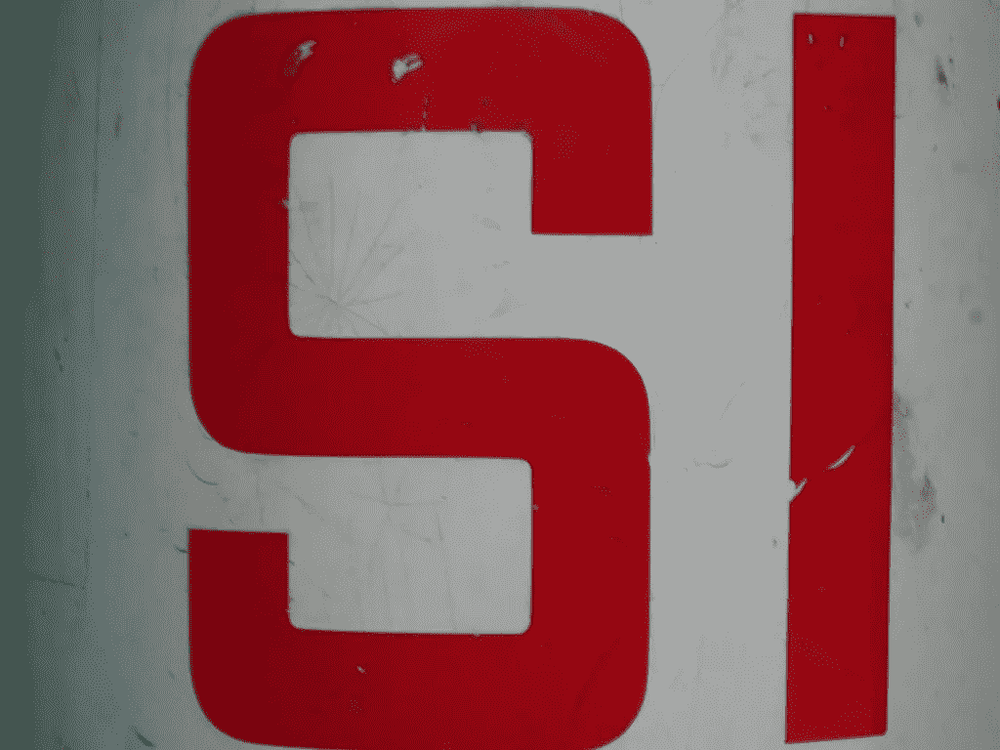

# 这是我在 10 天内对所有事情都说“是”时发生的事情

> 原文：<https://medium.com/swlh/here-is-what-happened-when-i-said-yes-to-everything-during-10-days-a2a8313059ab>

## 我对一切都说好的 10 天——生活方式实验

昨天星期五之前，第一阶段的实验已经结束。对一切都是对的 VS [**对一切都不是**](https://isragarcia.com/say-no-to-everything-experiment) 。这是 10 天来一切都是肯定的。所有我能说的"是"。我学到的比我想象的多，我生活在充满有趣矛盾的两极。

# 跟踪参数

这些是我遵循的定量参数:

*   “是”而不是“不是”:当我对通常会说“不是”的事情说“是”时
*   是的:“是的”他们不是被迫的，是自然的。
*   不:“不”不勉强，简单。
*   避免情况:当试图避免一份需要“是”的工作时
*   “不”而不是“是”:当我说“不”的时候，这应该是对我所处的实验阶段的“是”。
*   纠正措施:当我第一次说“不”的时候，我意识到了，然后说“是”

# 定性参数

*   突出的事情:在“是”中突出的事实
*   令人惊讶的:我认为是真实的轶事和时刻。
*   意想不到的情况:我措手不及，然后在没有意识到的情况下屈服了。

# 仪表板上的结果

以下是在“对一切都是”的 10 天结束时获得的量化结果:

*   20 个“是”而不是“不是”
*   50 是的。
*   11 没有。
*   2 避免的情况。
*   7 用“不”代替“是”。
*   4 整改。

这里是定性的…

10 天内突出的事情:

*   用现金支付你通常会用卡或公司支付的产品。
*   在离开超市的时候，把一周的所有购物都捐给一个点餐的人。
*   安排一次与多层次营销公司的会议。
*   让一个朋友开我的车
*   给一个在 Instagram 上问我的粉丝发 50€。
*   与 Eduardo Reyes 一起在 Castellón 组织会议和活动。
*   在加油站买一张彩票。一包口香糖，还有香肠。和一条小麦面包。除了车内缺少空气清新剂。(不吃这些食物)
*   致力于三个新项目，这些项目我都不知道，也不符合我的目标或要求。
*   确认世界逃亡日期间的在线会议。
*   听听我的电话公司的报价，改变计划，购买两个新套餐，租用一条新线路。

# 值得一提的令人惊讶的事情

*   用我的同事做挡箭牌，这样我就不用说“不”
*   去国家的另一边开一个免费的会议。
*   在我不太懂的时候帮邻居挂画。
*   让我的团队中的一名成员打扮成女人去参加下一个在阿利坎特举行的脱颖而出项目。
*   承认一个“不”而不是一个“是”
*   对自己撒谎说“是”。
*   认识到他们不必要地讨好我。
*   仅仅为了说一句“是”而承担不属于我的责任。
*   听 30 分钟推销信用卡的广告，最后签署一项计划。

# 发生了意想不到的事情

*   对我应该答应的承诺说“不”。
*   给优秀项目 Málaga 一个名额。
*   给一个无家可归的人 10€。
*   不得不吃 fideuá，在这里他们玩我很好。
*   说“是”来尝试购买一件你永远不会使用的产品。
*   免费工作 4 小时。
*   拒绝哈维·马西阿斯给我的香料。
*   处理并参加一个计划外的会议。

正如我所说的，这是不寻常的，奇怪的，非常不舒服，有时甚至令人不安。我觉得没什么好玩的。

# 10 天对一切都是肯定的

我已经录制了一段**的视频，向你解释在第一阶段对一切都是肯定的 10 天中剩下的体验，第一手的。**

***照片来源:* [*劳拉*](https://www.flickr.com/photos/evereverse/) *。***

****

## **这篇文章发表在 [The Startup](https://medium.com/swlh) 上，这是 Medium 最大的创业刊物，拥有+365，945 名读者。**

## **在此订阅接收[我们的头条新闻](http://growthsupply.com/the-startup-newsletter/)。**

****