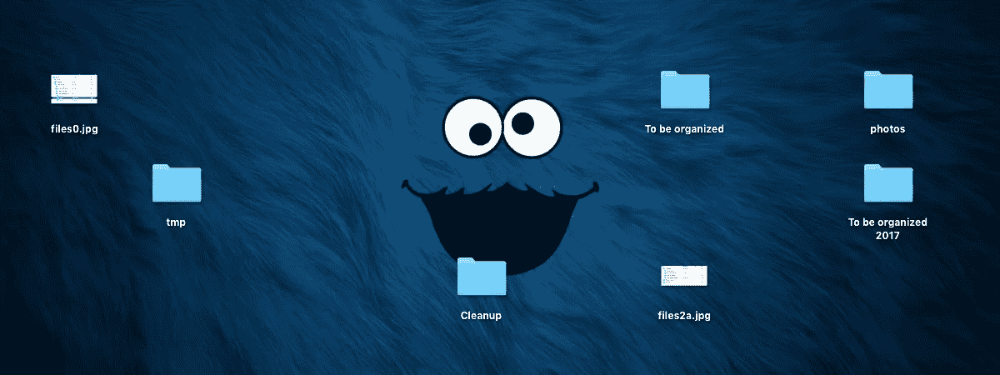
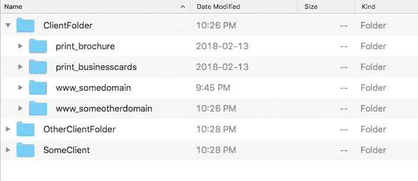
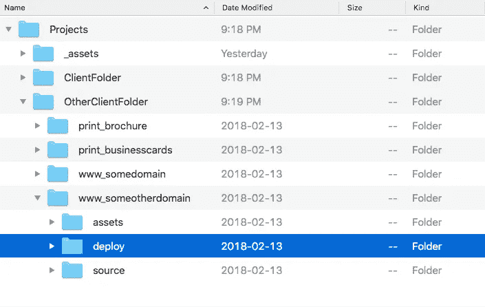
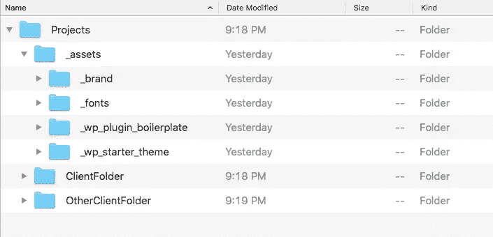
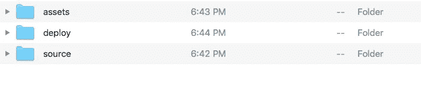
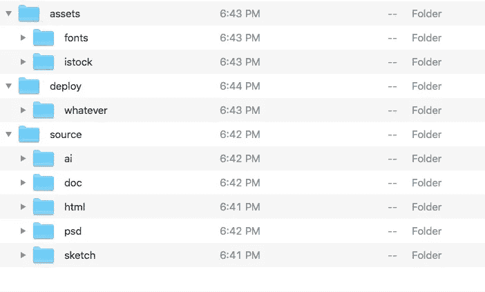

# 这里有一个您将实际使用的项目文件系统。

> 原文：<https://medium.com/swlh/heres-a-project-file-system-you-ll-actually-stick-with-a34951677902>

如果你是一名网页设计师或开发人员，你的工作需要一定程度的组织，这样你才能在工作中变得高效和理智。所以今天我将与你分享我的归档系统。我已经使用这个系统十多年了，它非常适合我。

如果你没有花时间计划如何存储和分享你的工作，停止你正在做的任何项目，实现一个文件组织系统。这是你不能推迟的事情之一。

> 有条理是业余爱好者和专业人士的区别之一。

# 首先，我把我的作品储存在云中。

> 这对大多数人来说可能是旧闻了，但我知道你们中的一些人仍然把自己的作品存储在某个外部硬盘上。

除非你的工作很敏感，或者你担心有人会偷你的东西，否则云是存储你的项目文件的好方法。我用谷歌的 Drive 文件流，我所有的工作都放在那个文件夹里。它允许我从任何地方访问我的文件，并受益于定期备份。

[https://www.google.com/drive/download/](https://www.google.com/drive/download/)

# 选择一个命名约定并坚持下去。

我对我的客户文件夹使用 CamelCase，对其中的所有内容，我都使用小写下划线。

就我今天所知道的，我建议所有的东西都用小写下划线，甚至是客户文件夹，因为这是你在建立你的项目时需要做的一个决定。十年前，当我第一次开始使用这个系统时，我个人偏爱 CamelCase…但是现在我更了解了🙂。

# 项目容器

我组织工作的方式如下:

—项目:这包含我的所有工作
—_ 资产:此文件夹包含我的共享资产
— —客户端文件夹:每个客户端的文件夹
— —项目 _ 文件夹:这包含客户端的项目

“Projects” folder contains client folders and the shared assets folder.

请注意我是如何用媒体类型作为项目文件夹的前缀的——这允许我对我的项目进行分类，而不必将它们隐藏在嵌套的文件夹中。你可以随意创建自己的类别，但我将它们限制在我的工作范围内，目前是`print`和`www(web)`。我计划在不久的将来开发移动应用程序，在这种情况下，我会使用类似`mobile`的东西。

请注意，我没有将我的客户端文件夹保存在`clients`父文件夹中。虽然这会让我的`Projects`文件夹看起来漂亮整洁(它只有`_assets`和`clients`)，但这意味着多了一个嵌套层次，随着时间的推移会变得很麻烦。

> 最好尽可能限制嵌套文件夹的数量。

# 共享资产

“共享资源”文件夹包含我在客户端项目中使用的资源。例如，作为一名开发人员，我会将样板文件和 starter 主题从 _assets 文件夹复制到我当前的项目文件夹中，以便快速启动和运行。

There is no strict structure for the _assets folder.

# 项目结构

客户端项目遵循严格的结构，如下所示:

The client project folder does not contain anything other than these three folders.

**资产:**该文件夹包含项目中使用的所有第三方资产:客户提供的内容、字体、购买的照片或音频等。**如果文件不是我自己创建的，它会放在** `**assets**` **文件夹**中。组织该文件夹的内容没有严格的规则。

**部署:**该文件夹包含要交付给客户端的文件。和`assets`文件夹一样，这个文件夹的内容没有严格的规则。如果您的项目使用文件传输(sftp)或版本控制(git)，您可能不需要此文件夹。

**Source:** 该文件夹包含项目的所有源文件。文件按扩展名组织，除了 `**html**` **文件夹**之外的**，它包含您的网站或网络应用程序的所有文件。(我正在考虑使用`app`向前移动，因为我正在迁移以做出反应)。**

Unlike the “source” folder, the “assets” and “deploy” folder do not adhere to any strict rules.

为什么我不在每个文件夹中执行严格的规则？因为我的经验告诉我，由于每个项目往往都是独一无二的，所以它的麻烦要大于它的价值。如果我有一系列的修订/版本*(我见过一些设计师的 psd 文件夹里塞满了 comp_v1 到 comp_v17* 😢T21，我可能会采用某种系统，但我通常不会有这个问题。

> 顺便说一句——如果我有超过 3 个版本的(已发布的)设计概念，这通常对我来说是一个危险信号，表明在设计过程中有些东西出了问题，我有比文件组织更大的问题……但那是另一回事了。

除此之外，我的文件系统非常简单和一致，对我来说，它在灵活性和刚性之间取得了恰当的平衡，使我可以在不考虑文件组织的情况下完成工作。

## 这篇文章发表在《创业》(The Startup)杂志上，这是 Medium 最大的创业刊物，有 311，185 人关注。

## 在这里订阅接收[我们的头条新闻](http://growthsupply.com/the-startup-newsletter/)。

