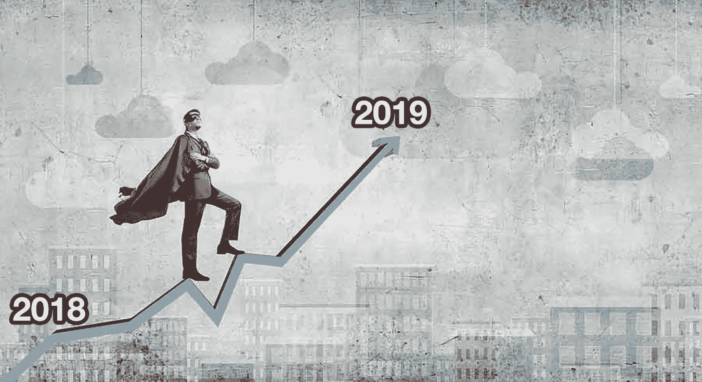

# 以下是你如何在 2019 年比 2018 年做得更好

> 原文：<https://medium.com/swlh/heres-exactly-how-can-you-do-better-in-2019-than-you-did-in-2018-65aced4564da>

Image adapted from: [www.cfocentre.com.au](https://www.cfocentre.com.au/2016/11/09/from-zero-to-hero/)

## 如何更有自知之明并计划好一年的策略

【2018 年对你来说怎么样？

*事情“按计划进行”了吗？*

*有计划吗？*

如果我在 2018 年比以往任何时候都更加繁荣，那不是因为我幸运，而是因为我…