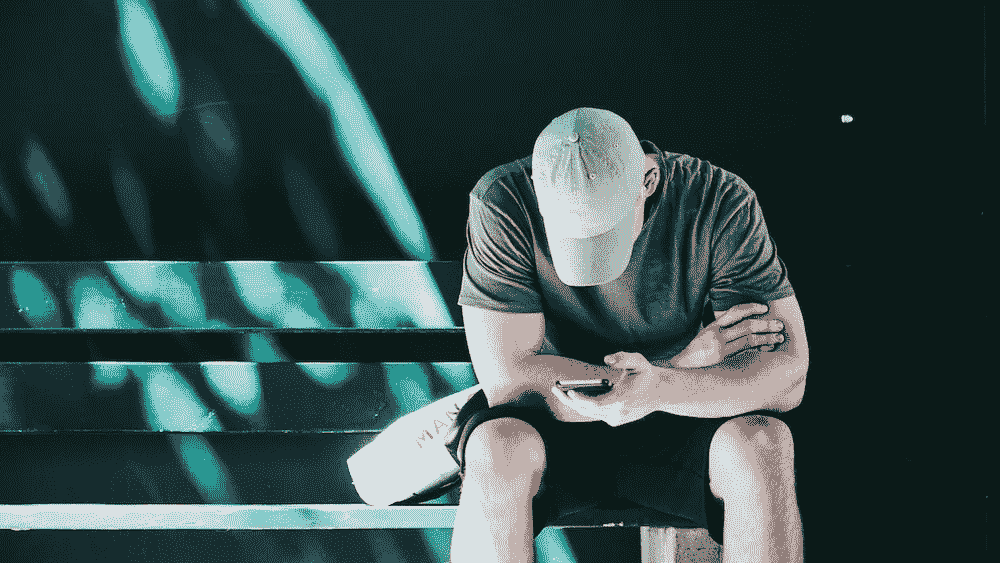

# 这是(确切地)当你放弃手机 24 小时后会发生的事情

> 原文：<https://medium.com/swlh/heres-exactly-what-happens-when-you-give-up-your-phone-for-24-hours-5bcc38a3cd16>

## 我国庆节前拔插头实验的结果

3 月 9 日至 10 日，周五至周六，是[的全国拔掉插头日](https://www.nationaldayofunplugging.com/)——这一活动旨在激励你放下手机整整 24 小时，花更多时间与所爱的人在一起。虽然我通常不发表关于具体事件的文章，但在与团队在[重生](https://www.rescuetime.com/)工作了几个月之后，这篇文章击中了我的要害。

我相信，当以正确的方式使用时，技术能让我们把工作做得最好。但我也亲身体会到，它可能是一个巨大的干扰和焦点杀手。

尤其是我们的智能手机，[被设计成能吸引我们的注意力](https://blog.rescuetime.com/nir-eyal-digital-distraction/)，并不断被评为我们不愿意花太多时间使用的东西。

根据 2017 年版美国心理协会的年度 [*美国压力*报告](https://www.apa.org/news/press/releases/stress/2017/technology-social-media.PDF)，**近三分之二的美国成年人同意定期“拔掉插头”或进行“数字排毒”对他们的心理健康有益。**

但是你上一次离开你的电脑超过几个小时(最多)是什么时候？

根据大多数报道，**美国人平均每月在手机上花费 70 个小时**，年轻人(18-24 岁)花费超过 94 个小时！

我并不认为自己是一个超级手机用户，然而仅仅一周之后，我发现我每周花在手机上的时间超过了 20 个小时。

最糟糕的是，我发现我花在手机上的时间比我写作的核心工作还多。

我们的手机控制了我们的注意力。但我们没必要让他们得逞。从我最近的采访中摘录了 Nir Eyal 的话:

> “绝望是走向失败的第一步。”

相反，这个周末——以及你选择有意识地远离手机的任何一天——是一个夺回控制权的机会。消除持续的注意力分散，以更集中的方式体验一天。

在国庆节前，我把自己的手机锁了 48 小时，然后把我的经历和其他做过同样事情的人进行比较。

所以，如果你还在犹豫是否要从手机上退一步，下面是当你放弃手机 24 小时(或更长时间)后会发生的事情:

# 我变得更容易厌倦(这不是一件坏事)

我注意到的第一件事，是我的大脑不断向我的手机漂移。我渴望社交媒体、电子邮件和新闻，哪怕是在稍微无聊的时候。

对于作家娜塔莉·霍姆斯来说，她在自己的 [3 天数字戒毒](/dangeroustech/three-days-of-solitude-8bd8c026b65c)中发现了这种渴望被打扰的感觉:

> *“持续的联系意味着我们永远不需要跟随我们的想法到达终点。”*

当我们感到压力、焦虑或无聊时，总会有别的东西转移我们的注意力。我们的手机是一种逃避，然而这提出了一个重要的问题:**为什么我们如此热衷于远离自己的思想？**

科学家会说这与多巴胺有关。福尔摩斯解释道:“化学反应提供了一个短暂的感觉良好的因素，让我们渴望下一个。”这可能部分是对的。但是从我自己的经验来看，感觉这只是习惯的一部分。我已经忘了如何感到无聊。

我已经变得依赖于源源不断的内容。然而，一旦我与它分开，我意识到我错过的事情是多么微不足道，并开始享受这个空间。

我走神了。没有任何提示，奇怪的歌曲突然出现在我的脑海里。我会让自己想起我正在写的一个故事或者我想做的一个项目。

几乎出乎意料的是，这种无聊让我能够更好地关注我所消费的内容。

当记者乔尔·斯坦住进一家 550 美元的技术康复中心时，其中一名参与者评论说，他发现自己耐着性子看完长电影的能力正在下降。

> “我们不是在谈论托尔斯泰。我们说的是《星球大战:第四集》。我们这一代人无法耐着性子看完爆米花电影。”

对我自己来说，没有 Instagram 或 Twitter 这样的“简单”内容的持续吸引，我能够更专注于并享受我选择的电影和书籍。

# 我更加放松和快乐

在一篇被广泛分享的名为 [*你是产品*](https://www.lrb.co.uk/v39/n16/john-lanchester/you-are-the-product) 的文章中，John Lancaster 强调了一项研究，该研究发现，脸书上的点击量和点赞量每增加 1%，研究人员记录的心理健康水平就会下降 5%至 8%。

在圣地亚哥州立大学心理学教授让·特文奇的另一项研究中，她直言不讳地指出，在研究过去十年青少年的幸福时:

> *“每一项不使用屏幕的活动都会带来更多的快乐，而每一项使用屏幕的活动都会带来更少的快乐。”*

在最近的一篇 [NPR 文章](https://www.npr.org/sections/health-shots/2018/02/12/584389201/smartphone-detox-how-to-power-down-in-a-wired-world)中，湾区夫妇[肯·戈德堡](http://goldberg.berkeley.edu/)和[蒂芙尼·史兰](http://www.letitripple.org/about/tiffany-shlain/)和他们十几岁的女儿敖德萨解释了他们是如何在十年的大部分时间里每周五至周六晚上练习 24 小时“科技安息日”的。

他们说白天感觉更长，更有目的，也更放松。

“你又让你的时间变得神圣了——重新获得它，”史林说。“你停止所有的噪音。”

即使是与手机的一点点分离，也让我感觉与和我共度时光的人有了更多的联系，在某种程度上，更快乐了。我确实感到焦虑，因为我错过了信息或短信，并担心有人可能试图与我联系，但不能。然而，这些担忧并没有持续很久。

# 我睡得(好多了)

多项研究表明，把手机放在卧室里是个糟糕的主意。

大多数数码设备发出的蓝光会导致我们的大脑脱离“睡眠”模式，并破坏我们的自然休息周期。早上第一件事就是看你的手机，伴随着社交嫉妒和压力开始你的一天。

在你的卧室里有一个分散注意力的来源甚至会破坏其他夜间活动。正如 Kelton Wright 在 Headspace 博客上写的:

> “看着某人在 Instagram 上咕鲁，一点也不性感。”

这些年来，我也养成了类似的糟糕的“电话卫生习惯”。

我用手机当闹钟，这意味着它通常是我睡觉前看的最后一样东西，也是我早上检查的第一样东西。这通常意味着我一醒来就会被吸引去看通知(或者如果我不看的话会感到紧张)。

没有了这种拉力，我发现自己睡得更香了，早上感觉不那么累了，通常也不那么焦虑了。

# 我的想法变得更清晰，更有创造力

“你对智能手机的使用……真的会剥夺你从自己的大脑中产生的一种无缝的创造性思维流，”[说](https://www.npr.org/sections/health-shots/2018/02/12/584389201/smartphone-detox-how-to-power-down-in-a-wired-world)[Anna lem bke](https://profiles.stanford.edu/anna-lembke)博士，斯坦福大学研究成瘾的精神病学家。

作为一名作家，这一点击中要害。[创造力](https://blog.rescuetime.com/creativity-exercises/)依赖于一种叫做“孵化”的思维方式，在这种方式中，我们的想法、灵感和想法在我们的潜意识中筛选，相互碰撞，直到有东西粘在一起。

这可能感觉像一个*尤里卡！*瞬间。但实际上，是你的大脑在你不知情的情况下工作。然而，要做到这一点，你不能总是让内容和通知塞满你的脑袋。

正如 Tchiki Davis 博士在 [*今日心理学*](https://www.psychologytoday.com/blog/click-here-happiness/201801/5-ways-do-digital-detox) 中写道:

> *“虽然一开始感觉有点可怕，但电子斋戒迫使你与他人和自己联系起来，这最终会成为一种非常奇妙的体验。”*

离开手机一段时间后，我开始感觉到这种思维方式又回来了。我们通过消费而沉默的意识流，在没有它的短短几天后又回来了。

# 我意识到我是多么依赖我的手机来做一些基本的事情

没有手机的 48 小时让我大开眼界。但我也很快意识到它已经成为我生活的一部分。

我从来不知道几点了。

赶上公共汽车是一场噩梦。

我逛了半个小时，寻找一家我没有写下地址的商店。

心理学家称之为认知卸载。

加拿大滑铁卢大学的认知心理学家埃文·里斯科解释说:“当你卸下负担时，你就释放了一些精神资源。”。

"现在，如果你把精力投入到一些有成效的任务中，应该会有净收益."

这是个好主意。但在实践中，我似乎理所当然地认为我的手机能够充当“第二大脑”，而不一定以积极的方式使用这些额外的资源。

# 你不需要永远放弃你的手机来看到这些好处

如果你读到这些，然后说，*“是的，听起来不错。但是我不能没有手机！”*那还是可以的。

带来好处的不是长期分离，而仅仅是和手机的关系更好。

在 Twenge 教授关于快乐和屏幕使用的研究中，她发现一两个小时的设备时间实际上更可能与更高水平的快乐相关。

一切都要适度。

放弃手机任何一段时间都不仅仅是看到好处。而是理解你和它的关系。

意识到我自己的用法让我痛苦地明白我错过了多少。不仅仅是在互动中，而是给我的思维空间去漫游和放松。

所以为什么不在这个周末休息一下呢？[拔一天](https://www.nationaldayofunplugging.com/)，烦了，看看是什么感觉。

# 嘿，我是乔里！

*我帮助公司和有趣的人通过聪明和专注的写作讲述他们的故事。想一起工作吗？在 hello@jorymackay.com 给我发邮件*

*这篇文章的一个版本最初发表在* [*RescueTime 博客*](https://blog.rescuetime.com/unplug/) *。查看更多关于生产力、专注和动力的文章。*

## 这个故事发表在 [The Startup](https://medium.com/swlh) 上，这是 Medium 最大的创业刊物，拥有 303，461+人关注。

## 在这里订阅接收[我们的头条新闻](http://growthsupply.com/the-startup-newsletter/)。

