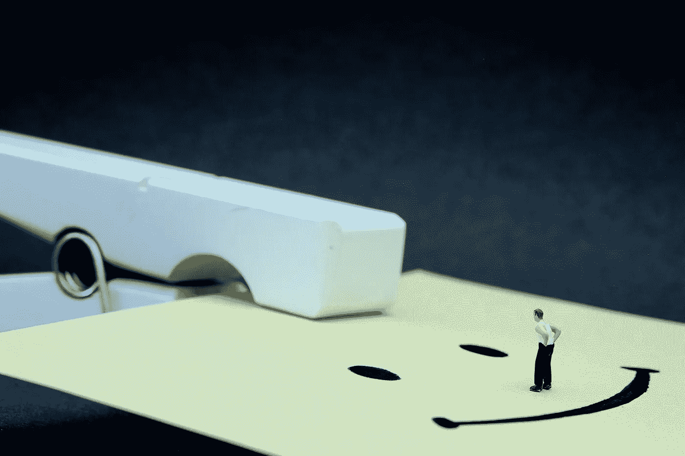

# 以下是我在 31 天里决定对每个人微笑时发生的事情

> 原文：<https://medium.com/swlh/heres-what-happened-when-i-decided-to-smile-to-everyone-during-31-days-40e0c6d4b6e6>

## 我试着一直对每个人微笑，这就是结果

昨天我结束了对每个人微笑的**[**实验**](https://isragarcia.com/category/experiment) ，它包括在任何时候对任何人微笑。最初，我设定 15 天为一个周期，但我决定延长到 31 天，以进行更深入的研究。下面介绍这个实验。**

**在每个实验中，我将通过区域分类来剖析结果…**

# **仪表板和跟进**

**我设计了一个小记分卡，在上面我试着计算我每天遇到的人和我一直微笑的次数。**

**使用的其他参数有:**

*   **反应:在每个最突出的反应中，什么类型的反应。**
*   **惊喜:当对方出乎意料地做出反应时。**
*   **错误答案:由于我的微笑引起的不良反应。**
*   **意见:补充说明。**

***黄色标记的日子对应内观禅修。**

**[**转到记分卡，跟进**](https://docs.google.com/spreadsheets/d/1gn739uz3pweGkrYVCuLMyv8r-eSp8pt-pFnhxtrKJnI/edit?usp=sharing) 。**

# **目标和最终结果**

**“对每个人微笑”实验的目的是从这五个目标中提取数据:**

1.  **从别人的回答到自信快乐的回答**
2.  **我对任何事情的态度。我觉得一直微笑让你感觉更清醒，更有意识，除了让你充满正能量和欢乐，我想测试一下这是不是真的。当你进入这种模式时，你和你的环境之间的关系会发生什么变化**
3.  **微笑如何改变比赛和结果。我认为在任何时候带着微笑接近任何人只会带来好的事情。所以我打算在接下来的 15 天里 24 小时试用。**
4.  **我喜欢，认真的时候感觉很舒服，很平静，很放松，是我最常见的面部表情和默认。但是，我想证明如果我强迫自己走向另一个极端，一直微笑，会发生什么。**
5.  **与你能接触到的人的联系微笑，或者不微笑。**

# **目标 1 —反应:**

**A.正如记分卡所示，负面反应几乎不存在。除了在 [**内观**](https://www.dhamma.org/es/index) 静修期间，每个人都在那里专注于自我。当我继续实验时，尽管我们练习了高贵的沉默，我没有停止微笑，这似乎困扰着那些试图对一切保持无菌的人。**

**B.在这 31 天里，我所见到的人们的反应非常积极。在大多数情况下，通过微笑，甚至交换一些合作的手势。这很有趣，因为在很多情况下，它已经从微笑变成了调情，不仅仅是对女孩，而是对每个人微笑。**

# **目标 2 —重新编程:**

**A.我的心情有所改善，在这 31 天里，我看到了比平时更少超越的东西。**

**B.我面对事情的态度比平时更随意。**

**C.我的性格比较开朗，无忧无虑，毋庸置疑。现在我醒来会不由自主地微笑。**

**D.这个实验帮助我淡化了大多数事情。我称之为“重要性-x10”的规则。**

**E.通过不要让自己被无关的事情蒙蔽，我对那些不让我走得更远的事情更加清醒**

**F.当我把微笑带到我的职业活动中时，我并没有失去对那些可能使我无效或让我头疼的事情的看法。**

# **目标 3 —改变游戏规则:**

**A.紧张的时刻只在微笑中消失了。**

**B.用一张严肃的脸和微笑接近你不认识的人改变了游戏，因为几乎每个人都以微笑结束。**

**C.人们的反应和感知更积极，更有共鸣。**

# **目标 4——个人状况:**

**A.你仍然保持平静和放松，但是你感受到平静和良好的感觉。**

**B.在最初的 7 天里，我和往常一样，但从第 8 天开始，我注意到更多的精力和精神不安。以至于我没有像往常一样睡得舒服。**

# **目标 5 —联系:**

**A.你会更多地同情和调整，积极的回应会比微笑的反面更大更接近。**

**B.当然，你们有联系。首先，当你和客户或观众在一起时，要专业。第二，个人而言，当你和朋友、家人或同事在一起时。**

# **发现和其他结论**

**此外，关于对每个人微笑的实验:**

*   **很容易用“我注意到你了”来代替微笑很容易把喜悦的手势和调情的手势混淆。**
*   **目标 2 的结果，加上开始练习耐心，将帮助你变得冷静。**
*   **每天早上，我醒来时都会带着微笑，至少持续一两分钟。它已经成为我每天练习的超级习惯。**
*   **“重要性-x10”法则:对于发生的每件事和我担心的事情，我会把它的重要性降低 10 倍。**
*   **我在 Instagram 上发布的 90%的文章(实验过程中微笑)都比那些看起来严肃的文章有 70%的到达率。正面反应和评论增加了 60%以上。类似的事情也发生在我录制的视频中。**
*   **你可以强迫自己改变自己的情绪，事实证明。**

# **尝试对每个人微笑**

**最后，我录制了一个简短的视频，记录了我更个人化的亲身经历和印象:**

***照片鸣谢:*[*JD hanck ock*](https://www.flickr.com/photos/jdhancock/)*。***

**【本帖首发于[**【isragarcia.com**](https://isragarcia.com/isra-garcia-blog)】**

# **只有当你觉得值得的时候，才让这个故事震撼吧！如果你发现任何有价值的东西，请鼓掌。**

> **Isra Garcia = 55 个客户，48 家企业，400 次演讲，3.574 篇帖子，24 个项目，6 本书，380 场讲座，6 家公司，17 次冒险，26 次实验，∞失败。到目前为止…**
> 
> **[营销人员](https://isragarcia.com/wp/marketer)。顾问。扬声器。作家。教育家。经理。在 [IG](http://thisisig.com) 的负责人。博主。企业家。颠覆性创新。数字化转型。高绩效者和生活方式实验者。**

# **行动号召>>订阅[此处](http://feeds.feedburner.com/isragarcia)更多类似的文章！**

****

## **这个故事发表在 [The Startup](https://medium.com/swlh) 上，这是 Medium 最大的企业家出版物，拥有 358，974+人。**

## **在这里订阅接收[我们的头条新闻](http://growthsupply.com/the-startup-newsletter/)。**

****