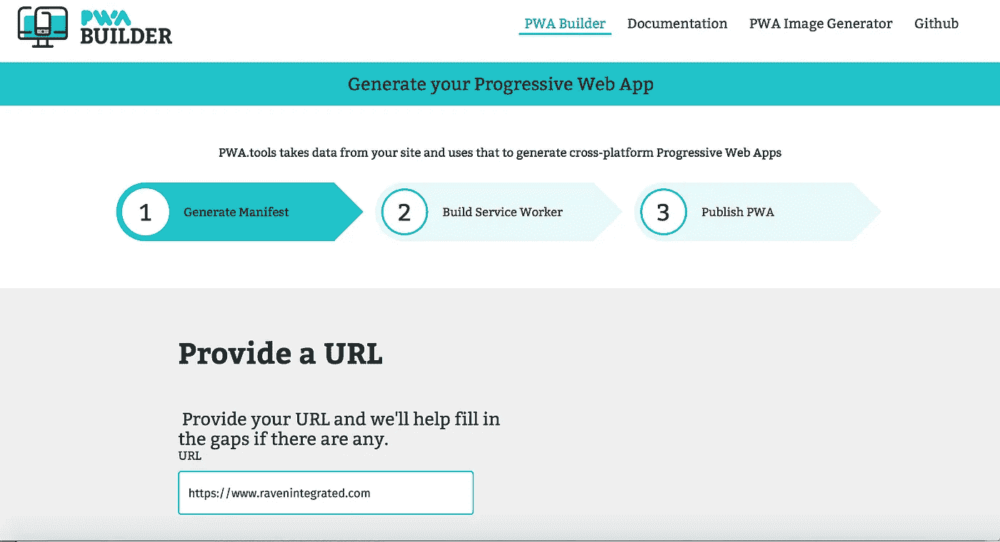
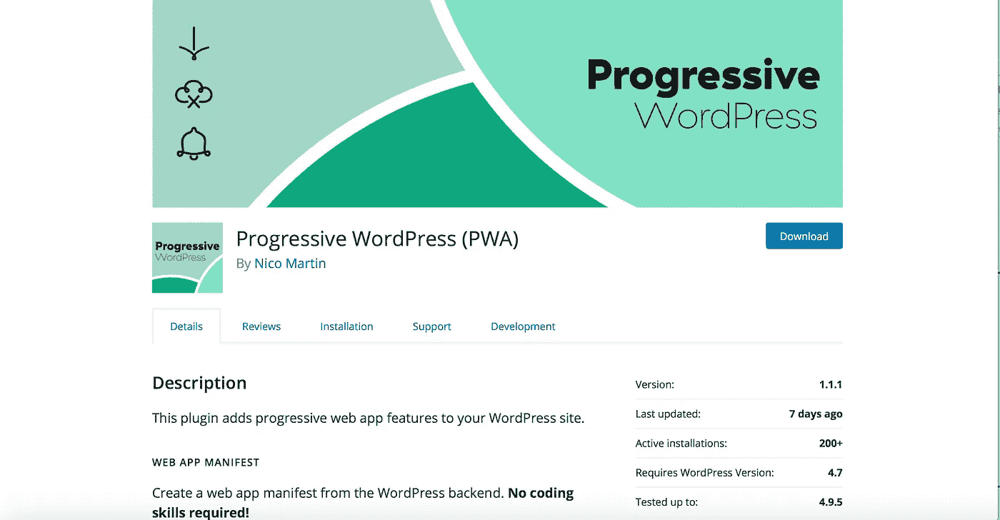
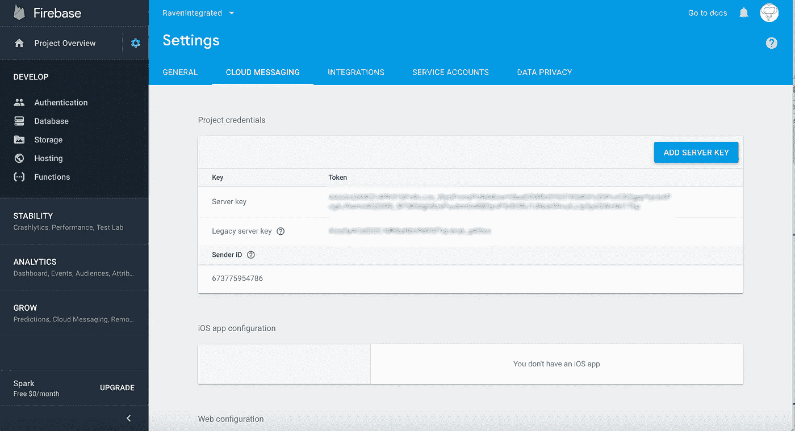

# 这就是为什么我把我的博客网站变成了 PWA(渐进式网络应用程序)

> 原文：<https://medium.com/swlh/heres-why-i-converted-my-blog-site-to-become-a-pwa-progressive-web-app-1c33d06fed34>

Image source — Unsplash

在英美等发达经济体，我们现在使用智能手机上网的时间几乎是使用笔记本电脑或个人电脑的两倍。

事实上，在我为毕马威工作的最后几个月，他们所有的员工都配备了平板电脑。以 Windows 为操作系统的混合型平板电脑。

我接触过的客户发现很难证明网络体验应用程序的成本是合理的。我的一个开发人员朋友提到了 PWAs，我很想了解更多。

# 渐进式网络应用——两全其美

PWA 的概念很简单，它们是感觉像你在应用程序商店里找到的应用程序的网站。

他们可以通过 HTTPS 的传统网址访问。这使得他们搜索友好的搜索引擎。

具有推送通知、唤醒、刷新和网站即时加载等功能；它们让我们有机会为任何设备获得最佳优化体验。

我把事情带回到基础，这样我就可以解释一些相关的技术。如果你已经熟悉这些概念，我很抱歉。

为了创建一个渐进式 Web 应用程序，开发人员创建了一个名为服务工作者的概念。这是一段获取信息而不影响网站主代码的代码。

它允许 PWA 获取信息并将其存储在您的设备上。这意味着该网站的行为就像是你设备上的一个应用程序。第一次访问后，它不需要保持连接，网站就会出现在设备上。

那么，在没有太多编码经验的情况下，创建一个渐进式 Web 应用程序有多容易呢？

例如，对于像我这样熟悉代码，但还不足以称自己为开发人员的人来说。

首先我试了一下 [PWA Builder](https://www.pwabuilder.com) 。

我把我的博客网址放在盒子里，然后等着。然后，该页面分析我的网站，寻找任何丢失的信息。

分析表明，我缺少用于从移动设备启动网站的图标图像。

构建器的下一步创建了服务管理器代码供我下载。

为 web、windows、android 和 IOS 生成的代码。现在，在我变得太兴奋之前，PWA builder 是微软的。

目前，微软似乎在让人们更容易获得技术。微软已经接受了开源模式。

也就是说，它们使得转移或改编代码以在 Windows 和其他地方工作变得容易。

逻辑当然很清楚。微软让他们的生态系统成为每个人的简单选择。

# 有一个小部件或插件可以做到这一点

事实证明，我不知道如何使用 WordPress 和预制模板将代码添加到我的博客网站。

我几乎可以改变 CSS，并接受改变 HTML 的想法。查看 PWA 中的代码示例具有欺骗性。它看起来很容易安装到位。

这并不简单，我需要访问一个叫做“网络应用清单”的东西。

每当我陷入困境时，谷歌搜索是我最好的朋友和盟友。我在搜索栏中输入了“渐进式网络应用 Wordpress”。

我搜索的第一个结果是 PWA 的插件。

不要走添加 PWA 工具生成的代码的 DIY 路线…在插件的 WordPress 社区中有一个插件已经准备好了。

这并不是说我比其他内容管理系统更喜欢 WordPress。我曾与开源的 Drupal 和 Umbraco 以及企业级的如 SiteCore 合作过。

他们都有自己独特的优势。而是选择一个最适合手头任务的。

对我来说，WordPress 是个人博客的明确选择。它有一个乐于助人的开发者社区。加上想分享经验的博主。

关键是它不需要任何编程或编码知识或技能。

我安装了插件，并按照说明操作。

# 创建一个 Google Firebase 帐户。

我将在另一个时间探索在 [Firebase](https://firebase.google.com) 中可用的工具。现在，我对把我的博客网站转换成 PWA 很感兴趣。

我花了一段时间才明白，因为我没有耐心通读说明书。如果有人在外面写说明，请注意:

提供屏幕截图很有帮助，因为它有助于识别要查找的页面或功能:

要激活插件，你需要打开并完成 Firebase 账户的一些细节。Firebase 的入门许可是免费的，所以能够试验和了解更多的特性是非常好的。

创建后，有一个用于设置的工具栏。切换这个，然后打开一系列的标签。选择“云消息”并将代码复制到插件中，下面的截屏显示了在 Firebase 中生成的代码，可以在 WordPress 插件中使用。

我这么做的原因不是随机的。我喜欢探索新的想法和技术，这也意味着我可以从经验中学到一些新的东西。

这就是我把我的博客网站变成 PWA 的原因。我注意到我在手机上收到了推文和 Instagram 帖子的推送通知。它们会让我分心，当我需要专注于一项任务时，我已经学会忽略它们。

但是，当我接受它们时，它们会让我想要点击并探索新的通知。

对于寻求提高受众参与度的品牌来说，推送通知会产生认知度。它把品牌放进了目标受众的口袋里。

虽然可以开发一个网络应用程序，但缺点是它需要 Wifi 或 4G/3G 接入才能连接到网络。

WordPress 的开箱即用插件似乎是一个简单的解决方案，可以在本地设备上保存网站页面。

PWA 消除了应用程序商店的障碍，创建了一个类似网站的应用程序，这就是重点。它可以让你的观众更接近你的品牌，无论是在线还是离线。

我很享受将我的网站转换成 PWA 的过程，现在我知道这相对简单——一个孩子都可以做到。(我)作为一个概念的证明，让我用简单的术语来解释所涉及的内容。这也意味着我可以在未来的项目中探索更广泛的好处和用例，特别是当客户询问是否要建立一个应用程序时。

## 这篇文章发表在《创业公司》杂志上，这是 Medium 最大的创业刊物，有 320，924 人关注。

## 订阅接收[我们的头条](http://growthsupply.com/the-startup-newsletter/)。

