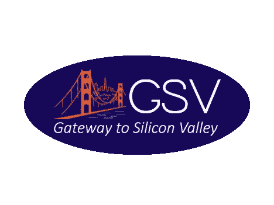

# 这就是硅谷投资者避免投资海外的原因

> 原文：<https://medium.com/swlh/heres-why-silicon-valley-investors-avoid-investing-overseas-9355318dde7d>

(注:虽然这些数据是针对我可爱的祖国土耳其的，但关键的发现和经验适用于所有非美国的创业公司。)

土耳其的创业生态系统正在快速发展。在过去的五年里，424 家土耳其创业公司已经筹集了 3.6 亿美元。几乎所有资金都来自当地和欧洲投资者。美国投资者不在其中。然而，美国投资于初创企业的资金几乎相当于全球投资的一半。在过去的五年里，美国有 25，472 家初创公司筹集了 2860 亿美元。

在 Mediterra Private Equity 任职期间，我投资了一些高增长的技术公司，如 [Wirecard Türkiye](https://medium.com/u/ed6e00867f34?source=post_page-----9355318dde7d--------------------------------) 、 [Logo Yazilim](http://www.logoyazilim.com/) 和 [Filo Turk](http://www.mobiliz.com.tr/) 。然后，我定居在硅谷，在斯坦福大学商学院获得了 MBA 学位。我努力解释土耳其创业生态系统的发展以及它为美国投资者提供的机会。

我和硅谷的五十多家风险投资公司谈过。由于该地区成功的土耳其企业家、投资者和技术公司员工(如埃伦·巴厘、[塞尔库卡特利](https://medium.com/u/7cd9921f4bee?source=post_page-----9355318dde7d--------------------------------)、[埃姆雷坎·多安](https://medium.com/u/c2eaef2f914e?source=post_page-----9355318dde7d--------------------------------)、巴尔·卡拉多根、艾登·森库特、胡利亚·科奇、艾登·科奇、[埃格尔特姆](https://medium.com/u/bdd2af187277?source=post_page-----9355318dde7d--------------------------------)、[巴里斯·阿克索伊](https://medium.com/u/a1b863337356?source=post_page-----9355318dde7d--------------------------------)、穆拉特·比瑟和[沙欣·博伊达斯](https://medium.com/u/274bcaaf5477?source=post_page-----9355318dde7d--------------------------------))，投资者意识到技术培训的高质量他们也知道内夫扎特·艾登、[西纳·阿弗拉、](https://medium.com/u/4645a0f36af0?source=post_page-----9355318dde7d--------------------------------)哈坎·巴斯、阿尔珀·阿肯和哈姆迪·乌鲁卡亚在当地的成功故事。移民企业家在美国的成功不仅限于土耳其人的成功。美国 25%的科技企业家是移民。估值达到 10 亿美元以上的公司中，有 51%是由移民建立的。所以，投资者急于在美国投资移民。

美国投资者愿意投资美国的移民创业者，为什么不愿意投资海外创业公司？

第一个原因是，早期投资者希望成为他们公司的积极合作伙伴。他们希望通过将企业家引入他们的网络来增加公司的价值。投资者在海外的网络有限是他们在海外投资时遇到的第一个问题。与公司的时差(与土耳其 11 小时，与印度 12 小时)使得沟通更加困难。因此，投资者认为他们给公司增加的价值是有限的。

第二个原因是他们愿意寻找估值将达到 10 亿美元的公司。投资者正在寻找巨大的潜在市场和可扩展的商业模式。从这个意义上来说，美国是最有吸引力的市场，它拥有最高的 GDP 和最高的早期采用率。

另一个原因是，美国企业家比非美国企业家更容易筹集资金。正如我们提到的，全球一半的投资资金都投在了美国的创业公司。

考虑到最后两个原因(巨大的潜在市场和资金)，投资者认为美国初创公司更有可能击败非美国竞争对手。近年来价值超过 10 亿美元的公司数量也支持他们的论点。

一位美国投资者分享了另一个原因:“美国人不做任何非美国的事情。”缺乏海外投资经验的投资者担心法治的力量。他们想知道，如果事情进展不顺利，当他们退出投资或诉讼程序时，如何将资金带回美国。这阻碍了投资者投资国外市场和司法管辖区。

最后但并非最不重要的一点是，在海外收购的知名客户并不为美国投资者所知。此外，投资者变得远离他们需要投资的客户确认。当投资者需要了解创业公司的信息时，他们可能很难接触到创业公司的客户。

如果我们把上面提到的所有原因都考虑进去，我们就会明白进入美国市场对于快速发展业务和筹集资金的好处对非美国企业家来说是巨大的。Hamdi Ulukaya 的 Chobani 故事是这方面最显著的例子。他的酸奶公司从美国最著名的投资者之一德克萨斯太平洋集团筹集了 7.5 亿美元。他在不到 10 年的时间里创建了一家价值 50 亿美元的公司。这一价值高于土耳其 30 多年来所有乳制品企业的价值总和。

我的下一篇博文(或者可能是接下来的两篇博文:)将会讨论海外创业公司在美国扩张时最常面临的问题。我们的第一次网络研讨会(建立和维护您的美国实体——合规要求)将于 12 月直播。请继续关注并通过[www.gatewaytosv.com](http://www.gatewaytosv.com)订阅我们的电子邮件列表。或者，给我们发邮件了解更多 info@gatewaytosiliconvalley.com。

**关于硅谷之门**

我们热衷于帮助企业家在美国拓展业务。我们梦想着和我们一起工作的企业家敲响纳斯达克股票市场开市钟的那一天。如果您和我们一样热衷于在美国发展业务，请与我们合作。访问我们的网站([www.gatewaytosv.com](http://www.gatewaytosv.com))并通过[info@gatewaytosiliconvalley.com](http://info@gatewaytosiliconvalley.com)联系我们。

“硅谷之门”提供了一套完整的解决方案来组建和管理一家美国实体——包括组建、银行开户、报税、完成组建后的要求、记账、招聘和筹款。

企业家可以通过 www.gatewaytosv.com/services-pricing.的[购买公司和金融服务包](http://www.gatewaytosv.com/services-pricing.)你也可以通过 info@gatewaytosiliconvalley.com 的[联系我们，要求定制你需要的服务包。](http://info@gatewaytosiliconvalley.com)

“硅谷之门”提供每月一次的网络研讨会，讨论如何在美国创办和管理一家实体。我们还与硅谷的主要企业家和投资者进行炉边谈话。您可以访问公司网站并订阅电子邮件列表，以定期了解所有即将举行的活动。

布·亚兹恩·图尔克版本号

 [## silikon Vadisi yatrmlar nürkiye ' den uzaklat ran 5 Neden

medium.com](/gateway-to-silicon-valley/silikon-vadisi-yatırımcılarını-türkiyeden-uzaklaştıran-5-neden-33f5c4691110) 

## 这个故事发表在《创业公司》杂志上，有 260，100 多人聚集在一起阅读 Medium 关于创业的主要故事。

## 在这里订阅接收[我们的头条新闻](http://growthsupply.com/the-startup-newsletter/)。

