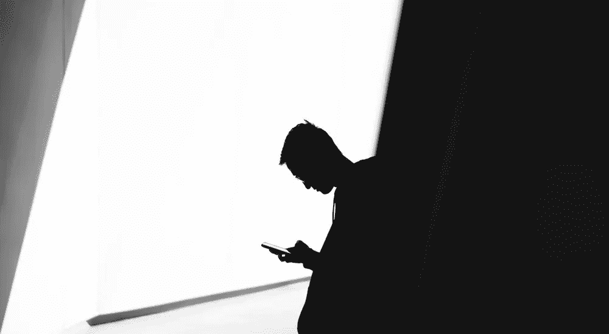
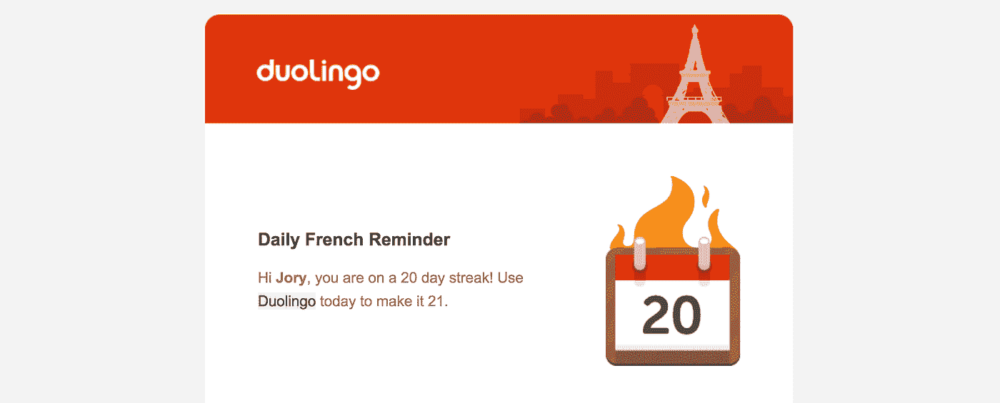
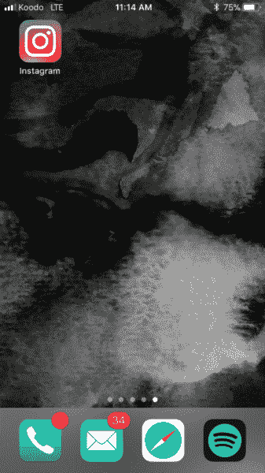
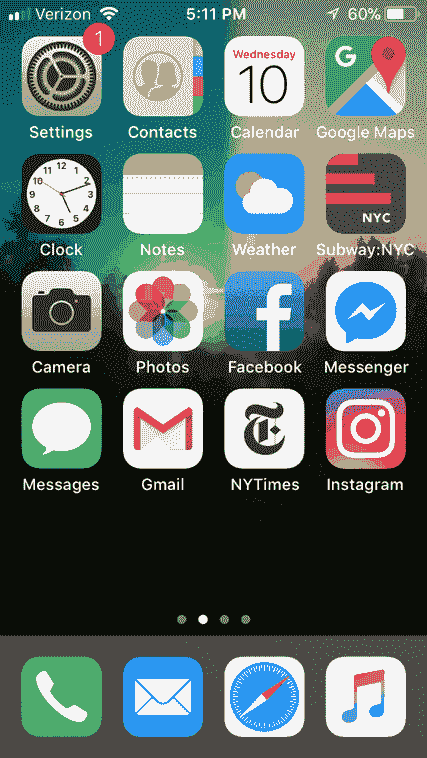

# 以下是为什么你不能(或不愿)从手机中删除分散注意力的应用程序

> 原文：<https://medium.com/swlh/heres-why-you-can-t-or-won-t-delete-distracting-apps-from-your-phone-ae1c50445f1e>

## 为什么你一天要摸手机几千次背后的心理

Photo by [Warren Wong](https://unsplash.com/photos/4l-e7U6c5ek?utm_source=unsplash&utm_medium=referral&utm_content=creditCopyText)

说我们对手机“上瘾”可能不太公平。然而，这并不意味着它们每天不会占用我们大量的时间和精力。

事实上，有各种各样的数字在试图量化我们的电话时间。从营销公司 [dscout](https://blog.dscout.com/mobile-touches) 声称我们每天“触摸”手机 2617 次，到[德勤的最新调查](https://www2.deloitte.com/us/en/pages/technology-media-and-telecommunications/articles/global-mobile-consumer-survey-us-edition.html)发现美国人平均查看手机 46 次。

甚至苹果公司也对我们的使用情况进行了评估，揭示出 [**iPhone 用户每 24 小时解锁手机约 80 次**](https://developer.apple.com/videos/play/wwdc2016/705/) **。**

我们都经历过低头看到手机在手中打开，却不记得把它拿出来。因此，不管哪个数字感觉最接近你的个人用途，它们都有点令人不安。就像我们的手机在使用我们，而不是相反。

但是通过理解我们为什么如此被手机吸引背后的心理，我们可以开始寻找解决方案来摆脱它们对我们注意力的控制。

# 你为什么如此频繁地查看手机背后的心理

如果你想了解我们对智能手机的依赖来自哪里，你需要回到 2007 年斯坦福大学的一间教室。

与此同时，第一部 iPhone 正准备上市，脸书刚刚向第三方开发者开放了平台，75 名学生开始在著名的行为心理学家 BJ·福格的指导下学习。

十周后，学生们——其中包括脸书、谷歌和优步的未来产品设计师——开发的应用已经积累了 1600 万用户，获得了 100 万美元的广告收入，并破解了开发我们不能丢下不管的应用的代码。

他们成功的“秘密”是福格的[行为模型](http://www.behaviormodel.org/)——一个解释当三种力量汇聚时，我们如何被驱使以某种方式行动(在这种情况下，使用一个应用程序):动机、触发器和能力。

正如作家西蒙娜·斯托尔佐夫在 [*连线*](https://www.wired.com/story/phone-addiction-formula/) 中所写:

> “在硅谷，福格的模型回答了产品设计师最持久的问题之一:**你如何让用户回来？**

# 动机:为什么你不假思索地伸手去拿手机

福格模型的第一部分描述了驱使我们使用产品的动机。具体来说，福格解释说**每一个行为都根植于三个核心动机之一:感觉、预期和归属感。**

想想你经常在手机上使用的应用程序，你会发现它们都属于这些类别。

让我们以脸书，或者实际上任何社交媒体应用为例:有一种来自与朋友联系的**归属感**。每次打开应用程序时看到新的和意想不到的内容的**期待**。以及当你滚动浏览你认识的人的反馈时你的感觉(快乐、愤怒、喜悦、嫉妒、爱)。

# 能力:一旦你进入应用程序，就很难退出

福格方法的第二部分描述了能力——我们必须能够容易地使用产品，否则我们会寻找其他东西。让我们再来看看脸书。在这一点上，你甚至需要质疑它是如何工作的吗？多年来，该公司一直在使其界面更加简单易用。

或者，考虑一下 Instagram 如何让你在发布照片之前尝试不同的滤镜。当然，让你控制有一个功能上的好处。但是真正的交易，福格解释说，是情感上的:你感觉自己像一个艺术家。

不仅仅是脸书和 Instagram 是这样运作的。苹果、安卓和所有其他手机制造商都明白，要想让你使用他们的产品，它们必须简单，而且必须具有强大的功能。

史蒂夫·乔布斯甚至曾经解释过让事情变得“简单”是多么复杂，却又是如此重要。因为一旦你到了那里，“你就能移山。”

# 触发器:应用程序和手机如何变得不可动摇

最后，福格说，所有这些行为都是在没有诱因的情况下发生的。一些让你开始行动的提醒。

当你第一次下载一个新的应用程序时，它到达你并触发触发器的唯一方式是通过通知。乒乒乓乓、丁丁声、电子邮件和主屏幕上布满了红点，提醒你采取一些行动。

根据行为设计师(前 Fogg 学生)Nir Eyal 的说法，[几乎⅔的智能手机用户从不改变他们的通知设置](https://blog.rescuetime.com/nir-eyal-digital-distraction/)。也就是说，每当我们被打断时，我们就有机会采取行动。

然而，驱动我们应用和手机使用的不仅仅是这些通知。在被触发使用一个产品足够多次后，触发变得内在化。突然之间，我们不需要提醒来检查脸书，而是被一些情感线索所驱使(比如孤独或对联系的需求)。

如果你觉得不适合你，就听听这个。根据德勤(Deloitte)的最新调查，大多数智能手机用户，无论年龄大小，都会在起床后的 5 分钟内查看手机(T3)。

在我们煮咖啡、洗澡或刷牙之前，我们不得不检查我们的手机。

# 那么，我们能控制我们的手机吗？还是他们控制了我们？

值得注意的是，福格从未打算用他的公式来垄断你的注意力。不幸的是，产品开发人员太擅长实现它了，普通用户根本没有机会。

删除应用不仅仅是释放屏幕空间。这是在对抗你的大脑*主动想要做的行为*。应用程序让你感觉良好。它们让你的生活更轻松。它们满足了你的情感需求。

# “可变奖励”让我们觉得我们必须检查，否则我们会错过一些重要的东西

当你看到一个应用程序图标旁边的红点，或者感觉到你的手机嗡嗡作响，你不知道这意味着什么。是电话吗？重要的文字？昨晚活动中你的照片？

这就是心理学家 B.F .斯金纳所谓的“可变奖励”斯金纳发现，如果我们不知道结果会是什么，我们更有可能继续做一个动作。

所以，如果你每次打开脸书都会得到不同的回应——可能有一次你看到一个老朋友的照片让你开心，而另一次你看到一个烹饪教程视频——你会继续查看。

# 应用程序隐藏了替代选项，让你走上了一条预先决定的选择之路

从你打开手机或启动应用的那一刻起，你就已经开始走上了一条旨在让你保持参与的道路。这就是为什么人道技术中心的创始人特里斯坦·哈里斯称应用程序为“魔术师”

他们给你一种“在拿到菜单时自由选择的错觉，所以不管你选择什么，他们都会赢。”

> “我们误以为我们得到的选择是一套完整的选项。或者说，它们是最好的选择。”

# 我们已经养成了使用应用程序和查看手机的习惯和依赖

福格的系统与我们培养习惯的方式几乎相同。我们的大脑已经准备好遵循给予我们奖励的模式。而且我们越是重复这些动作，它们就越难被撼动。

据估计，超过 40%的日常行为是由习惯驱动的。

比习惯更强大的是我们对某些技术的依赖。

想想你手机的 GPS 和地图应用程序。**据** [**最近的一项调查**](https://mashable.com/2015/05/01/map-reading-knowledge/#SDwycpixTZqE) **，30 岁以下的司机中有 80%不知道如何看地图。当使用手机比任何其他选择都容易时，我们就要卸下我们的能力。**

# 如何夺回对手机和应用程序使用的控制权

那么，这是否意味着我们注定要成为手机的忠实仆人呢？不一定要。

你的手机和应用程序可能会抓住你的注意力，但你可以采取一些简单的措施来帮助你一点一点地脱离这种控制。

# 更改您的通知设置

如果你在⅔，人们仍然在使用手机的默认通知设置，停止。当你允许通知实时到来时，你会让自己不断地受到触发和干扰的影响。

前往你的设置，关闭所有应用程序的推送通知，以及调整你的通知设置，不显示预览或出现在你的主屏幕上。这样，你可以选择什么时候入住，而不是被你的手机触发。

# 将应用图标移出主屏幕

每个触发器都被设计成引发一连串的动作。因此，每次你刷开手机，你就开始检查分散注意力的应用程序。即使是中间的一点点空间也能帮助减缓这个过程，帮助你更清楚地意识到你是如何度过时间的。

试着把所有让你分心的应用放在一个文件夹里，然后把它们从你的主屏幕上移开。就我个人而言，我已经把我所有的社交媒体应用程序转移到了我 iPhone 的第四个屏幕上，并且发现我查看信息的频率显著下降了。

# 变成灰色

这些小通知点是鲜红色的是有原因的。我们的大脑自然会被明亮的颜色所吸引，红色是我们一贯认为重要的颜色(想想为什么停车标志是同样的颜色)。然而，你可以通过去除主屏的颜色来消除这种边缘。

然而，“特征”是相当隐蔽的。因此，这里有一个关于如何改变手机屏幕颜色的快速指南。

# 度过一周的电话分心假期

如果仅仅移动或控制手机上的触发器还不够，你可能需要采取更严厉的措施。对于作家 Jake Knapp 来说，这意味着从他的手机中移除所有潜在的干扰。

> “也许你能应付那种诱惑。也许你有意志力。这对你很好。但对我来说，仅靠意志力是不够的。”

杰克的解决方案是移除任何干扰他手机的东西。这意味着:

*   删除 Twitter、Instagram 和任何有 feed 的东西
*   禁用电子邮件
*   停用 Safari 和其他浏览器

虽然你总是可以重新下载或启用应用程序，但杰克发现，即使是从持续的注意力转移中稍作休息，也会改变他与手机的互动方式。正如他所说，它将应用程序从“热触发器”变成了“冷触发器”，这意味着他需要很大的动力来检查它们。

# 使用工具来控制你的分心

最后，对于您的技术问题，有许多技术解决方案。

*   阿里安娜·赫芬顿最新公司的 [Thrive 应用](https://www.thriveglobal.com/stories/15380-introducing-the-thrive-app)会关闭通知、来电和短信，除非你的贵宾名单上的人除外
*   [Siempo](http://www.getsiempo.com/) 改变你的界面，帮助你询问*为什么*你在使用你的手机，并且可以在你想接收通知的时候批量接收通知
*   [RescueTime](https://play.google.com/store/apps/details?id=com.rescuetime.android&hl=en) 跟踪你在 Android 手机上花费的时间，让你准确地了解它花费了多少注意力，还可以在设定的时间段内阻止令人分心的网站和应用程序。
*   [森林](https://www.forestapp.cc/en/)通过种植虚拟“树”鼓励你在一段时间内远离手机，如果你离开应用程序，这些虚拟“树”就会死去。

我们的手机不会很快消失。可能有很好的理由。

尽管我们妖魔化了渗透到我们生活中的技术，但我们的手机是非常有用的设备。我们需要学会与它们一起工作，并以一种长期对我们有益的方式使用它们。

当我们重新掌控如何使用技术时，它会为我们工作，而不是反过来。

# 嗨，我是乔里！

*我帮助公司和有趣的人* [*通过灵动、专注的文笔讲述他们的故事*](http://jorymackay.com) *。想一起工作吗？给我发邮件到 hello@jorymackay.com*

*这篇文章的一个版本最初发表在* [*的改版博客*](https://blog.rescuetime.com/delete-distracting-apps-find-focus/) *。查看更多关于生产力、专注和动力的文章。*

## 这个故事发表在 [The Startup](https://medium.com/swlh) 上，这是 Medium 最大的企业家出版物，拥有 297，332+人。

## 在这里订阅接收[我们的头条新闻](http://growthsupply.com/the-startup-newsletter/)。

