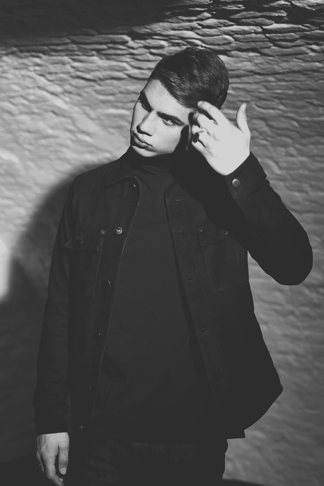

# 这就是为什么你不是天才，以及成为天才的 12 个步骤

> 原文：<https://medium.com/swlh/heres-why-you-re-not-a-genius-and-the-12-steps-to-become-one-d7f87ab8ee4b>

Image by [Frank Uyt den Bogaard](https://unsplash.com/@saintape?utm_source=medium&utm_medium=referral) on [Unsplash](https://unsplash.com?utm_source=medium&utm_medium=referral)

> “因为天才是意识的特征，所以天才也是普遍的。因此，从理论上讲，每个人都可以得到普遍的东西。它只等待合适的环境来表达它。”医学博士大卫·霍金斯爵士

你想知道是什么把你和那些突破的胜利者区分开来。

你想知道是什么让爱因斯坦和莫扎特与众不同，他们是如何创造出如此天才的作品的。

为什么你的同行发表了一篇新颖的文章，而你没有。

不同之处在于他们发挥创造性肌肉的能力，找到他们有信心产生足够多的创造性声音的能力，从而*然后*不时地挖掘天才。

发掘天才是优秀和伟大的区别。

这就是在你的领域中取得别人没有的突破的不同之处。

但它也很微妙——无论如何都不戏剧化。它找到你，你找不到它。

天才发现了查尔斯·达尔文，因为他追随自己的深深的爱好和无尽的好奇，这创造了耐心、精神空间、活动和专注，使他的进化论从他身上出来。他的表弟弗朗西斯被认为比他聪明得多，智商也比他高得多，但他没有。为什么这样

为什么不是你？

也许你不相信自己，相信。

也许你不相信自己足够“聪明”，但你确实足够“聪明”。

每个人都有天赋，发掘它是他们的责任。

*天才仅仅是你的精神状态、意识水平和创造性产出能力的结果。这是输出的深度，以及它来自哪里，使它成为天才与否。你的工作就是培养这种能力，让天才尽可能多地找到你。*

天才之路和最大化你的潜能的 T4 是相邻的，因为错误的信仰体系和原则，往往会让你迷失很长一段路。

它从你开始，你如何做你所做的，你将成为谁，以及为什么。

从你晚上睡觉的方式到你早上系鞋带的方式，每件事都需要追求卓越。它总是在线上。总是比赛日。

诺曼·施华蔻将军说过“擦亮的鞋子拯救生命”。

它始于一个决定。一个决定，知道你有天赋，需要把它发挥出来。

你越在乎什么时候不重要，就越不需要在乎什么时候重要。事实上，你想变得如此优秀，以至于比赛日只是另一个展示表演的机会。

真正的天才就是这样练习的。

世界上最好的冠军不会自我吹嘘。他们仍然像水一样流动，准备像回声一样回应。

当达到那种持续的能量和静止的状态时，天才就会被挖掘出来，而火热的头脑会以极快的速度产生产出。

然后在某个时刻，一股力量接管了你，带走了你无法描述的特殊的东西。在这一点上，你已经达到了你的身体、思想和手艺之间的合一状态。

你变成了工艺。

你的新目标需要达到这种状态，并全身心地投入其中。

记住，重要的不是你做什么，而是你如何去做。

那你是怎么做的呢？

如果你目前没有处于创造性产出的状态，没有发挥你的天赋，你很可能:

*   不要把时间花在个人和心理发展上。
*   花太多时间试图获得新的东西(“如果我努力存钱，3 个月后我就能拥有它，我会更开心”)。
*   不要把学习作为你生活中最重要的部分，而不仅仅是一个部分(“我有时间就看书，因为我一直在工作。”).
*   不要冥想、祈祷或锻炼。
*   不要刻意节食。

天才和你有多“聪明”或者你已经知道的东西完全没有关系。你的情商或者智商，或者你到现在为止取得的成绩。

事实是，每个人都有精神上的优势和劣势，以及不同的大脑。我们都是独一无二的。

因此，如果你像我一样智商很低，这只能意味着你[不会用左脑处理和应用语言和符号，](http://www.funderstanding.com/brain/left-brain-learning/)你可能不会像在数学或工业时代那样擅长“教”的学习方式。我爸爸是数学家，而我数学很差。

你可能像我一样是一个[视觉学习者和右脑主导者](https://www.webdesignerdepot.com/2009/11/understanding-your-brain-for-better-design-left-vs-right/)。

我在学校表现很差，通常要花很长时间才能学到新东西。当我深潜时，我肯定做得更好，做很多一点点，不像我的左脑联合创始人那样，他能做很多一点点。

也许你是右脑导向型的，因此能够以不同的方式掌握你所学的知识，并利用这些知识更好地将现实世界中的想法可视化。

一个并不比另一个更有价值——重要的是你如何利用你所拥有的。

有了正确的原则，有创造力的左脑思考者也许能够从青春期开始，通过学校进入哈佛商学院和企业界。他们能够挖掘自己的天赋，分析业务，运行出色的电子表格，以及你期望从哈佛 MBA 获得的所有其他技能。还有一些同样智商和技能的人没有最大限度地发挥他们的潜力，没有挖掘他们的天赋。

有了正确的原则，聪明的右脑人可以从青春期一直上学，成为专业作家、艺术家或组建非常成功的乐队。还有许多其他有同样技能和天赋的右脑思考者，他们最终没有成为专业艺术家，更没有形成成功的音乐团体。但是[“成功”与天生的天赋](https://qz.com/707205/successful-people-dont-have-natural-talent-they-have-something-thats-much-more-important/)无关，而是与成功的[原则](/@ARTaghavi/7-steps-to-bring-out-the-absolute-best-in-yourself-b0e14c303af4)有关，每个人都可以获得这些原则，但许多人没有实施。

鉴于左脑技能有更多的工作机会，右脑阵营中碰巧有更多被浪费的潜力——尽管这可能不是一份理想的工作，其中那个人正在利用他们的创新精神和产出，并感觉他们正在最大限度地发挥他们的潜力。

在这篇文章中，你会发现突破到天才水平的工作与智商或智力无关，而与你的生活方式和驱动你的动力有关。

人类最可悲的损失是当人们没有[最大限度地发挥他们的潜力](/traena/how-to-reach-the-state-of-mind-required-to-achieve-absolutely-anything-bd562e9dc4be)并挖掘他们的天赋——这是免费的，会带来满足感、幸福、创造性突破、精神能量甚至爱。

对天才的追求让生活变得有价值，唯一阻止你发掘天才的是你自己。

# 这里有 12 个步骤来发现你内在的天才

…………………………………………………………………………………

# 1.首先要认识到天才来自过程

> "影响的头号预测指标是生产率."——天才学者、加州大学洛杉矶分校心理学教授基思·西蒙顿博士

每天有意识的练习是达到天才水平的最重要的部分。

如果你每天都坚持不懈，你将会发现天才并掌握一门手艺，它最终会成为你。

发明智商的先驱心理学家开始研究是什么造就了天才，他们跟踪了 1500 名智商在 140 以上的人和另一组平均智商的人。

他发现智力并不能保证成就。这项研究中的许多高智商参与者都很努力，甚至因不及格而被大学退学，而高智商群体之外的其他人则在各自的领域中成名——包括路易斯·阿尔瓦雷斯和威廉姆·肖克利，他们获得了诺贝尔物理学奖。

# 2.理解天才的最终目标是生活在一个稳定的状态中，让你不再工作

> "我被一种我只能感激的力量牵引着。"—钢琴家凯斯·贾瑞特。

Jarrett 特别记得在慕尼黑的一场音乐会，他觉得自己仿佛消失在了键盘的高音中。他的创造性艺术，是通过几十年的聆听、学习和练习旋律培养出来的，在他最不可控的时候显现出来。

“这是一个广阔的空间，我相信这里会有音乐”，他说。

我现在每天都要写作。幸运的是，写作只需要一台笔记本电脑，所以我可以在任何地方写作。我在哥伦比亚度过了 4 天的单身周末，每天都在写作。

天才来自于处于[深流](https://en.wikipedia.org/wiki/Flow_(psychology))的状态。你的工作是创造那种状态和环境，让它发生在你身上。

举个例子，Jarrett 不仅是他领域的大师，他还在人群面前表演，这使得他的表演更加引人入胜。成为很多人的焦点本身就有能力激发你的天赋，所以[尽可能多地把自己放在你需要做到最好的场合。](/the-mission/6-behaviors-to-become-the-person-you-need-to-become-to-achieve-every-goal-56dbadf2b53b)

# 3.天才是指突破性的想法和看到别人看不到的东西

> "每一项伟大的事业都是建立在一个对外隐藏的秘密之上的."彼得·泰尔

当你不断想出好主意，并且能够熟练地将这些想法应用到你的工艺中时，你就处于天才状态。创意是开始，创作出精湛的作品才是天才。

在天才的状态下，你会想出如此多的好主意，以至于你不得不努力工作，优先考虑哪些主意要做，为什么要做。这可以是律师、艺术家、开发商、设计师、中层经理、初创企业创始人或自由职业者。所有的工作都有好有坏，只有实践天才原则的人才是最好的，不管他们做什么。

“医学院里有一些不是好医生的坏学生”——蒂姆·费里斯

当你在阅读一本书，并因为新的见解或表达任何想法的新方式而受到启发写博客时，你的创造力正在给全新的作品带来生命。

如果你发现自己有了一个突破性的联系，别人从来没有过，并且在经过长时间的努力思考后，你会一跃而起，这是一个天才的时刻。

如果它在领域里站得住脚，那就是天才的突破。天才不需要被大众歌颂。

大多数天才都不为人知。

当我以一种我知道没有人写过的方式写一篇关于某个主题的文章时，我发掘了我的天才。例如，我记得[写了这篇关于文化、人才的文章](/the-mission/the-culture-of-a-high-performing-organization-and-how-to-hire-for-it-8062dc6ede59),并将你的员工的‘为什么必须是奇迹’与高绩效的企业文化联系起来。我记得在思考了很久之后，我把这些点连接起来。

当我看着作品中的“文化地图”,看到最高阶段是“天真的惊叹”——这让我大吃一惊！对于一个高绩效的组织来说，你的员工一定会感到奇怪。嘣，那是一个创造性的突破，也是我那天的天才时刻。

我们可能会争论我正在解决的问题有多难，或者将“为什么”和“想知道”与高绩效工作文化联系起来是否是天才之举，但事实是，我以这种方式联系了以前从未有人联系过的两件事，并且我为该领域添加了一些新的东西，这对我们的意图和目的来说，是一个天才时刻。

会持久吗？我不知道。但我知道我会继续走下去。

从小处着手，在第 100 次尝试后，你会想出一些能激发你的天赋并让世界震惊的东西。

# 4.天才是你练习的方式，是习惯性的

> [所有学科都有主题上的相互联系，](https://www.sonshi.com/josh-waitzkin-interview.html)如果我们善于感知和处理这些联系，学习过程会变得非常令人兴奋。关键的第一步是与你的直觉建立工作关系，这样你的学习过程就会被你独特的细微的创造性飞跃所引导。我们的思想都是不同的，我相信培养敏锐的内省敏感性对于发现我们的潜力是绝对必要的。—乔希·怀茨金

乔希·怀茨金是天才的定义，他是国际象棋神童和世界武术冠军*。停下来想一想。他会下象棋和武术，并在这两项比赛中都获得了全球冠军！*

乔希为自己过着“深度而非广度”的简单宁静的生活而自豪。他生活在冥想中。做呼吸练习，锻炼和管理他的输入和输出，就好像他的生命依赖于此。

他早上直到绝对时间才会查看邮件。他以一个创造性的日志爆发开始他的一天，这是他前一天晚上启动潜意识的结果。

他现在训练对冲基金经理在高风险的情况下，用数十亿美元来挖掘他们的天赋。

你要么让自己活在天才的状态中，要么就不要。天才的状态始于你的正念、意识、深度和注意力..

如果你不在一个能直觉到你的大脑和身体的高度状态，你怎么能挖掘你的天才呢？

正如 Waitzkin 所说，最深刻的思考者培养他们的生理内省敏感性。他们斋戒，激发他们的潜意识，让洞察力发生，最后，给天才创造空间。

当你不“兴奋”或“状态”时，你在休息，并发酵你的想法。这是你的过程中最重要的部分——让想法慢慢酝酿并找到对方。

一切都是主动的，你的每一秒钟都岌岌可危。

你的时间有多慢？

在场必须像呼吸一样直观，每一秒钟都应该被认为是处于危险之中——积极主动。

每天是快节奏还是慢节奏？

你想为那些让你的一天[变得深沉而缓慢](/experiential/the-best-time-spent-is-time-spent-slowly-how-to-use-time-slowly-every-day-bcd2dde8fc62)的最重要的事情创建一个必不可少的唯一例行程序。

# 5.创建一个早晨惯例，确保你每天都在最高状态下挖掘你的创造力

> 我已经越来越多地通过忘却的镜头来看待学习的过程。我正努力在成长过程中变得越来越自由，这往往是一个从复杂到简单的运动。— [乔希·威茨金](https://www.sonshi.com/josh-waitzkin-interview.html)

你希望早上的例行公事能优化你一整天的生活，还包括一次创造性爆发，无论是写日记还是列出想法——任何能发挥你创造力的事情。或者可能是你每天早上的手艺本身——甚至是阅读。我喜欢阅读，因为它让我进入深度状态。做一些让你进入心流的事情。

每个人早上都是精力最充沛的时候，这也是发掘你天赋的最佳时机。做所有你能做的事情来优化你的早晨，这样你就能处于一种深度的最佳状态，去有意识地学习，安静地创造，深入地思考。

专注于尽可能多地移除以创造空间——这是我们这个时代的挑战。

以下是其他一些基本习惯，如果在早上做，会让你一整天都有更好的状态

*   晨间冥想
*   剧烈运动
*   音乐和舞蹈

# 6.让你的潜意识为洞察力和突破做好准备——相信你自己！

> “一个人应该学会发现和观察来自内心的光芒，而不是吟游诗人和圣贤的苍穹的光芒，然而他却不加注意地抛弃他的思想，因为那是他的。在每一件天才的作品中，我们都认识到自己被拒绝的想法，它们带着某种疏离的威严回到我们身边。”——拉尔夫·瓦尔多·爱默生

你最大的突破发生在没有尝试的情况下，然而你的工作是启动你的潜意识，给自己空间去接受洞察力。

如果你想解决一个问题，简单地在前一天晚上想象一下。或许读一些关于这个话题的主要材料，让它成为你睡觉前想的最后一件事。

但是等一下，这很重要。别指望了。给它进来的空间。这可能需要几天或几个月，但要耐心等待。

这是乔希·威茨金(Josh Waitzkin)的惯例，也是他向高风险对冲基金客户推荐的内容。深入，给自己空间，让它来找你。

最重要的是，相信自己！你有天赋，相信你的直觉是你的工作。

# 7.在你早上例行公事之后或期间，立即练习你的手艺

本杰明·p·哈迪是我所知道的最善于在早上发掘自己天赋的人。他早上起床，开车离开他的家庭环境开始写日记，进行高强度的锻炼，然后做他最重要的工作:写作。

Benjamin 现在因为是 Medium 的#1 作家而出名，他接受过采访，采访内容是关于他做了什么，他是如何写出这么多伟大的材料的，事实上很简单。

本杰明比任何人都做得更好，并且最擅长去除其他不重要的东西。他所有的努力都是为了优化他的状态，这产生了超深思熟虑的学习，这产生了他精湛的写作。就这么简单。

他也是我见过的最能快速接受内容的人。他建立了神经通路以更快的速度吸收有声读物。想一天看一本书？习惯于以两倍的速度激烈地阅读有声读物，并观察你的世界的变化。

就目标实现而言，他是世界上[最好的作家](https://journal.thriveglobal.com/how-to-become-the-best-in-the-world-at-what-you-do-7d3e918780dd?inf_contact_key=0dcf02814015edd143afe23f756af8e9ab9cd88457345644e9917ccc080a335a)，这是因为他把那几件简单的事情做得很好，110%地投入，并且知道他为什么做他所做的事情。

# 8.创造外部的期限和条件来迫使深入的工作

> 截止日期让我们感觉我们真的在路上，我们会很快实现目标！”—约翰·帕特里克·希基

这是一个困难的问题，因为在前端需要意志力来创造这些力量功能，并需要纪律来维持它们。

无论最后期限或强制功能有多难，都要超越 10 倍，以确保完成任务！

你有多想要它？如果你这么想要，你会创造外部条件，绝对要求你[破釜沉舟，深入挖掘，得到你需要完成的事情，完成](https://www.youtube.com/watch?v=OHNfqdL9_1Y)。我现在正在重新设定目标，并在考虑以下策略和时间表:如果我错过了任何我想深深铭记的事情，比如周一午餐时锻炼或周五下午 5 点向我的教练报告我的指标，我会让其他负责人收取我 1000 美元。我要大胆公开宣布我的目标，并创造不确定的外部条件，以真正发挥出我的最佳水平。我将有一个负责任的教练，他每周五的第一件事就是决定我那周表现如何。

# 9.使用强制功能消除干扰

在当今移动设备和社交媒体分散注意力的世界中，你绝对需要学会使用原力函数。我怎么强调都不为过。

深度是挖掘你的天赋的游戏名称，这要求你在深度聚焦时完成输出。如果你不能达到深度聚焦，你就不会创作出有深度的作品，也不会有创造性洞察力的空间。

为了达到那种深度的专注，你想要被扫除，没有任何机会被分散或转移到另一个地方。你认为莫扎特练习的时候会停下来查看他的电话通知吗？如果你想发挥你的天赋，你必须像莫札特一样行动，不管你在做什么或你的手艺是什么，这就是 T2。

# 10.关注并强调休息和恢复

工艺大师的生活围绕着他们的精神状态，这通常意味着过着悠闲的生活。人们通常误以为天才来自军事训练，但这与事实相去甚远。是的，联系感和仪式感在天才的工作中发挥着作用，但它是最小的，只关注本质，允许深入的工作，有效性，以及适当的休息和恢复，让一个人的思想发酵。

转变你的心态，这样你就可以把休息、放松甚至休闲视为恢复和创造过程的一部分。不要对此感到内疚，因为我们中的许多人并不相信或觉得应该得到大量的休息和放松。你知道，你必须知道！

下午休息一下，做做按摩。

给自己留些自由活动的空间。

如果可以的话，在工作日去度假。

这些是天才创造者的[习惯](http://www.slate.com/articles/arts/culturebox/features/2013/daily_rituals/daily_rituals_life_hacking_tips_from_novelists_painters_and_filmmakers.html)。

# 11.在禁食状态下工作

> “每个人都可以表演魔术，每个人都可以达到他的目标，如果他能够思考，如果他能够等待，如果他能够斋戒。”—赫尔曼·黑塞

这也许是你所能拥有的最大优势，人们并不谈论它。我已经间歇性禁食仅 8 周，并发现自己处于神奇的轻松状态，让我的思想轻松流动。每次吃东西，你的身体都会消耗大量的能量来消化。你的大脑可以用于脑力的能量。这就是为什么我们的大脑在发现火时变得如此之大的部分原因——我们可以更容易地消化食物，所以更多的能量流向大脑，而不是身体的其他部分。

现在已经证明，从食物中获得的能量比食物本身更好。无论是你自己的脂肪，如果你处于[生酮状态](https://www.webmd.com/diabetes/type-1-diabetes-guide/what-is-ketosis)，还是[酮状态](https://www.webmd.com/diabetes/type-1-diabetes-guide/what-is-ketosis)，当你有一段时间不吃东西，没有碳水化合物和蛋白质可以燃烧时，你就会开始产生天然的火箭燃料。

自从我开始间歇性禁食，我只想吃得少一些，并且确信一日三餐对我们不好。我们已经狩猎采集了几百万年，我们不能仅仅通过几百年甚至几千年更频繁的进食来扭转这种局面。当我们吃得更少时，我们的身体工作得更好，这种运动正成为常态。

# 12.做一项你一直被吸引的活动

> “天才的秘密是把孩子的精神带到老年，这意味着永远不要失去热情。”—阿尔多斯·赫胥黎

热情源于:“被上帝占有”。这就是为什么热情让人感觉很好，对你有好处

你一直有一种强烈的倾向，总能激发你的热情。也许是钢琴、艺术或写作。随着我的不断进步，这无疑是为我而写的。如果我根本不用赚钱，我会写作。这是一个信号，表明写作是我的使命，我现在正尽我最大的努力追随这一使命。

一、你痴迷于什么？

二。是什么让你夜不能寐？

三。你会为了什么而挨饿，却不记得挨饿的时候在做什么？

四。如果你能解决的话，你会为什么事业献出生命？这是一种活动，它带来了激发灵感的工作状态。

Art by Juan Jiminez

# 结论

天才是关于你的。

你的心态，你的生活方式，你的工作方式。

你想挖掘自己的潜能，让它发生在你身上吗？

挖掘你无尽的惊奇，拥抱冥想的生活。

将你对技艺的掌握与一种缓慢、深沉的状态结合起来。

当你一次又一次地把你的创造性的声音展现在这个世界上时，你的创造性的声音就会出现，总有一天你会达到一种你从未想到过的天才状态。

[点击接收我个人用来赢得一天的晨间例行电子表格和愿景板。多年来我一直在改进它，它改变了我的生活。每周日早上你还会收到我的最佳每周文章。](https://betreatedhowyouwanttobetreated.com/optin-main)

## 这篇文章发表在[的《创业](https://medium.com/swlh)，这是 Medium 最大的创业刊物，拥有+388，456 名读者。

## 在这里订阅接收[我们的头条新闻](http://growthsupply.com/the-startup-newsletter/)。

