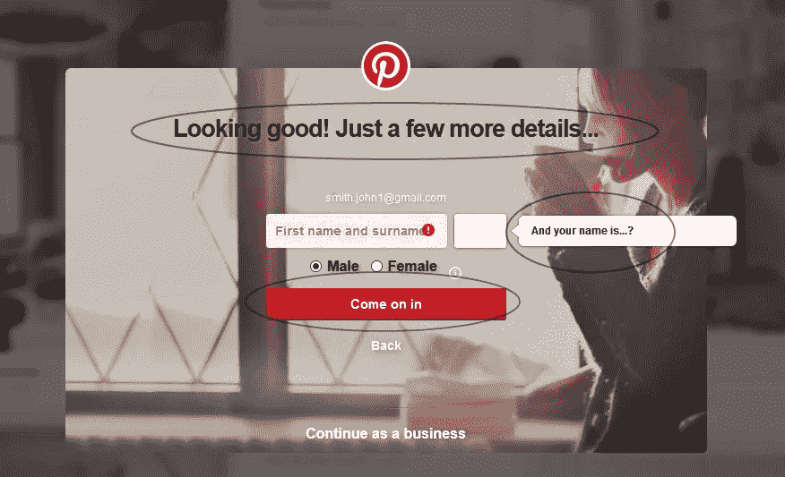
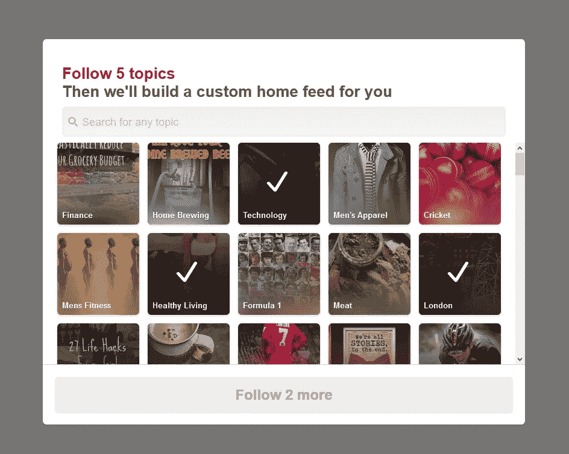
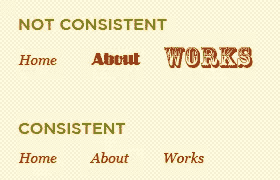
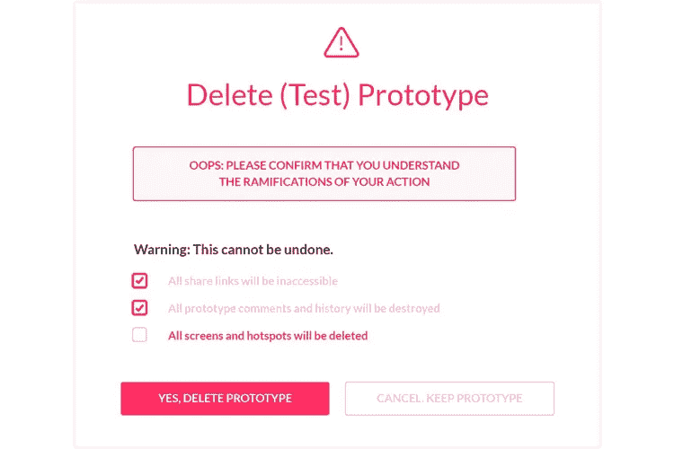
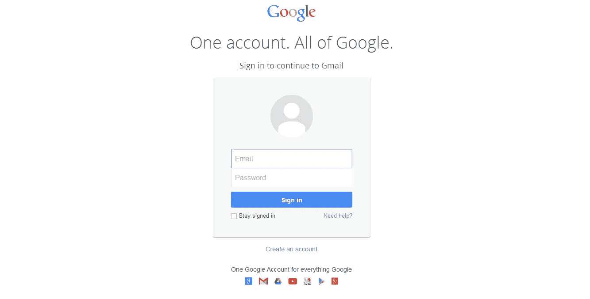
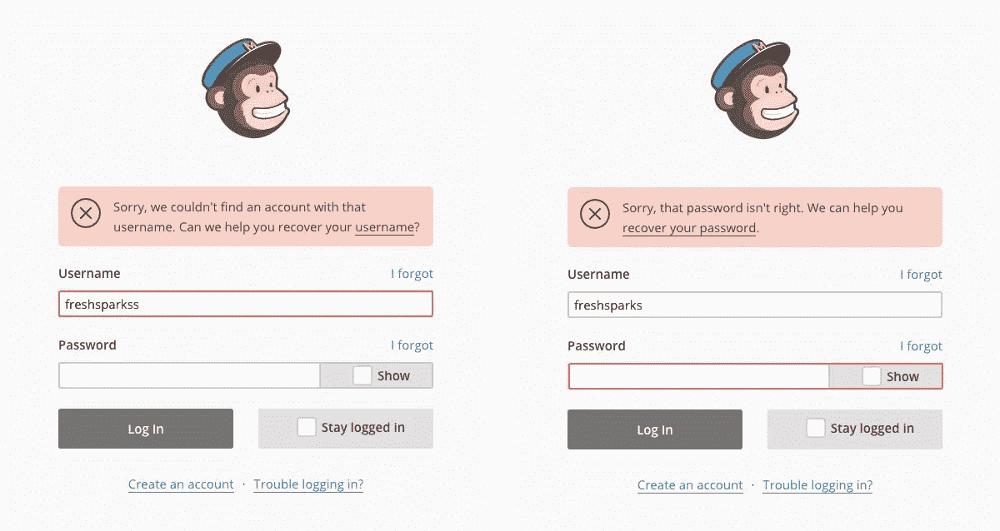
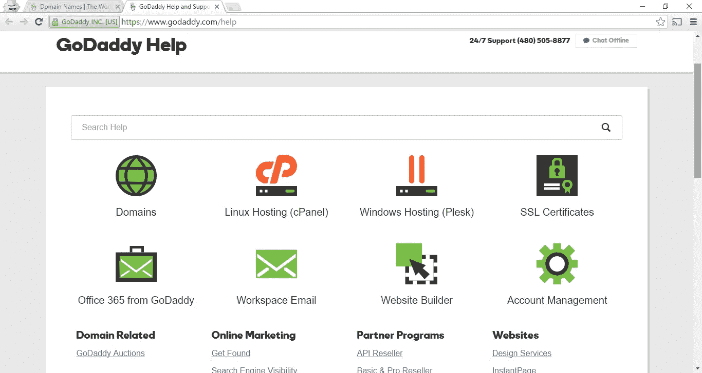

# 启发式评估:把你的产品放在显微镜下

> 原文：<https://medium.com/swlh/heuristic-evaluation-put-your-product-under-the-microscope-f602a79ec9ac>

启发式是一个 ***古希腊*** 词，意思是**【发现】****【发现】**。

启发式评估是计算机软件的可用性检查方法，有助于识别用户界面(UI)设计中的可用性问题。它特别包括评估者检查界面并判断其是否符合公认的可用性原则**(“启发式”)**。这些评估方法现在在新媒体领域被广泛教授和实践，在新媒体领域，ui 通常在很短的时间内根据预算设计，这可能会限制可用于提供其他类型的界面测试的资金量。

> “启发式评估包括让一小组评估者检查界面，并判断它是否符合公认的可用性原则(“启发式”)——雅各布·尼尔森

如果你是一个单独的 UX 设计师，你不能说服你的经理做用户测试，因为它耗费时间和金钱，启发式评估是解决方案。你可以发现可用性问题，并从中快速而廉价地学习，如果有可能将它与用户测试结合起来，它会给你带来最佳的结果。

# **什么时候使用启发式评估？**

*   在产品开发的所有阶段
*   在早期阶段
*   发布的产品
*   产品评论

# **10 Jacob Neil son 对用户界面设计的启发式评估**

Jakob Nielsen 的交互设计 10 大原则。它们被称为“启发式”，因为它们是宽泛的经验法则，而不是具体的可用性指南。

## **系统状态的可见性**

系统应该在合理的时间内，通过适当的反馈，始终让用户了解正在发生的事情。

## **系统与现实世界的匹配**

系统应该说用户的语言，使用用户熟悉的单词、短语和概念，而不是面向系统的术语。遵循现实世界的惯例，使信息以自然和逻辑的顺序出现。

Pinterest UX Report

## **用户控制和自由**

用户经常错误地选择系统功能，并且需要一个清晰标记的“紧急出口”来离开不想要的状态，而不必经过一个长时间的对话。支持撤销和重做。

Pinterest UX Report

## **一致性和标准**

用户不应该怀疑不同的词语、情境或动作是否意味着同一件事。遵循平台约定。

## **错误预防**

比好的错误消息更好的是仔细的设计，它从一开始就防止了问题的发生。要么消除容易出错的情况，要么检查它们，并在用户提交操作之前向他们提供确认选项。

Usability Geek

## **认可而不是回忆**

通过使对象、动作和选项可见来最小化用户的内存负载。用户不必从对话的一部分到另一部分记忆信息。该系统的使用说明应在适当的时候清晰可见或易于检索。

Google

## **使用的灵活性和效率**

新手用户看不到的加速器通常可以加速专家用户的交互，使得系统可以迎合没有经验和有经验的用户。允许用户定制频繁的操作。

## **唯美极简设计**

对话不应包含不相关或很少需要的信息。对话中每一个额外的信息单元都会与相关的信息单元竞争，从而降低它们的相对可见度。

Google

## **帮助用户识别、诊断并从错误中恢复**

错误信息应该用简单的语言表达(没有代码)，准确地指出问题，并建设性地提出解决方案。

Mailchimp

## **帮助和文档**

即使系统可以在没有文档的情况下使用会更好，但提供帮助和文档可能是必要的。任何这样的信息都应该易于搜索，集中于用户的任务，列出要执行的具体步骤，并且不要太大。

GoDaddy Website

# 参考

尼尔森试探法[https://dl.acm.org/citation.cfm?](https://dl.acm.org/citation.cfm?id=77486)

维基百科上的启发式[https://en.wikipedia.org/wiki/Heuristic](https://en.wikipedia.org/wiki/Heuristic)

## 这篇文章发表在 [The Startup](https://medium.com/swlh) 上，这是 Medium 最大的创业刊物，拥有 330，853+的读者。

## 在此订阅接收[我们的头条新闻](http://growthsupply.com/the-startup-newsletter/)。

