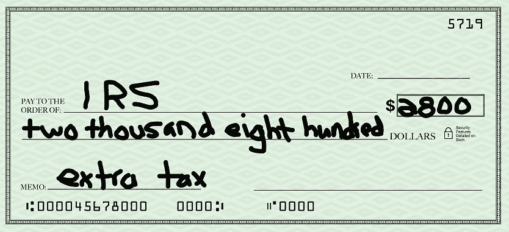

# 嘿 S 公司老板，撕碎你的奖金支票！

> 原文：<https://medium.com/swlh/hey-s-corp-owner-shred-your-bonus-check-ea33a6884477>

汤姆拿起他桌子上的 20，000 美元奖金支票，看了一遍，然后迅速地把它放进了碎纸机。

他很快给他的股东同事发了一条短信:“比尔，我希望你在兑现奖金支票之前收到这条信息。请立即撕碎它，然后和我说话。”

汤姆为什么要撕碎他的奖金？

汤姆和比尔拥有 S 公司 75/25 的股份。他们每人年薪 15 万美元，外加年终奖金。过去，奖金是作为工资发放的，因此它们可能是平等的。会计部门今年采取了同样的处理方式。

什么变了？

**新法**

去年，国会将最高公司税率从 35%降至 21%。这是一个 40%的巨大降幅。不幸的是，对小企业主来说，“公司税率”是针对 C 类公司的(想想沃尔玛、通用汽车和亚马逊)。

**大多数私有企业都不是 C 类公司**。它们是股份有限公司、合伙企业和独资企业。这些企业类型被称为“转手实体”，因为企业本身不像 C 公司那样缴纳所得税。相反，企业收入“通过”所有者的个人纳税申报表，并在那里纳税。

新法还降低了个人所得税，但降幅不到 40%。为了保持公平，国会决定向转手企业主提供税收减免。

扣除额相当于营业收入的 20%。例外比比皆是，但一般来说，如果你的 S 公司有 100，000 美元的应税收入，根据新的法律，你只需支付 80，000 美元的税款。

**军规**

这就是问题所在(也是汤姆撕毁支票的原因)。**20%的扣除仅适用于剩余的业务收入，不适用于工资或奖金**。实际上，这是对业主工资征收的一项新税。

继续以应税收入为 100，000 美元的 S 公司为例，假设 S 公司在支付任何所有者工资之前的总利润为 220，000 美元。老板给自己支付了 120，000 美元的工资，这使得剩余的业务收入下降到 100，000 美元。

业主按其工资收入的 100%纳税。20%的扣除额仅适用于未作为工资支付的剩余 100，000 美元的业务收入。

如果所有者给自己 10，000 美元的工资奖金，他的工资会上升到 130，000 美元，他的业务收入会下降到 90，000 美元。现在他将只获得 9 万美元的 20%的扣除，而不是 10 万美元。

通过支付奖金作为工资，他损失了 10，000 美元的 20%的扣除额——损失了 2，000 美元的扣除额。如果他的个人税率是 35%，他将欠 700 美元的额外税款(2000 美元损失扣除额的 35%)。这意味着 10，000 美元奖金的 7%将用于本来可以避免的税收！

**回到汤姆和比尔**

汤姆和比尔的公司在发放奖金前有 40 万美元的应税收入。他们的制造业务是 S 公司，他们有资格从该收入中扣除 80，000 美元(20% x 400，000 美元)。

如果他们每人获得 20，000 美元的奖金，该企业的应税收入将降至 360，000 美元(400，000 美元至 40，000 美元)。他们现在只有资格获得 72，000 美元(20% x 360，000 美元)的税收减免。

通过支付 40，000 美元的奖金，他们刚刚一起放弃了 8，000 美元(80，000 美元至 72，000 美元)的税收减免！

再次假设他们处于 35%的税收等级，根据新的法律，他们的奖金将花费他们 2800 美元(35% x 8000 美元)的额外税收。同样，7%(2800 美元/40000 美元)的奖金损失在额外的税收上。

7%是保持事情简单的一般经验法则。它假设你在 35%的税率范围内，并且有资格获得非工资业务收入的全部 20%的扣除。

很有可能你的税率不同，你可能没有资格获得全额 20%的扣除(法律充满了例外)。仅将 7%作为一个经验法则，而不是像医疗保险那样一成不变的税率。

如何避免这种额外的税收？

一个词:**分布**。

在 Tom 和 Bill 的情况下，正确的做法是首先最大化分配。75%的股东将获得 20，000 美元的非工资分配，25%的股东将获得 6，666 美元的比例分配。剩余的 13，334 美元(使 25%的股东获得 20，000 美元)仍将作为工资奖金支付。

通过这样做，他们将只需支付约 933 美元(13，334 美元的 7%)的额外所得税。与全额奖金的 2800 美元额外税收相比，仅仅通过*粉碎工资支票和最大化分配*，就节省了 1866 美元的税收！

为什么不完全跳过工资，让一切都分配呢？

这将使新税法(甚至旧税法)最大化，但美国国税局已要求 S 公司所有者必须支付自己“合理的补偿”。合理是一个主观的词，但通常工资必须与所有者的职位相符。

例如，如果所有者是首席执行官，他的工资必须基于该规模公司的首席执行官的收入。如果股东是销售经理、首席财务官、运营经理等，同样的概念也适用。

重点不是变得贪婪或逃税，而是在每个人都获得合理的工资后明智地行事。

美国公司所有者总是试图最小化工资和最大化分配，以避免社会保障和医疗保险税。随着新法律的出台，这一目标变得更加重要。

**注意事项和结论**

这篇文章使用了过于简化的插图和计算，并忽略了重要的考虑因素，如您是否有足够的“基础”来进行分配。在你真的粉碎支票之前，你的税务会计师应该得到一个快速的电话来讨论你的具体情况。

与此同时，不要忘记:合理的工资，然后是分配。

**作者注:感谢您今天的阅读。如果您有任何问题或意见，请随意写在下面的方框中。我会尽快回复。**

**如果你恰好是一家中型公司(10 到 100 名员工)的员工，并且想讨论一个一次性项目来让你的会计更上一层楼，请随时联系我，电话:******或通过**[**toptal.com**](https://www.toptal.com/finance/resume/scott-hoover#book-unmatched-finance-advisors)**。****

****

## **这篇文章发表在 [The Startup](https://medium.com/swlh) 上，这是 Medium 最大的创业刊物，拥有+400，714 名读者。**

## **在这里订阅接收[我们的头条新闻](http://growthsupply.com/the-startup-newsletter/)。**

****