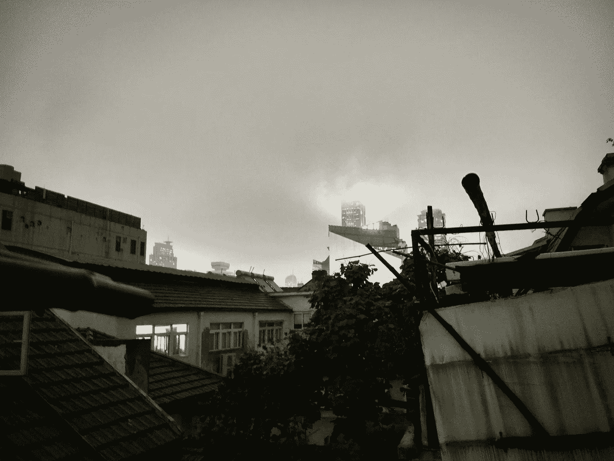

# 嗨，我是一个机器人，我将夺走你在旅游业的工作

> 原文：<https://medium.com/swlh/hi-i-am-a-bot-and-i-will-take-away-your-job-in-the-travel-industry-485fb6b492d5>

## **未来几年人工智能(AI)将影响旅游业的三种方式**

我和我的[总裁](http://vtrmk.com/)现在正在亚洲进行为期四个月的旅行。我们经常讨论，如果我们在五年前旅行，我们的旅行会非常不同。优步、Airbnb 和其他旅行工具的便利和效率让体验变得更好、更容易、更实惠。我相信，由于聊天机器人和人工智能，它将发生更大的变化。

**1。搜索更加透明**

客户搜索航班、住宿和租车的方式将会改变。Facebook Messenger、Telegram 和微信上的主要聊天机器人(基本上是与你聊天的计算机程序)将很少会帮助你找到最好的交易。这样，客户将不必检查十个平台，但肯定会在一个地方得到最好的交易，节省时间和金钱。

> “你好，我在过去几个月里花了很多时间在 Agoda、Booking.com、Skyscanner 和携程上。”

预订和支付也将通过 messenger 和集成支付完成，因此客户将获得流畅的 Messenger 体验。

**2。更少的人工交互和更多的自助服务**

Flying over Langkawi in Malaysia with AirAsia in November 2016 [https://www.instagram.com/vtrmk/](https://www.instagram.com/vtrmk/)

聊天机器人将为消费者提供更多选择，以限制不必要的人际互动，并提供更多自助服务选项。

几周前，我们乘坐亚航航班时注意到，顾客不再需要去柜台办理行李托运。相反，他们可以在家里或通过机场的自助服务亭完成。这为客户和航空公司都节省了时间。这种方法将进一步扩展，允许客户通过聊天机器人托运行李。

像奥地利航空[和荷兰皇家航空](https://www.austrian.com/Info/AustrianServices/chatbot.aspx?sc_lang=en&cc=AT)[这样的大型航空公司已经很少有聊天机器人了。他们允许客户检查航班状态，办理登机手续，并与他们的即时客户支持人员交谈。这是一个开始，我相信它会进一步扩展。我尤其在大型航空公司的客户支持热线中看到了巨大的潜力，这是你永远无法触及的。](https://messenger.klm.com/)

“你好，这里是英国航空公司热线，学生时代我花了几个小时试图以每分钟 1 英镑的价格重新预订我的航班。”

**3。更多真实和定制的体验**

最后，我认为当你到达目的地时，你在当地的互动和体验将会发生巨大的变化。

在最近的一次采访中，Airbnb 的产品副总裁乔·扎德说，公司将聊天机器人视为一个巨大的机会；然而，技术不能取代人类与当地人的互动和体验。

> “你好，上海的一个奇怪的 Airbnb 房东，我希望我没有和他有任何人类互动。”

View from our Airbnb in Shanghai — an experience [https://www.instagram.com/vtrmk/](https://www.instagram.com/vtrmk/)

[乔·扎德](https://medium.com/u/ca7febaef42c?source=post_page-----485fb6b492d5--------------------------------)有一个观点，旅行就是关于当地的人类体验。去年 11 月，Airbnb 进行了一次巨大的更新，成为一个集住宿、体验和住宿于一体的中心。

我同意这种说法，并且真的很喜欢发现当地文化和隐藏的宝石；然而，如果聊天机器人能帮我节省一些时间找到符合我口味的地方并决定选择哪一个，我会非常感谢它们。

扎德还指出，在 Airbnb 的情况下，聊天机器人可以帮助实现不需要人类参与的部分的自动化，例如创建个人资料和查找价格(Airbnb 不久前推出了基于人工智能的智能定价)。

**关键结论**

接下来会有很多变化，旅游业必须开始尝试聊天机器人，主要是因为这是他们的客户目前所在的地方。

经过第一阶段的测试，真实的案例将开始出现。聊天机器人将通过减少低效率为旅游行业的公司带来价值，消费者也将从更真实、简单和方便的旅行体验中受益。

**我是**[**Vlad Lena**](/@vtaraskina)**，**[**Botmanufaktur**](https://botmanufaktur.com/)**创始人，我最想做的就是让你的企业更高效的使用 AI。感谢阅读！**

 [## 订阅我的媒体帖子

### 输入您的电子邮件以接收我的更新。

powered.by.rabbut.com](https://powered.by.rabbut.com/p/sk6p?c=1) 

## 最后一件事…

如果你喜欢这篇文章，请点击♥按钮，传播这个词:)