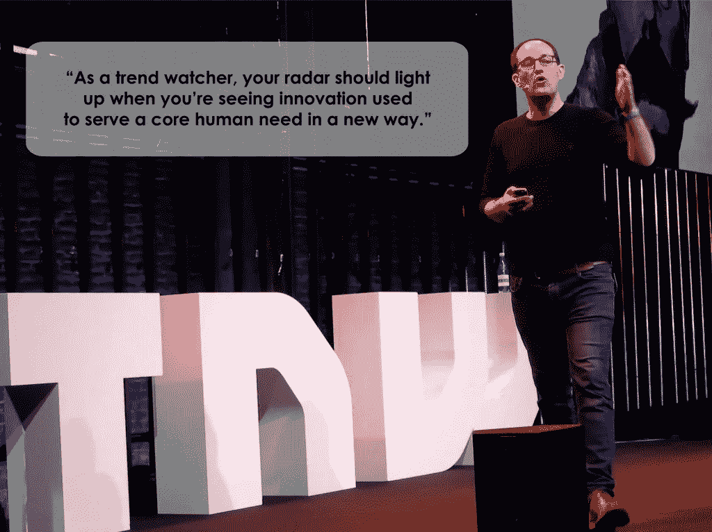

# 下一个网络及以后的亮点

> 原文：<https://medium.com/swlh/highlights-from-the-next-web-and-beyond-c710ddd6fecb>

© Jolien Evaert | Story Chief

在芬兰纵酒狂欢了两个晚上之后，Story Chief 的那帮人开始在 T2 参加下一个网络会议。

我们是上周 15，000 名与会者中的一员——包括实习生和所有人。

TNW 2018 接管了 [Westerpark 的文化综合体——Westergasfabriek——](https://www.iamsterdam.com/en/about-amsterdam/amsterdam-neighbourhoods/westerpark/westerpark)将该空间转变为“推动商业创新的技术代理生态系统”，更不用说现场乐队和快餐车了！

The Future Is Here

The Dome was hard to miss

Maurits Berger, Netherlands Ministry of Economic Affairs

Westerpark swarm

Transformatorhuis in session

Gashouder filled to the rafters

Nobody went hungry or thirsty

Regulations, Responsibilities, and Blockchains, oh my!

Part-Conference Part-Festival All-Good

故事主管

所有人都聚集在下一个网络的前提下****预测、讨论和发明未来****

*我们做到了。*

*以下是我们对 2018 年下一届网络大会主题演讲人的分析，以及他们的收获:*

## *1.[迈克·里格比，](https://twitter.com/MikeRigby)副总裁兼 [R/GA](https://www.rga.com/) 的执行创意总监*

**

*[《故事会》完全是关于数字故事的，](https://get.storychief.com/content-publisher)里格比是故事的忠实信徒。*

*此外，他相信“需要将品牌的故事与系统相匹配。”*

*至少可以说，他的主题演讲是鼓舞人心的，鼓励互联品牌“转变业务和移动文化，改变思想和挑战偏见，以大大小小的方式改善生活。”*

*我们都应该努力大声自豪地说我们热爱我们的工作。*

## *2.[大卫·马丁，](https://twitter.com/DMattin)[趋势观察](http://trendwatching.com/)的全球趋势与洞察力主管*

**

*“Serve a core human need in a new way.”*

*Mattin 引起了所有人的注意，因为他强调需要倾听客户的需求**(感同身受)**，以便能够向前发展。*

## *马丁说创新源于:*

1.  *变革(世界创新)*
2.  *基本需求*
3.  *创新本身*
4.  *新兴的期望*

> *“伟大的创新和设计始于人类的核心需求和愿望。当你遇到某种新的创新时，你需要问自己的最大问题是:“这种创新如何以新的方式满足人类的基本需求？””—大卫·马丁*

*太棒了。回到最基本的。*

## *3. [Tricia Wang，](https://twitter.com/triciawang)全球科技人种学家，[突发罗盘](http://Sudden Compass)和[喜鹊王国](https://www.magpiekingdom.com/)的联合创始人。*

**

*Tricia Wang of Sudden Compass | © Story Chief*

*当王说我们需要找回自己的灵魂时，她是在开玩笑，但并不是真的在开玩笑*

1.  *大数据让我们离客户越来越远。我们一直期待它成为帮助我们了解客户的神奇解决方案。*
2.  *这就是我们需要大量数据的原因，这样我们才能了解客户。(厚数据:捕捉人类情感和故事的珍贵数据。)*
3.  *我们如何以最佳的数学方式将人类模型扩展成可靠且有意义的数据模型？*

> *“不要看你的仪表盘。离开大楼。与您的客户交流。”—崔茜卡·王*

*👏🏻 👏🏻 👏🏻*

*为后面的人大声说！*

## *4.[苏珊·林德纳，](https://twitter.com/susanlindnerEM)[新兴媒体](http://Founder and CEO)的创始人兼首席执行官*

*作为一名文化人类学家，苏珊·林德纳知道一个好故事，因为她本身就是一个天生的讲故事者。*

## *"对于泰国的妓女来说，避孕套是一项很酷的颠覆性技术."*

*她应该知道，因为她在 90 年代末在泰国妓院呆了几年，致力于减少艾滋病病毒的传播，促进性工作者的职业培训和教育。用她自己的话说，她帮助这些妇女“重新过上自己的生活，掌握自己的命运。*

*这个特别的故事很有震撼力，但也有寓意。*

## *“不能做伪君子。”*

*每个故事中的真实性驱动着里面发生的事情与外面发生的事情相匹配。员工的声音(例如通过员工的博客)是你实现目标的途径。*

*苏珊·林德纳发表完她的主题演讲后，我有幸采访了她。*

*我简单地问她:“创业公司找到那个声音是更容易还是更难？”*

*她回答说:“对故事主管和其他初创公司/扩大规模的公司来说，这是个好消息。现在开始是寻找你的品牌声音的最佳时机！”*

## *5.[大卫·戈德堡，](https://twitter.com/davidjgoldberg)创始人誓言[的联合创始人兼首席执行官](https://founderspledge.com/)*

*与从[芝华士风险投资](https://www.chivas.com/en/the-venture)获得资金的[“5 位获奖企业家”](https://thenextweb.com/entrepreneur/2018/05/25/how-to-build-a-brand/)类似，戈德堡相信给予。*

> *“为什么我们只有一个埃隆·马斯克？”—大卫·戈德堡*

*根据戈德堡的说法， **CSR(企业社会责任)很好，但是它并不是全部，从长远来看甚至可能是有害的。***

*最终，直接捐赠给慈善机构是“做好事”最聪明的方式。*

## *那么，你如何向最好的慈善机构捐款呢？*

*戈德堡强调在选择慈善机构时遵循数据的重要性，“而不是遵循轶事、故事和感觉。”*

*他的推荐？*

*GiveDirectly(直接给生活极端贫困的人寄钱)。*

## *在下一届 Web 2018 上征服高塔*

*最后但并非最不重要的一点是，80 家顶级创业公司在全明星评审团面前进行了面对面的角逐，其中包括[宾迪·卡里亚、](mailto:https://twitter.com/@bindik) [克雷格·卡农](https://twitter.com/CraigCannon)、[露丝安娜·利桑德鲁](https://twitter.com/lucianalix)和[贝迪·杨](https://twitter.com/bedy)。*

*在哪里？*

*[TNW 投球塔](https://thenextweb.com/conference/startup-pitch-program):一座定制的(三层)角斗士风格的投球塔。*

**

*The Tower is all it’s 3-story glory*

**

*All-smiles pre-pitch*

**

*Ekaterina Kazakova of Blendr.io*

**

*Valeri Potchekailov of StoryChief..io*

**

*Evelien de Vries of Flickfeeder*

**

*Much thanks to The Next Web!*

*故事主管*

*Story Chief 有幸在 **Marketing2020** vertical、的决赛中，与其他 7 家令人印象深刻的初创公司一起，向初创公司发起挑战。*

*我们自己的首席执行官和 Story Chief 的联合创始人 Valeri Potchekailov 击败了它。*

*我们的提议？*

> *“Story Chief 是一款易于使用的内容营销工具，让您只需点击一下，即可多渠道推送您的文章。
> 😱你还可以使用 Story Chief 进行内容规划、在线协作以及雇佣能够为你撰写内容的自由职业者。此外，如果你没有博客或思想领袖网站，Story Chief 会为你创建一个，不需要任何技术设置。”*

*真实的故事。*

*未来在内容营销！*

*为什么不安排一次演示呢？*

*我们很想有机会向你展示我们自己。*

**

## *这篇文章发表在《初创企业》杂志上，这是 Medium 最大的创业刊物，有 329，974 人关注。*

## *订阅接收[我们的头条](http://growthsupply.com/the-startup-newsletter/)。*

**