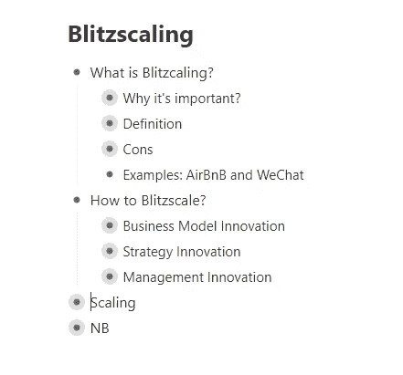
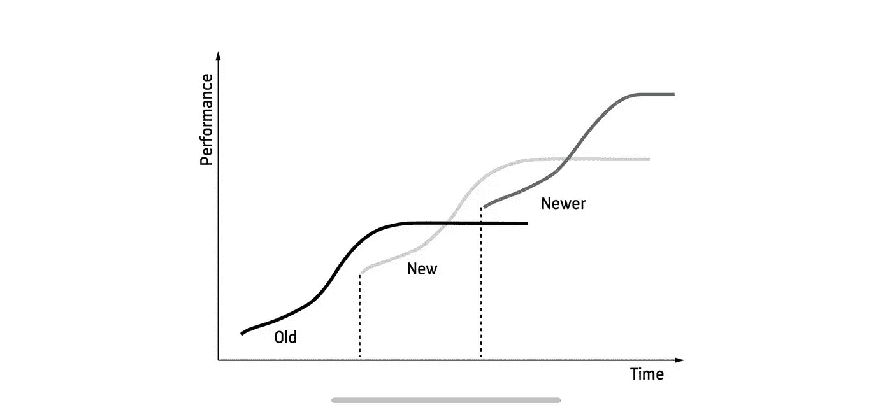

# 雷德·霍夫曼闪电战集锦

> 原文：<https://medium.com/swlh/highlights-on-blitzscaling-book-by-reid-hoffman-3d41b2793f3d>

Slide from [Book Trailer](https://www.slideshare.net/reidhoffman/blitzscaling-book-trailer-118631898/15-Because_starting_a_company_is)

> “你们都知道，一等奖是一辆卡迪拉克。有人想看二等奖吗？二等奖是一套牛排刀。
> 三等奖是你被解雇了。明白了吗？”格伦加里·格伦·罗斯

我最喜欢的播客之一[音阶大师](https://mastersofscale.com/)的作者，最近出版了一本基于此的[书](https://blitzscaling.com)。他是 LinkedIn 的联合创始人，也是他以 264 亿美元的价格将 LinkedIn 卖给了微软。这本书得到了比尔·盖茨、埃里克·施密特和布莱恩·切斯基的好评。

上周末开始看，很神奇。用这些简单的词，你就能得到帮助你快速扩展谷歌、AirBnB、FB 和腾讯以及更多类似事物的秘方！除了*模式*，还有大量世界知名公司的*真实成长故事*。

作为一名开发人员，我喜欢在阅读时组织书籍，以便能够在几秒钟内获得所需的信息。下面是这本书的思维导图和一些我最喜欢的引用和注释。

Mind map on Blitzscaling book

> 这本书的使命是:分享让硅谷如此强大的秘密武器。

# 为什么它很重要？

> 行动的窗口可以很小，也可以很快关闭。甚至几个月的犹豫也可能意味着领先和追赶的区别(作者)
> 
> 有一个由服务提供商和外包公司组成的丰富生态系统来支持快速增长。许多公司都经历过自己的高速增长，所以有很多例子可以借鉴。用户反馈来自持续不断的数据流。产品周期已经从每年减少到每周或每天。而好的评论可以在网上瞬间传播，所以一个强有力的产品可以迅速吸引大量观众。
> **比尔·盖茨**

B 李兹标度——面对**的不确定性**，优先考虑**速度**而非**效率**。如果你很早就得到反馈，而你的竞争对手没有。那么你就走上了成功之路。

> 颠覆本身没有好坏之分，但它总是包含着变化

Series of S-curve of growth

> 像谷歌和脸书这样的公司所经历的典型序列是，在建立产品/市场契合度的同时，开始典型的初创增长，然后转变为闪电式扩张，以在竞争对手面前实现临界质量和/或市场主导地位，然后随着业务的成熟，放松到快速扩张，最后当公司成为公认的行业领导者时，转变为典型的规模扩张。
> 
> ……脸书一开始是一个经典的闪电战故事。在成立的最初几年，收入的年增长率分别为 2，150%，433%和 219%，2007 年的收入从零增长到 1.53 亿美元。

现在比较一下你获得收入或用户数的最乐观的情景，并计划一下你什么时候可以获得这些类型的数字。让我们公平地对待自己——我们永远也不会得到 FB 数字。但是想一想这中间是什么深渊。

这也让我想起著名的彼得·泰尔的名言:

> 如果你有一个如何到达某个地方的 10 年计划，你应该问:为什么你不能在 6 个月内完成这个计划？

# 如何 Blitzscale？

## 1.商业模式创新

> 在谷歌，拉里·佩奇(Larry Page)和谢尔盖·布林(Sergey Brin)构建了伟大的搜索算法，但推动他们取得巨大成功的是他们对搜索引擎商业模式的创新——具体来说，就是在显示广告时考虑相关性和性能，而不是简单地将空间租给出价最高的人。
> 
> 理想情况下，你在创办公司之前就设计好你的商业模式创新。
> 
> 技术创新是保持商业模式创新收益的关键因素。

作为一名技术人员，我总是希望技术能掩盖糟糕的商业模式和销售。它不起作用。关于网景的另一个例子:

> 网景公司的 Netscape Navigator 使网络浏览成为主流，它的首次公开募股开启了网络热潮，它被迫将自己卖给了美国在线。网景公司的工程师发明了 JavaScript、SSL 和各种至今仍在使用的互联网酷技术，但网景公司接受了现状，开始使用可靠的商业模式，而不是开发通过自己的技术创新实现的新模式。在第一次“浏览器大战”中，微软在所有新的 Windows 电脑上预装了它的 Internet Explorer，然后赠送了它的 Web 服务器软件 Internet Information Server (IIS)，这实际上摧毁了网景的商业模式。

## 生长因子

1.  市场尺寸
2.  分配
3.  高毛利率

> 设计一个高毛利的商业模式会让你成功的机会更大，成功的回报更高。
> 
> 通常，你只关注你的成本，以及购买的预期收益。这意味着销售低利润产品并不一定比高利润产品更容易。如果可能的话，公司应该设计一个高毛利的商业模式。
> 
> 我们在本书中关注的大多数有价值的公司的毛利率都超过了 60%、70 %,甚至 80%。

对此我深表赞同。你有越多的钱，你可能花费越多的燃料和时间，直到你把火扑灭。有时候，一个好的建议应该简单明了。我想起了马克·安德森的一句名言:**提高价格**

4.网络效应

> 当任何用户的使用增加了产品或服务对其他用户的价值时，产品或服务就会受到积极的网络效应的影响。
> 
> 现在有超过 20 亿人携带智能手机，让他们时刻与全球万物网络保持联系。在任何时候，那些人都可以找到世界上几乎任何信息(谷歌)，购买世界上几乎任何产品(亚马逊/阿里巴巴)，或者与世界上几乎任何其他人类交流(脸书/WhatsApp/insta gram/微信)。

## 增长限制因素

> “产品/市场匹配意味着在一个好的市场中拥有一种能满足该市场需求的产品。”马克·阿德里森

缺乏产品/市场契合度

> 通常，在你承诺建立一家公司之前，你无法完全确认产品/市场的适合性。但是你应该试试。企业家可以也应该做他们的研究，并尝试设计他们的商业模式，以尽可能快地最大化他们实现产品/市场匹配的机会。

操作可扩展性的人为限制

> 领导一个只有四名成员的小型创始团队，你必须担心你与其他三位联合创始人的直接关系，以及他们彼此之间的直接关系。这意味着您需要管理六对个体之间的关系([4*3] / 2)。在您雇佣了两个员工之后，对于一个总规模为六人的团队，您需要管理十五对员工之间的关系([6*5] / 2)。你增加了 50%的团队规模，但是你需要管理的关系数量增加了 150%。
> 
> 一种方法是设计一种需要尽可能少的人力的商业模式。一些软件公司采用的商业模式允许他们用最少的员工获得巨大的成功。WhatsApp 有免费增值的商业模式；这项服务一年免费，之后每年收费 1 美元。这种低摩擦模式基本上消除了对销售、营销和客户服务等职能部门人员的需求，直到被脸书收购，每名员工拥有超过一千万活跃用户的比率！
> 
> 另一种方法是想办法将工作外包给承包商或供应商。“用手做每件事，直到它太痛苦，然后自动化它”布赖恩切斯基

基础设施对运营可扩展性的限制

friendster——40 秒加载配置文件。Twitter 的失败鲸鱼。特斯拉的生产率。当 Nest 被谷歌以 3B 美元收购时，它有 130 名员工，主要是因为它将所有的制造业务外包给了中国。

## 成熟的模式

1.  比特而不是原子

> 基于比特的业务往往是高毛利的业务，因为它们的可变成本较少。Bits 还使围绕增长限制因素的设计变得更加容易。你可以在软件产品(许多互联网公司每天发布新软件)上比在实体产品上迭代得更快，从而更快更便宜地实现产品/市场的契合。

2.平台

> 如果一个平台达到规模，并成为其行业的事实标准，兼容性和标准的网络效应(结合快速迭代和优化平台的能力)将创造一个重要而持久的竞争优势，这种优势几乎是无懈可击的。

iTunes——30%的收入份额。FB、iOS 示例

3.免费或免费增值
例子:Dropbox 的 2GB 免费空间，FB，李

4.市场
双边网络效应
例子:阿里巴巴，Airbnb，AdWords

5.订阅
示例:Salesforce、AWS、网飞

6.数字商品
2014 年，在运营的第一年，LINE 的贴纸业务创造了 7500 万美元的收入。这一数字在 2015 年增长到 2.7 亿美元。

7.Feeds
例子:FB，Twitter，Instagram。货币化——广告。

## 基本原则

摩尔定律

> “当我们在 1997 年第一次开始筹集资金时，我们认为我们将在 5 年内实现大部分流动，”黑斯廷斯在参观我们在斯坦福大学的闪电班时告诉我们。“2002 年，我们没有流媒体。所以我们认为到 2007 年，这将是我们业务的一半。2007 年，我们仍然一无所获。所以我们做了同样的预测。这一次，我们错在了另一个方面——到 2012 年，流媒体已经占到我们业务的 60%”，网飞的创始人

适应，而不是优化

> 公司实践持续改进，无论是通过强调速度还是不断的实验和对增长黑客的 A/B 测试。在公司需要寻找适合新的和快速变化的产品和市场的产品/市场的环境中，这种强调是有意义的。想想亚马逊是如何扩张到 AWS 这样的新市场，而不是简单地磨练其零售能力，或者脸书是如何适应从通过桌面、网络浏览器访问的基于文本的社交网络到通过智能手机访问的基于图像和视频的社交网络的转变的。

反向原则

> 当大多数人认为搜索是一种成熟的商品时，谷歌推出了它的搜索引擎。当大多数人认为社交网络要么毫无用处，要么被 MySpace 垄断市场，或者两者兼而有之时，脸书建立了自己的社交网络。

Photo by [Paul Skorupskas](https://unsplash.com/photos/7KLa-xLbSXA?utm_source=unsplash&utm_medium=referral&utm_content=creditCopyText) on [Unsplash](https://unsplash.com/search/photos/strategy?utm_source=unsplash&utm_medium=referral&utm_content=creditCopyText)

# 2.战略创新

> **只有当你确定**加速**进入市场**是实现巨大成果的关键战略**时**才有意义。

> 许多初创企业认为，他们在追求一种极度增长的战略，而事实上，他们有极度增长的目标和愿望，但却不了解能让他们实现这一目标的实际战略。
> 
> 闪电式扩张通常需要以传统商业智慧认为“浪费”的方式花费大量资本，实施支持这种激进支出的财务战略是闪电式扩张的关键部分。例如，当优步在一个新的城市推出时，它经常在市场的双方使用大量补贴，降低票价以吸引乘客，增加支付以吸引司机。当然，如果没有以优惠条件筹集大量资金的能力，这一战略是不可能实现的。以优步为例，从成立到写这本书，它已经筹集了近 90 亿美元。
> 
> 闪电战可能会导致效率低下，比如支付建筑工人一天 24 小时的工资，以便让迪士尼乐园提前几个月开放，或者降低票价 90%，以便更快地吸引 100 万游客——要知道这 100 万游客与另外 1000 万游客是联网的。

在学习曲线上:

> 网飞必须解决 DVD 的具体任务，开发基础设施和推荐引擎。它现在能够预测流行内容。允许生产它。

关于竞争:

> 企业倾向于依赖闪电扩张的原因之一是，速度是他们相对于大公司的主要优势之一。初创企业可以迅速采取行动，利用技术进步创造的新机遇。如果他们磨磨蹭蹭，以大公司的速度前进，他们是在一个公平的竞技场上战斗，这意味着大公司的资源可能会带来巨大的优势。

> “所有大胆的策略都有风险。如果你看不到它，你就是在盲目冒险。”杨致远

## 3.管理创新

> 在每一个新阶段，重塑你的领导风格、产品和组织并不容易，但却是必要的。用领导力大师马歇尔·戈德史密斯的话说，“让你到这里的东西不会让你到那里。”
> 
> 你也在团队中加入了不同性质的人，海军陆战队占领了海滩，军队占领了国家，警察统治了国家。海军陆战队是刚起步的人，他们习惯于现场处理混乱和即兴解决方案。陆军士兵是上层人士，一旦你的部队离开海滩，他们知道如何快速夺取和保护领土。警察是维护稳定的人，他们的工作是维持而不是破坏。海军陆战队和陆军通常可以一起工作，陆军和警察通常可以一起工作，但是海军陆战队和警察很少能很好地合作。当你闪电战的时候，你可能需要为你的海军陆战队寻找新的海滩，而不是让他们帮助巡逻现有的海滩。
> 
> “从内部培养候选人需要很多很多年，”她告诉我们斯坦福大学的闪电战班。“我们选择自己不擅长的领域，比如金融和人力资源，并从外部聘请专家。说到我们的秘方，比如众包，我们从内部培养人。我们的艺术和文具副总裁是在内部成长起来的，而我们的财务副总裁和首席人事官则是外聘的。”马里亚姆·纳西

John ' s Lilly(Mozilla 创始人)招聘三步法。

*   雇用至少一个团队成员已经知道数量的人。
*   最初，让新高管进入较低的级别，让他或她证明自己。
*   一旦高管赢得了团队的信任和信誉，考虑提拔他或她。

# **Nota bene**

> 高等级的问题还是问题；对你的自我来说，与增长问题角力，而不是简单地试图避免丢失工资单，可能会感觉更好，但这两者仍然会扼杀你的公司

> 运气总是比创始人、投资者和媒体愿意承认的更重要。
> 
> 关键是将新技术与对潜在客户的有效分销、可扩展的高利润收入模式以及允许您在资源有限的情况下为这些客户服务的方法结合起来。
> 
> 但是生活并不总是如此美好。
> 
> 对于一个成功的成长型企业来说，更大的风险是行动太慢，让竞争对手赢得市场领导地位和第一规模优势。
> 
> 你必须擅长打造产品，然后你必须同样擅长获得用户，然后你必须同样擅长打造商业模式。如果你缺少了链条中的任何一环，整个链条就会断裂。—德鲁·休斯顿
> 
> 我喜欢通过问我的团队“如果我们试图与自己竞争，我们会怎么做？”来产生新的、创新的防守方式。如果我们是一家初创企业呢？谷歌？脸书？微软？”
> 
> 很多伟大的创始人都是产品人员。最初的产品/市场匹配和成功是因为他们的产品本能。但随着公司的发展，这些创始人几乎总是需要雇用一名高管来接管产品组织的领导权——这太重要了，不能成为创始人的兼职。

> 如果你真的想闪电式扩张，那么速度必须优先于一切——包括你自己的自我。衡量自己只有三种方法:授权、放大和简单地让自己变得更好。

P.S .如果你喜欢下面的报价，[购买](https://blitzscaling.com)原书。这是我读过的最有价值的书之一。

🚀我的团队 **帮助初创公司** **的创始人**实现他们的想法。如果你也可能需要一些帮助，请发送 message️[Oleg @ product crafters . io](mailto:oleg@productcrafters.io)

你喜欢文章的这种格式吗？**我应该继续出版关于最佳创业/商业书籍的笔记吗？**

请分享🌎这篇文章可能对你的朋友有帮助。

## 这篇文章发表在 [The Startup](https://medium.com/swlh) 上，这是 Medium 最大的创业刊物，有+ 379，306 人关注。

## 在此订阅接收[我们的头条新闻](http://growthsupply.com/the-startup-newsletter/)。

