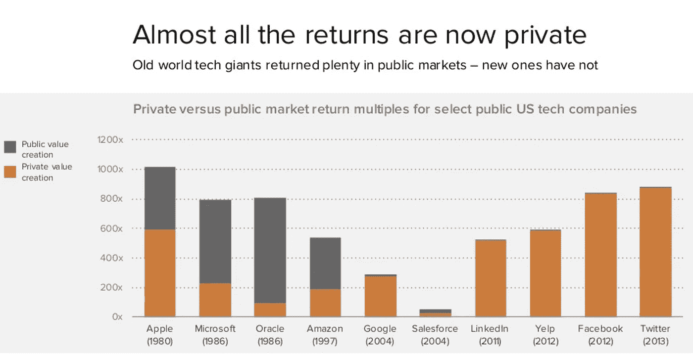
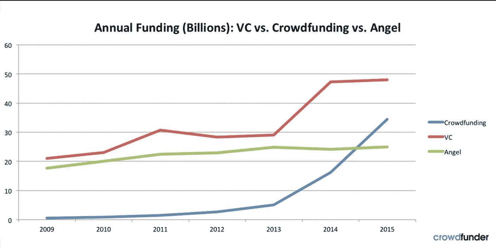

# 股权众筹平台的历史、神话和评级

> 原文：<https://medium.com/swlh/history-myths-and-a-rating-of-equity-crowdfunding-platforms-4980c33cd6ee>

unsplash.com

这个帖子最初出现在 [Startup Grind](https://www.startupgrind.com/blog/history-myths-and-a-comparison-of-equity-crowdfunding/)

我做天使投资人的这些年，接触过不同的股权众筹平台。我遇到过一些创始人，他们对利用平台筹集资金感到担忧。他们认为这发出了一个“负面选择”的信号

我也遇到过一些投资者，他们认为实力较强的公司不会使用众筹平台来筹集资金。

在这篇博客中，我试图打破这些神话。我还对几个顶级平台进行了比较。评级是基于现有信息中每一项的利弊。

**提醒一下，这个博客并不是股票平台的全面列表。** **此处评级的平台发展迅速，因此评级可能无法真实反映状态。目标是帮助投资者和创始人做出明智的决定。**

但在我们深入挖掘各个平台之前，让我们先来谈谈股权众筹，它的神话和历史。

# 什么是股权众筹？

众筹是获得“大众”支持的一种方式。这意味着你、我和我们所有的朋友和家人可以出钱帮助某个寻求帮助的创始人、创新者或初创公司，让他们能够继续他们的想法，并在他们的新公司工作。

随着越来越多的人接入互联网，联系成千上万相信类似事业的人变得更加容易。这种支持的形式可能是对某项事业的捐赠，也可能是对建造你最喜欢的冷藏箱的财政支持。

**股权众筹**是指你可以投资一家初创公司，以换取该公司的股权(股份)。由于这属于“证券”领域，限制更加严格。筹集资金的公司处于商业生命周期的不同阶段。他们可能处于早期想法阶段，没有什么吸引力，或者他们可能处于初创公司产生数百万收入的阶段。

# 为什么要股权众筹？

**股权众筹是一个双赢的局面——嗯，算是吧。**

对于早期创业者来说，筹集资金一直是一项艰巨的任务。银行一般不会在这个阶段贷款给企业。天使投资/风投的世界往往有些神秘，难以驾驭。

在目前的趋势开始之前，创始人必须依靠她的关系才能进入投资者的大门。

对投资者来说，很难接触到高增长公司。到目前为止，这些访问仅限于少数幸运者。他们是在正确的时间出现在正确的地点，能够接触到必要的网络的人。

与上市公司不同，在上市公司，你可以要求你的经纪人购买股票，购买私人公司的股票仅限于“圈子”中的少数个人。

进入这些公司很重要(如果你觉得创造财富很有趣的话)。数据表明，大量的财富将在私营企业中产生。如果你是多疑型的，看看下面的图表。它突显出回报是如何从公共市场转向私人市场的。

来源: [*安德森·霍洛维茨。根据“美国技术资助—进展如何？”的第 30 张幻灯片重新制作*](http://info.ourcrowd.com/sem/cf-1/clkn/http/www.slideshare.net/a16z/state-of-49390473)

# 历史:

**很难得到这些年来股权众筹参与者的确切发展时间。根据维基百科，历史是这样的:**

> *2009 年 6 月，Grow VC Group 推出了第一个基于股权的创业众筹平台，作为私人测试版，随后于 2010 年 2 月全面投入商业运营。*
> 
> *第一个我们。总部位于美国的 ProFounder 公司于 2011 年 5 月推出了创业公司直接在网站上筹集投资的模式，但后来决定关闭其业务，因为监管原因阻止他们继续运营，他们在《就业法案》之前推出了他们的模式。*
> 
> *美国最早运营的股权众筹平台之一是 EquityNet，其他早期平台包括英国的 CrowdCube 和 Seedrs。*

# 该规定:

不同的国家颁布了不同的法规，以在保护投资者的同时实现股权众筹。在美国，股权众筹受《就业法案》(JOBS Act)监管，该法案目前允许合格投资者(净资产超过 100 万美元的人)和未合格投资者投资初创企业。同样，来自维基百科(编辑版):

> *在 2015 年 6 月 16 日之前，股权众筹(根据法规 D)仅限于达到一定净值和收入水平的个人(合格投资者)，由持牌经纪交易商进行。*
> 
> *大众认可的众筹平台有 AngelList、CircleUp 等。在美国运营的第一个面向小企业的门户网站是 2005 年的 EquityNet，随后是 2010 年的 Rock The Post，现在是 Onevest，SeedInvest 成立于 2011 年，FundersClub 成立于 2012 年。2016 年 6 月 15 日，StartEngine 首次根据《就业法案》的规定 A+提供机会，该规定允许经认证和未经认证的投资者投资私营公司。*
> 
> *2016 年 5 月 16 日，2012 年就业法案法规 CF 的标题 III 生效，该法规允许股权众筹(也称为“法规众筹”)，无论净值或收入如何。它必须由持牌经纪交易商或通过在美国证券交易委员会注册的融资门户进行。甚至在法律生效之前，许多众筹服务就已经开始扮演这一角色。*
> 
> *早期门户网站 Profounder 在 SEC 准则发布前关闭，股权门户网站 Earlyshares 收购慈善门户网站 Helpersunite。StartEngine 和 Wefunder 是首批获得批准的两个融资网站。Wefunder 成为第一个成功的平台，在法律生效后的头几个月就达到了 100 万美元的最高 rais。此后，许多其他门户网站相继推出，许多获得认证的众筹平台也进入了非认证市场。*

**如果你是那些对历史和法规感到兴奋的人之一，以下是了解包括股权在内的不同类型众筹演变的良好入门。**

# 股权众筹有多大？

它很大，而且还在增长。Crowdfunder 首席执行官 Chance Barret 在 2015 年写道:

> *如果股权众筹像其他众筹一样每年翻一番，那么到 2020 年，它可能会达到 360 亿美元，并超过风险资本，成为创业资金的主要来源。*

**风险投资资金不具备众筹平台那样的规模。下面是另一张图表:**

# 直接投资与间接投资:

在深入了解围绕众筹的产品和神话之前，我们先来谈谈这个概念。在众筹平台上投资创业公司有两种方式。

**一种是特殊目的载体(SPV)。大多数平台使用 SPV 方法。**把投资者的小额支票汇聚在一起，以特殊目的机构的名义在初创公司开出一张大额支票，会有所帮助。

这有助于为创始人管理资本表。SPV 是股权众筹的杀手级 app。它打开了大规模扩展的大门。在极少数情况下，当投资者投入一大笔资金时，她可以直接投资于该公司，而无需通过 SPV，也无需在退出时支付套利。

# 产品:

众筹平台已经发展到提供不同类型的产品。

**一些例子有:**

**普通基金(类似于典型的风险投资)**:这是你一次性投入资金，由几家公司牵头投资。像典型的风险投资基金一样，你没有选择退出个别交易的权利。套利是根据基金来计算的。这有助于领导进行快速交易，或者创始人不愿意公开交易的情况。

区别(与典型的风险投资基金相比)是通常没有或更低的管理费，因此在经济上更可行。这些基金的侧重点可能有所不同。它可能专注于特定的一批 Y combinator，或者像 AI 这样的特定行业。它可能是一个由领导筹集的基金，用于投资他们遇到的交易。

辛迪加(Syndicate):这是 AngelList 独有的方式，在这里，某人可以建立一群追随者，这些追随者愿意在一笔接一笔的基础上与他们一起投资，或者如果领头人选择投资普通基金。追随者可以选择退出参与。

**公司专用基金**:除 AngelList 外，大部分平台使用的产品。公司由平台的交易团队选择，投资人投资基金。然后，这些资金被汇集起来，作为特殊目的公司进行投资。投资者可以选择不参与。

# 神话:

围绕股权众筹有几个神话。

**这里有一些例子:**

***众筹是针对那些无法从已知风投那里筹集资金的公司*** :

知名众筹平台上的许多公司都有一系列知名风投作为投资者。从安德森·霍洛维茨到红杉世界。从 Instacart、Zenefits 到 Cruise 等平台上筹集资金的公司不一而足。

***投资这些平台需要很有钱*** *:*

不完全正确。成为合格投资者是在平台上投资的规则，但随着新规定的出台，这不再适用于所有情况。在一些平台上，人们可以投资几百美元。

***投资众筹比直接投资创业公司风险更大:***

不是真的。风险是一样的。创业投资是有风险的。除非你准备建立一个投资组合，失去所有的资本，否则你不应该投资创业公司。我在以前的一篇博客文章 [**中详细介绍过这个问题。**](/myasiavc/learn-from-my-mistakes-how-to-avoid-deathtrap-in-startup-investment-dc6aa68a0ec2)

**知名天使投资人不投资这些平台**:

不是真的。像 AngelList 这样的平台使用了一种银团模式，在这种模式下，你可以看到一些顶级的投资初创公司的名字，比如杰森·卡拉卡尼斯(Jason Calacanis)、吉尔·彭奇纳(Gill Penchina)、戴夫·莫兰(Dave Morin)等等。其他平台也使用许多知名投资者来寻找和投资交易。

# 那么，这些平台是如何堆叠的呢？

我选取了几个来自不同国家的著名平台来展示它们在不同领域的表现。

我使用了以下标准:

> *1。平台型号*
> 
> *2。交易的多样性(就阶段、行业而言)*
> 
> *3。平台条款(管理费、运费等..)*
> 
> *4。交易条款(估价、比例、股份类型)*
> 
> *5。产品选项*
> 
> *6。交易分析/评论*
> 
> *7。对投资者的行政支持(客户响应)*
> 
> *8。接触创始人*
> 
> *9。共同投资者的素质*
> 
> *10。公司和 11 的最新情况。投资生命周期内的退出/关闭和其他支持*

**还有其他指标可用于衡量平台，但我认为这将是一个良好的开端。我使用 1 到 10 分(10 分最高)作为工具来比较每个平台的相对优势。同样，这些评级是非常主观的，目的是给投资者和创始人一个想法。**

# AngelList:

这是目前最大的平台。据创始人 Naval Ravakant 称，AngelList 旨在使初创公司的融资民主化。为了更好地理解这一点，请听一段旧的采访，，这是有益的，也是与今天相关的，作者是海军·拉维坎特

2015 年，AngelList 向 441 家初创公司投资了 1.63 亿美元。超过 3300 名投资者参与了这些投资。您可以在这里找到详细信息:

 [## AngelList 2015 回顾

### 超过 1.6 亿美元的在线融资和其他有趣的事实

angel.co](https://angel.co/2015) 

**平台模式:**众包。辛迪加领导。合格投资者。

**交易类型:**广。有专注于食品技术或无人机的特定行业辛迪加。不管是什么行业，也不管初创企业是否成熟，总会有一些辛迪加。辛迪加线索带来基于其个人/专业网络的广泛交易。你可以获得一些其他平台上没有的非常有选择性的交易(9/10)。

**交易的质量**:考虑到平台的分散性，不同辛迪加的交易质量各不相同。你可能会接触到罕见的交易，但也可能会被不那么强的交易轰炸。(6/10)

平台条款:通常是 20%左右(5%给 AngelList，其余给 lead)和一次性的开户费。无年度管理费(8/10)

交易条款:取决于估价。公司可能处于早期阶段，将第一笔外部资金转移到后期/成长阶段。还有股份类型、比例等条款。取决于辛迪加牵头的谈判以及该公司在哪里筹资。(7/10).

**产品选择:**平台上众多不同类型的产品。你可以投资特定行业的基金、银团模式、不通过银团融资的公司。可以是与顶级投资者一起投资的普通基金，而不考虑垂直投资等..AngelList 正在成为一个人才聚集地和技术资源招聘平台。(9/10)

**交易分析/评论:**不全面。取决于银团线索，但通常没有详细信息。信息结构不统一(6/10)

**行政支持:**不一致。取决于谁在后端处理你的请求。(6/10)

**接近创始人:**好的通路。大多数情况下，你可以向创始人提问。创始人有时会在融资期间安排网络研讨会。普通基金除外。在少数情况下，辛迪加领导不鼓励与创始人直接沟通，以保护创始人的时间。(8/10)

**最小支票金额:**从 1k 美元到 25k 美元不等，甚至更大。(8/10)

**联合投资者的质量:**许多大牌投资者在平台上随筹一起投资(8/10)

**公司更新:**通常定期(7/10)

**退出:**资金到位即按时发放。(8/10)

# 资助者俱乐部:

出资者俱乐部运行一个集中的模式。不存在个人主导的辛迪加式结构。平台上的交易集中呈现。该公司最近开始在该平台上启动交易之前，征求活跃投资者的意见。

**平台模式:**集中，即交易在平台上由一个来源提供。合格投资者。

**交易类型:**与 AngelList 相比有限。然而，交易类型因行业和阶段而异(7/10)。

交易的质量:鉴于该平台相当集中的性质，交易的平均质量更好。像 Instacart 这样的知名公司都是在平台上养的。(8/10)

**平台条款:**收取 20%的费用和一次性行政费来开设账户。无年度管理费(8/10)

交易条款:占主导地位的早期阶段。还有关于股份类型、比例等的条款。通常是有利的。(8/10).

**产品选项:**有限选项。例如，普通基金、投资于 YC 批次的基金或公司专用基金。(6/10)

对交易的分析/评论:比你在 AngelList 上能找到的更详细的分析。统一信息结构(8/10)

行政支持:高质量的支持。定期跟进和及时回复询问(8/10)

**接近创始人:**几乎没有。问题通常通过资助者俱乐部提出(4/10)。

**最小支票金额:**统一 3k 美元。(9/10)

**合作投资人的素质:**素质高。许多著名的个人和机构投资者在交易中共同投资。(8/10)

**公司更新:**大多是常规。平台更新。(6/10)

**退出:**资金到位时，分配有规律，无延迟。(8/10)

# 我们的订单:

OurCrowd 采用集中式模式，交易由 OurCrowd 团队管理。该平台在过去 4 年中筹集了 3.2 亿美元，投资了 100 家初创公司，有 9 家退出。

**平台模式:**集中，即交易在平台上由一个来源提供。合格投资者。

**交易类型**:有限。涵盖了从网络安全到健康到农业的方方面面。(6/10).

交易的质量:非常高的质量。展示了选择交易背后的严格流程..(8/10)

**平台条款:**可能是平台中最严格的。有许多平台，但管理费的一个例子是每年 2%，持续 4 年，另外 4%用于其他支出。(5/10)

**交易条款:**多为早期阶段。条款经过良好协商，通常在清算优先权、按比例分配权利等方面对投资者有利。(9/10).

**产品选项:**有限选项。普通基金(侧重于健康、农业等。)或公司特定基金。(7/10)

**交易分析/评论:**与其他平台相比，非常详细的分析。融资前与创始人进行网络研讨会。统一信息结构(9/10)

行政支持:高质量的支持。定期跟进和及时回复询问(8/10)

**接触创始人:**除了网上研讨会之外，几乎没有外部接触。(5/10).

**最小支票金额:**支票金额相当一致，为 1 万美元。(7/10)

**合作投资人的素质:**高质量的合作投资人。许多知名个人和机构投资者在交易中共同投资。(8/10)

**公司更新:**公司更新一般定期。报告在平台上更新。(6/10)

**退出:**资金到位时，分配有规律，无延迟。(8/10)

# Wefunder:

早期股权众筹平台之一。最初仅面向合格投资者，但现在根据第三章向非合格投资者开放。

这是目前非授权投资者最大的平台。

**平台模式:**集中化，例如，交易由平台上的一个来源提供。未经认可的投资者。

**交易类型:**不同类型。不仅关注科技创业公司。(8/10).

**交易的质量:**好坏参半。Zenefits 早期在这个平台上筹集资金。随着 Title III 平台的开放，交易质量并不总是高标准的。(6/10)

**平台条款:**对投资人有利。携带百分之二十。监管方面，众筹向创始人收取 6%的费用，向投资者收取 2%的费用。(8/10)

交易条款:大多数是早期公司。条款是标准普通股或优先股。(7/10).

**产品选项:**有限选项。公司专用基金。(5/10)

**交易分析/评论:**信息有限。(6/10)

**行政支持:**优质支持。定期跟进和及时回复查询(7/10)

**接触创始人:**有限(2010 年 6 月)。有一个 Q &一个选项。

**最小支票金额:**最低可达 100 美元(8/10)

**合作投资者的素质:**机构投资者不多。通常是来自个人的早期资金。(5/10)

**公司更新:**不定期。平台更新。(6/10)

**退出:**资金到位时，分配有规律，无延迟。(8/10)

# 众包:

英国最大的股权众筹平台。

2015 年，该平台为 166 个摊位筹集了 8306.018 万英镑(合 1.05 亿美元)。

**平台模式:**集中化，例如，交易从平台上的一个来源呈现。未经认可的投资者。

**交易类型:**不同类型。不仅关注科技创业公司。(7/10).

**交易的质量:**好坏参半。一些交易质量很高，得到了机构投资者的投资，而许多则不然。(6/10)

**平台条款:**对投资者高度有利。不进位。(9/10)

交易条款:大部分是早期阶段。交易条款因公司和投资规模而异。无论是 a 股还是 b 股。(9/10).

**产品选项:**有限选项。公司专用基金。(5/10)

**交易分析/评论:**优质信息。还有一个活跃的 Q & A，投资者可以向创始人提问。也可以直接联系创始人(7/10)

**行政支持:**优质支持。定期跟进和及时回复查询(7/10)

**接触创始人:**高。可以安排直拨电话。同样，可以通过 Q & A (9/10)伸出手。

**最小支票金额:**可低至 100 (9/10)

**合作投资者的素质:**通常来自个人的早期资金。有限机构共同投资者。(6/10)

**公司更新:**不太规律。取决于创始人。没有清晰的结构。(5/10)

**退出:**资金到位时，分配有规律，无延迟。(8/10)

# 结论:

还有许多其他值得注意的平台没有包括在这个博客中。一些额外的名称包括 MicroVentures、iAngels、Crowdfunder、Equityzen、Syndicate room 和 CircleUp。

**股权众筹在创业生态系统中有着重要的作用。法规和商业模式随着经验不断发展。**

尽管如此，这些平台正在快速扩展，并将在未来几年扮演更重要的角色。

*   你可能也喜欢从我的错误中吸取教训——如何在创业投资中避免死亡陷阱？
*   如果你想要一本关于建立成功公司的免费电子书，点击 [**这里**](http://www.myasiavc.com)