# 房主和未来的房主:我为你做了一个很棒的工具

> 原文：<https://medium.com/swlh/homeowners-and-future-homeowners-i-made-an-awesome-tool-for-you-be796e97383d>

## 你可以用它来节省数年和数万美元…

Photo by [Scott Webb](https://unsplash.com/photos/1ddol8rgUH8?utm_source=unsplash&utm_medium=referral&utm_content=creditCopyText) on [Unsplash](https://unsplash.com/search/photos/house?utm_source=unsplash&utm_medium=referral&utm_content=creditCopyText)

让我给你讲个小故事。

我在 2014 年底关闭了我的房子，之前我花了几个月的时间和银行来回寻找我们购买的卖空交易。

当我签署结算文件时，给我贷款的银行给了我一份叫做抵押分期偿还表的文件，这份文件显示了如果你按时还清贷款，你每个月要支付多少本金和利息。

我注意到一些令人震惊的事情:尽管我的房子得到了一笔惊人的交易，我打算只花 105，000 美元买下它，但我要向银行支付将近 58，000 美元 **的利息**。

这是我的抵押贷款分期偿还时间表的样子。第二张照片显示了利息总额:

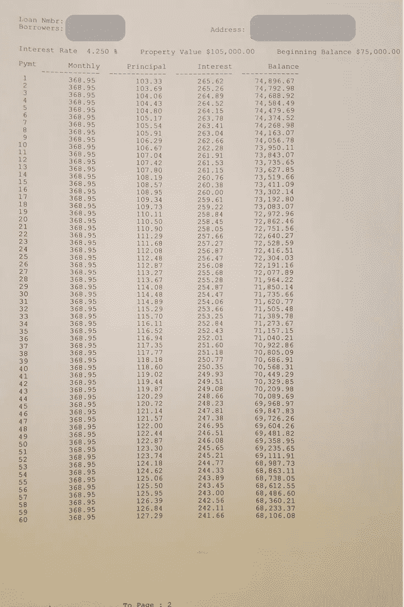

The first page of our mortgage amortization schedule provided by the bank…

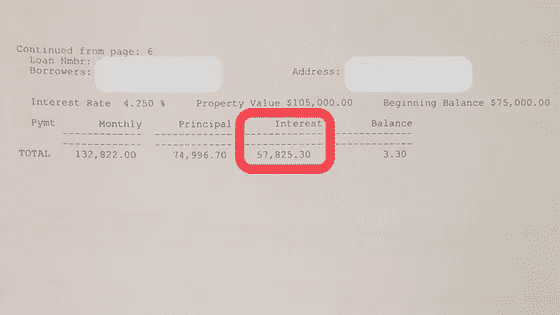

The last page. Note the enormous amount of interest.

这比房子价格的一半还多。见鬼，这比我在无聊的办公室工作一年赚的还多。我真的想工作一年多就为了给银行付利息吗？

所以我回到家，在 Google Sheets 中创建了我自己的抵押贷款分期偿还时间表，看看如果我每个月为本金额外支付 100 美元会发生什么。**事实证明，有了这个改变，我可以提前 10 年还清抵押贷款，并节省 22，000 美元的利息。**

我把我的表变成了一个复杂的即插即用的模板，任何人都可以用它来查看额外支付抵押贷款的影响。

我要给你这张表，它可以轻松地为你节省几万美元，**免费**，我要在这篇文章中告诉你如何使用它。

# 获取您的副本并保存到您的 Google Drive

如果您点击下面的链接并输入您的电子邮件，我会给您发送一份 Google 表单文件的副本:

[**在这里免费获得抵押还贷工具**](http://thematthewkent.com/mortgage)

一旦你有了文件，你需要点击“文件”，然后“复制一份…”

这将允许你用你选择的名字把它保存到你自己的 Google Drive 中。

*我建议保存两份拷贝，一份使用，一份作为备份，以防你不小心弄乱了其中一个公式*

# 输入您的贷款信息

一旦你保存了一个副本，你就要进入第二个标签，名为“原始贷款”的标签

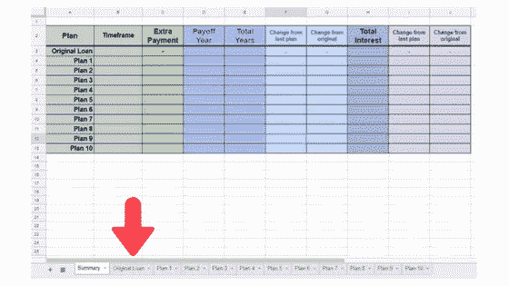

在这里，您需要在用黄色突出显示的单元格中输入五条简单的信息:

1️⃣ **起始本金:**输入你从银行贷款的总额

2️⃣ **利率:**输入您的利率，以百分比表示(例如，对于 4.25%，输入 4.25 而不是 0.0425)。目前这张表只适用于固定利率抵押贷款，不适用于可调利率抵押贷款。如果你还没买房，反正我建议固定利率房贷。

3️⃣ **每月本金和利息:**这和你每月的总还款额不太一样，可能包括税和保险。要找到这个号码，你可以尝试在银行网站上登录你的账户，直接打电话给银行，或者咨询他们在你关闭房子时提供给你的抵押贷款分期偿还时间表

4️⃣ **开始年份:**输入你第一次开始付款的年份。

5️⃣ **开始月份:**输入你开始付款的月份。记住这最后两个月，你关闭的那个月可能不是你第一次付款的那个月。检查你的银行记录，以确定你是什么时候支付第一笔款项的。

一旦你输入了所有必要的信息，表格就会神奇地从空白变成一个完整的抵押分期偿还表:

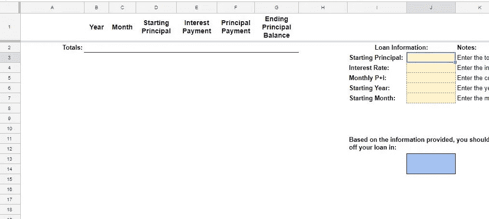

The blank sheet

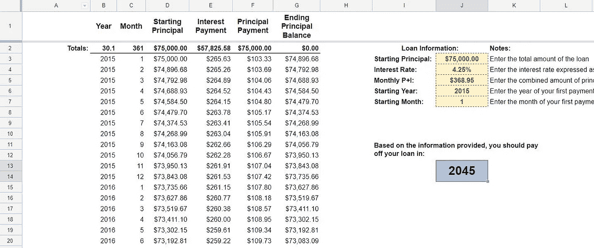

After entering just five pieces of info

> 它像魔法一样有效。

你在这里得到的抵押贷款分期偿还时间表应该与你关闭房屋时收到的时间表一致。

*旁注:你在例子中看到的数字确实代表了我的真实情况。我这样做主要是因为我知道这些数字代表一个真实的抵押贷款，而不必花时间去寻找有效的数字。*

但是我也认为人们互相谈论他们的财务细节是有好处的。如果我们对彼此隐瞒一切，我们就不会学到东西。是的，显然应该有界限，但我认为我们的文化采用的界限过于严格。

您可能会注意到，在给出总数的第二行中，30 年期抵押贷款的总数是 30.1，而不是 30；15 年期贷款的总数是 15.1，而不是 15:

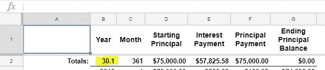

这是因为在你最后一次付款后，总会有几美元的余额。对于银行来说，根本没有办法制定一个时间表，在每个月等额还款的同时，将余额精确降至零。我觉得这是因为四舍五入。为了在 360 次等额还款后将贷款降至零，你需要能够支付一美分的零头。

我的文件将这几美元的最终余额视为第 361 个月(或 15 年贷款的第 181 个月)。我从银行得到的抵押贷款分期偿还时间表只是将其列为第 360 次付款后的剩余余额:

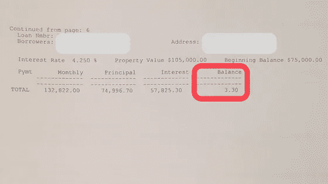

这一余额可能会比你的银行提供的抵押贷款分期偿还时间表少几美元，这完全取决于他们是否像 Google Sheets 一样四舍五入。

只需输入这些信息，您就可以看到一些有趣的东西。首先是我之前提到的令人不安的事实，你可能要支付惊人的利息:

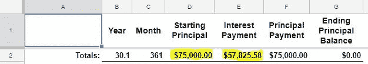

$58K in interest on a $75K loan? Uhhhhhhhhhh…no thanks.

但是你也可以看到如何偿还抵押贷款的机制。你会注意到，开始时，你支付的主要是利息:

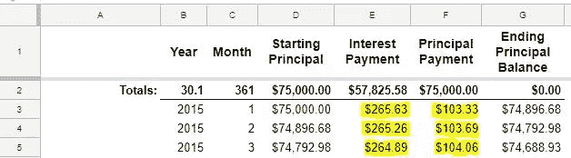

但是每次还款，你都要支付一些本金，这意味着下个月你支付的利息会下降，而你支付的本金会上升。

这种影响起初很小，但它开始像雪球一样越滚越大，到最后几个月，你支付的主要是本金，几乎没有任何利息:

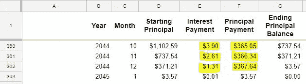

这实际上是为什么每月额外付费如此有价值的关键所在。

每次你向本金多支付一笔，你就减少了随后每次利息支付的*金额。不仅如此，你*增加*每*次后续本金支付的*金额，反过来减少每一次后续利息支付…*

这就是复利在行动中的力量。如果你的贷款利率为 4%，那么你额外支付的款项实际上是投资，复利为 4%。

那么额外付费能省多少钱呢？让我们看一些例子:

# 制定支付额外费用的计划

接下来，转到名为“计划 1”的选项卡:

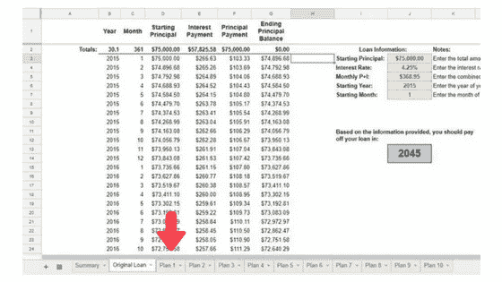

您会注意到，它的大部分已经根据您已经输入的信息进行了填充:

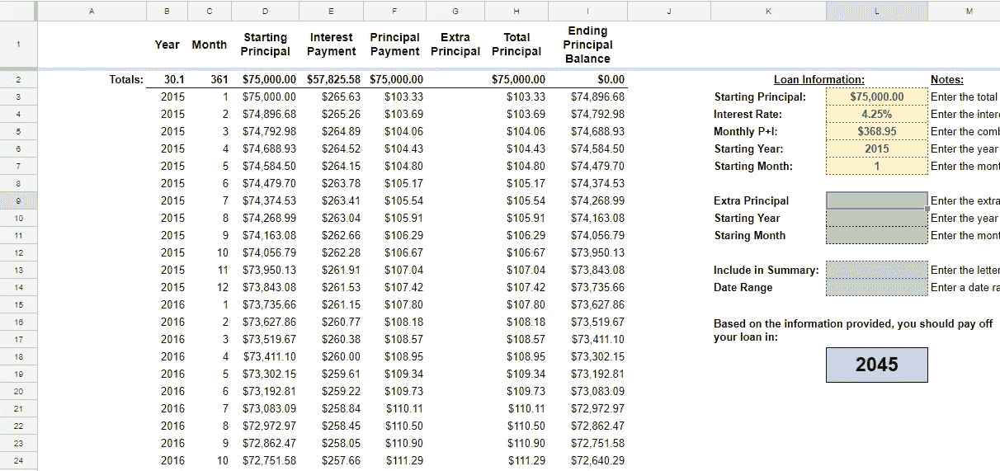

你需要做的就是填写绿色和灰色的单元格。

**绿色单元格:**

1️⃣ **额外本金:**你可以在这里选择每月额外支付的抵押贷款金额。

2️⃣ **开始年份:**输入您首次支付额外费用的年份。

3️⃣:开始月份:你将支付第一笔额外付款的月份。

**灰色的单元格:**

1️⃣ **包含在摘要中:**当您准备好让字母“y”出现在“摘要”标签中时，请将它放在这一栏中。

2️⃣ **日期范围:**这只是摘要选项卡的一个标签。我通常在这里放一个日期范围。例如，我从 2015 年 1 月开始额外支付 100 美元，并在 2018 年 3 月保持这一速度。因此，我在这个单元格中输入“2015.01–2018.3”

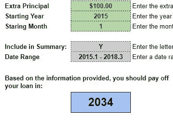

通过填写绿色的单元格，你可以看到额外支付抵押贷款的效果。通过填写灰色单元格，您可以将您的计划与 summary 选项卡上的原始贷款进行比较:

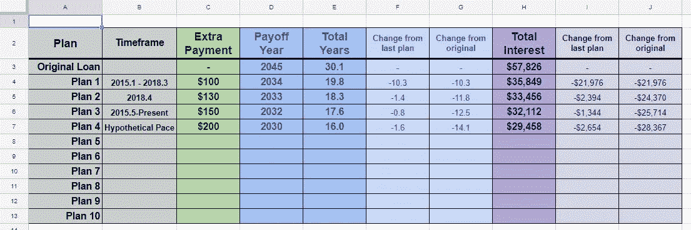

上图是我的摘要选项卡现在的样子。“摘要”选项卡包括以下内容:

1.  第一列(A 列)让您知道该行从哪个选项卡中提取信息
2.  第二列(B 列)是您为计划指定的标签
3.  绿色栏(C 栏)显示你每月多付了多少钱
4.  第一个蓝色列(D 列)是你的预期收益年(所有涉及年份的列都是蓝色的)
5.  E 列显示了还清抵押贷款的预期年数(从你开始还款的那一天算起)
6.  F 列显示了与上面的计划相差多少年
7.  G 列显示它与原始贷款的期限相差多少年
8.  第一个紫色栏(H 栏)显示如果你保持你的速度，你将支付多少总利息。
9.  第一列显示了这与上面的计划有多么不同
10.  J 列显示了它与原始贷款的不同之处

它所提供信息的一些显著亮点:

*   如果我支付最低还款额，我将在 2045 年还清我的贷款，也就是我关门后的 30 多年，我将支付近 58000 美元的利息
*   自从我第一次付款以来，我已经额外支付了至少 100 美元，这一改变节省了 10 年时间，比原来的贷款少了 20，000 多美元。
*   我已经增加了几次额外支付的金额，但最初的 100 美元是迄今为止最有影响力的，因为这是最大的金额*和*。因为每一笔额外的费用都会像滚雪球一样越多，你越早开始支付额外费用越好。
*   我也用这张表来衡量假设变化的影响。你可以看到，我把我的计划 4 标签为“假设配速”，它显示了在我已经做的基础上每月额外贡献 50 美元的影响，这是我即将扣动扳机的举动。
*   一旦我扣动扳机，我将会把我支付利息的年数和金额减少一半。

# 偿还抵押贷款与投资

这是个人理财领域激烈争论的一个话题。如果你每个月都有钱支付额外的抵押贷款，你会更愿意投资吗？

投资的最佳论据是，股票市场历史上提供的回报率远高于你的贷款利率。这意味着你最好尽可能长时间地还清抵押贷款，并投资差额。

尽早还清抵押贷款的最佳理由是这样更安全。你的负债越多，你的处境就越危险。当你的房子还清时，失去工作并不像你每月面临巨额还款时那么可怕。

在还清你的抵押贷款的论点中，我听到的最深刻的一点来自流行的个人金融作家和电台主持人戴夫·拉姆齐，他问了一个假设的问题:如果你的房子还清了，你会以 4%的利率贷款(或无论你的抵押贷款利率是多少)投资股票市场吗？

我的答案是否定的。如果你有类似的答案，还清抵押贷款可能是一个好主意。

# 我的策略

老实说，我的方法实际上是一种混合，我称之为进攻和防守。

## 防守

对我来说，“打防守”就是省钱。这意味着看看我从我正常的 9-5 天工作中挣了多少钱，并确保我的花费少于这个数目。

当我找到一种可持续的储蓄方式时，我会自动将这笔钱用于支付我的购房款。

几个月前，我取消了每月 30 美元的服务，并将额外的本金从 100 美元增加到 130 美元。

这个月，我求助于我的朋友，他在节省手机费用方面很有一套，他帮助我和妻子从 Cricket Wireless 换到 Red Pocket，每月节省了 30 美元。

我还打算取消亚马逊 Prime，这将让我每月多赚 10 美元(并让我不再购买不必要的东西)。

最后，我在工作中从 Roth 401k 换成了传统的，每月为我多赚了 20 美元，我以低税收的形式存了下来。

这是每月 60 美元的持续储蓄，其中 10 美元将被转移到其他地方，但其中 50 美元将用于支付我的抵押贷款。

这是一个策略，我在我关于个人理财的书中有更详细的介绍。削减你每月的开支是非常有效的，因为尽管这需要一些前期工作，但并不需要额外的努力。储蓄被锁定在长期。

## 进攻

对我来说，打进攻意味着赚更多的钱。

现在，我在网上很多地方赚钱，包括[媒体](https://medium.com/creators)、 [YouTube](https://www.youtube.com/user/thematthewkent) 、[亚马逊联盟计划](https://affiliate-program.amazon.com/)和[图书销售](https://amzn.to/2JfESW8)。

这笔收入每个月都不一样，不在我的预算之内。

这使得它不是一个理想的选择，用于额外的抵押贷款付款，因为我不知道它每个月会有多少，我会欠多少税。

我的解决方案(目前)是将这笔额外收入存入个人退休帐户。

个人退休帐户是一种退休帐户，在这种帐户中，你不必为你的缴款缴税(在资格和缴款金额方面有[限制](https://www.irs.gov/retirement-plans/plan-participant-employee/retirement-topics-ira-contribution-limits))。这意味着，只要我的兼职收入低于个人退休帐户的缴费限额，我就可以把所有的收入都存入我的个人退休帐户，而不用担心税收。

我对个人退休帐户的偏好是在 Vanguard 开一个账户，投资他们的总股票市场指数基金 VTSAX。

问题是，VTSAX 最少需要 10，000 美元才能启动。

如果你没有 1 万美元，不要担心，有一个优雅的解决方案:查尔斯·施瓦布。

查尔斯·施瓦布有一只名为 [SWTSX](https://www.schwab.com/public/schwab/investing/investment_help/investment_research/mutual_fund_research/mutual_funds.html?&&path=%2Fprospect%2Fresearch%2Fmutualfunds%2Fsummary.asp%3Fsymbol%3Dswtsx) 的全股票市场指数基金，没有最低投资额和*微观*0.03%的费用率。

一旦你达到 10，000 美元，你可以打电话给 Vanguard，让他们把你的账户转到 VTSAX 投资，或者你可以继续使用 Schwab 和他们的最低费用率。

如果你不太懂投资，也不用担心。在最后一分钟左右，您已经了解了一些要点:

*   像 VTSAX、SWTSX 或 FSTVX(富达总股票市场指数基金)这样的基础广泛的指数基金非常好
*   低费用率=非常好
*   个人退休帐户、罗斯个人退休帐户和 401(k)帐户等税收优惠帐户=非常好

这里还有几个要点:

*   试图把握市场时机=非常糟糕
*   挑选个股=非常糟糕

所以这里，用一句话来说，就是坚如磐石的投资策略:

> 尽你所能，尽早投资于低成本、基础广泛的指数基金，从税收优惠账户开始。

是的，就这么简单。上网到嘉信理财，开一个账户，链接你的银行账户，转一些钱，投资到 SWTSX。

如果你真的想深潜，我强烈推荐 JL·科林斯博客上的[股票系列](http://jlcollinsnh.com/stock-series/)。你想知道的关于投资的一切都以任何人都能理解的方式写了出来。

## 看那个！你有一个工具，可以帮助你节省*年*和数万美元偿还抵押贷款，一个优雅的解决经典问题，你是否应该提前偿还抵押贷款或投资，以及一个简单的，一步一步的指导，建立一个精英投资策略。今天是个好日子，是吧？😄

**如果你还没有，请确保在这里免费获取抵押贷款支付工具:**

 [## 抵押贷款偿还工具

### 更多信息请访问邮报。

thematthewkent.com](http://thematthewkent.com/mortgage) 

你可以回来看看这个指南，了解如何使用它的细节，如果你喜欢，你可以看看我写的其他一些关于金钱的文章:

 [## 千禧一代如何真正退休

### 抛弃朝九晚五、赢得自由、过上梦想生活的现实指南…

medium.com](/swlh/how-millennials-can-actually-retire-2782c27aa9ba)  [## 金钱和幸福的终极指南

### 花费更少变得更快乐背后的逻辑

medium.com](/swlh/the-ultimate-guide-to-money-and-happiness-eaadeadda56a) 

你也可以抢一本我的书 [***对你管用的个人理财:*** *如何建立财富，设计未来，趁你睡觉时赚钱*](https://amzn.to/2JfESW8)

## 这篇文章发表在《初创企业》杂志上，这是 Medium 最大的创业刊物，有 358，974 人关注。

## 订阅接收[我们的头条](http://growthsupply.com/the-startup-newsletter/)。

