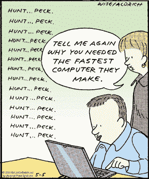

# 2018 年 5 大深度技术趋势将如何影响数字健康

> 原文：<https://medium.com/swlh/how-5-deep-tech-trends-will-influence-digital-health-in-2018-4c2c190e8e10>

在过去的一年里，对数字健康的投资飞速增长。根据 [Rock Health 的年终报告](https://rockhealth.com/reports/2017-year-end-funding-report-the-end-of-the-beginning-of-digital-health/)，2017 年数字健康资金首次越过 50 亿美元基准，飙升至 58 亿美元的历史新高。未来一年，当前的深度技术趋势将如何与医疗保健融合？

# 1.人工智能

Robo-doctors aren’t replacing people anytime soon

今天的大多数头条新闻都表明，下次你出现在医院时，迎接你的将是一种算法，而不是医生。但是人工智能并不像宣传的那么先进。我们看到的许多关于计算机的头条新闻(机器人医生？)殴打人类应该用健康的怀疑眼光来看待。正如卢克·奥克登-雷恩在[他的精彩文章](https://lukeoakdenrayner.wordpress.com/2016/11/27/do-computers-already-outperform-doctors/)中解释的那样，导致这种误解的两个主要因素是 *:*

**1)将算法用例与人类医生不做的事情进行比较**(即预测)

吹捧一个实际上不是人工智能的算法。这些技术中有些确实是新算法，但不是人工智能。这些技术已经存在了几十年，但是我们还没有足够的计算能力来完成它们。现在我们知道了。由此，艾？不完全是。

那么，实际的 AI 正在为实际的医学做些什么，并帮助医生进行实际的工作呢？例子确实存在。

一个这样的例子是一些在过去几年中获得成功的医疗成像公司。虽然没有完全取代医生，但像以色列的斑马医疗视觉这样的公司帮助医生更快更准确地处理大量图像。

聊天机器人也已经成为减少临床能力问题和提供护理的越来越受欢迎的方法。总部设在伦敦的 Babylon Health 和总部设在柏林的 Ada Health 是这一领域的两个著名公司。两者都为患者提供人工智能驱动的聊天机器人，为医生提供有用的工具——Babylon 正在努力将个人与医生的视频电话联系起来，Ada Health 为医生提供决策支持。然而，这两个聊天机器人都明确表示它们不是用于诊断目的。第一个声称具有诊断能力的聊天机器人将会吸引大量的兴趣。

另一家这样的公司是总部位于瑞士的索菲亚遗传公司。Sophia Genetics 开发了 Sophia 来挖掘基因组数据的宝藏，以改进诊断并推荐治疗方案。他们的 SaaS 平台 SOPHiA DDM 与医院和医生合作，将该技术应用于医院。

虽然许多高调的公司专注于取代/增加医生，但在医院后台办公室，人工智能机会比比皆是。

总部位于纽约的 [Oscar](https://www.hioscar.com/) 可能是解决后台办公室问题的最引人注目的公司。尽管大量技术已经用于创造出色的用户体验，但 Oscar 的算法通过从草率的保险和账单数据中提取有意义的见解来制定计划和定价。他们的更多算法将病人与正确的医生匹配起来，这是提高质量和降低医疗成本的一个不太重要但极其重要的步骤。

虽然令人费解和模糊，但据估计，医疗账单行业的价值为 550 亿美元。随着诊断学的竞争越来越激烈，后台办公室里唾手可得的水果将变得更有吸引力。

# 2.区块链

Sharing data safely could get a whole lot easier

区块链技术有巨大的机会影响医疗保健的后台办公室。两个关键领域是数据共享和支付。

集成医疗的最大障碍之一是没有安全的方式来共享受保护的健康信息(PHI)。目前，PHI 被孤立在各种电子健康记录(EHR)和医院计费系统中。使用区块链，医疗记录可以安全地存储，每个人都拥有自己 PHI 的私钥。每个患者都可以在任何医疗会议上提供他们的钥匙，区块链将保存他们捕获和更新的记录。患者向其提供私钥的任何医生都能够查看患者的病史并对其采取行动。光是这一点就足以让综合医疗变得更便宜、更有效。下一步，也是更难的一步，是将这些数据的匿名版本用于公共卫生。

区块链可以解决的另一个细分领域是支付方和提供方之间的报销交互。如今，医院必须雇用整个部门来追踪支付、协商变更和应对日益复杂的支付条款。智能合同不会让这些部门无效，但会大幅削减它们的人力成本。一旦就诊得到认证，带有特定就诊条款的智能合同将自动从保险公司向医院付款。许多手术已经通过简单的诊断相关的团体(DRG)付款(在美国)以这种方式支付，但它们并不总是简单的，而且令人惊讶的是大量的费用没有支付。

对这一灵丹妙药的两个警告是:( 1)这将要求保险公司以基于规则的方式明确说明他们支付什么以及何时支付，即使有时模糊和逐案工作更容易,( 2)这将要求医生更多地参与医院的信息技术，这对于现代 EHR 系统来说已经是一个挑战(见 [Sarah Kliff 的文章](https://www.vox.com/health-care/2017/10/30/16228054/american-medical-system-fax-machines-why)关于停留在传真时代的医疗系统)。

两家在医院方面与区块链一较高下的公司是总部位于纳什维尔的[哈希健康](https://hashedhealth.com/about/)和总部位于洛杉矶的 [Gem](https://gem.co/health/) 。尽管采取的方法略有不同(Hashed Health 在技术上是一个提供商联盟)，但两者都是区块链的专家，积极识别美国医疗保健中可以用区块链技术解决的问题。

# 3.量子计算

Even with hospitals still faxing, quantum computing can provide benefits

量子技术涉及许多先进的医疗手段，从[无针疗法](https://www.fastcompany.com/1680025/no-more-needles-a-crazy-new-patch-will-constantly-monitor-your-blood)到生物标记纳米粒子。然而，量子计算的巨大吸引力来自医学研究和安全。

量子位提供的巨大计算能力可能允许量子计算机测试给定组合的几乎每一个结果，达到数学确定性(据估计，一台具有 50-100 个量子位的量子计算机将能够解决量子化学的所有问题)。今天，经典计算机的能力限制了制药公司对化学相互作用的分析。有了量子计算机，我们将看到更快的药物发现和更准确的结果。

量子密码是一个全新的安全级别。像 [ID Quantanique](https://www.idquantique.com/) 这样的公司使用量子纠缠*来防止除预定接收者之外的任何人读取信息。在 WannaCry 劫持 NHS 医院的一年里，这种安全级别对医院系统和医疗记录产生了深远的影响。

在量子芯片开始从研究过渡到工业应用之前，这里的大部分进展将是开发性的，但请留意那些准备充分利用这一优势的公司。

**纠结听起来很混乱，维基百科对那个没有太大帮助……试试* [*这个*](https://www.quantamagazine.org/entanglement-made-simple-20160428/) *代替。*

# 4.增强现实

AR can change the way we perform surgery

快速超越那些用僵尸追逐我来激励我跑步的健身应用，增强现实将帮助医生和病人。

对于医生来说，AR 创造了一种更“动手”的外科培训方法，使时间和材料密集型培训更容易获得。总部位于伦敦的[触摸手术](https://www.touchsurgery.com)的平台允许医生“随时随地学习、准备和测试手术程序”。

在从[寻找除颤器](http://medicalfuturist.com/automated-external-defibrillator-and-augmented-reality/)到[预览整形手术结果](http://www.illusioimaging.com/)的众多患者应用中，最引人注目的用例之一是[orcam 的 EyeDecide](https://www.imedicalapps.com/2013/07/medical-app-augmented-reality-patient-education/) ，它向患者展示不同眼部手术的结果，以更好地了解他们当前的状况和选择。

AR 在健康领域有很多机会，但最成功的应用需要找到能够创造制度变革而不是小噱头的用途。

# 5.监管如何适应这种情况？

To boo or not to boo?

好吧，这不是一个深刻的技术趋势…可以说是截然相反的趋势。类似 Theranos 的恐怖故事，或者最近的 [Outcome Health](https://www.wsj.com/articles/outcome-healths-investors-receive-subpoenas-from-justice-department-1510276020) 并不能给人太多鼓励。然而，促进进步的监管将是数字健康领域能走多远的最终决定因素。

通常被视为创新障碍的适当监管既可以像在金融领域一样打开医疗创新的大门(即像英国 Monzo 和 Revolut 这样的挑战者银行)，也可以为初创企业提供优势。瑞典避孕应用程序 [Natural Cycles](https://www.naturalcycles.com/en) 等公司将其监管认证视为竞争优势。

> “在过去的几十年里，科技企业家改变了不受监管的行业。现在，科技正转向受监管的行业，如卫生或教育。我们正在研究最困难的社会问题，寻找最好的解决方案。”
> ~ Barnaby Hussey-Yeo，Cleo 联合创始人兼首席执行官

传统上不受监管的行业变得过于拥挤，监管力度也越来越大。随着企业家寻找新的垂直行业来增加价值，健康提供了一个具有挑战性但富有成效的努力。

*☞如果想继续讨论，请在下面留下回应。*

或者，点击“♥︎”来帮助向其他人推广这篇文章，并在 Medium 上关注我，让我知道你喜欢阅读这篇文章。

*☞还有，你可以随时在 Twitter(*[*@ Nico _ in140*](https://twitter.com/nico_in140)*)上关注我，也可以在 LinkedIn 上和我联系。*

## 这篇文章发表在 [The Startup](https://medium.com/swlh) 上，这是 Medium 最大的创业刊物，拥有 284，454+人关注。

## 在此订阅接收[我们的头条新闻](http://growthsupply.com/the-startup-newsletter/)。

