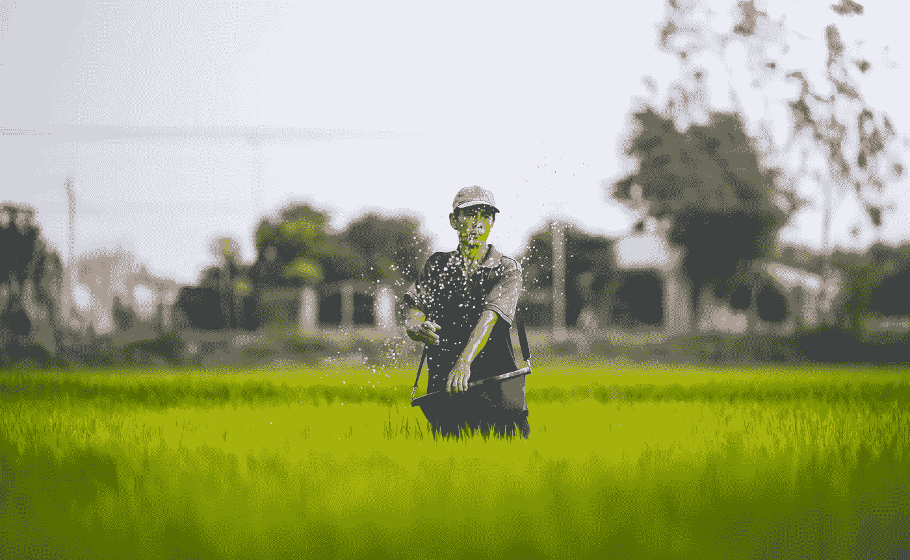
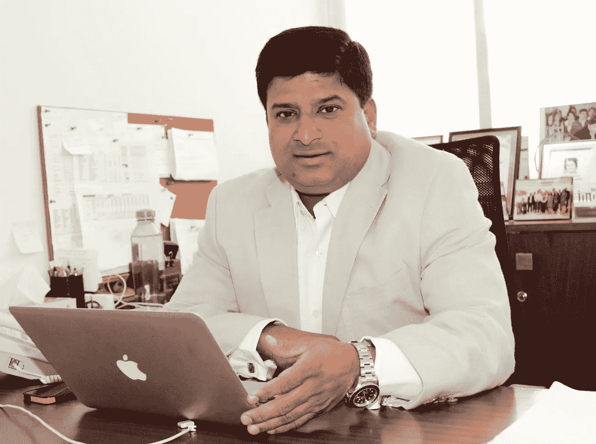
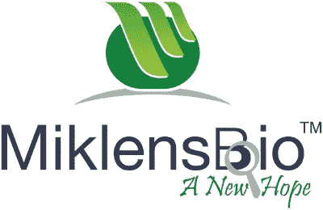
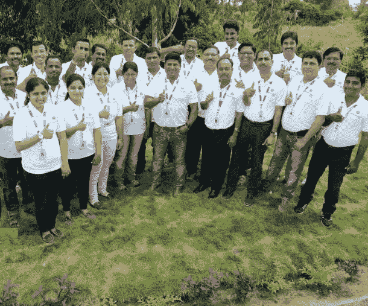
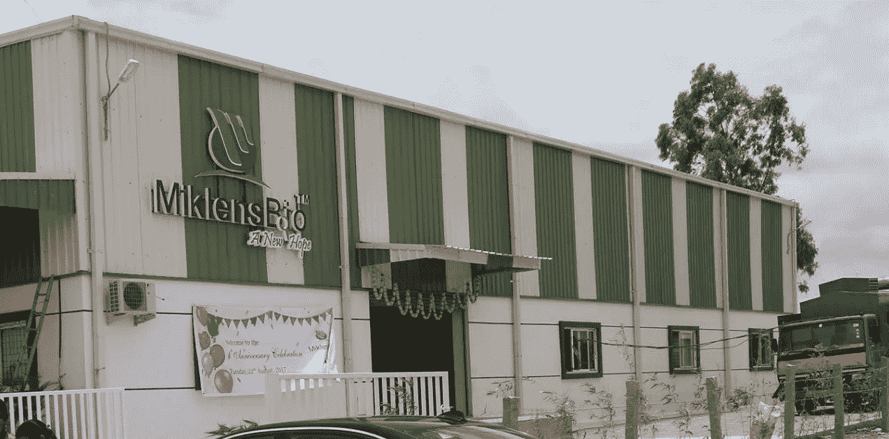

# 一个银行家如何变成一个农学家建立了 Miklens Bio:一个每年创造 540 亿美元收入的农业科技创业公司

> 原文：<https://medium.com/swlh/how-a-banker-turned-agriculturist-built-miklens-bio-an-agritech-startup-generating-5-4-5b7bd64ba61f>

## [推送开始](https://www.pushstart.in/)面试 13:

## 如何 [Santosh Nair](https://www.linkedin.com/in/santosh-nair-4a630a10) 建立 [Miklens Bio](http://www.miklensbio.com/) 的旅程:一家每年创造 540 亿美元收入的农业科技初创公司。

**Credits:** [**https://unsplash.com/**](https://unsplash.com/)

印度三分之一的土壤已经退化，另外 25%的土地面临沙漠化。这是对我国数百万人粮食安全的直接威胁。

> 随着一条致命的“癌症带”在旁遮普省的马尔瓦地区形成，农民们对传统耕作方法和过度使用杀虫剂的呼声越来越高。

正是在这种严峻的环境下，印度重新引进了有机农业。

尽管有许多与有机农业相关的倡议分散在全国各地，但仍然缺乏领导力和满足地区需求的定制产品。

不要烦恼！因为 Miklens Bio 正在改变印度有机农业的现状，一次生产一种产品。

## 通读这篇采访，了解:

> “一位银行家如何成为一名农学家:一家每年创造 540 亿美元收入的农业科技创业公司，并一直保持自我发展。”

这是“[**push interview**](https://www.facebook.com/groups/Pushstarter/)**:帮你的访谈**[**push start**](https://www.pushstart.in/)**”**系列的第十三期访谈由 [**Pushstart**](https://www.pushstart.in/) 提供动力。

本次 [**面试**](https://www.facebook.com/groups/Pushstarter/) 由[**engineer Babu**](https://www.engineerbabu.com/)****印度成长最快的创业公司之一专门为创业公司打造 **MVP** 。****

**** [## 开发世界上最好的产品-工程师

### 100%的项目交付，平均评分为 9.5。我们开发的产品入选 Y-Combinator 2016 & 2017。

www.engineerbabu.com](https://www.engineerbabu.com/)**** 

# ****🕴你是谁？****

****您好 [**Pushstarters**](https://www.pushstart.in/) ！我是 [**桑托什·奈尔**](https://www.linkedin.com/in/santosh-nair-4a630a10) ，米克朗斯生物农业技术私人有限公司的创始人兼董事总经理****

********

******Hello** [**Pushstarters**](https://www.pushstart.in/)**! Santosh this side :)******

****我做了大半辈子的银行家，在南印度打头 [**HDFC 银行**](https://www.hdfcbank.com/)12 年，在印度 [**梅里勒林奇**](https://www.ml.com/)4 年。我还担任过一家上市生物技术公司的首席执行官，之后开始自己创业。****

****我是一名铁杆足球爱好者，曾效力于印度的职业足球俱乐部。****

****我对农业的热情导致了[**Miklens Bio**](http://www.miklensbio.com/)**一家公司在**【纯生物】**领域的诞生，这将彻底改变印度乃至全世界的**生物农业投入**行业。******

# ****🤔Miklens 生物有什么大不了的？****

********

****我们今天面临的许多健康风险都归咎于我们摄入的水果和蔬菜中的化学物质。****

****目前，农民使用各种化学物质为土壤提供基本养分，抵御病虫害。****

> ****众所周知，我们饮食中的有毒化学物质会导致癌症、身体畸形、智力迟钝、生育和许多其他威胁生命的疾病。****
> 
> ****不要忘记对土壤健康和产量的影响，使土地不适合耕种。****

## ****我们的产品为所有这些疾病提供了解决方案。****

*   ****在 Miklens Bio，我们相信**无残留栽培**。这将通过提高产量、降低成本和环境影响来改变农业部门，从而提高利润率。****
*   ****Miklens Bio 革命性的**T2 农业微生物技术(AMT)** 为农民提供无残留农业投入，如[**mik nations**](http://www.miklensbio.com/buy-online.html#)、[**mik loud**](http://www.miklensbio.com/buy-online.html#)、 [**Mikpower** 、](http://www.miklensbio.com/buy-online.html#)T16。****

****农民现在可以选择转而使用比化学产品便宜 20%的更安全的替代品。****

> ****就研发而言，我们是一家独一无二的公司。我们采用革命性的农业微生物技术(AMT)，在短短 2 年内推出了 30 种产品。****

# ****miklens bio 的初始阶段是什么？****

## ****Miklens Bio 的初始阶段:****

*   ****搬进了一个只有一个房间的小厨房来收拾东西。****
*   ****建立了我们的初始科学家团队，以便能够开发出内部产品。****
*   ****在后院测试我们的产品。一旦我们对结果满意，我们就联系著名机构进行验证，例如 [**【对照联盟】**](http://cucpublications.controlunion.com/Publications.aspx) 、 [**APEDA**](http://www.apeda.gov.in/) 。****
*   ****在成功获得认证后，我们在将产品推向市场进行试验之前完成了专利申请。****
*   ****我们还不断向小农发送样本，以便他们可以尝试和测试。一旦农民给了验证，我们就意识到**“哇，这个产品管用！”**并移入包装。****

> ****我们的产品定位更符合需求和市场实际需求。****

# ****👬你是如何组建你的团队的？****

********

******The Team behind Miklens Bio******

****我和我的同事妮莎博士一起组建了我的团队，他在领导研发方面有超过 16 年的经验，在农业、微生物学&生物技术方面有丰富的知识。****

****接下来，我们需要一位业务开发方面的专家，因此我们聘请了具有 20 多年行业经验的钱德拉塞卡先生。****

****随后招募了科学家，他们是我们研发的骨干。他们大多是行业同事，除了人力资源顾问之外，还有一些来自前一家公司。****

# ****🛍:第一个上市销售的产品是什么？****

> ****无论你是哪个农民，种植什么，你都需要某种肥料来种植你的产品。****

****因此，我们从销售 **NPK** 开始，这是我们大量采用的第一款肥料产品。****

# ****💵在公司初创阶段，你是如何提供资金的？****

********

******This is the hub of all the action!******

****我做了一些个人牺牲，赚了近 3 亿。我们仍然在引导运行。我想企业家的旅程通常就是这样开始的。****

# ****🤝你是如何获得最初的客户的？****

> ****我们的第一批 10 个客户是通过个人行业联系人，他们对团队和研究有信心。****

****在这个阶段，很少有人从美国通过社交媒体听说我们的**农业微生物** **技术**后来找我们。****

****尽管他们花了 9 个月的时间在不同的大学测试该产品并最终达成交易，但这种等待是值得的。这笔交易帮助我们在印度农民和经销商群体中建立了信誉。****

> ****一旦有人从美国购买了你的产品，印度的经销商和零售商将不会退缩。****

****一旦上面的**概念验证**建立，我们就以此为跳板，在印度不同的市场上发展新的客户。****

****一旦农民或经销商用你的产品对抗他们的作物，看到积极的结果，他们就会开始相信你。你开始获得合作提议和大宗订单。从那时起，我们开始通过口口相传有机种植**。******

****迄今为止，我们已经发展到大约 110 家分销商。我们每天都在为我们的网络增加 3 到 4 个分销商。两年后，我们将在全国寻找大约 1000 家经销商。****

# ****📈从 NPK 到 30 多种产品的产品历程是怎样的？****

> ****每个市场都有不同的需求和需求的紧迫性。我们两者都利用了。****

****如果你看看喀拉拉邦，土壤是酸性的，这限制了农作物的产量。去马哈拉施特拉邦，会遇到虫害高发。在更靠北的地方，湿度的波动会引发严重的真菌侵袭。****

****政府测试土壤并发放健康卡，这样土壤就呈中性，有利于高产。****

****由于喀拉拉邦的土壤是酸性的，我们为喀拉拉邦推出了 pH 调节剂，为北方地区推出了 MIKDEW，以应对真菌的侵袭，为马哈拉施特拉邦推出了 MIKROOT，以防止虫害。****

> ****我们了解市场的需求，开发出合理的、更有效的产品。****
> 
> ****作为一家 R&D 公司，我们有权按照客户的要求定制我们的产品。****

# ****💰你的商业模式是什么？你是如何增加收入的？****

## ****向我们购买产品的四类客户:****

*   ****经销模式:我们的代理商将我们的产品供应给经销商，经销商再直接卖给农民。我们在印度的大部分邦都有经销商网络，每个经销商都为其所在地区的大量农民提供服务。****
*   ******零售业务:**我们也通过网站或线下方式直接向农民销售。****
*   ******出口业务:**我们确定了一个在美国有固定网络的经销商，并与他们签订了**谅解备忘录**。在接下来的三年里，他们将独家获得这个市场份额。****
*   ******企业客户:**一些公司，比如[**Harrison Malayalam**](https://www.harrisonsmalayalam.com/)从我们这里大量购买，因为他们管理着数千公顷的土地。****

> ****运营四个月后，我们的收入约为 500 多万英镑。****

****但我们的成本也很高。我们拥有业内一些最优秀的人才，并确保他们的报酬很高。****

*******第一年，即 2016-2017 年，数字加起来不太好，我们损失了 700 万英镑。*******

*******2017-2018 年，我们实现营业额 54 亿元，净利润 180 万元。*******

> ****提高品牌知名度并在农民社区的主要利益相关者中建立信心，导致了收入的大幅增长。****

*******我们明年的目标是 1800 亿欧元，之后是 3500 亿欧元，5 年后是 500 亿欧元。*******

# ****🌋到目前为止，您面临的最大挑战是什么？您是如何应对的？****

> ****任何初创公司要想成功，都需要新的技术和产品，以及它的可接受性。****

****由于这项技术对印度市场来说相对较新，教育和接受程度比竞争对手要低。关于演示和试验，我们不得不进行乏味的地面活动。****

****幸运的是，我们产品试验的结果令人吃惊。对美国和加拿大市场的出口进一步增强了我们的信誉。****

*   ****我们面临的最大挑战是改变农民的思维方式，他们认为生物农业的产量更低。****
*   ****当您的存在对环境中的其他人构成威胁时，竞争对手可能会出于政治动机采取行动。****
*   ****从市场上获得优秀人才是另一个巨大的挑战。****

# ****🗒:你对先发制人有什么建议？****

*   ****了解自己的发展方向很重要。您需要一个独特的产品和主张。****
*   ****您需要确定您的产品背后是否存在逻辑。****
*   ****拥有合适的资本。****
*   ****和合适的人。你负担不起创业的费用，而且每隔一天就会有人离开，是吗？****

> ****“永远不要犹豫！冥想并实现伟大”。****

# ****✉️，我们怎么才能和你联系上？****

****可以在 [**LinkedIn**](https://www.linkedin.com/in/santosh-nair-4a630a10/) **和******上联系我！********

****由[阿姆林·卡里姆](https://medium.com/u/f16c954592b0?source=post_page-----5b7bd64ba61f--------------------------------)和[尼拉杰·乔希](https://medium.com/u/62c16aa7c0ed?source=post_page-----5b7bd64ba61f--------------------------------)****

## ****非常感谢你的阅读！如果你喜欢，请鼓掌支持👏🏻还有分享帖子。请随意发表评论💬下面。****

## ****想成为印度最活跃的创业社区的一员吗？****

*****在* [***上发送请求 Pushstart***](https://www.pushstart.in/join-network-community) *成为我们不断壮大的大家庭的一员。*****

*****嘿！Neeraj 这里是*[***Pushstart***](http://pushstart.in/feed)*的创始人，印度最活跃的企业家社区。我每周都会发布对成功企业家的采访。**[***脸书***](https://www.facebook.com/jneeraj0807)***|***[***Linkedin***](https://www.linkedin.com/in/jneeraj0807)***| neeraj . Joshi @ pushstart . in |***[***Twitter***](https://twitter.com/jneeraj0807)*****

**********

## *****这个故事发表在 [The Startup](https://medium.com/swlh) 上，这是 Medium 最大的企业家出版物，有 332，253+人关注。*****

## *****在这里订阅接收[我们的头条新闻](http://growthsupply.com/the-startup-newsletter/)。*****

**********