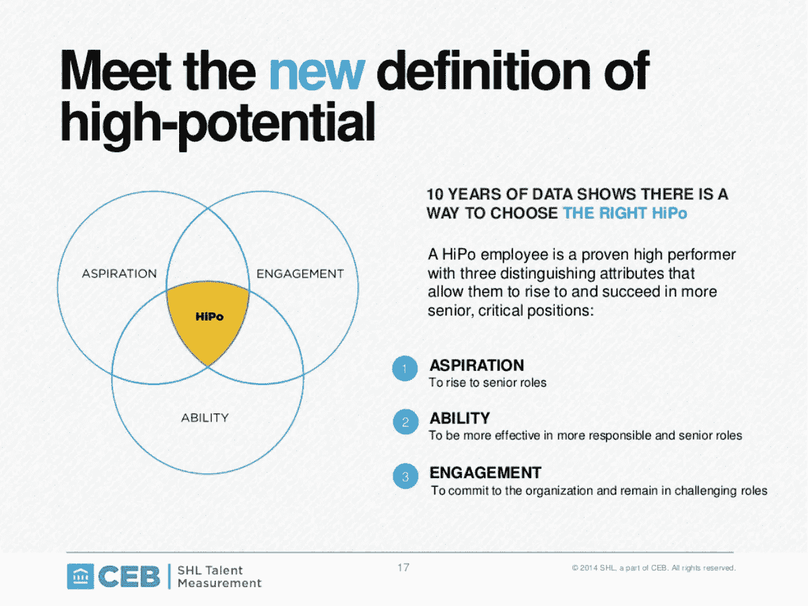

# 十年前的企业 HIPO 模型如何帮助预测企业家的成功。

> 原文：<https://medium.com/swlh/how-a-decade-old-corporate-hipo-model-can-help-predict-entrepreneurial-success-b34081c57f77>

## 传统的高潜力人才识别模型可以帮助投资者识别创业人才。

如果你在一家大公司呆过一段时间，你应该听说过内部高潜力或职业加速项目。大多数时候，我们倾向于忽略它们，因为它们是只有人力资源部门才关心的人力资源计划。没必要这样。

现已成为 Gartner 公司的 CEB 在十多年前提出了其 HIPO 模型，该模型认为(除其他外)当前的表现不是未来成功的唯一指标。高潜力员工需要展现出三种品质才能在未来的高级职位上取得成功:

*   **抱负**——你想做大事并获得不成比例的高回报吗？
*   **能力**——你能持续承担更艰难的角色吗？
*   参与度——你是否对事业有足够的投入，为实现目标付出额外的努力？

CEB’s HIPO model, read [more here](https://www.slideshare.net/CEB-Slideshare/hi-po-inboundslideshareglobalus-eng).

好吧，我不得不承认，这个模型脱离了它最初的背景，但它的大部分对创业公司和创业投资是正确的。该研究还指出，只有七分之一的优秀员工能够成为未来的高潜力领导者。

这听起来熟悉吗？

能力、抱负和参与是推动企业家成功的关键因素。当创始人创办一家公司时，他们几乎总是在追求一个之前没有经过广泛测试的想法。歧义性高。方向低。如果你对未来的荣耀没有很高的期望，也没有坚持下去的决心，你很可能不会成为一个企业家很久。

## 那么，这有什么关系呢？

很多早期投资都是基于对创始人能力的信任。种子和天使投资者正在寻找一支优秀的企业家团队来实现崇高的目标。作为一个早期投资者，你的钱是在创始团队，而不是具体的想法。也就是说，选择合适的创始人并非易事。

在你签署支票之前，了解创始人和他们的动机是有好处的。你不能给他们一份调查问卷或进行心理分析，所以你只能凭直觉去做…这和你现在做的没有太大区别。

> 围绕创始人的抱负、能力和参与度与他们交谈，将有助于从一群高绩效的顶尖人才中挑选出赢家。

## 对话如何变化？

当你押注于创始人时，把你的谈话集中在驱动他们未来选择的因素上——是创建一家美元美元的公司，还是以美元美元的价格退出。不要简单地专注于想法(无论如何都会改变)，而是回顾一下创始人这样做是为了什么。或者，根据上述模型，关注他们的愿望是什么。

谈谈创始人到目前为止是如何适应新体验的。他们是如何学习新技术的。适应和学习的能力，卷起袖子开始干脏活的能力，以及坚持下去的韧性，将会让那些更上一层楼的创始人与众不同。

了解创始人如何致力于解决手头的问题。解决问题是否足够驱动他们？他们会每天投入额外的时间来解决吗？请注意，我不是在谈论对*想法*的承诺——如果他们致力于解决问题，他们将继续测试想法，直到他们找到解决问题的方法。

加速器和孵化器在使用相似的模型来找到适合他们项目的方法方面做得很好。[企业家首先非常关注雄心](/entrepreneur-first/tech-entrepreneurship-and-the-disruption-of-ambition-4e6854121992)寻找合适的人才。 [500 Startups 在他们的团队中寻找七个关键要素，包括抱负](https://500.co/ten-tips-for-getting-in/)。

TBH，以上几点适用于比早期投资更多的情况。如果你是一个寻找联合创始人的创始人，和他们谈谈能力、抱负和参与度。如果你要加入一家新的创业公司，问问创始人。无论你是在投资时间还是金钱，这些都是很好的问题。

***如果你喜欢看这个故事，请给它一个“👏".此外，跟着我，你会得到更多这样的故事。如果你正在推出一项新的产品或服务，请前往***[***www.sapsonic.com***](http://www.sapsonic.com)***报名或给我留言。首次咨询是免费的！***

## 这个故事发表在 [The Startup](https://medium.com/swlh) 上，这是 Medium 最大的创业刊物，拥有 317，629+人关注。

## 在这里订阅接收[我们的头条新闻](http://growthsupply.com/the-startup-newsletter/)。

