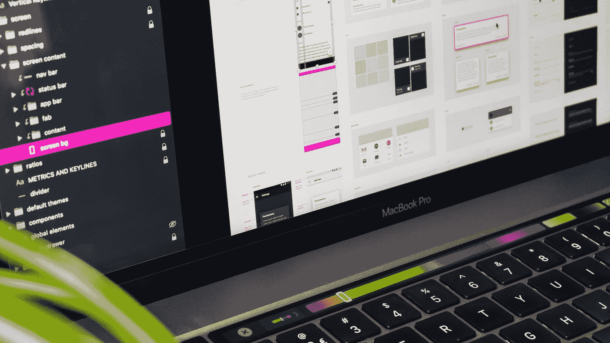
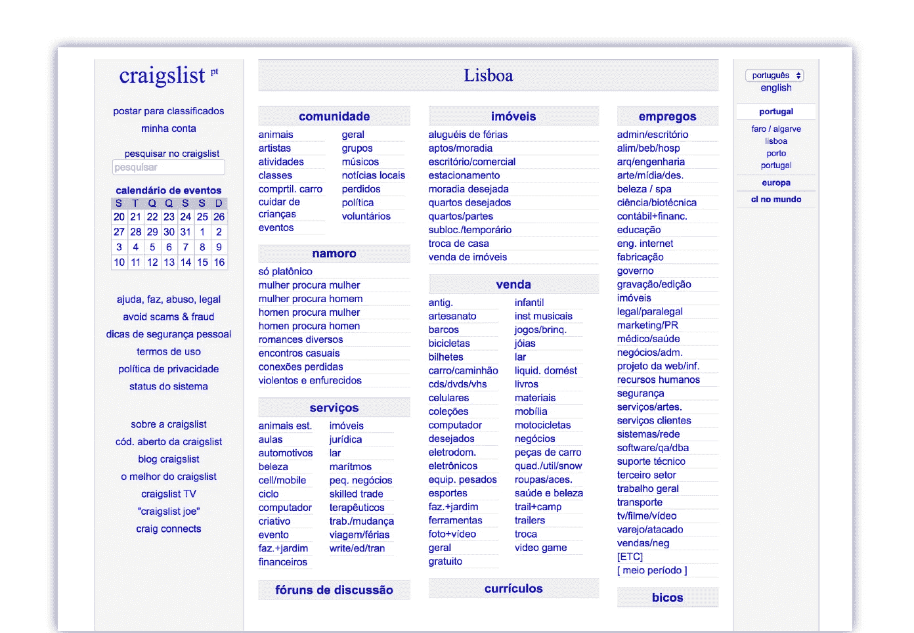
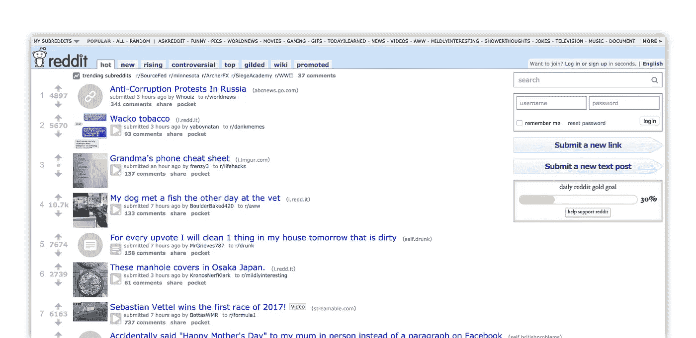
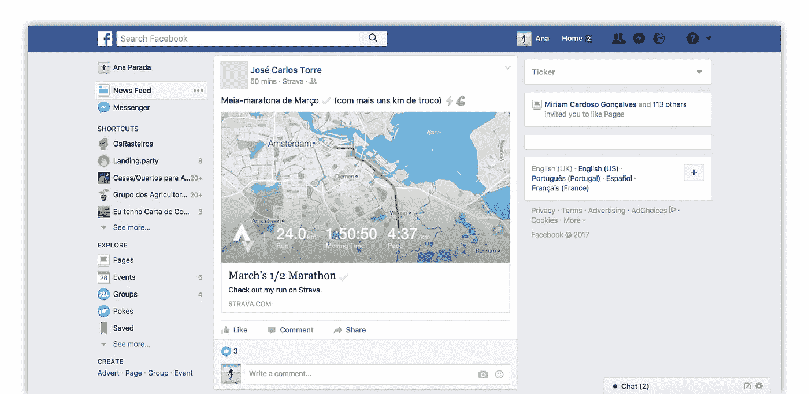
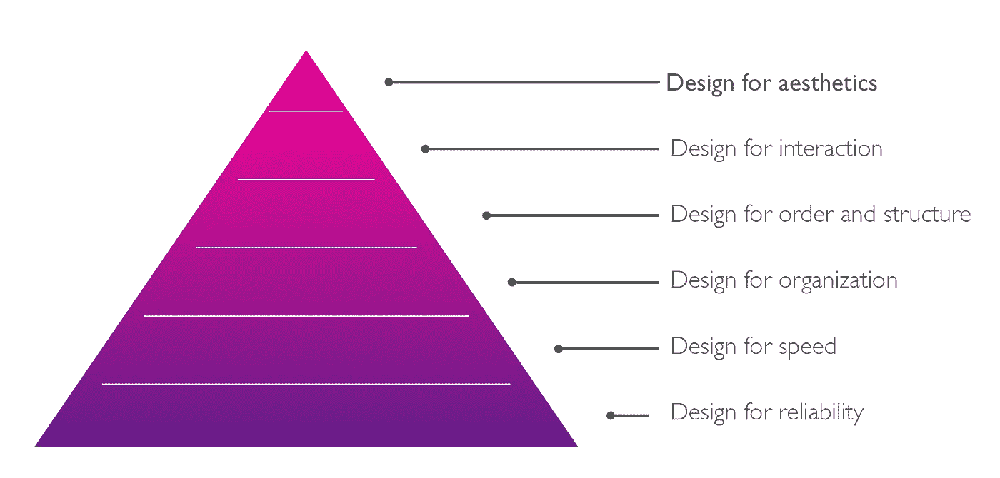
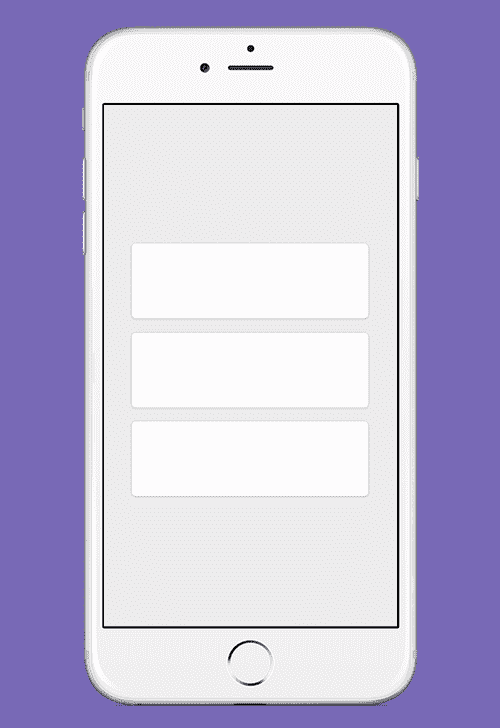
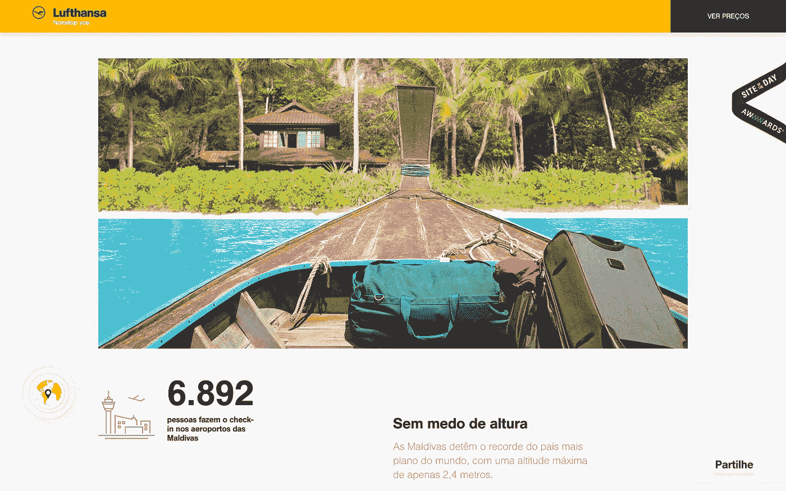
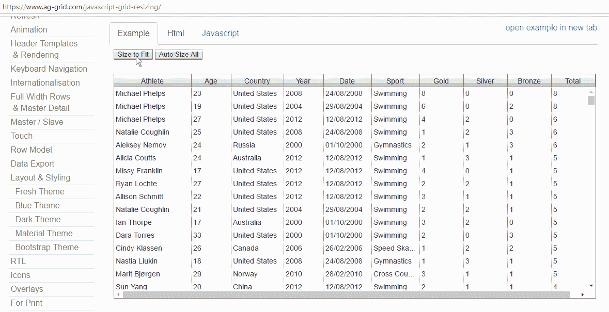

# 一个好的 UI 如何成为一个好的 UX

> 原文：<https://medium.com/swlh/how-a-good-ui-becomes-a-good-ux-aa7e08a75cd>

Photo by [Tirza van Dijk](https://unsplash.com/@tirzavandijk?utm_source=medium&utm_medium=referral) on [Unsplash](https://unsplash.com?utm_source=medium&utm_medium=referral)

去年(2017 年 3 月)，我在 [GDGLisbon](https://medium.com/u/1e3b0172cb89?source=post_page-----aa7e08a75cd--------------------------------) 为主要由开发人员组成的观众做了一次设计演讲。【https://www.meetup.com/gdglisbon/events/238243199】**)**

***任务**:试图澄清一些关于可用性、用户体验、用户界面的误解，以及这些元素中的每一个对于构建优秀产品的重要性。*

# *好的用户界面与坏的用户界面*

*坏的用户界面或好的用户界面背后的概念是什么？丑的时候不好吗？漂亮的时候好吗？只是见仁见智吗？是什么让我们更喜欢一个网站？*

**

## *常见误解第一部分*

> *如果一个界面有一个好的视觉设计，它会简单易用*

*第一名: **Craigslist***

**

*Craigslist’s Homepage*

*也许我们都同意这是一个糟糕的界面，只是因为没有什么吸引人的或有趣的东西。没有太多的颜色，甚至没有图像。但是这个接口的目标是什么呢？Craigslist 近 6000 万用户的主要任务是什么？
Craigslist 是一个分类广告网站，有社区论坛和数百个主题的广告，如体育、服务、工作、住房……
用户的目标是找到他/她想要的东西的最快途径。因此，这些带有 URL 列表的组是用户完成他们的目标所需要的。
内容是界面最重要的元素。信息架构是关键。*

*第二名: **Reddit***

**

*Reddit’s homepage*

*另一个非附加界面的例子。我在上面问的问题在这个例子中也是有意义的。在这种情况下，我们有 Reddit，一个新闻和网络内容的聚合器，人们可以在这里讨论任何类型的主题。用户在这里的目标是关注热门的子话题，也是他们最喜欢的话题，阅读讨论并参与其中。这是一个糟糕的用户界面吗？Reddit 每月有 5.42 亿访客(2.34 亿独立用户)。*

*第三名:**脸书***

**

*脸书是一个特殊的例子，因为世界上每个人都在使用它。无论文化，无论教育，年龄，甚至社会阶层。我们可以同意脸书没有吸引人的界面，但对于 18.6 亿月活跃用户来说，它工作得很好。*

## ***设计中的美学***

*美学是产品/服务设计的最后一个重点*

**

*首先，你必须创造和设计一个一致的产品。*

# ***UX** 在打造产品过程中的作用*

> *设身处地为用户着想，知道如何更好地满足他们的需求。*

*例如，我们可以说，UX 过程的主要目标是通过与最终用户/客户建立情感联系来增加产品的价值。*

*另一方面，可用性是实现良好用户体验的重要一步。*

*   *可用性目标是使界面*简单易用*。*
*   *可用性试图*最小化用户完成任务的努力*。*

*我们可以说，可用性和用户体验对于产品的成功至关重要。*

*所以在任何产品开始时，我们首先应该尝试回答这些问题:*

***1。**该产品/服务试图解决什么问题？*

***2。**谁是我的产品/服务用户？*

***3。他们(用户)的期望是什么？***

***4。**他们看重什么品质？*

***5。**他们期望什么？*

***6。**他们如何/何时使用产品/服务？*

> *当把 UX 和界面联系起来时，我们可以确定目标是强调“感觉像家”的感觉。*

## *常见误解第二部分*

> *如果一个界面易于使用，它就有良好的用户体验。*

# ***UI** 在构建产品过程中的角色*

*用户界面设计是实现良好用户体验的重要一步。*

> *视觉(UI)设计是使用图像、颜色、形状、排版和形式来增强可用性和改善用户体验。*

## *我们如何改善“体验”？？*

1.  ***通过给用户视觉反馈***

**

*交流交互的结果向用户显示界面已经被他的动作更新了。这让用户感觉一切尽在掌握。*

***2。通过给元素一些额外的空间***

*因为空白可以使内容更容易被发现和阅读。*

**

***3。通过使用响应式布局***

*…例如，避免可滚动元素。*

**

***4。通过使用好的副本***

*好的文案有时会运用幽默感。*

**

*制作一份好的文案对产品来说非常重要，因为:*

*文案中的用户界面可以更温暖，更少机械感，更具人性化。*

*好的文案也可以用来指导和帮助用户。*

*好的文案是对话式的，而不是指导性的。*

## ***所以，最后:***

*不要光靠视觉设计来挽回不好的体验，但是**不要忽视视觉设计！**
视觉设计是用户对你的产品的第一印象。*

> *视觉设计可以成为一个战略区分器，鼓励用户将一个应用程序看得比另一个同样有用的应用程序更重要。*

**

## *这个故事发表在 [The Startup](https://medium.com/swlh) 上，这是 Medium 最大的企业家出版物，拥有 293，189+人。*

## *在这里订阅接收[我们的头条新闻](http://growthsupply.com/the-startup-newsletter/)。*

**