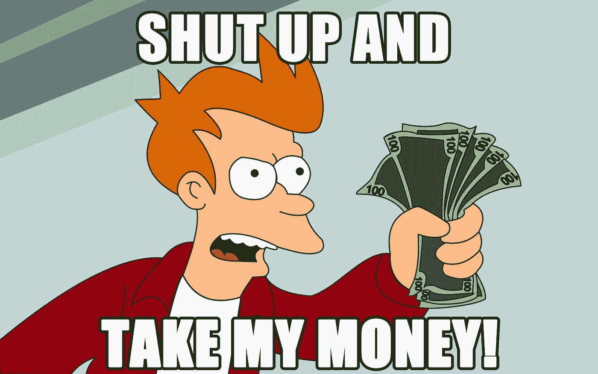

# 黑客马拉松如何改变了我的生活

> 原文：<https://medium.com/swlh/how-a-hackathon-changed-my-life-734432b0f1e>

## 或者:48 小时的忙碌如何重塑了我的大脑

Photo by [Austin Chan](https://unsplash.com/photos/ukzHlkoz1IE?utm_source=unsplash&utm_medium=referral&utm_content=creditCopyText) on [Unsplash](https://unsplash.com/?utm_source=unsplash&utm_medium=referral&utm_content=creditCopyText)

2017 年 3 月 30 日“社会企业家”这个概念并没有真正进入我的视野。事实上，可以公平地说，总体来说，我没有多少创业抱负。我有一份工作；我有一些爱好；我参加了一些专业聚会。这都是…非常标准的。

然后，3 月 31 日， [GiveBackHack](https://givebackhack.com/) 出现了，一拳打在我脸上。从好的方面来说。以一种“站起来做点什么”的方式。

而现在，在过去的一年里，我感觉有点像刚刚醒来。

我职业生涯的大部分时间都在呼叫中心行业度过。在一段令人窒息的电话营销工作和结束我在一家呼叫中心软件公司担任产品经理的那段职业生涯之间，我工作了 15 年，为其他企业努力降低与客户互动的成本做出了贡献。

简单地说，我的工作是帮助企业赚更多的钱。

当我从一个位置跳到另一个位置时——事实上超过 12 个——没有什么是真正固定的。有些工作最终变得无聊，但许多工作提供了令人兴奋的挑战，并有才华横溢、充满活力的人来应对这些挑战。但这项工作总有一些令人讨厌的不满足感。

几年前我终于意识到了这个问题:

我只是不在乎如何帮助企业赚更多的钱。

当然，企业赚更多的钱本身并没有错，但是，在我从事呼叫中心行业的所有时间里，我就是找不到一个超越底线的*目的*。

所以我离开了。

我在休假，尽我所能让自己沉浸在哥伦布的文化中。我在产品管理方面的工作激发了我对软件开发的热情，所以我去参加技术讲座、聚会和社交活动，试图了解这方面的情况。

发现这样一个蓬勃发展的技术社区就在我的眼皮底下，这是令人惊讶和有点震惊的，它主要是通过 Techlife Columbus 及其赞助商的赞助而变得容易访问。我不记得在 2016 年我是如何听说 GiveBackHack 的，但我现在认为是通过他们的一份简讯。

我没有去那个，虽然我希望我去了。我早一年就知道我现在所知道的。

到 2017 年 2 月，我已经在一家软件咨询公司工作了大约一年，利用咨询作为一个机会来找出我在这个世界上的位置，仍然没有完全击中目标。当 GiveBackHack 2017 的活动通知到达脸书时，我立即买了票。

如果我完全诚实的话，我不知道我要签的是什么。我从未参加过黑客马拉松或创业周末之类的活动，而且，由于主要与技术的商业方面有关，除了最基本的软件开发技能之外，我一无所知，我真的不知道自己能做些什么。

不管怎样，我知道这将是不同的东西——有 T2 目的的东西。我的意思是，只要读一下来自[脸书事件](https://www.facebook.com/events/1773141332947782/)的描述，告诉我你一点也不感兴趣:

> 周末的目标是将社区领袖、设计师、开发商和其他关心的公民聚集在一起，创造有助于产生持久社会影响的解决方案。

是的。请给我来点那个。

如果你想知道我的经历，你可以在这里阅读:

 [## 十个完全陌生的人走进一个房间，决定创办一家社会企业

### 我不记得我是如何听说 GiveBackHack 的，但我记得我对自己感到失望，因为 2016 年…

medium.com](/daca-time/ten-complete-strangers-walk-into-a-room-and-decide-to-start-a-social-enterprise-33e6bedd6493) 

但除了周末的力量之外，我的心灵上还有某种持久的印记，就像一些社会企业家的巫术，不知何故让我看到了隐藏在哥伦布平原上的另一个充满活力的生态系统。

事实证明，在哥伦布市有很多人想从事公益事业，他们希望自己的职业生活和目标内在地交织在一起。

事实证明，我也是其中之一。

现在，差不多一年过去了，我已经变成了我想我会称之为社会企业极客的人。

我辞去了咨询工作，去了一家公司工作，这家公司的使命是帮助人们过上更健康的生活。我几乎每周都会与非营利组织和企业家会面，试图找到我可以提供帮助的方法。当人们与我谈论他们的商业想法或他们发现的一些问题时，我会引导他们产生可持续的社会影响。

我发现自己一直在思考*的目的*。

有点好笑:GiveBackHack 的开场演讲之一来自大猫咪实验室的丹·洛克威尔。他首先断言，每个人都有需要去挠的创业之痒。我记得当时我内心翻了翻白眼，觉得这一切都有点戏剧性，我真的没有这样的痒。我只是在检查这个随机事件。我甚至没有感到刺痛。

 [## 回馈黑客！—大猫咪实验室

### 刚刚过去的这个周末是在俄亥俄州哥伦布市举办的一个相对较新的黑客马拉松系列活动。它是围绕……

www.bigkittylabs.com](https://www.bigkittylabs.com/2017/04/05/giving-back-hack/) 

该死的，丹，我猜你是对的。

我确实有那种瘙痒，抓挠它让我进入了一个新的世界观，给了我机会与一些最不可思议的人见面并一起工作，使哥伦布成为当今美国最不可思议的城市之一。有趣的是，丹在他的文章中说:

> 回馈黑客真的是生活加速器。

他没开玩笑。

几周前，我在 T2 的《创业之路》中读到了这句话:

> 天才分布很广，但机会还没有。随着越来越多的人有机会尝试创业，世界将不再一样。

他是对的，想象一下，如果我们能把这种广泛分布的天赋更多地应用于社会问题，就像我们把它应用于经济问题一样。

我想了很多，试图找出哥伦布市最大、最紧迫的问题是什么，我们可以尝试以经济可持续的方式来解决。是获得干净的水吗？贫穷？收入不平等？

如果最大的问题是我们没有足够的社会企业来解决这些问题呢？如果越来越多的人有机会尝试*社交*创业，会发生什么？那么，世界会是什么样子呢？

我认为这就是 GiveBackHack 和围绕它的生态系统的全部内容:降低壁垒，传播意识，为企业家提供一个真正的社会影响发射台。

注意:如果你去参加他们的活动——你真的应该去——你的大脑可能会像我一样被重新连接。

但我保证你会有好伙伴。

## 这篇文章发表在 [The Startup](https://medium.com/swlh) 上，这是 Medium 最大的创业刊物，有 295，232+人关注。

## 订阅接收[我们的头条新闻](http://growthsupply.com/the-startup-newsletter/)。

