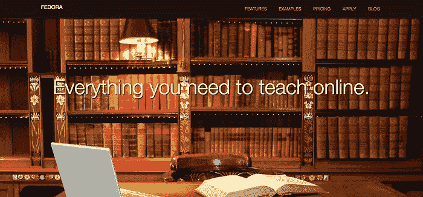
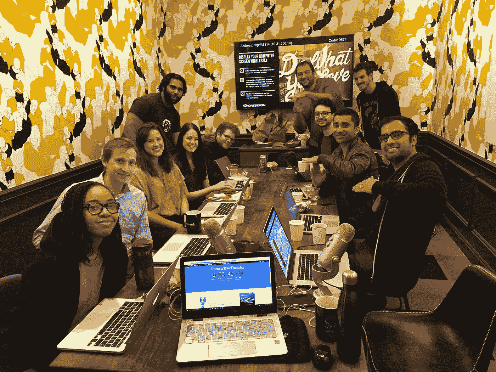

# Fedora 现在可以教了

> 原文：<https://medium.com/swlh/how-a-side-project-grew-up-to-become-a-company-66df8634c787>

## 一个副业项目如何成长为一家公司

无处不在的硅谷神话是这样的:创始人热衷于解决一个巨大的问题，在强大愿景的驱动下筹集了数百万资金，并在激烈的斗争中最终改变了世界。

我们的故事不是那样的。

## 【2013 年秋季

Fedora 最初是作为一个辅助项目来挠痒痒的。

我和我的搭档康拉德在 Udemy 上教授课程。我们赚了一些钱，但向学生推销我们无法直接接触到的课程似乎是不明智的。

所以我把自己锁在房间里三天，建了一个[非常简陋的网站](https://web.archive.org/web/20131104051729/http://hacktheappstore.com/)，直接向人们销售我的移动营销课程。

几天后，我说服康拉德代表他的机构使用这个工具，成为我们的第一个付费客户。一周后，我们签下了我们的[第二](http://i.imgur.com/FAaZLxR.png)和[第三](http://i.imgur.com/tCtpZ09.png)付费客户，作为一个未命名的附带项目。

Our stellar first landing page

一个从未被建立成为创业公司的副业项目。没有更大的愿景，我对弥漫在科技初创企业中的“改变世界”的论调感到吃惊。

这是一个简单的附带项目，有点吸引力，需要一个名字。所以，我从一顶象征性的帽子里选了一个名字，Fedora 就这样诞生了。

## 【2014 年夏季

我们有几十个活跃的客户，他们不仅在使用产品，还在慢慢塑造产品。

我们雇佣了我们的[第一](https://twitter.com/chrisrxth)承包商和我们的[第一](https://twitter.com/noahpryor)员工。三周后，他带来了我们的第二个孩子。另一个[朋友](http://twitter.com/RubyBrewsday)出现并免费工作，直到他成为公司不可或缺的一部分。

我们雇佣了第三名员工。然后，我的合伙人和第一个客户从顾问一跃成为全职联合创始人。

> 神奇的事情正在发生。

承包商变成了雇员。顾客变成了投资者。一名顾问成为了联合创始人。一路走来，我们成了一个团队。

不全是彩虹和蝴蝶。我仓促拼凑的技术烂透了。不理会[秒系统效应](https://en.wikipedia.org/w/index.php?title=The_Mythical_Man-Month&redirect=no#The_second-system_effect)，我们开始从头开始重建整个产品。

**这将决定我们将成为什么样的人。**

我们没有围绕现有产品建立团队，而是获得了一个难得的机会，作为一个团队来建立一个全新的产品。

这是一款平等属于我们所有人的产品，我们都投入了自己的一部分——无论我们将来做什么，它都将永远属于我们。

我的副业项目成长为我们公司。

我们公司开始需要一个名字。这个名字反映了我们的客户和我们的信念。一个代表我们所有人的名字。

## 2015 年秋季

这是疯狂的两年。我们已经帮助 5，000 多名教师开设了 12，000 多门课程，教授了 700，000 名学生，并创造了超过 350 万美元的收入。

在某个时候，我们也开始相信某些事情。

与建立在特定愿景上相反，这些信念来得很慢。它们是多年来与我们的客户日常互动的结果。

我嗤之以鼻的“改变世界”的花言巧语？罪名成立。

# 介绍…可教的

# ***我们的指导方针***

我们的老师是我们的顾客。

与迎合学生和教师的在线教育市场不同，我们专注于让我们的教师能够以在线教学为生。

我们正在扩大教师群体的范围。

任何有弟弟妹妹的人都可以证明，教书是世界上最原始、最自然的事情。我们先教后说，我们无时无刻不在教我们的朋友、家人和同事，然而我们害怕把自己当成老师。

无论你是教绘画、编程、书法还是营销，无论你的媒介是博客帖子、Snapchat、Youtube 视频还是解释性舞蹈——如果人们向你学习，你就是老师。

我们相信未来最成功的老师将会是企业家。

我们相信世界上最有动力的人是企业家。未来最成功的教师将会是企业家——而这些企业家是我们自豪地称之为客户的人。

我们相信每个人都可以教，一切都是可以教的。

> 我们是可教的。

Launch day ~5 min ago.

[安库尔·纳帕尔](http://twitter.com/ankurnagpal)代表[艾利森·哈格](https://twitter.com/allisonhaag)，[安德鲁·古登森](https://twitter.com/AGuttormsen)，[阿什利·霍克尼](https://twitter.com/ashleyhockney)，[卡梅隆·马蒂斯](https://twitter.com/jaundicedave)，[克里斯·罗斯](https://twitter.com/chrisrxth)，[康拉德·瓦多夫斯基](http://twitter.com/conradwa)，[达斯汀·艾希勒](https://twitter.com/dustineichler)，[杰克·菲尔普斯](http://twitter.com/jack_was_taken)，[杰克逊·里索](https://twitter.com/JacksonRiso)，[贾斯汀·格雷泽](https://twitter.com/justinglazer)