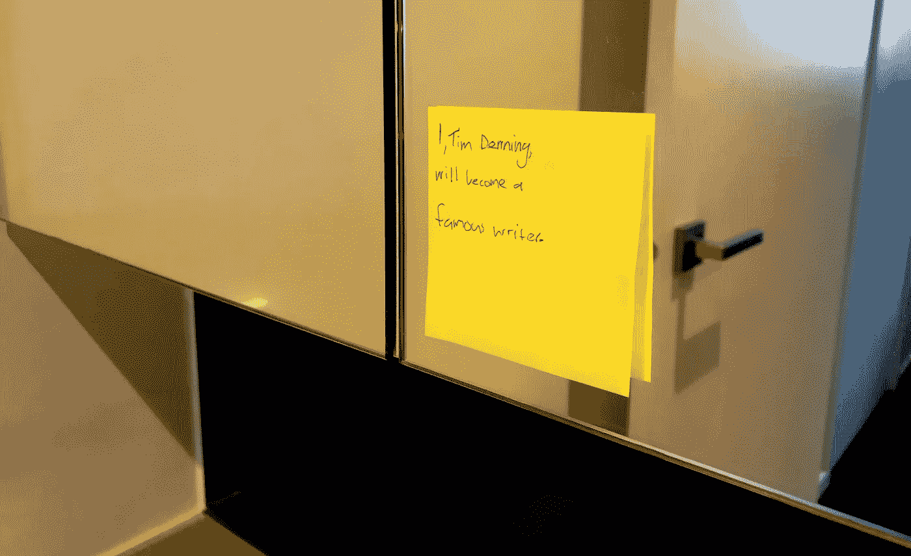

# 我浴室镜子上的便利贴是如何对我的生活产生巨大影响的

> 原文：<https://medium.com/swlh/how-a-sticky-note-on-my-bathroom-mirror-massively-impacted-my-life-1ff0684fecf4>

专注是一件很难获得的事情。我们脑子里有太多东西在嗡嗡作响。这是我们生活的数字时代。

我想我应该集中精力做一件事。

一天早上 8 点上班前，我拿出一张贴着的黄色纸条，写下如下内容:

> 我，蒂姆·丹宁，将会成为一名著名的作家。

当我现在读到这些文字时，我仍然觉得有点愚蠢。一张贴有这种东西的便条怎么会对我的生活产生巨大影响？

我一秒钟也不相信贴出来的纸条是我的救星。

最简单的实践经常被忽视或者因为太“简单”而被摒弃

在我把那张纸条贴在浴室的镜子上之后，我就没把它放在心上了。每天我都会走进浴室，上厕所，刷牙。在这些虚无的时刻，我会盯着镜子。

**我情不自禁地注意到这张亮闪闪的便条正盯着我。**

很难不看到它像太阳一样的善良。

所以，每次我去洗手间，我都会看贴在纸条上的内容。这条消息似乎无关紧要。

把那张贴好的纸条贴在我的镜子上后，我想都没想，每次读到贴好的纸条上的内容，我都会在电脑上写点什么。对于一个喝很多水的人来说，这意味着去很多次洗手间，甚至更多地接触到这张小小的黄色便条。

有时候是 LinkedIn 上的一些书面评论。

其他时候，在 Quora 上回答一个问题需要 100 到 200 个单词。

在我精力充沛或有心事的日子里，我会写一些关于 Medium.com 的长文

我在哪里写作并不重要；重要的是我抓住一切机会写作。

当我看了贴好的纸条，然后写了一些东西，我感觉很好。

每次我按照贴在纸条上的一个指示去做，都会让我有一种成就感。

> “即使这一天我没有完成任何其他事情，但做了我在张贴的纸条上承诺的事情，其他事情都是值得的”

在我在那张黄色的小纸条上写下任何东西，并把它贴在我浴室的镜子上之前，我有冲突的优先权。有健身房，公共演讲练习，数字营销研究和 101 本书要读。这是一场意志力的持续斗争，以找出该关注什么。

Image Credit: [NewGStudio](https://newgstudio.com/war-mind/)

> 空闲时间成了我头脑中对抗相互冲突的优先事项的战争。贴在我浴室镜子上的纸条彻底结束了那场战争。

一件事。写的清清楚楚。如此简单，任何人都能理解。

# 重点是。

听起来都不错，不是吗？

嗯，这个故事是有意义的。有人会说这是一个惊喜。

就在我把这张便条贴在浴室镜子上，开始练习说“我，蒂姆·丹宁，将成为一名著名作家”的同一个月，一封令人惊讶的电子邮件进入了我的收件箱。

> 邮件内容是“你是 LinkedIn 的顶级代言人”

有些人可能不知道这个奖是什么，没关系。

对于一个试图成为著名作家，并通过创业和个人发展来激励世界的人来说，这表明了在实现这一目标方面取得了重大进展。

这个奖意味着我的作品每个月都能接触到数百万人。

我镜子上的便利贴可以被描述为一种肯定，一个目标，一个关注的领域——有一千种不同的方式来描述它。

我认为这种做法的名称并不重要。镜子上的便利贴的重要之处在于，它是一种日常练习，它让我忙碌的头脑专注于一件事。

读到这里的许多人都没有能够实现你一生中一直想要的东西，因为你没有每天都有意识地朝它努力。虽然不是你自己的错，但你的思想已经变得分散了——部分是由于互联网——所以你生活中的所有其他任务都被妨碍了。

> 像我一样，你可能认为在镜子上贴便利贴这样的小习惯很愚蠢，所以你从来没有尝试过。

我就是活生生的例子，证明了浴室镜子上的便利贴会极大地影响你的生活。

深思熟虑的练习和专注会让你实现目标的过程自动化。

自动化你所寻求的改变。

# 行动呼吁

如果你想提高你的工作效率，学习一些有价值的生活窍门，那就订阅我的私人邮件列表吧。你还将获得我的免费电子书，它将帮助你成为改变游戏规则的在线影响者。

[**马上点击这里订阅！**](http://timdenning.net/free-ebook)

## 这篇文章发表在 [The Startup](https://medium.com/swlh) 上，这是 Medium 最大的创业刊物，有+396，714 人关注。

## 订阅接收[我们的头条新闻](http://growthsupply.com/the-startup-newsletter/)。

