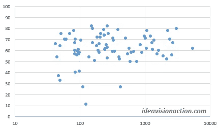

# CoSchedule 标题分析器有多准确？

> 原文：<https://medium.com/swlh/how-accurate-is-coschedule-headline-analyzer-1846019e7ff9>

[Lalmch/pixabay](https://pixabay.com/en/computer-summary-chart-business-767776/)

*   CoSchedule headline analyzer 是一款深受博客作者欢迎的工具。
*   我用我在创业刊物的[上发表的 82 篇博文测试了它。](https://medium.com/swlh)
*   标题的分数和我的帖子的浏览量不对应。
*   尽管如此，还是可以从这个工具中学到一些有价值的经验。

**最值得推荐的三个工具**

两周前，我分析了我的中等统计数据，并发表了一系列关于结果的文章。

**在主流媒体上发表文章是获得浏览量的最大因素。**帖子的标题是第二大因素。我给[发了几个帖子，想出了一些被点击的标题](https://ideavisionaction.com/blogging/a-three-step-exercise-to-come-up-with-popular-blog-post-titles/)。

在我发表了那些帖子之后，我收到了很多关于三个工具的推荐。

1.  [Grammarly.com](https://www.grammarly.com/)
2.  [海明威应用](http://www.hemingwayapp.com/)
3.  [协同计划标题分析器](https://coschedule.com/headline-analyzer)

海明威应用程序非常好，它进入了我的标准工具箱。

语法上

我还是要在语法上试试。我推迟了这个，因为它没有一个像海明威应用程序一样的简单易用的试用版。

语法上要求在我的浏览器中安装一个插件。火狐警告我不要这么做。

> 安装这个插件意味着语法上可以看到我在浏览器中输入的所有内容。

正如我在关于隐私的帖子中解释的那样，我不想那样。我会找到另一种方法来尝试语法。

**协同日程标题分析器**

今天，我想尝试一下 CoSchedule 标题分析器。结果喜忧参半。它有它的优点和缺点。

CoSchedule 标题分析器没有进入我的标准工具箱。然而，我会不时地使用它。从中可以吸取教训。

什么是协同调度？

[协同日程](https://coschedule.com/)是一个在线营销管理工具。您可以将它用于以下用途。

*   计划和自动化您的营销工作。
*   追踪你的结果。
*   管理你的团队。

**对自动化营销管理工具的需求**

我还没有尝试过 CoSchedule，但是我需要这样一个工具。我会单独写一篇关于自动化营销管理的文章。我可以使用这样的工具，但是我想先写下我的需求。

**用免费工具推广你的在线业务**

用免费工具推广你的在线业务是一个精明的策略。人们喜欢使用这样的工具，他们互相推荐。

标题分析器是 CoSchedule 工具箱中的工具之一。他们给你免费的访问权以换取你的联系方式。

**标题分析标准**

我期望这个工具能给我一个分数和一些提示。除了分数之外，它给了我一份详尽的报告。它检查标题的以下因素。

*   单词平衡
*   标题类型
*   长度分析
*   前三个，后三个单词
*   关键词
*   感情
*   谷歌搜索预览
*   电子邮件主题行预览

一些因素有链接到更详细的博客文章。我还没有读过那些博客文章，但它们现在在我的阅读清单上。

让我们回顾一下每个因素，并分享我的观察结果。

**字平衡**

这里的想法是你的标题中有四种类型的单词。

1.  普通的
2.  不寻常的
3.  情绪的
4.  力量

你需要在标题中平衡这些词的类型。该工具为每种单词类型推荐一定的百分比。请查看该工具，了解每种单词类型的具体百分比。

我喜欢平衡单词类型的想法，但是**这个工具不能对我标题中的所有单词进行分类。**因此，每个类别中的单词总和并不等于 100%。这让我对最终分数的准确性产生了质疑。

此外，它还将“技能”和“专注”等词归类为情绪词。

该工具无法识别由撇号连接的单词。例如，它将“you 're”末尾的“re”识别为一个单独的单词。

**标题类型**

该工具可以识别几种标题类型。它在我的标题中识别出以下类型。

当它识别出标题类型时，它会给你一个绿色的勾号。如果它不能识别标题类型，它会给你一个警告信号，称你的标题为“通用”我不喜欢那个结论。

首先，它建议所有的博客文章都应该符合预先确定的模板之一。当然，这些模板可以帮助你想出新的博文创意。

> **为什么我每次写博文都要跟着他们？这其中的创意在哪里？**

此外，[“如何”标题在我的经验中表现不佳](https://ideavisionaction.com/blogging/the-winning-formula-for-composing-blog-post-titles-that-get-clicked/)。我相信它们被过度使用了，人们对它们已经免疫了。他们在其他博客帖子的人群中并不突出。

**长度分析**

这是最有洞察力的因素之一。标题分析器推荐大约 55 个字符和 6 个单词长的标题。这对我来说很有意义。

**如果你想包含更多的信息，把标题分成两部分。**将第二部分作为斜体小标题添加到内容中。这样的话，标题就不会太罗嗦，字幕仍然会出现在预览卡中。

**前三个，后三个字**

这绝对让我大开眼界。人们倾向于阅读标题的前三个字和后三个字。这些话足够说明你的文章了吗？或者是常用词？

**关键词**

我明白你必须在你的博文标题中包含战略性关键词。但是头条分析器拉出来的关键词并没有说服我。它以“你是”中的“我”和“你是”作为关键词。

**感悟**

我同意这个因素背后的想法。你的标题越有感情色彩，就会吸引越多的读者。

标题分析器告诉你你的标题是正面的、负面的还是中性的。有负面情绪并不是坏事，因为这也有情绪上的负担。

有时，我会因为在标题中使用过于强烈的词语而受到批评。比如[这是我从自己最讨厌的博文](https://ideavisionaction.com/blogging/this-is-what-i-learned-from-my-most-hated-blog-posts/)中了解到的。然而，这些强烈的话语吸引着读者。

**谷歌搜索预览&电子邮件主题行预览**

我发现两个预览都很有帮助。

**有多准确？**

这是关于这个工具最重要的问题。我只能根据自己的数据来回答。我在我写的 82 篇发表在创业刊物上的博客文章中测试了它。

正如我上面提到的，一些因素的细节并不准确。总得分反映了这些不准确性。

我比较了我的帖子的浏览量和标题分析器的分数。**相关性仅为 11%。**你可以在图 1 中看到。这两个数据之间没有关系。

Fig. 1\. Scatter Chart. Headline Analyzer Overall Score vs Number of Views

这个结果可能是我的错误。我通过只使用一个出版物的帖子来标准化我的数据。

我也可以对一周中某一天的数据进行归一化，因为周一发布的**帖子往往会比其他帖子表现得更好。**

在这两种情况下，我认为浏览量和整体标题得分之间有很高的相关性。如果没有这种相关性，我就不会每天使用这个工具。

**结论**

自动标题分析器是一个好主意。我从中吸取了一些重要的教训。我打算以后去参观一下，了解更多。然而，这一工具仍有改进的余地。

**改进点**

*   单词平衡中的单词分类
*   用撇号连接的单词的识别
*   它将一些简单的单词识别为关键字。
*   总体分数与我的帖子的浏览量几乎没有关联。

如果 CoSchedule 解决了这些问题，他们的标题分析器会是一个有用的工具。

**正向**

在一些极端的情况下，它给了我准确的分数:

这是一种教育工具。我学到了最佳的单词平衡，标题长度，以及开头和最后三个单词的重要性。

**未来工作**

这是我的后续行动清单。我对#2 和#3 特别好奇。我也会把它们贴出来。

1.  阅读 CoSchedule 标题分析器链接的博客文章。
2.  使用并复习语法。除了 MS 单词语法和拼写检查之外，还有什么附加价值？
3.  写下我对自动化营销工具的要求。

**轮到你了**

*   你用过 CoSchedule 的头条分析器吗？
*   你怎么想？
*   每个帖子都用吗？
*   你还使用和推荐其他工具吗？

***如果你觉得这篇文章很有价值，注册*** [***每周简讯***](https://ideavisionaction.com/email-newsletter/) ***就能收到我关于创业、企业家精神、领导力和自我提升的文章综述。***

## 这个故事发表在 [The Startup](https://medium.com/swlh) 上，这是 Medium 最大的创业刊物，拥有 317，629+人关注。

## 在这里订阅接收[我们的头条新闻](http://growthsupply.com/the-startup-newsletter/)。

