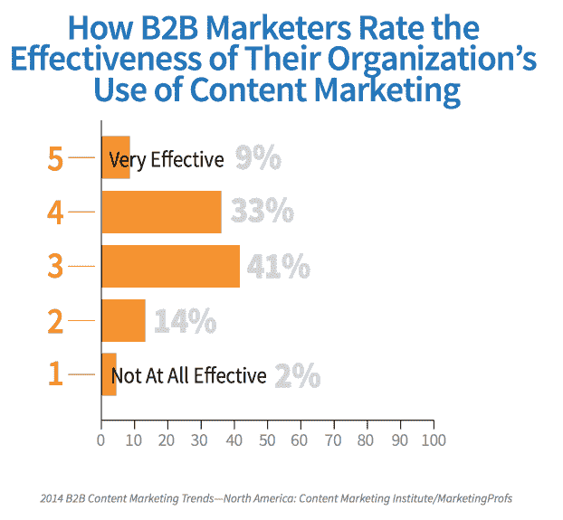

# 人工智能将如何把内容营销从毁灭的边缘拉回来

> 原文：<https://medium.com/swlh/how-ai-will-pull-content-marketing-back-from-the-brink-of-destruction-d1d205034582>

海明威试图警告我们。

> "你所要做的就是坐在打字机前流血."

我们要流血。

因为[我们创造了一个怪物](https://www.brightinfo.com/blog/how-much-is-too-much-content)，它决心摧毁内容营销，这曾经是我们走向[自我毁灭](https://www.hubspot.com/stories/chatbot-marketing-future)的漫长旅程中的救命恩人。

> “有一个内容怪兽，它正在撕裂内容营销。
> 
> 怪物是不受控制的生物，它们对理性或逻辑没有反应，它们就是这样；没有目的。"

你知道更可怕的是什么吗？

几乎[大家都在做内容营销](https://blog.kissmetrics.com/content-isnt-working-for-you/)。然而，不到一半的 B2B 营销人员认为他们的努力比“哼”表现得更好

[Source](https://blog.kissmetrics.com/content-isnt-working-for-you/)

我们有一个千载难逢的机会来扭转局面。

如果 Seth Godin 所说的内容营销是我们剩下的唯一营销是真的，我们最好抓住它。

人工智能就在这里，它可能会把内容营销从毁灭的边缘拉回来——如果我们放任它的话。

当我说人工智能将拯救内容营销时，你可能会马上想到让你最耗时的任务——比如整个*写作*的事情——离开你的盘子。

没那么快。

高质量的内容还不能完全自动化。但是可以增加。

一些聊天机器人已经足够智能，可以在我们能够进行查询的同时，将大量相关数据放在我们的指尖。

以今天超过 12K 的营销人员使用的 GrowthBot 为例。它与十几个系统和 API 对话，带来了一些很酷、很有用的功能:

[Source](https://growthbot.org/)

是的，人工智能可以写完整个博客是真的。事实上，已经发生了。你可能在不知不觉中读过一本。

美联社已经使用人工智能来创建大量的体育和金融报道。

Engadget 将一百万个单词和一些规则混合在一起，创建了一个“博客机器人”,发布了一个完整的、尽管单调的技术公告。

> 后置摄像头是一个 1200 万像素的单元，分辨率低于这个价格范围内的大多数传感器，但三星声称，由于像素更大和快速自动对焦，它无论如何都能拍出很好的照片。

你能相信这是机器人写的吗？大概吧。

就连贯性和创造性而言，这是人工智能的极限。

考虑到内容的泛滥[并不完全起作用](https://blog.bufferapp.com/55-visitors-read-articles-15-seconds-less-focus-attention-not-clicks)，这些当前的限制实际上可能是一件好事。

什么*是*工作就是**品质**。高质量的内容给读者独特的体验。高质量的内容符合你和他们的目标。

质量内容[是史诗](http://contentmarketinginstitute.com/author/joepulizzi/)。

> “内容量很重要。企业组织需要许多不同形式和多渠道的大量内容。
> 
> 但是不能牺牲质量。要打破杂乱，内容必须是史诗。"
> 
> ——乔·普利兹，[内容营销研究所](http://www.contentmarketinginstitute.com/)的创始人

AI 能创造史诗内容吗？还没有。

但是它可以帮助你研究、编辑和维护[非常有价值的](/swlh/kill-your-conversion-funnel-9367e461a46f)内容营销。

[Source](https://www.artsy.net/article/artsy-editorial-life-death-microsoft-clippy-paper-clip-loved-hate)

还记得 Clippy，那个世人又爱又恨的回形针[？](https://www.artsy.net/article/artsy-editorial-life-death-microsoft-clippy-paper-clip-loved-hate)

它可能没有自我意识，也没有那么有帮助，但它预示了内容营销的[未来，这是机器学习公司 Kemvi 的创始人](https://thinkgrowth.org/ai-and-big-data-are-changing-our-attention-spans-959923adad7f) [Vedant Misra](/@vedantmisra) 所梦想的:

> “机器将帮助我们制作内容。
> 
> 机器会建议在你制作的内容中包含资产，或者包含内容的子集。
> 
> 执行控制仍将属于创作者，但构思和制作过程将变得越来越自动化。
> 
> 想想微软 Office 助手 Clippy，但它的大脑要大得多。"

虽然这个梦想还没有完全实现，但一个看起来很像救生筏的形状正在形成，它将我们从淹没在内容中解救出来。

人工智能工具可以分析趋势，告诉你你的每一个读者想要阅读什么内容。他们可以根据他们的行为和大量其他数据告诉他们该读什么。

但是他们能帮助从零开始开发史诗般的阅读材料吗？

事实上是的。

以原子人工智能为例。

一旦为你的故事(或电子邮件，或任何东西)提供了足够的目标受众数据，智能程序将计算可读性，为你提供实时定制的预测性建议。

[Source](https://twitter.com/i/web/status/924652184364466177)

当然，这只是第一步。

如果说人工智能在一件事上优于人类，那就是[理解数据](http://contentmarketinginstitute.com/2017/08/marketers-use-artificial-intelligence/)。

人工智能平台从大量输入中推断出行为模式，这将需要我们多年来组织，更不用说理解了。

更好的是，他们可以告诉你如何根据这些知识*行动*。

> “通过分析单个用户的数百个数据点(包括位置、人口统计、设备、与网站的交互等。)，AI 可以显示最合适的优惠和内容。”
> - [内容营销学院](http://contentmarketinginstitute.com/2017/08/marketers-use-artificial-intelligence/)

一旦你有了完美个性化的内容；一个智能系统可以告诉你何时、何地以及多久发布和分享一次，以获得最大的影响。

然后，整个循环再次开始，根据你的观众与你的内容的互动方式，智能推荐他们感兴趣的话题。

[Source](https://cdn2.hubspot.net/hubfs/253739/DemandMetric_Content_Personalization_Benchmark_Study_Report_Final.pdf?t=1476185057935)

# 其意义远远超出了简单地撰写史诗般的博客文章。

Evergage 和 Researchscape International 发现，70%接受调查的组织表示，电子邮件是最重要的个性化营销渠道。

对这些受访者来说，幸运的是，人工智能让根据订户关心的东西来个性化电子邮件内容变得比以往任何时候都容易。

不再对着虚空大喊大叫。

[Source](http://www.evergage.com/wp-content/uploads/2016/06/2016-Trends-in-Personalization-Survey-Report-Evergage-final.pdf)

用户体验和转化率优化也可以受益于智能个性化。

一个支持人工智能的平台允许你在整个用户体验中提供完美的内容和产品，增加转化的可能性，同时保持低流失率。

# 人工智能会通过让它过时来拯救我们。

我喜欢认为，作为内容营销者，我们没有做完全错误的事情。也许我们做得太好了。

太多的满足和太少的智慧正在压垮我们。

消费者向我们展示了他们想要极致的价值。他们想要相关性。他们期待在最佳时间找到最佳解决方案。

**他们想要史诗般的内容营销。**

我们需要一点帮助来切断谈话。我们达到史诗地位的最强大的工具是人工智能，它增强了我们的自然技能。

人工智能并没有取代内容营销商，它正在和我们一起工作。

毕竟，海明威告诉我们“没有什么可写的。你所要做的就是坐在打字机前流血。”

让我们看看机器是怎么做的。

*最初发表于*[T5【blog.growthbot.org】](https://blog.growthbot.org/how-ai-will-pull-content-marketing-back-from-the-brink-of-destruction)*。*

感谢阅读。

> 如果你喜欢这篇文章，请随意点击那个按钮👏帮助其他人找到它。

.