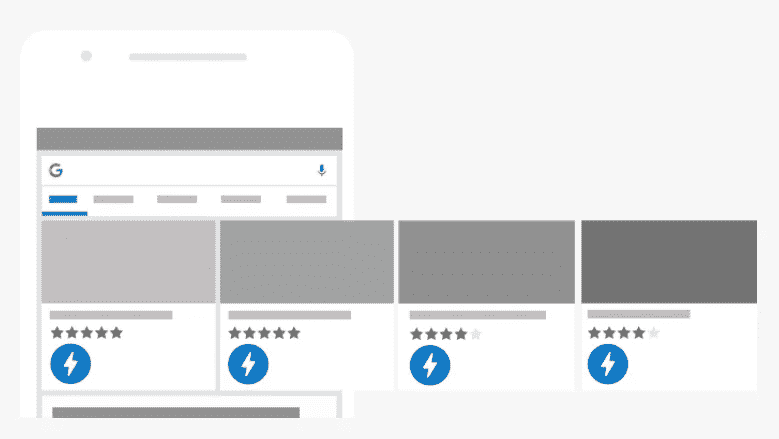
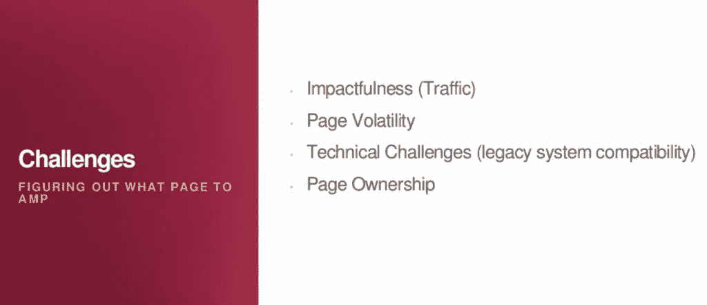
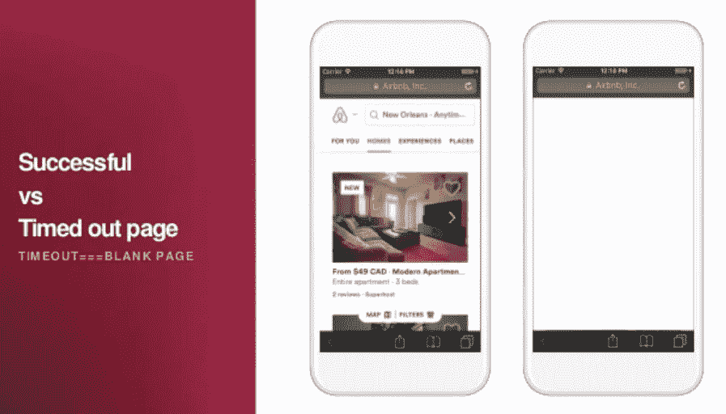
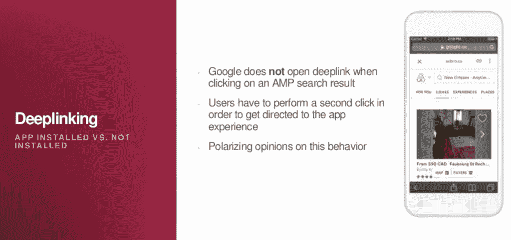
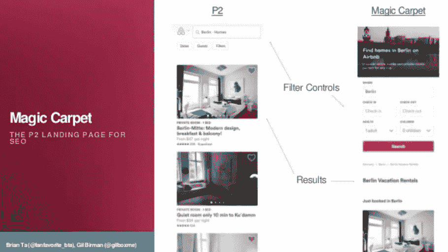

# Airbnb 如何将 AMP 置于其数字战略的核心

> 原文：<https://medium.com/swlh/how-airbnb-is-putting-amp-at-the-core-of-its-digital-strategy-d6b9cf1fc0ad>

在向移动优先的世界不断过渡的过程中，各品牌都在努力为用户提供更快的在线体验。这一趋势的核心是加速移动页面(AMP)项目，它有一些强大的支持者，包括谷歌。在波士顿最近的一次活动中，Airbnb 揭示了迁移到 AMP 带来的好处和挑战。下面我们总结了关键要点。

加速移动页面(AMP)是一项开源计划，旨在移动设备上高速呈现和交付内容。AMP 最初的目标是出版商(迄今为止，他们与 AMP 有着爱恨交加的关系)，后来被包括易贝在内的电子商务网站采用，并被纳入谷歌 AdWords、DoubleClick 和 AdSense 的元素中。公平地说，谷歌从第一天起就非常积极地支持这项倡议。

AMP 利用 HTML 和 JavaScript 的精简版本来提供更快的页面加载速度。用 AMP HTML 编码的搜索结果伴随着蓝色闪电，用户可以浏览类似的故事。

在实践中，我们经常发现让事情变得更快可能是一个非常缓慢的过程 AMP 也不例外。

虽然提供更好的用户体验听起来像是一个品牌的显而易见的选择，但当实施 AMP 时，会有一些重要的物流影响。网页的 AMP 版本显示在搜索结果中，并与网站架构中的原始版本并列，这给许多网站带来了一系列挑战。

因此，听到品牌如何将 AMP 融入其现有工作流程总是令人着迷。

在 TechSEO Boost 上，Airbnb 的 Gil Birman 和 Brian Ta 发表了一篇富有启发性的演讲，揭示了该公司如何使用 AMP 来帮助他们在客户战略中优先考虑速度。

毫无疑问，更流畅、更快速的体验可以提高转化率，但 Birman 和 Ta 讨论了需要首先考虑的缓解因素，然后讨论了他们必须设计的新解决方案，以使 AMP 代码在如此复杂的网站上工作。

# **确定网站各部分的优先顺序**

Airbnb 网站的三个主要层级是主页、搜索结果页面和每个房产的列表页面。Airbnb 的内部团队将这三个城市分别称为 P1、P2 和 P3。

虽然具体到这种类型的公司，但对于大多数营销人员来说，这些仍然可以识别为主页、类别级别和产品级别。

上面截图中的四个标准(流量影响、页面波动性、技术挑战和页面所有权)是针对网站的 P1、P2 和 P3 进行评估的，以决定哪一个将首先接受 AMP 处理。

取得适当的平衡被证明是一个挑战，因为目标是展示 AMP 在流量和收入方面可以带来的积极变化，而不会在此过程中对有价值的页面造成过多的干扰。

例如，主页在流量方面表现很好，但它需要许多团队的批准，并且更新非常频繁。因此，团队决定不在主页上实现 AMP。

在评估结束时，搜索结果页面(P2)被选为最合适的测试场地。如果 AMP 是有效的，他们会收到足够的流量来显示显著的差异，并且这一级别的变化会比在主页上引起更少的干扰。

尽管非常具体到 Airbnb，但对于任何计划实施 AMP 的营销人员来说，这里都有一些经验教训。必须制定一份决策标准列表，并在整个站点中一致地应用这些标准，因为建议在切换到整个域之前在一个部分上测试 AMP。当然，这取决于正在运行的页面数量，但是对于任何较大的网站来说，这应该被视为最佳实践方法。

# **构建最小可行产品**

Airbnb 的团队旨在通过构建一个最低限度的可行产品来启动 AMP，该产品可以展示该技术的功能，并在该技术推广到网站的其他部分之前帮助消除任何漏洞。

这是通过预先解决一些基本问题来实现的:

*   **AMP 如何在现有的网站框架内工作？**
*   **跨搜索结果页面(P2)实现 AMP 会如何干扰网站架构的其余部分？**
*   添加 AMP 对公司其他开发人员的工作流程有什么影响？
*   **AMP 如何影响设计、UX 以及 Airbnb 的整体产品？**

这些问题为任何商业规划大规模技术变革提供了一个有用的起点。当然，理解新代码如何与现有产品融合是必要的，但是也需要考虑人的因素。实施 AMP 将影响一系列内部团队，因此建议在发布之前召开必要的会议，以避免未来的挑战。

随着项目的进展，最初的问题导致了要评估的考虑事项列表:

*   **如何将 AMP 开发成一个跨工厂所有部门的全功能产品？**
*   随着站点的发展，如何管理增加的复杂性？
*   **如何才能让其他团队参与到项目中来？**
*   谁将拥有和维护该项目？

虽然这些可能不是最令人兴奋的思考点，但它们的答案可能意味着持续成功和长期失败的区别。

此外，牢记这些考虑提供了一个判断进展的框架。正如 Airbnb 的团队发现的那样，不能保证精心的规划会带来有利的结果，但如果事情确实出错了，正确的规划可以帮助纠正方向。

# 即使是最周密的计划也会出错

网站类似于活的有机体；它们在不断移动和进化。创建一个复杂网站的完整部分的平行版本会给这个脆弱的生态系统带来不可避免的破坏。

当这种中断发生时，问题就会出现。有时这些是可以预见的，但通常它们是不可能预测的，因为它们来自一个全新的互动。

Airbnb 实施 AMP 就是这种情况。

其中一个障碍是当页面渲染超过 500 毫秒时，服务器端开始超时。

> 尽管 AMP 为最终用户创造了更快的加载体验，但它确实在服务器端产生了更多的请求。谷歌应该将用户重定向到页面的规范版本(即非 AMP 版本)，但它只是显示一条错误消息。

结果，用户除了一个空白页什么也看不到。

对于启用 AMP 的页面，这种情况开始发生的几率为 16%,因此迫切需要一种解决方案。

为了最小化服务器和用户之间的距离，实现了内容分发网络(CDN)缓存。CDN 缓存允许保存存储的文件，以便加速加载。因此，可以避免超时问题，用户将看到页面的启用了 AMP 的版本。

在 AMP 投入运行之前，还有其他一些障碍需要克服。Airbnb 的团队发现，在移动设备上注销或首次访问该网站的访问者将获得支持 AMP 的搜索结果页面。

**然而，登录的用户陷入了不一致的体验。**

通常，登录的用户会看到基于他们的偏好和过去行为的个性化版本的网站。在启用 AMP 的情况下，谷歌向所有用户显示注销体验，这意味着任何拥有 Airbnb 账户的人都不会看到任何常见功能，例如他们收到的消息或过去的预订。

如果用户再次点击主站点，这个问题会得到解决，但这远远不是最佳体验，团队仍在努力找到合适的解决方案。

**Airbnb 团队还发现，AMP 覆盖了 deeplinking，这意味着谷歌将不再从 Airbnb 应用程序中提取内容。**

客户并不总是意识到深度链接已经出现，因为他们点击了搜索结果，看到了合适的内容。尽管如此，这些内容通常来自该公司的应用程序，往往会提供更好的用户体验。

像许多类似的公司一样，Airbnb 认为该应用程序提供了更高效的预订旅程，因此这是 AMP 项目的一个重大缺陷。

这使得该团队得出结论，在这种情况下，AMP 不适合更广泛的实施。潜在的好处太多了，不容忽视，所以 Airbnb 转而专注于一种新的解决方案，这种解决方案在没有技术问题的情况下提高了速度。

# **“魔毯”解决方案**

Magic Carpet 是一个登录页面系统，它允许 Airbnb 通过 SEO 为首次访问该网站的用户创造新的体验。新页面包含了典型网站体验的所有功能，但它也具有清晰的行动号召，因此用户确切地知道该做什么。

下面的截图强调了标准搜索结果页面(左侧)和“魔毯”版本(右侧)之间的区别:

这个解决方案是一个团队从最初的实验中吸取经验教训的明显例子。用户最初可能会对首次访问 Airbnb 的体验感到困惑，但现在他们看到的是一个支持 AMP 的简单预订之旅。由于该项目的近期性质，结果不可共享，但该团队计划在不久的将来在全球范围内推广。

尽管这一演讲与传统的案例研究采取了不同的叙事路线，传统的案例研究往往掩盖了道路上的坎坷，呈现出一系列出色的结果，但 Airbnb 的演讲提供了对现实世界问题的有益审视。AMP 的实施并非一帆风顺，但公司内部普遍认为，如果做得好，速度将成为竞争优势。

> 只是可能需要一些时间让事情变得更快。

***你可以在这里查看 TechSEO Boost 的幻灯片:***

***吉尔·伯曼和布莱恩·塔的演讲录音在这里:***

## 这篇文章发表在 [The Startup](https://medium.com/swlh) 上，这是 Medium 最大的创业刊物，拥有 277，994+读者。

## 在此订阅接收[我们的头条新闻](http://growthsupply.com/the-startup-newsletter/)。

