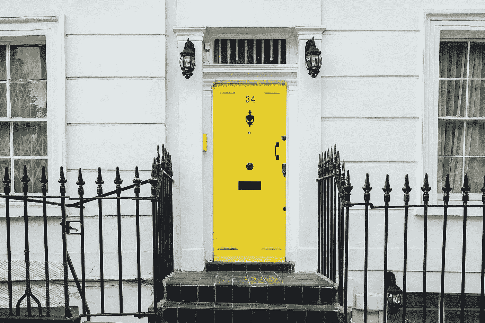

# How Airsorted 融资 875 万，建成全球最大 Airbnb 管理公司

> 原文：<https://medium.com/swlh/how-airsorted-raised-8-75-million-and-built-the-worlds-largest-airbnb-management-firm-470e84e20ff0>

## 自从三年前加入 Pi Labs 的第一批人以来，Airsorted 已经从一家卧室初创公司发展成为全球领先的 proptech 公司。我们采访了联合创始人和首席运营官·丹尼尔·斯科特，看看他们一路走来学到了什么，以及接下来会发生什么。

Image via [Unsplash](https://unsplash.com/photos/QR_vT8_hBZM)

hen Pi Labs 于 2015 年首次成立，我们的使命很简单:识别和发展寻求颠覆房地产行业的最佳新技术公司。今天，我们工作中最有收获的一个方面是看到这些雄心勃勃的创业公司通过纯粹的努力获得成功。Airsorted 是我们通过 pre-seed 计划投资的前十家企业之一。在过去的三年里，他们越来越强大，从一个饥饿的年轻初创公司变成了一个全球 proptech 颠覆者。这是他们的故事。

# 从概念到上市:分拣机的兴起

Airsorted 三年前在伦敦成立，大约在同一时间，Pi Labs 作为欧洲第一家 proptech 风险投资公司成立。Airsorted 的商业模式很简单:业主支付 15%的佣金来代表他们管理租金。收取额外费用，它还提供清洁和物业维修服务。像许多新企业一样，这个故事始于创始人兼首席执行官詹姆斯·詹金斯-耶茨对市场缺口的观察。

该公司首席运营官、三位联合创始人之一丹尼尔·斯科特(Daniel Scott)表示:“我们的创始人詹姆斯(James)在伦敦公寓租出一间空房时，发现在他不在的时候，很难找到可靠的人来打扫卫生和为客人提供通道，于是他想出了 Airsorted 这个概念。“在研究这个领域的参与者时，他发现这个市场服务不足。因此，在 2014 年的节礼日，他推出了一个登陆页面和一些脸书广告，以测试是否有人对这项服务感兴趣。这让他产生了足够的兴趣，让他相信这是一个值得从事的行业。”

在那里，詹金斯-耶茨组建了一个创始团队，他们一起申请加入 Pi 实验室的首批成员。他们是我们作为第一个项目的一部分接受的五家公司之一。

根据 Airsorted 的说法，与 Pi 实验室合作的最初好处有很多。“首先，在一个充满活力的伦敦办公室里有免费的办公空间，这吸引了很多我们可能会错过的人才。斯科特解释道:“这对你刚刚起步的时候非常重要。“第二，我们获得了建立成功企业的所有关键要素:行业专业知识、指导机会和对该领域领导者的介绍。第三，我们能够利用与 Pi Labs 的合作，在竞争中脱颖而出。”

# 以客户为中心扩大规模

发展业务无疑是任何行业的企业家面临的最大挑战之一。意想不到的问题几乎总是会出现，知道如何解决它们是持续成功的绝对必要条件——尤其是在快速变化的 21 世纪房地产世界中。

Airsorted 一直小心翼翼地保持对客户的关注，因为他们的业务从三个创始团队发展到拥有 200 多名员工、价值数百万英镑的公司。每一步，他们都寻求客户的反馈，并给予密切关注。为了解决问题，他们采用了精益方法:确定回答问题所需的最低解决方案，“这是否产生了影响，并按照我们想象的方式解决了问题？”然后小规模实施以测试其可行性。这是一个持续回报的公式。

“在传统公司，当一个问题、挑战或机遇出现时，倾向于创建一个解决方案，并在几个月或几年内执行，”斯科特解释道。“但他们往往没有分析他们确定的解决方案是否会产生他们想要的影响。”

“詹姆斯最初的脸书活动是我们如何在 Airsorted 以不同方式做事的一个很好的例子:他创建了一个基本的网站，并投入 50 英镑的营销预算来测试这个想法，”斯科特说。“有些人可能会先组建一个团队，花几个月时间寻找合适的人选，并制定一份完整的商业计划，但我们可能比许多其他公司早 6 个月就能回答一些基本问题。”

# 投资只是开始

在 Pi Labs，我们遇到了许多初创公司，它们最初将投资视为最终目标。但我们的经验告诉我们，赢得投资者远不是旅程的终点——事实上，这只是开始。这一课尤其适用于空气分拣。

“投资是对你迄今工作的认可，这非常有用，因为有时你会讨论不同的策略。你选择一个，然后你从投资团体那里得到这个决定的确认。斯科特说:“我们已经进行了四轮投资，包括种子期前的投资，我们很幸运即将迎来另一轮投资。”。“我认为，投资会让你很快明白，不仅业务会如何运作，而且运作得有多好。这是非常宝贵的——但这肯定不是路的尽头。”

迄今为止，Airsorted 已经筹集了 875 万美元的投资，并发展成为全球最大的短租管理平台之一，在全球 26 个城市开展业务。今年夏天，它实现了一个重要的里程碑:月收入首次超过 100 万英镑。这是第一家 Pi Labs 投资组合公司达到这一里程碑。Pi Labs 自豪地与该团队一起走过了每一步，迄今为止已经投资了 Airsorted 筹集的四轮投资。

不是每个创业公司都成功，但对于雄心勃勃的企业家来说，proptech 行业是 2018 年最令人兴奋的开展新业务的空间之一。正如 Airsorted 所展示的那样，许多领域进行颠覆和创新的时机仍然成熟，产生影响的机会是巨大的。然而，正确的投资伙伴至关重要。在 Pi Labs，我们与采用颠覆性的不同方法的初创公司合作，并与他们培养牢固的、价值驱动的关系。这对他们的进步有很大的影响。正如斯科特所说:“与 Pi 实验室合作，尤其是在最早的阶段，对我们的商业想法的实现至关重要。老实说，如果没有 Pi Labs 的持续信任和投资，我不确定我们能走到今天这一步。"

# 关于多米尼克·威尔逊

多米尼克是 Pi 实验室的联合创始人和常务合伙人。他以一般身份领导公司，特别关注投资和投资者。他还是 Brolly、FalconDHQ 和 Office App 的董事会成员。Dominic 在私募股权房地产领域有着广泛的背景，曾与 AEW Europe 和 Savills Investment Management 合作，并在欧洲完成了超过 30 亿€的交易。Dominic 拥有伯明翰大学的法语法律学位和伦敦商学院的 MBA 学位。

# 关于 Pi 实验室

Pi Labs 是欧洲第一家专注于 proptech 投资的风险投资公司。在这个垂直领域的早期阶段，它已经成为卓越的全球领导者。迄今为止，它已经进行了 35 项投资，包括 Airsorted、Land Insight 和 Plentific。Pi Labs 的关注点是全球性的——它已经支持了来自 19 个不同国籍的创始人。迄今为止，其投资组合公司已经筹集了超过 1.4 亿美元。

如果你是一家 proptech 初创公司，希望加速发展，今天就联系我们 Pi Labs 的团队吧。通过访问[我们的网站](https://pilabs.co.uk)，了解更多我们的工作并提交您的投资想法。

## 这篇文章发表在[《创业](https://medium.com/swlh)》上，这是 Medium 最大的创业刊物，有+ 375，985 人关注。

## 在这里订阅接收[我们的头条新闻](http://growthsupply.com/the-startup-newsletter/)。

